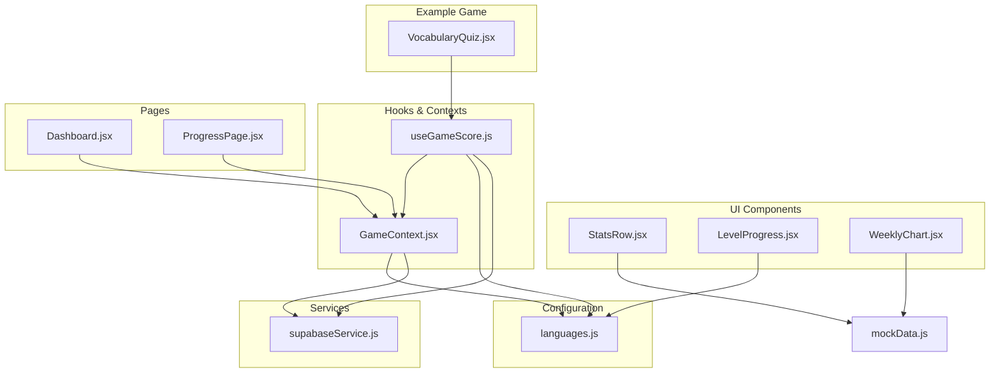
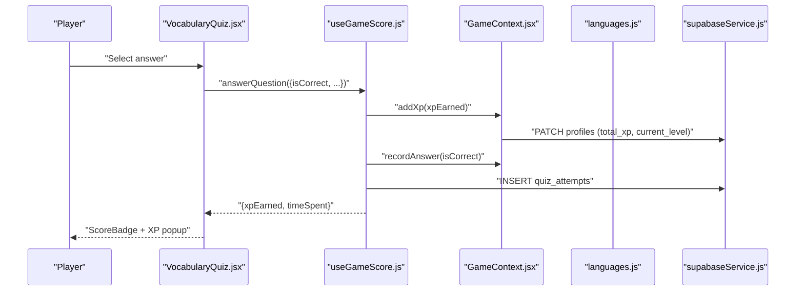
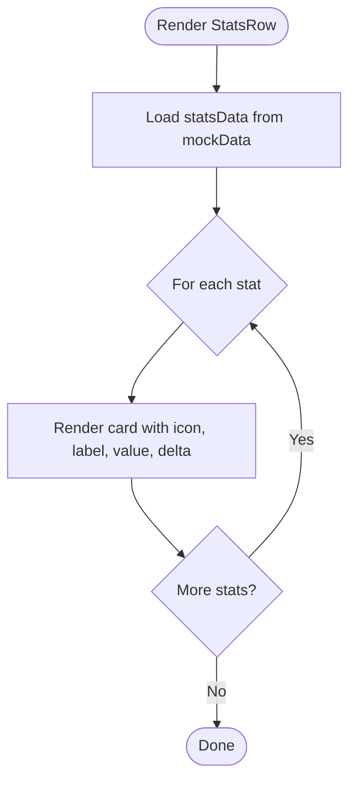
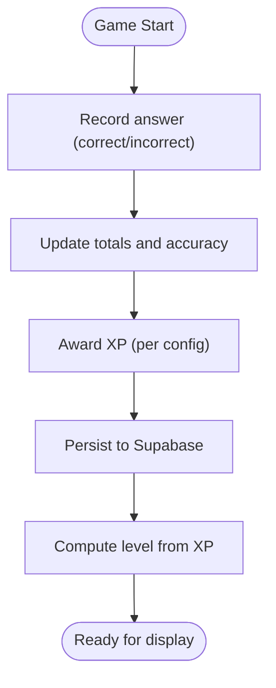
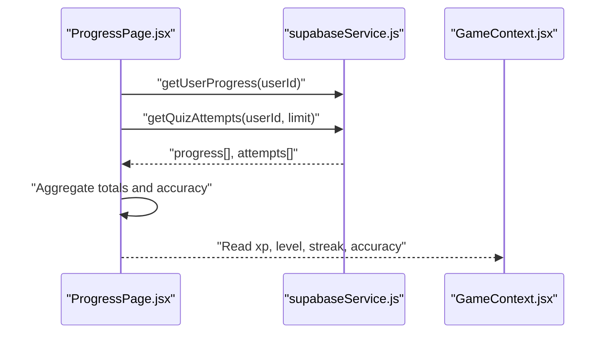
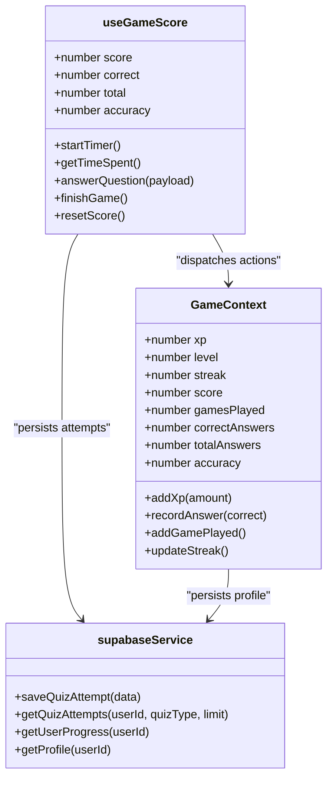
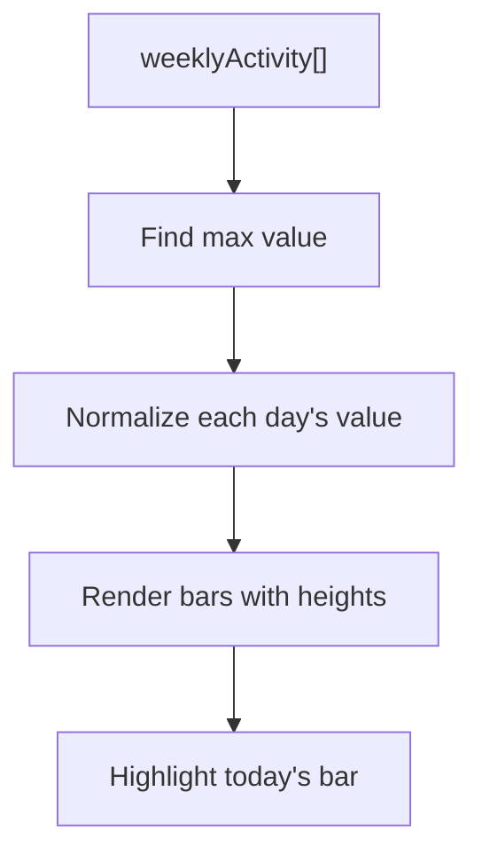
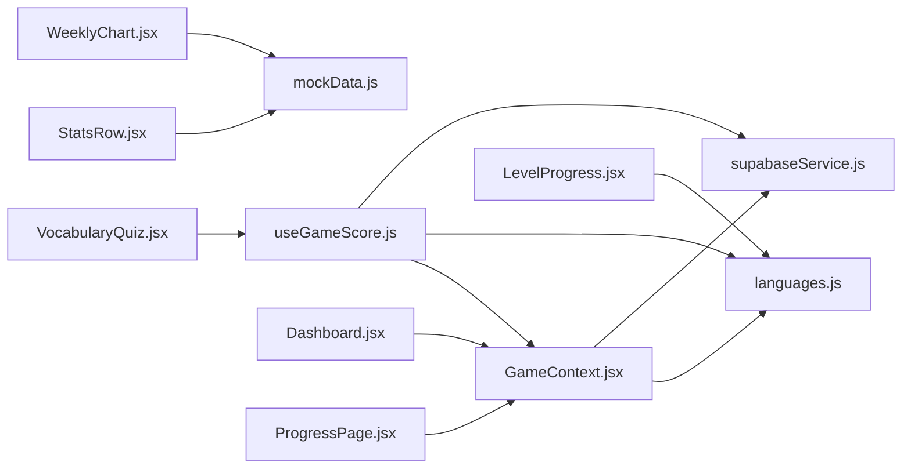

# Performance Statistics and Metrics

<cite>
**Referenced Files in This Document**
- [StatsRow.jsx](file://src/components/StatsRow.jsx)
- [mockData.js](file://src/data/mockData.js)
- [useGameScore.js](file://src/hooks/useGameScore.js)
- [GameContext.jsx](file://src/contexts/GameContext.jsx)
- [languages.js](file://src/config/languages.js)
- [supabaseService.js](file://src/services/supabaseService.js)
- [Dashboard.jsx](file://src/pages/dashboard/Dashboard.jsx)
- [ProgressPage.jsx](file://src/pages/dashboard/ProgressPage.jsx)
- [WeeklyChart.jsx](file://src/components/WeeklyChart.jsx)
- [LevelProgress.jsx](file://src/components/LevelProgress.jsx)
- [ScoreBadge.jsx](file://src/components/ScoreBadge.jsx)
- [VocabularyQuiz.jsx](file://src/pages/games/VocabularyQuiz.jsx)
</cite>

## Table of Contents
1. [Introduction](#introduction)
2. [Project Structure](#project-structure)
3. [Core Components](#core-components)
4. [Architecture Overview](#architecture-overview)
5. [Detailed Component Analysis](#detailed-component-analysis)
6. [Dependency Analysis](#dependency-analysis)
7. [Performance Considerations](#performance-considerations)
8. [Troubleshooting Guide](#troubleshooting-guide)
9. [Conclusion](#conclusion)
10. [Appendices](#appendices)

## Introduction
This document explains the performance statistics and metrics display system in the application. It focuses on the StatsRow component architecture, metric calculation algorithms, data aggregation patterns, real-time update mechanisms, and integration with game mechanics and Supabase. It also covers performance indicators such as XP gains, streak counts, accuracy rates, and completion percentages, along with examples of metric computation, data formatting, and display optimization. Guidance is included for extending the system with new metrics, customizing display formats, and implementing advanced analytics while maintaining optimal user experience.

## Project Structure
The metrics system spans several layers:
- UI components for displaying metrics (StatsRow, LevelProgress, WeeklyChart)
- Hooks and contexts for state and calculations (useGameScore, GameContext)
- Configuration and constants (languages.js)
- Services for persistence and retrieval (supabaseService.js)
- Pages that aggregate and present metrics (Dashboard.jsx, ProgressPage.jsx)
- Example game integration (VocabularyQuiz.jsx)

**Diagram sources**
- [StatsRow.jsx:1-17](file://src/components/StatsRow.jsx#L1-L17)
- [mockData.js:1-47](file://src/data/mockData.js#L1-L47)
- [useGameScore.js:1-76](file://src/hooks/useGameScore.js#L1-L76)
- [GameContext.jsx:1-141](file://src/contexts/GameContext.jsx#L1-L141)
- [languages.js:1-30](file://src/config/languages.js#L1-L30)
- [supabaseService.js:1-132](file://src/services/supabaseService.js#L1-L132)
- [Dashboard.jsx:1-151](file://src/pages/dashboard/Dashboard.jsx#L1-L151)
- [ProgressPage.jsx:1-114](file://src/pages/dashboard/ProgressPage.jsx#L1-L114)
- [WeeklyChart.jsx:1-34](file://src/components/WeeklyChart.jsx#L1-L34)
- [LevelProgress.jsx:1-18](file://src/components/LevelProgress.jsx#L1-L18)
- [VocabularyQuiz.jsx:1-80](file://src/pages/games/VocabularyQuiz.jsx#L1-L80)

**Section sources**
- [StatsRow.jsx:1-17](file://src/components/StatsRow.jsx#L1-L17)
- [mockData.js:1-47](file://src/data/mockData.js#L1-L47)
- [useGameScore.js:1-76](file://src/hooks/useGameScore.js#L1-L76)
- [GameContext.jsx:1-141](file://src/contexts/GameContext.jsx#L1-L141)
- [languages.js:1-30](file://src/config/languages.js#L1-L30)
- [supabaseService.js:1-132](file://src/services/supabaseService.js#L1-L132)
- [Dashboard.jsx:1-151](file://src/pages/dashboard/Dashboard.jsx#L1-L151)
- [ProgressPage.jsx:1-114](file://src/pages/dashboard/ProgressPage.jsx#L1-L114)
- [WeeklyChart.jsx:1-34](file://src/components/WeeklyChart.jsx#L1-L34)
- [LevelProgress.jsx:1-18](file://src/components/LevelProgress.jsx#L1-L18)
- [VocabularyQuiz.jsx:1-80](file://src/pages/games/VocabularyQuiz.jsx#L1-L80)

## Core Components
- StatsRow: Renders a responsive grid of metric cards using static mock data. It displays label, icon, value, and delta/description.
- useGameScore: Provides real-time scoring, timing, XP accumulation, and persistence via Supabase for quiz-like interactions.
- GameContext: Centralized state for XP, level, streak, totals, and accuracy; persists to Supabase and exposes convenience actions.
- languages.js: Defines XP rewards, level calculation, and difficulty metadata used across metrics.
- supabaseService.js: Implements CRUD for quiz attempts, translation history, user progress, and leaderboard queries.
- Dashboard and ProgressPage: Aggregate metrics from GameContext and Supabase to render dashboards and progress views.
- WeeklyChart: Visualizes weekly activity using mock data.
- LevelProgress: Computes and displays XP-to-next-level progress.
- ScoreBadge: Animates score and XP gain feedback during gameplay.

**Section sources**
- [StatsRow.jsx:1-17](file://src/components/StatsRow.jsx#L1-L17)
- [mockData.js:1-47](file://src/data/mockData.js#L1-L47)
- [useGameScore.js:1-76](file://src/hooks/useGameScore.js#L1-L76)
- [GameContext.jsx:1-141](file://src/contexts/GameContext.jsx#L1-L141)
- [languages.js:1-30](file://src/config/languages.js#L1-L30)
- [supabaseService.js:1-132](file://src/services/supabaseService.js#L1-L132)
- [Dashboard.jsx:1-151](file://src/pages/dashboard/Dashboard.jsx#L1-L151)
- [ProgressPage.jsx:1-114](file://src/pages/dashboard/ProgressPage.jsx#L1-L114)
- [WeeklyChart.jsx:1-34](file://src/components/WeeklyChart.jsx#L1-L34)
- [LevelProgress.jsx:1-18](file://src/components/LevelProgress.jsx#L1-L18)
- [ScoreBadge.jsx:1-36](file://src/components/ScoreBadge.jsx#L1-L36)

## Architecture Overview
The metrics pipeline integrates game events, state updates, and persistent storage:

**Diagram sources**
- [VocabularyQuiz.jsx:1-80](file://src/pages/games/VocabularyQuiz.jsx#L1-L80)
- [useGameScore.js:1-76](file://src/hooks/useGameScore.js#L1-L76)
- [GameContext.jsx:1-141](file://src/contexts/GameContext.jsx#L1-L141)
- [languages.js:1-30](file://src/config/languages.js#L1-L30)
- [supabaseService.js:1-132](file://src/services/supabaseService.js#L1-L132)

## Detailed Component Analysis

### StatsRow Component
- Purpose: Render a responsive grid of metric cards with label, icon, value, and delta.
- Data source: Static mock data array defines entries for streak, XP, accuracy, and sessions.
- Responsive layout: Uses Tailwind grid classes to adapt from 2 to 4 columns.
- Real-time updates: Not reactive by itself; intended to consume live metrics from GameContext or page-level computations.

**Diagram sources**
- [StatsRow.jsx:1-17](file://src/components/StatsRow.jsx#L1-L17)
- [mockData.js:1-47](file://src/data/mockData.js#L1-L47)

**Section sources**
- [StatsRow.jsx:1-17](file://src/components/StatsRow.jsx#L1-L17)
- [mockData.js:1-47](file://src/data/mockData.js#L1-L47)

### Metric Calculation and Aggregation
- XP and level:
  - XP increments via GameContext reducer and persists to Supabase.
  - Level computed by integer division of XP against a fixed threshold.
- Accuracy:
  - Computed as correct answers divided by total answers, rounded to whole percent.
  - Available both from GameContext totals and aggregated from quiz attempts.
- Streak:
  - Managed in GameContext; persisted to Supabase with daily checks.
  - Bonus XP awarded upon streak increase.
- Timed performance:
  - Per-question timing tracked in useGameScore; stored with quiz attempts.

**Diagram sources**
- [GameContext.jsx:1-141](file://src/contexts/GameContext.jsx#L1-L141)
- [languages.js:1-30](file://src/config/languages.js#L1-L30)
- [supabaseService.js:1-132](file://src/services/supabaseService.js#L1-L132)

**Section sources**
- [GameContext.jsx:1-141](file://src/contexts/GameContext.jsx#L1-L141)
- [languages.js:1-30](file://src/config/languages.js#L1-L30)
- [supabaseService.js:1-132](file://src/services/supabaseService.js#L1-L132)

### Real-Time Update Mechanisms
- useGameScore:
  - Tracks score, correct count, total count, and time spent per question.
  - Emits XP and timing with each answer and persists to Supabase.
- GameContext:
  - Dispatches ADD_XP, RECORD_ANSWER, UPDATE_STREAK, and ADD_GAME_PLAYED.
  - Exposes derived accuracy and convenience setters.
- Dashboard and ProgressPage:
  - Load recent quiz attempts and user progress to compute session counts and accuracy.

**Diagram sources**
- [ProgressPage.jsx:1-114](file://src/pages/dashboard/ProgressPage.jsx#L1-L114)
- [supabaseService.js:1-132](file://src/services/supabaseService.js#L1-L132)
- [GameContext.jsx:1-141](file://src/contexts/GameContext.jsx#L1-L141)

**Section sources**
- [useGameScore.js:1-76](file://src/hooks/useGameScore.js#L1-L76)
- [GameContext.jsx:1-141](file://src/contexts/GameContext.jsx#L1-L141)
- [ProgressPage.jsx:1-114](file://src/pages/dashboard/ProgressPage.jsx#L1-L114)
- [supabaseService.js:1-132](file://src/services/supabaseService.js#L1-L132)

### Performance Indicators and Examples
- XP gains:
  - Incremented per correct answer using XP_REWARDS mapping.
  - Persisted to profiles with updated level.
- Streak counts:
  - Daily streak incremented if not already active today; bonus XP applied.
- Accuracy rates:
  - Derived from totals in GameContext or aggregated from quiz attempts.
- Completion percentages:
  - Session counts shown in dashboards; weekly chart bars represent normalized activity.

Concrete computation examples:
- Accuracy percentage: round((correct / total) * 100) for totals and attempts.
- Level: floor(total_xp / XP_PER_LEVEL) + 1.
- XP in level: total_xp % XP_PER_LEVEL; progress percentage computed for display.

**Section sources**
- [languages.js:1-30](file://src/config/languages.js#L1-L30)
- [GameContext.jsx:1-141](file://src/contexts/GameContext.jsx#L1-L141)
- [ProgressPage.jsx:1-114](file://src/pages/dashboard/ProgressPage.jsx#L1-L114)

### Display Optimization and Formatting
- Number formatting:
  - XP values formatted with thousands separator in dashboards.
- Icons and emojis:
  - Used for quick visual recognition of metrics.
- Loading states:
  - Spinner placeholders during asynchronous data fetches.
- Responsive grids:
  - Tailwind utilities adapt card layouts across breakpoints.

**Section sources**
- [Dashboard.jsx:1-151](file://src/pages/dashboard/Dashboard.jsx#L1-L151)
- [ProgressPage.jsx:1-114](file://src/pages/dashboard/ProgressPage.jsx#L1-L114)
- [StatsRow.jsx:1-17](file://src/components/StatsRow.jsx#L1-L17)

### Integration with Game Mechanics and Data Sources
- GameContext provides centralized state and actions consumed by pages and hooks.
- useGameScore orchestrates per-session scoring and persistence.
- Supabase stores quiz attempts, user progress, and profile metrics.
- Example integration: VocabularyQuiz uses useGameScore to update metrics after each answer.

**Diagram sources**
- [GameContext.jsx:1-141](file://src/contexts/GameContext.jsx#L1-L141)
- [useGameScore.js:1-76](file://src/hooks/useGameScore.js#L1-L76)
- [supabaseService.js:1-132](file://src/services/supabaseService.js#L1-L132)

**Section sources**
- [GameContext.jsx:1-141](file://src/contexts/GameContext.jsx#L1-L141)
- [useGameScore.js:1-76](file://src/hooks/useGameScore.js#L1-L76)
- [supabaseService.js:1-132](file://src/services/supabaseService.js#L1-L132)
- [VocabularyQuiz.jsx:1-80](file://src/pages/games/VocabularyQuiz.jsx#L1-L80)

### Trend Analysis and Visualization
- WeeklyChart:
  - Normalizes bar heights by the maximum value in the dataset.
  - Highlights today’s bar differently for emphasis.
- Dashboard and ProgressPage:
  - Compute overall accuracy and session counts from recent attempts.
  - Present language progress using user progress records.

**Diagram sources**
- [WeeklyChart.jsx:1-34](file://src/components/WeeklyChart.jsx#L1-L34)
- [mockData.js:23-31](file://src/data/mockData.js#L23-L31)

**Section sources**
- [WeeklyChart.jsx:1-34](file://src/components/WeeklyChart.jsx#L1-L34)
- [mockData.js:23-31](file://src/data/mockData.js#L23-L31)
- [ProgressPage.jsx:1-114](file://src/pages/dashboard/ProgressPage.jsx#L1-L114)

## Dependency Analysis
Key dependencies and coupling:
- StatsRow depends on mockData for static metrics.
- useGameScore depends on GameContext for XP and totals, languages for XP rewards, and supabaseService for persistence.
- GameContext depends on languages for level calculation and Supabase for persistence.
- Dashboard and ProgressPage depend on GameContext and Supabase for computed and stored metrics.
- LevelProgress depends on languages for level thresholds.

**Diagram sources**
- [StatsRow.jsx:1-17](file://src/components/StatsRow.jsx#L1-L17)
- [mockData.js:1-47](file://src/data/mockData.js#L1-L47)
- [useGameScore.js:1-76](file://src/hooks/useGameScore.js#L1-L76)
- [GameContext.jsx:1-141](file://src/contexts/GameContext.jsx#L1-L141)
- [languages.js:1-30](file://src/config/languages.js#L1-L30)
- [supabaseService.js:1-132](file://src/services/supabaseService.js#L1-L132)
- [Dashboard.jsx:1-151](file://src/pages/dashboard/Dashboard.jsx#L1-L151)
- [ProgressPage.jsx:1-114](file://src/pages/dashboard/ProgressPage.jsx#L1-L114)
- [LevelProgress.jsx:1-18](file://src/components/LevelProgress.jsx#L1-L18)
- [WeeklyChart.jsx:1-34](file://src/components/WeeklyChart.jsx#L1-L34)

**Section sources**
- [StatsRow.jsx:1-17](file://src/components/StatsRow.jsx#L1-L17)
- [mockData.js:1-47](file://src/data/mockData.js#L1-L47)
- [useGameScore.js:1-76](file://src/hooks/useGameScore.js#L1-L76)
- [GameContext.jsx:1-141](file://src/contexts/GameContext.jsx#L1-L141)
- [languages.js:1-30](file://src/config/languages.js#L1-L30)
- [supabaseService.js:1-132](file://src/services/supabaseService.js#L1-L132)
- [Dashboard.jsx:1-151](file://src/pages/dashboard/Dashboard.jsx#L1-L151)
- [ProgressPage.jsx:1-114](file://src/pages/dashboard/ProgressPage.jsx#L1-L114)
- [LevelProgress.jsx:1-18](file://src/components/LevelProgress.jsx#L1-L18)
- [WeeklyChart.jsx:1-34](file://src/components/WeeklyChart.jsx#L1-L34)

## Performance Considerations
- Efficient rendering:
  - Use memoization for derived metrics (accuracy) to avoid recomputation.
  - Virtualize long lists (e.g., recent activity) if datasets grow large.
- Network efficiency:
  - Batch reads/writes to Supabase; combine requests where possible.
  - Cache recent attempts locally to reduce repeated fetches.
- UI responsiveness:
  - Debounce timer-based updates to prevent excessive re-renders.
  - Use skeleton loaders for async content to maintain perceived performance.
- Data normalization:
  - Normalize metrics (e.g., weekly chart) client-side to minimize server load.
- Memory management:
  - Limit retained history arrays (e.g., recent XP gains) to a capped size.

## Troubleshooting Guide
- Metrics not updating:
  - Verify GameContext dispatches are triggered and Supabase writes succeed.
  - Confirm useGameScore is invoked on answer submission.
- Incorrect accuracy:
  - Ensure totals are initialized and updated consistently across hooks and pages.
- Streak not incrementing:
  - Check daily last_active_date logic and Supabase update calls.
- Missing recent activity:
  - Inspect error handling around quiz attempts fetch and loading states.
- Stale XP or level:
  - Confirm profile loads initial state and subsequent updates persist correctly.

**Section sources**
- [GameContext.jsx:1-141](file://src/contexts/GameContext.jsx#L1-L141)
- [useGameScore.js:1-76](file://src/hooks/useGameScore.js#L1-L76)
- [supabaseService.js:1-132](file://src/services/supabaseService.js#L1-L132)
- [Dashboard.jsx:1-151](file://src/pages/dashboard/Dashboard.jsx#L1-L151)
- [ProgressPage.jsx:1-114](file://src/pages/dashboard/ProgressPage.jsx#L1-L114)

## Conclusion
The metrics system combines local state management, deterministic calculations, and persistent storage to deliver accurate, real-time performance insights. StatsRow provides a flexible display surface, while GameContext and useGameScore orchestrate scoring, XP, and persistence. Dashboard and ProgressPage surfaces aggregate data for broader insights. With careful attention to rendering efficiency, caching, and robust error handling, the system scales to support richer analytics and improved user experience.

## Appendices

### Adding New Metrics
- Define metric computation:
  - Add derived values in GameContext or page-level computations.
  - Use existing totals (correct, total, gamesPlayed) to build new ratios.
- Persist new data:
  - Extend supabaseService with new write/read functions if needed.
- Display new metrics:
  - Integrate into StatsRow or page-specific grids.
  - Apply number formatting and icons for clarity.

### Customizing Display Formats
- Number formatting:
  - Use locale-aware formatting for large numbers and percentages.
- Icons and trends:
  - Choose emoji or icon sets aligned with metric semantics.
- Responsive layouts:
  - Adjust grid classes and typography scales for readability across devices.

### Advanced Analytics Features
- Historical trends:
  - Store per-day aggregates and render charts with moving averages.
- Cohort analysis:
  - Group users by sign-up cohort and compare engagement curves.
- A/B testing:
  - Attribute metric differences to feature variants using event logging.