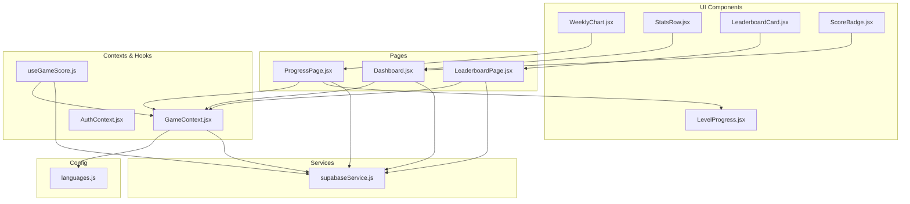
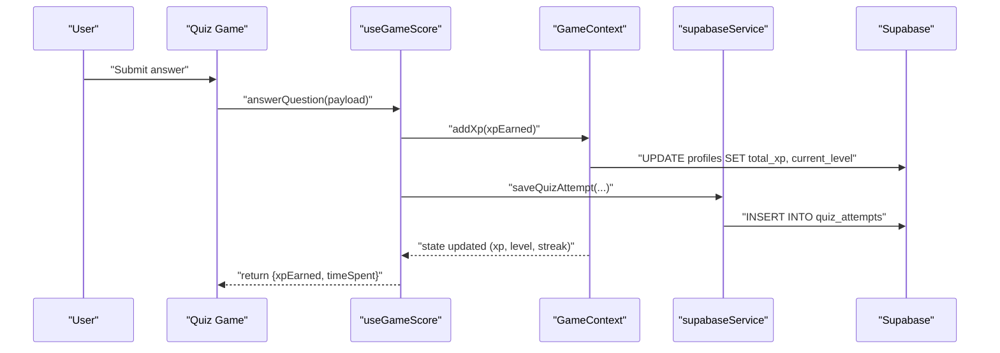
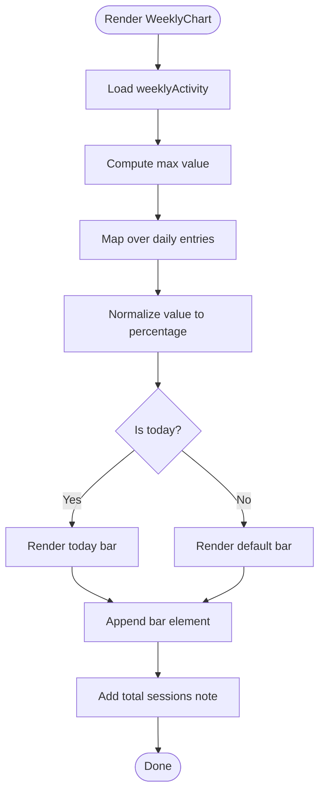
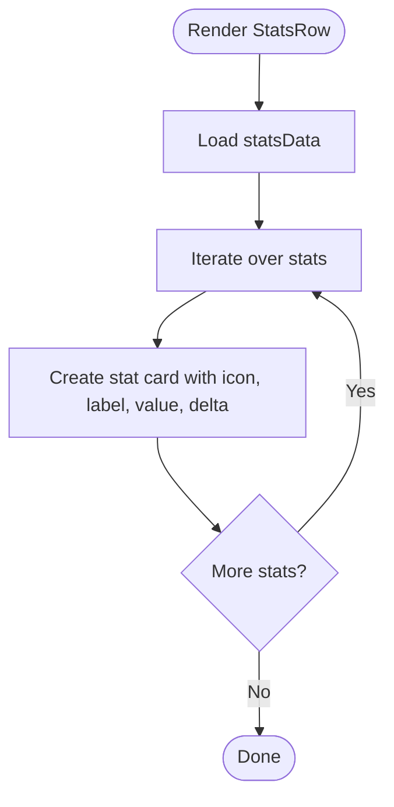
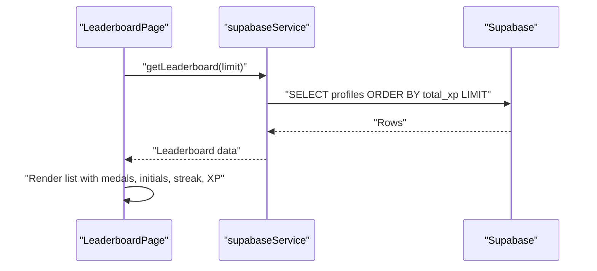
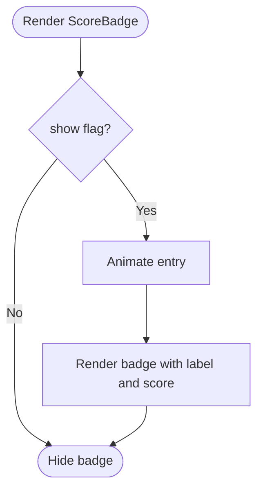
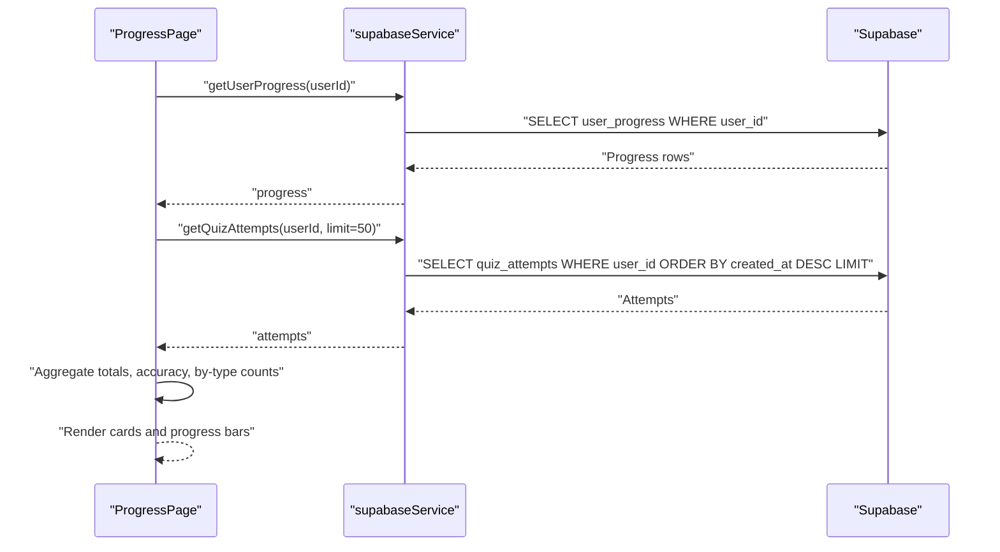
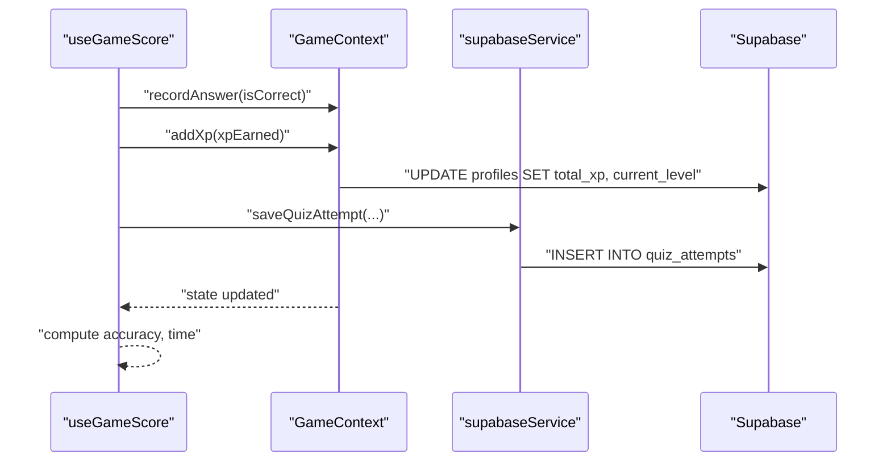
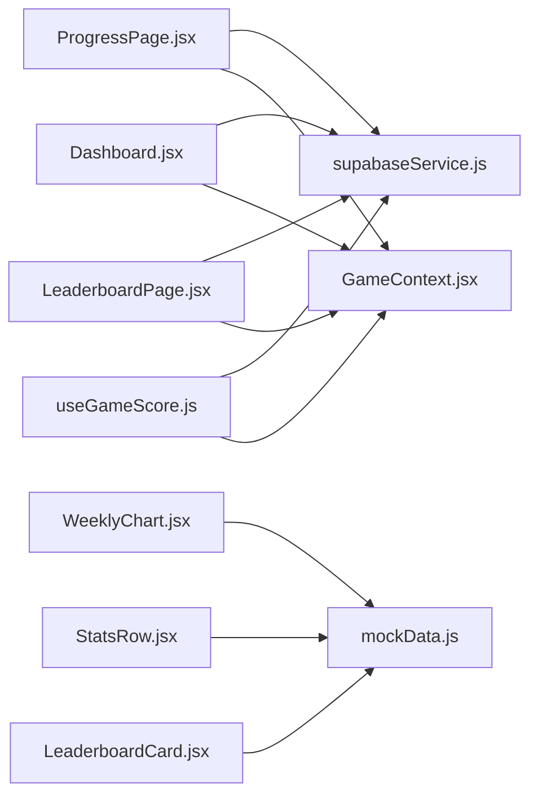

# Progress Tracking and Analytics

<cite>
**Referenced Files in This Document**
- [WeeklyChart.jsx](file://src/components/WeeklyChart.jsx)
- [StatsRow.jsx](file://src/components/StatsRow.jsx)
- [LeaderboardCard.jsx](file://src/components/LeaderboardCard.jsx)
- [ScoreBadge.jsx](file://src/components/ScoreBadge.jsx)
- [ProgressPage.jsx](file://src/pages/dashboard/ProgressPage.jsx)
- [LeaderboardPage.jsx](file://src/pages/dashboard/LeaderboardPage.jsx)
- [mockData.js](file://src/data/mockData.js)
- [supabaseService.js](file://src/services/supabaseService.js)
- [GameContext.jsx](file://src/contexts/GameContext.jsx)
- [useGameScore.js](file://src/hooks/useGameScore.js)
- [languages.js](file://src/config/languages.js)
- [LevelProgress.jsx](file://src/components/LevelProgress.jsx)
- [Dashboard.jsx](file://src/pages/dashboard/Dashboard.jsx)
- [AppLayout.jsx](file://src/layouts/AppLayout.jsx)
</cite>

## Table of Contents
1. [Introduction](#introduction)
2. [Project Structure](#project-structure)
3. [Core Components](#core-components)
4. [Architecture Overview](#architecture-overview)
5. [Detailed Component Analysis](#detailed-component-analysis)
6. [Dependency Analysis](#dependency-analysis)
7. [Performance Considerations](#performance-considerations)
8. [Troubleshooting Guide](#troubleshooting-guide)
9. [Conclusion](#conclusion)
10. [Appendices](#appendices)

## Introduction
This document explains the progress tracking and analytics system, focusing on weekly progress visualization, performance statistics, and leaderboard implementation. It documents the data visualization components WeeklyChart and StatsRow, the leaderboard display via LeaderboardCard and LeaderboardPage, and the achievement badges via ScoreBadge. It also covers data aggregation, rendering, persistence, and real-time updates, along with guidance for extending analytics and maintaining performance.

## Project Structure
The analytics and progress features are implemented across components, pages, services, contexts, and configuration modules. Key areas:
- Visualization components: WeeklyChart, StatsRow, LeaderboardCard, ScoreBadge, LevelProgress
- Pages: ProgressPage (analytics and history), LeaderboardPage (global rankings)
- Services: supabaseService for data persistence and retrieval
- Contexts: GameContext for XP, streak, and scoring state; AuthContext for user/session/profile
- Hooks: useGameScore for scoring lifecycle and saving quiz attempts
- Config: languages for XP rewards, levels, and language metadata

**Diagram sources**
- [WeeklyChart.jsx:1-34](file://src/components/WeeklyChart.jsx#L1-L34)
- [StatsRow.jsx:1-17](file://src/components/StatsRow.jsx#L1-L17)
- [LeaderboardCard.jsx:1-48](file://src/components/LeaderboardCard.jsx#L1-L48)
- [ScoreBadge.jsx:1-37](file://src/components/ScoreBadge.jsx#L1-L37)
- [LevelProgress.jsx:1-18](file://src/components/LevelProgress.jsx#L1-L18)
- [ProgressPage.jsx:1-114](file://src/pages/dashboard/ProgressPage.jsx#L1-L114)
- [LeaderboardPage.jsx:1-78](file://src/pages/dashboard/LeaderboardPage.jsx#L1-L78)
- [Dashboard.jsx:1-151](file://src/pages/dashboard/Dashboard.jsx#L1-L151)
- [supabaseService.js:1-132](file://src/services/supabaseService.js#L1-L132)
- [GameContext.jsx:1-141](file://src/contexts/GameContext.jsx#L1-L141)
- [useGameScore.js:1-76](file://src/hooks/useGameScore.js#L1-L76)
- [languages.js:1-30](file://src/config/languages.js#L1-L30)

**Section sources**
- [AppLayout.jsx:1-42](file://src/layouts/AppLayout.jsx#L1-L42)
- [ProgressPage.jsx:1-114](file://src/pages/dashboard/ProgressPage.jsx#L1-L114)
- [LeaderboardPage.jsx:1-78](file://src/pages/dashboard/LeaderboardPage.jsx#L1-L78)

## Core Components
- WeeklyChart: Renders a bar chart of weekly activity using mock data and computes normalized heights for bars.
- StatsRow: Displays quick stats cards (streak, total points, accuracy, sessions) using mock data.
- LeaderboardCard: Shows a compact weekly leaderboard preview with avatars, streaks, and points.
- LeaderboardPage: Loads and renders global leaderboard entries from the database.
- ScoreBadge: Animated badge to display current score and optional XP gain popups.
- LevelProgress: Visual progress indicator within a level with XP-in-level and level threshold.
- GameContext: Centralized state for XP, level, streak, and scoring actions; persists to Supabase.
- useGameScore: Hook to compute score, track correctness, award XP, and persist quiz attempts.
- supabaseService: Backend integration for retrieving attempts, progress, and leaderboard data.

**Section sources**
- [WeeklyChart.jsx:1-34](file://src/components/WeeklyChart.jsx#L1-L34)
- [StatsRow.jsx:1-17](file://src/components/StatsRow.jsx#L1-L17)
- [LeaderboardCard.jsx:1-48](file://src/components/LeaderboardCard.jsx#L1-L48)
- [LeaderboardPage.jsx:1-78](file://src/pages/dashboard/LeaderboardPage.jsx#L1-L78)
- [ScoreBadge.jsx:1-37](file://src/components/ScoreBadge.jsx#L1-L37)
- [LevelProgress.jsx:1-18](file://src/components/LevelProgress.jsx#L1-L18)
- [GameContext.jsx:1-141](file://src/contexts/GameContext.jsx#L1-L141)
- [useGameScore.js:1-76](file://src/hooks/useGameScore.js#L1-L76)
- [supabaseService.js:1-132](file://src/services/supabaseService.js#L1-L132)

## Architecture Overview
The analytics pipeline integrates frontend components with Supabase-backed services. Scoring events trigger immediate UI updates and persistent writes. Leaderboards are fetched on demand and rendered in dedicated pages.

**Diagram sources**
- [useGameScore.js:23-55](file://src/hooks/useGameScore.js#L23-L55)
- [GameContext.jsx:76-84](file://src/contexts/GameContext.jsx#L76-L84)
- [supabaseService.js:32-45](file://src/services/supabaseService.js#L32-L45)

## Detailed Component Analysis

### WeeklyChart: Weekly Progress Visualization
- Purpose: Render a compact weekly bar chart of activity values.
- Data source: Uses mock weeklyActivity data.
- Rendering logic:
  - Computes a global maximum across values to normalize bar heights.
  - Iterates over daily data to render bars with today highlighted.
  - Displays day labels and a summary footer.
- Extensibility:
  - Replace mock data with dynamic queries to a weekly aggregation endpoint.
  - Add tooltips and click handlers for drill-down.

**Diagram sources**
- [WeeklyChart.jsx:3-29](file://src/components/WeeklyChart.jsx#L3-L29)
- [mockData.js:23-31](file://src/data/mockData.js#L23-L31)

**Section sources**
- [WeeklyChart.jsx:1-34](file://src/components/WeeklyChart.jsx#L1-L34)
- [mockData.js:23-31](file://src/data/mockData.js#L23-L31)

### StatsRow: Key Metrics Display
- Purpose: Present quick stats cards for streak, total points, accuracy, and sessions.
- Data source: Uses mock statsData.
- Rendering: Grid layout with stat cards combining icon, label, value, and delta.
- Real-time updates: Intended to reflect live GameContext state; currently uses mock data.

**Diagram sources**
- [StatsRow.jsx:5-14](file://src/components/StatsRow.jsx#L5-L14)
- [mockData.js:1-6](file://src/data/mockData.js#L1-L6)

**Section sources**
- [StatsRow.jsx:1-17](file://src/components/StatsRow.jsx#L1-L17)
- [mockData.js:1-6](file://src/data/mockData.js#L1-L6)

### LeaderboardCard and LeaderboardPage: Rankings and Social Engagement
- LeaderboardCard:
  - Displays top entries with medals for top 3 ranks, initials avatars, streak, and points.
  - Highlights the current user’s row.
- LeaderboardPage:
  - Fetches leaderboard entries from the backend ordered by total XP.
  - Handles loading and empty states.
  - Shows user initials, display name, level, streak, and XP.

**Diagram sources**
- [LeaderboardPage.jsx:12-17](file://src/pages/dashboard/LeaderboardPage.jsx#L12-L17)
- [supabaseService.js:111-119](file://src/services/supabaseService.js#L111-L119)

**Section sources**
- [LeaderboardCard.jsx:1-48](file://src/components/LeaderboardCard.jsx#L1-L48)
- [LeaderboardPage.jsx:1-78](file://src/pages/dashboard/LeaderboardPage.jsx#L1-L78)
- [supabaseService.js:111-119](file://src/services/supabaseService.js#L111-L119)

### ScoreBadge: Achievements and Visual Feedback
- Purpose: Display current score and optionally animate XP gain popups.
- Features:
  - Badge with label and score.
  - Popup animation for XP gains using motion primitives.
- Integration: Used alongside real-time score updates from GameContext.

**Diagram sources**
- [ScoreBadge.jsx:3-17](file://src/components/ScoreBadge.jsx#L3-L17)

**Section sources**
- [ScoreBadge.jsx:1-37](file://src/components/ScoreBadge.jsx#L1-L37)

### LevelProgress: In-Level Progress Indicator
- Purpose: Visualize XP progression within the current level.
- Logic:
  - Calculates current level from XP.
  - Computes XP-in-level and progress percentage.
  - Renders a progress bar and XP counters.

**Diagram sources**
- [LevelProgress.jsx:3-16](file://src/components/LevelProgress.jsx#L3-L16)
- [languages.js:27-29](file://src/config/languages.js#L27-L29)

**Section sources**
- [LevelProgress.jsx:1-18](file://src/components/LevelProgress.jsx#L1-L18)
- [languages.js:20-30](file://src/config/languages.js#L20-L30)

### ProgressPage: Analytics and Learning History
- Purpose: Aggregate and present user progress, accuracy, and language-specific learning.
- Data aggregation:
  - Loads user progress and recent quiz attempts.
  - Computes overall accuracy and attempt counts by quiz type.
  - Builds language progress bars from aggregated data.
- Rendering:
  - Level progress card, activity breakdown, and language progress sections.

**Diagram sources**
- [ProgressPage.jsx:15-25](file://src/pages/dashboard/ProgressPage.jsx#L15-L25)
- [supabaseService.js:62-69](file://src/services/supabaseService.js#L62-L69)
- [supabaseService.js:47-58](file://src/services/supabaseService.js#L47-L58)

**Section sources**
- [ProgressPage.jsx:1-114](file://src/pages/dashboard/ProgressPage.jsx#L1-L114)
- [supabaseService.js:47-85](file://src/services/supabaseService.js#L47-L85)

### GameContext and useGameScore: Scoring Lifecycle and Persistence
- GameContext:
  - Manages XP, level, streak, and scoring metrics.
  - Persists XP and level updates to profiles.
  - Updates streak and awards streak bonus XP.
- useGameScore:
  - Tracks score, correct answers, and total attempts.
  - Awards XP on correct answers and records attempts to the database.
  - Returns computed accuracy and timing metrics.

**Diagram sources**
- [useGameScore.js:23-55](file://src/hooks/useGameScore.js#L23-L55)
- [GameContext.jsx:76-119](file://src/contexts/GameContext.jsx#L76-L119)
- [supabaseService.js:32-58](file://src/services/supabaseService.js#L32-L58)

**Section sources**
- [GameContext.jsx:1-141](file://src/contexts/GameContext.jsx#L1-L141)
- [useGameScore.js:1-76](file://src/hooks/useGameScore.js#L1-L76)
- [supabaseService.js:32-85](file://src/services/supabaseService.js#L32-L85)

## Dependency Analysis
- Component-to-service coupling:
  - ProgressPage depends on supabaseService for user progress and quiz attempts.
  - LeaderboardPage depends on supabaseService for leaderboard retrieval.
  - Dashboard uses GameContext for XP/streak and recent quiz attempts.
- Context-to-service coupling:
  - GameContext persists XP and streak updates to Supabase.
  - useGameScore persists quiz attempts and triggers XP updates.
- Mock data usage:
  - WeeklyChart, StatsRow, and LeaderboardCard use mockData for demonstration.
  - These can be replaced with live data from services.

**Diagram sources**
- [ProgressPage.jsx:5-5](file://src/pages/dashboard/ProgressPage.jsx#L5-L5)
- [LeaderboardPage.jsx:3-3](file://src/pages/dashboard/LeaderboardPage.jsx#L3-L3)
- [Dashboard.jsx:6-11](file://src/pages/dashboard/Dashboard.jsx#L6-L11)
- [useGameScore.js:5-9](file://src/hooks/useGameScore.js#L5-L9)
- [WeeklyChart.jsx:1-1](file://src/components/WeeklyChart.jsx#L1-L1)
- [StatsRow.jsx:1-1](file://src/components/StatsRow.jsx#L1-L1)
- [LeaderboardCard.jsx:1-1](file://src/components/LeaderboardCard.jsx#L1-L1)
- [mockData.js:1-47](file://src/data/mockData.js#L1-L47)

**Section sources**
- [ProgressPage.jsx:1-114](file://src/pages/dashboard/ProgressPage.jsx#L1-L114)
- [LeaderboardPage.jsx:1-78](file://src/pages/dashboard/LeaderboardPage.jsx#L1-L78)
- [Dashboard.jsx:1-151](file://src/pages/dashboard/Dashboard.jsx#L1-L151)
- [useGameScore.js:1-76](file://src/hooks/useGameScore.js#L1-L76)
- [supabaseService.js:1-132](file://src/services/supabaseService.js#L1-L132)
- [mockData.js:1-47](file://src/data/mockData.js#L1-L47)

## Performance Considerations
- Data fetching:
  - Use pagination and limits for leaderboard and quiz attempts to avoid large payloads.
  - Debounce or batch requests when integrating live updates.
- Rendering:
  - Virtualize long lists in leaderboard for large datasets.
  - Memoize computed aggregates (accuracy, totals) to prevent unnecessary re-renders.
- Persistence:
  - Batch writes for frequent XP updates if needed; current implementation writes per event.
- Real-time updates:
  - Subscribe to Supabase changes for leaderboard and user progress to refresh views instantly.
- Memory:
  - Limit stored recent XP gains and recent attempts arrays to a fixed window.

## Troubleshooting Guide
- Leaderboard shows no data:
  - Verify backend query and permissions; confirm profiles exist with populated XP.
- WeeklyChart bars appear uneven:
  - Ensure weeklyActivity values are numeric and non-negative; check normalization logic.
- ScoreBadge not animating:
  - Confirm show flag is toggled and motion library is initialized.
- Streak not incrementing:
  - Check last_active_date logic and daily update conditions in GameContext.
- Quiz attempts not saved:
  - Inspect saveQuizAttempt errors and network connectivity.

**Section sources**
- [LeaderboardPage.jsx:23-35](file://src/pages/dashboard/LeaderboardPage.jsx#L23-L35)
- [WeeklyChart.jsx:3-29](file://src/components/WeeklyChart.jsx#L3-L29)
- [ScoreBadge.jsx:5-16](file://src/components/ScoreBadge.jsx#L5-L16)
- [GameContext.jsx:107-119](file://src/contexts/GameContext.jsx#L107-L119)
- [useGameScore.js:36-51](file://src/hooks/useGameScore.js#L36-L51)

## Conclusion
The progress tracking and analytics system combines lightweight visualization components with robust backend services. WeeklyChart and StatsRow provide quick insights, while LeaderboardPage and LeaderboardCard foster social engagement. GameContext and useGameScore ensure accurate scoring and persistence. With proper pagination, virtualization, and real-time subscriptions, the system scales to larger datasets while remaining responsive and engaging.

## Appendices

### Extending Analytics Capabilities
- New progress metrics:
  - Add fields to user_progress and aggregate in ProgressPage.
  - Extend LevelProgress to visualize new thresholds.
- Real-time updates:
  - Subscribe to Supabase channels for quiz_attempts and profiles to refresh UI without reloads.
- Leaderboard enhancements:
  - Add filters (time range, language) and sorting options.
  - Introduce weekly vs lifetime leaderboards.
- Visualizations:
  - Replace bar charts with line charts for trend analysis.
  - Add interactive tooltips and drill-down to attempt details.

### Maintaining Performance
- Optimize leaderboard queries with indexed columns (total_xp).
- Cache recent attempts and progress locally to reduce server calls.
- Use efficient aggregation queries on the backend for weekly summaries.