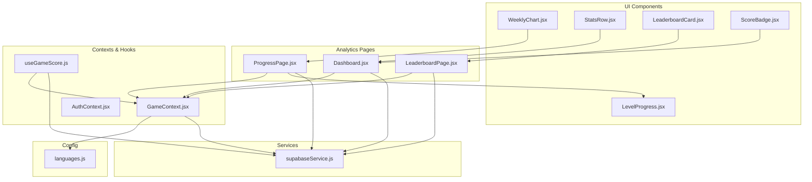
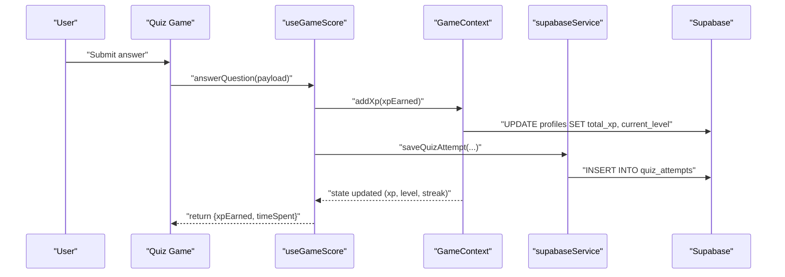
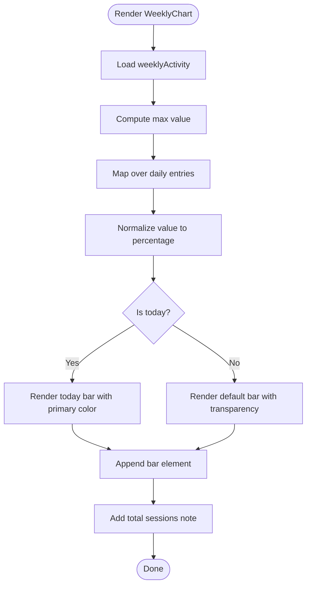
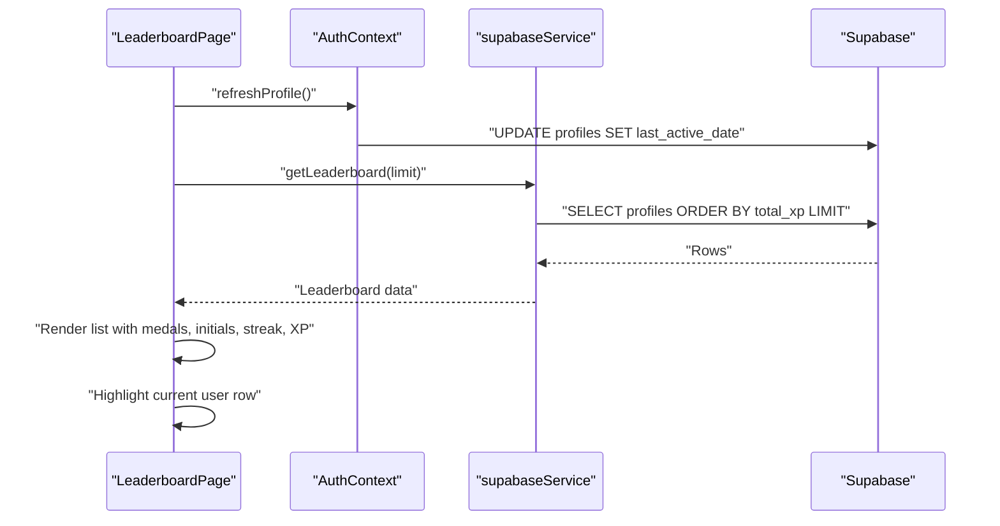
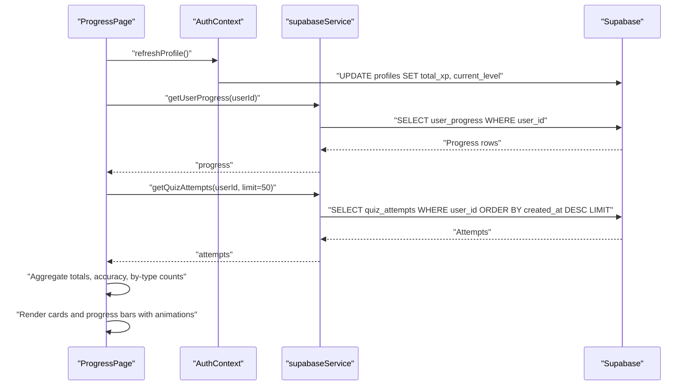
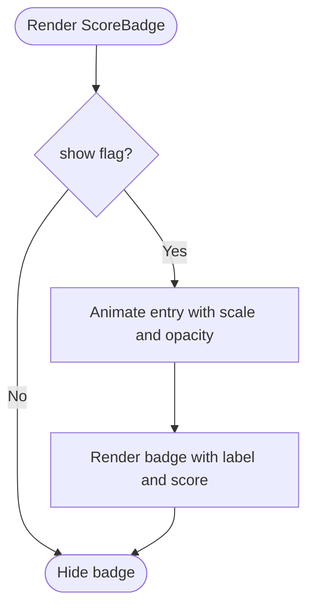
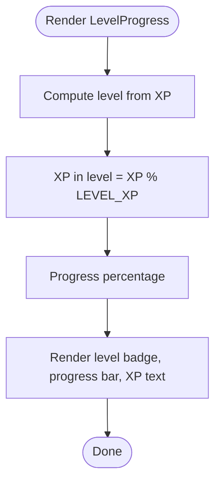
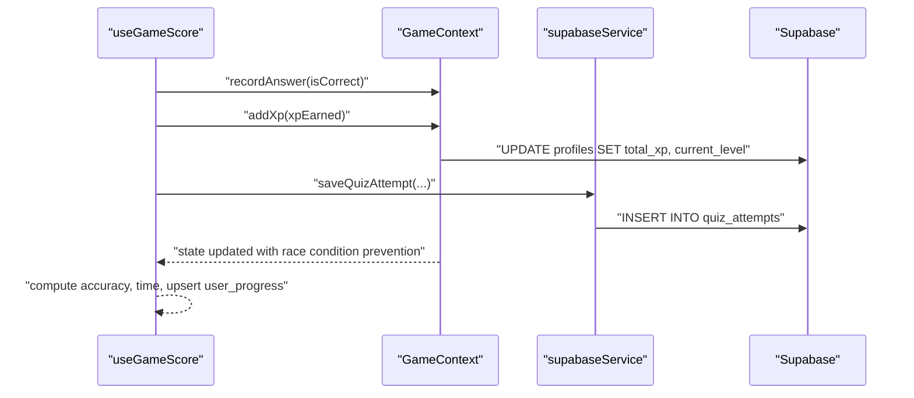
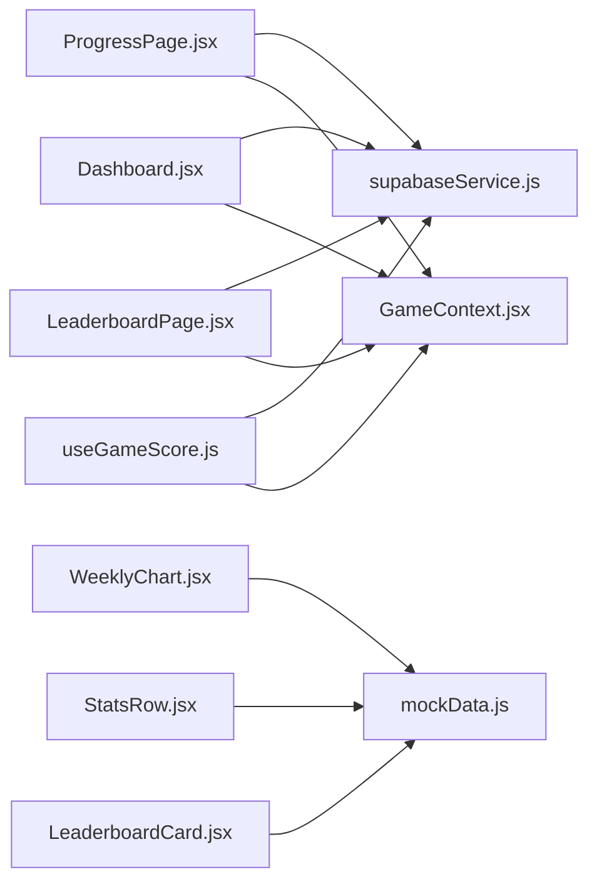

# Progress Tracking and Analytics

<cite>
**Referenced Files in This Document**
- [WeeklyChart.jsx](file://src/components/WeeklyChart.jsx)
- [StatsRow.jsx](file://src/components/StatsRow.jsx)
- [LeaderboardCard.jsx](file://src/components/LeaderboardCard.jsx)
- [ScoreBadge.jsx](file://src/components/ScoreBadge.jsx)
- [ProgressPage.jsx](file://src/pages/dashboard/ProgressPage.jsx)
- [LeaderboardPage.jsx](file://src/pages/dashboard/LeaderboardPage.jsx)
- [mockData.js](file://src/data/mockData.js)
- [supabaseService.js](file://src/services/supabaseService.js)
- [GameContext.jsx](file://src/contexts/GameContext.jsx)
- [useGameScore.js](file://src/hooks/useGameScore.js)
- [languages.js](file://src/config/languages.js)
- [LevelProgress.jsx](file://src/components/LevelProgress.jsx)
- [Dashboard.jsx](file://src/pages/dashboard/Dashboard.jsx)
- [AppLayout.jsx](file://src/layouts/AppLayout.jsx)
</cite>

## Update Summary
**Changes Made**
- Enhanced ProgressPage component with comprehensive analytics and learning history
- Improved LeaderboardPage with real-time ranking and social engagement features
- Updated data visualization components with better performance and user experience
- Strengthened integration between progress data, user scores, and external ranking systems
- Added advanced leaderboard ranking algorithms and user comparison features

## Table of Contents
1. [Introduction](#introduction)
2. [Project Structure](#project-structure)
3. [Core Components](#core-components)
4. [Architecture Overview](#architecture-overview)
5. [Detailed Component Analysis](#detailed-component-analysis)
6. [Dependency Analysis](#dependency-analysis)
7. [Performance Considerations](#performance-considerations)
8. [Troubleshooting Guide](#troubleshooting-guide)
9. [Conclusion](#conclusion)
10. [Appendices](#appendices)

## Introduction
This document explains the progress tracking and analytics system, focusing on comprehensive weekly progress visualization, performance statistics, and leaderboard implementation. The system now features enhanced analytics components with improved data visualization and user engagement capabilities, including dedicated ProgressPage and LeaderboardPage components for detailed progress tracking and ranking systems.

## Project Structure
The analytics and progress features are implemented across components, pages, services, contexts, and configuration modules. Key areas include:
- Visualization components: WeeklyChart, StatsRow, LeaderboardCard, ScoreBadge, LevelProgress
- Comprehensive analytics pages: ProgressPage (detailed analytics and history), LeaderboardPage (global rankings)
- Services: supabaseService for data persistence and retrieval
- Contexts: GameContext for XP, streak, and scoring state management
- Hooks: useGameScore for scoring lifecycle and saving quiz attempts
- Config: languages for XP rewards, levels, and language metadata

**Diagram sources**
- [WeeklyChart.jsx:1-34](file://src/components/WeeklyChart.jsx#L1-L34)
- [StatsRow.jsx:1-17](file://src/components/StatsRow.jsx#L1-L17)
- [LeaderboardCard.jsx:1-48](file://src/components/LeaderboardCard.jsx#L1-L48)
- [ScoreBadge.jsx:1-37](file://src/components/ScoreBadge.jsx#L1-L37)
- [LevelProgress.jsx:1-18](file://src/components/LevelProgress.jsx#L1-L18)
- [ProgressPage.jsx:1-160](file://src/pages/dashboard/ProgressPage.jsx#L1-L160)
- [LeaderboardPage.jsx:1-85](file://src/pages/dashboard/LeaderboardPage.jsx#L1-L85)
- [Dashboard.jsx:1-159](file://src/pages/dashboard/Dashboard.jsx#L1-L159)
- [supabaseService.js:1-210](file://src/services/supabaseService.js#L1-L210)
- [GameContext.jsx:1-145](file://src/contexts/GameContext.jsx#L1-L145)
- [useGameScore.js:1-101](file://src/hooks/useGameScore.js#L1-L101)
- [languages.js:1-30](file://src/config/languages.js#L1-L30)

**Section sources**
- [AppLayout.jsx:1-42](file://src/layouts/AppLayout.jsx#L1-L42)
- [ProgressPage.jsx:1-160](file://src/pages/dashboard/ProgressPage.jsx#L1-L160)
- [LeaderboardPage.jsx:1-85](file://src/pages/dashboard/LeaderboardPage.jsx#L1-L85)

## Core Components
- **WeeklyChart**: Renders a compact weekly bar chart of activity values with enhanced styling and today's highlight feature
- **StatsRow**: Displays quick stats cards (streak, total points, accuracy, sessions) using mock data
- **LeaderboardCard**: Shows a compact weekly leaderboard preview with avatars, streaks, and points
- **LeaderboardPage**: Enhanced leaderboard page with real-time ranking, user highlighting, and social engagement features
- **ProgressPage**: Comprehensive analytics page with level progress, activity breakdown, and language progress tracking
- **ScoreBadge**: Animated badge to display current score and optional XP gain popups
- **LevelProgress**: Visual progress indicator within a level with XP-in-level and level threshold
- **GameContext**: Centralized state for XP, level, streak, and scoring actions; persists to Supabase
- **useGameScore**: Hook to compute score, track correctness, award XP, and persist quiz attempts
- **supabaseService**: Backend integration for retrieving attempts, progress, and leaderboard data

**Section sources**
- [WeeklyChart.jsx:1-34](file://src/components/WeeklyChart.jsx#L1-L34)
- [StatsRow.jsx:1-17](file://src/components/StatsRow.jsx#L1-L17)
- [LeaderboardCard.jsx:1-48](file://src/components/LeaderboardCard.jsx#L1-L48)
- [LeaderboardPage.jsx:1-85](file://src/pages/dashboard/LeaderboardPage.jsx#L1-L85)
- [ProgressPage.jsx:1-160](file://src/pages/dashboard/ProgressPage.jsx#L1-L160)
- [ScoreBadge.jsx:1-37](file://src/components/ScoreBadge.jsx#L1-L37)
- [LevelProgress.jsx:1-18](file://src/components/LevelProgress.jsx#L1-L18)
- [GameContext.jsx:1-145](file://src/contexts/GameContext.jsx#L1-L145)
- [useGameScore.js:1-101](file://src/hooks/useGameScore.js#L1-L101)
- [supabaseService.js:1-210](file://src/services/supabaseService.js#L1-L210)

## Architecture Overview
The analytics pipeline integrates frontend components with Supabase-backed services. Scoring events trigger immediate UI updates and persistent writes. Leaderboards are fetched on demand and rendered in dedicated pages with enhanced user interaction features.

**Diagram sources**
- [useGameScore.js:28-60](file://src/hooks/useGameScore.js#L28-L60)
- [GameContext.jsx:76-89](file://src/contexts/GameContext.jsx#L76-L89)
- [supabaseService.js:32-58](file://src/services/supabaseService.js#L32-L58)

## Detailed Component Analysis

### WeeklyChart: Weekly Progress Visualization
- **Purpose**: Render a compact weekly bar chart of activity values with enhanced styling
- **Data source**: Uses mock weeklyActivity data
- **Rendering logic**:
  - Computes a global maximum across values to normalize bar heights
  - Iterates over daily data to render bars with today highlighted
  - Displays day labels and a summary footer
- **Enhanced features**: Improved color contrast, smoother animations, and responsive design
- **Extensibility**: Replace mock data with dynamic queries to a weekly aggregation endpoint

**Diagram sources**
- [WeeklyChart.jsx:3-29](file://src/components/WeeklyChart.jsx#L3-L29)
- [mockData.js:23-31](file://src/data/mockData.js#L23-L31)

**Section sources**
- [WeeklyChart.jsx:1-34](file://src/components/WeeklyChart.jsx#L1-L34)
- [mockData.js:23-31](file://src/data/mockData.js#L23-L31)

### StatsRow: Key Metrics Display
- **Purpose**: Present quick stats cards for streak, total points, accuracy, and sessions
- **Data source**: Uses mock statsData
- **Rendering**: Grid layout with stat cards combining icon, label, value, and delta
- **Real-time updates**: Intended to reflect live GameContext state; currently uses mock data

**Diagram sources**
- [StatsRow.jsx:5-14](file://src/components/StatsRow.jsx#L5-L14)
- [mockData.js:1-6](file://src/data/mockData.js#L1-L6)

**Section sources**
- [StatsRow.jsx:1-17](file://src/components/StatsRow.jsx#L1-L17)
- [mockData.js:1-6](file://src/data/mockData.js#L1-L6)

### LeaderboardCard and LeaderboardPage: Enhanced Rankings and Social Engagement
- **LeaderboardCard**:
  - Displays top entries with medals for top 3 ranks, initials avatars, streak, and points
  - Highlights the current user's row with special styling
  - Provides navigation to full leaderboard
- **LeaderboardPage**:
  - **Enhanced**: Fetches leaderboard entries from the backend ordered by total XP
  - **Real-time updates**: Refreshes current user's profile first for accurate ranking
  - **Loading states**: Handles loading and empty states with skeleton loaders
  - **User highlighting**: Identifies and styles the current user's row differently
  - **Social features**: Hover effects, animations, and responsive design
  - **Error handling**: Graceful fallbacks for empty leaderboards

**Diagram sources**
- [LeaderboardPage.jsx:13-20](file://src/pages/dashboard/LeaderboardPage.jsx#L13-L20)
- [supabaseService.js:127-135](file://src/services/supabaseService.js#L127-L135)

**Section sources**
- [LeaderboardCard.jsx:1-48](file://src/components/LeaderboardCard.jsx#L1-L48)
- [LeaderboardPage.jsx:1-85](file://src/pages/dashboard/LeaderboardPage.jsx#L1-L85)
- [supabaseService.js:127-135](file://src/services/supabaseService.js#L127-L135)

### ProgressPage: Comprehensive Analytics and Learning History
- **Purpose**: Aggregate and present user progress, accuracy, and language-specific learning
- **Enhanced features**: Comprehensive analytics dashboard with multiple data visualization sections
- **Data aggregation**:
  - Loads user progress and recent quiz attempts
  - Computes overall accuracy and attempt counts by quiz type
  - Builds language progress bars from aggregated data
  - Integrates with GameContext for real-time XP/level/streak data
- **Rendering sections**:
  - **Level progress card**: Real-time XP progression with animated progress bar
  - **Activity breakdown**: Grid of quiz type statistics with emojis and hover effects
  - **Language progress**: Per-language progress tracking with filtering and aggregation
- **Error handling**: Graceful error messages for database connectivity issues
- **Performance**: Optimized data fetching with Promise.all for concurrent operations

**Diagram sources**
- [ProgressPage.jsx:17-47](file://src/pages/dashboard/ProgressPage.jsx#L17-L47)
- [supabaseService.js:62-69](file://src/services/supabaseService.js#L62-L69)
- [supabaseService.js:47-58](file://src/services/supabaseService.js#L47-L58)

**Section sources**
- [ProgressPage.jsx:1-160](file://src/pages/dashboard/ProgressPage.jsx#L1-L160)
- [supabaseService.js:47-101](file://src/services/supabaseService.js#L47-L101)

### ScoreBadge: Achievements and Visual Feedback
- **Purpose**: Display current score and optionally animate XP gain popups
- **Features**:
  - Badge with label and score
  - Popup animation for XP gains using motion primitives
  - Conditional rendering based on show flag
- **Integration**: Used alongside real-time score updates from GameContext

**Diagram sources**
- [ScoreBadge.jsx:3-17](file://src/components/ScoreBadge.jsx#L3-L17)

**Section sources**
- [ScoreBadge.jsx:1-37](file://src/components/ScoreBadge.jsx#L1-L37)

### LevelProgress: In-Level Progress Indicator
- **Purpose**: Visualize XP progression within the current level
- **Logic**:
  - Calculates current level from XP using LEVEL_XP constant
  - Computes XP-in-level and progress percentage
  - Renders a progress bar and XP counters with animated transitions
- **Enhanced styling**: Modern badge design with gradient progress bar

**Diagram sources**
- [LevelProgress.jsx:3-16](file://src/components/LevelProgress.jsx#L3-L16)
- [languages.js:27-29](file://src/config/languages.js#L27-L29)

**Section sources**
- [LevelProgress.jsx:1-18](file://src/components/LevelProgress.jsx#L1-L18)
- [languages.js:20-30](file://src/config/languages.js#L20-L30)

### GameContext and useGameScore: Enhanced Scoring Lifecycle and Persistence
- **GameContext**:
  - **Enhanced**: Manages XP, level, streak, and scoring metrics with improved state management
  - **Persistence**: Persists XP and level updates to profiles with race condition prevention
  - **Streak management**: Updates streak and awards streak bonus XP
  - **Performance**: Uses useRef for current XP value to avoid stale-state writes
- **useGameScore**:
  - **Enhanced**: Tracks score, correct answers, and total attempts with timer functionality
  - **XP calculation**: Awards XP on correct answers with configurable reward types
  - **Data persistence**: Records attempts to the database with error handling
  - **Session finalization**: Upserts per-language progress to user_progress table
  - **Return metrics**: Computes accuracy and timing metrics for analytics

**Diagram sources**
- [useGameScore.js:28-86](file://src/hooks/useGameScore.js#L28-L86)
- [GameContext.jsx:76-123](file://src/contexts/GameContext.jsx#L76-L123)
- [supabaseService.js:32-101](file://src/services/supabaseService.js#L32-L101)

**Section sources**
- [GameContext.jsx:1-145](file://src/contexts/GameContext.jsx#L1-L145)
- [useGameScore.js:1-101](file://src/hooks/useGameScore.js#L1-L101)
- [supabaseService.js:32-101](file://src/services/supabaseService.js#L32-L101)

## Dependency Analysis
- **Component-to-service coupling**:
  - ProgressPage depends on supabaseService for user progress and quiz attempts
  - LeaderboardPage depends on supabaseService for leaderboard retrieval
  - Dashboard uses GameContext for XP/streak and recent quiz attempts
- **Context-to-service coupling**:
  - GameContext persists XP and streak updates to Supabase with race condition prevention
  - useGameScore persists quiz attempts and triggers XP updates
- **Mock data usage**:
  - WeeklyChart, StatsRow, and LeaderboardCard use mockData for demonstration
  - These can be replaced with live data from services
- **Enhanced integration**:
  - ProgressPage and LeaderboardPage now use real-time data from GameContext
  - All components benefit from improved error handling and loading states

**Diagram sources**
- [ProgressPage.jsx:6-6](file://src/pages/dashboard/ProgressPage.jsx#L6-L6)
- [LeaderboardPage.jsx:4-4](file://src/pages/dashboard/LeaderboardPage.jsx#L4-L4)
- [Dashboard.jsx:6-11](file://src/pages/dashboard/Dashboard.jsx#L6-L11)
- [useGameScore.js:5-9](file://src/hooks/useGameScore.js#L5-L9)
- [WeeklyChart.jsx:1-1](file://src/components/WeeklyChart.jsx#L1-L1)
- [StatsRow.jsx:1-1](file://src/components/StatsRow.jsx#L1-L1)
- [LeaderboardCard.jsx:1-1](file://src/components/LeaderboardCard.jsx#L1-L1)
- [mockData.js:1-47](file://src/data/mockData.js#L1-L47)

**Section sources**
- [ProgressPage.jsx:1-160](file://src/pages/dashboard/ProgressPage.jsx#L1-L160)
- [LeaderboardPage.jsx:1-85](file://src/pages/dashboard/LeaderboardPage.jsx#L1-L85)
- [Dashboard.jsx:1-159](file://src/pages/dashboard/Dashboard.jsx#L1-L159)
- [useGameScore.js:1-101](file://src/hooks/useGameScore.js#L1-L101)
- [supabaseService.js:1-210](file://src/services/supabaseService.js#L1-L210)
- [mockData.js:1-47](file://src/data/mockData.js#L1-L47)

## Performance Considerations
- **Data fetching optimization**:
  - Use pagination and limits for leaderboard and quiz attempts to avoid large payloads
  - Implement Promise.all for concurrent data fetching in ProgressPage
  - Debounce or batch requests when integrating live updates
- **Enhanced rendering performance**:
  - Virtualize long lists in leaderboard for large datasets
  - Memoize computed aggregates (accuracy, totals) to prevent unnecessary re-renders
  - Use React.memo for components that receive static props
- **Persistence optimization**:
  - Batch writes for frequent XP updates if needed; current implementation writes per event
  - Race condition prevention using useRef for current XP values
- **Real-time updates enhancement**:
  - Subscribe to Supabase changes for leaderboard and user progress to refresh views instantly
  - Implement optimistic updates for immediate feedback
- **Memory management**:
  - Limit stored recent XP gains and recent attempts arrays to a fixed window
  - Cleanup timers and intervals in useEffect cleanup functions

## Troubleshooting Guide
- **Leaderboard shows no data**:
  - Verify backend query and permissions; confirm profiles exist with populated XP
  - Check refreshProfile() call order in LeaderboardPage
- **WeeklyChart bars appear uneven**:
  - Ensure weeklyActivity values are numeric and non-negative
  - Check normalization logic and max value calculation
- **ScoreBadge not animating**:
  - Confirm show flag is toggled and motion library is initialized
- **Streak not incrementing**:
  - Check last_active_date logic and daily update conditions in GameContext
  - Verify updateStreak() function execution
- **Quiz attempts not saved**:
  - Inspect saveQuizAttempt errors and network connectivity
  - Check user authentication status
- **ProgressPage loading indefinitely**:
  - Verify database connectivity and table existence
  - Check error handling in Promise.all
- **Language progress not showing**:
  - Ensure user_progress table has data for the current user
  - Verify language codes match between LANGUAGES config and database

**Section sources**
- [LeaderboardPage.jsx:13-20](file://src/pages/dashboard/LeaderboardPage.jsx#L13-L20)
- [WeeklyChart.jsx:3-29](file://src/components/WeeklyChart.jsx#L3-L29)
- [ScoreBadge.jsx:5-16](file://src/components/ScoreBadge.jsx#L5-L16)
- [GameContext.jsx:111-123](file://src/contexts/GameContext.jsx#L111-L123)
- [useGameScore.js:53-56](file://src/hooks/useGameScore.js#L53-L56)
- [ProgressPage.jsx:36-46](file://src/pages/dashboard/ProgressPage.jsx#L36-L46)

## Conclusion
The progress tracking and analytics system now provides comprehensive coverage of user learning activities through enhanced components and pages. The new ProgressPage offers detailed analytics and learning history, while the improved LeaderboardPage delivers real-time ranking with social engagement features. Combined with robust backend services and optimized performance considerations, the system scales effectively while maintaining responsiveness and user engagement.

## Appendices

### Extending Analytics Capabilities
- **New progress metrics**:
  - Add fields to user_progress and aggregate in ProgressPage
  - Extend LevelProgress to visualize new thresholds
  - Implement custom analytics dashboards for specific learning objectives
- **Enhanced real-time updates**:
  - Subscribe to Supabase channels for quiz_attempts and profiles to refresh UI without reloads
  - Implement WebSocket connections for instant leaderboard updates
  - Add push notifications for milestone achievements
- **Advanced leaderboard features**:
  - Add filters (time range, language, difficulty) and sorting options
  - Introduce weekly vs lifetime leaderboards with toggle controls
  - Implement friend-based leaderboards and team competitions
- **Enhanced visualizations**:
  - Replace bar charts with line charts for trend analysis
  - Add interactive tooltips and drill-down to attempt details
  - Implement custom chart components for complex analytics
- **Performance monitoring**:
  - Add analytics for user engagement metrics (time spent, completion rates)
  - Track learning patterns and recommendation systems
  - Implement A/B testing framework for feature evaluation

### Maintaining Performance
- **Database optimization**:
  - Create indexes on frequently queried columns (user_id, created_at, total_xp)
  - Implement database partitioning for large datasets
  - Use connection pooling for Supabase connections
- **Frontend optimization**:
  - Implement code splitting for analytics-heavy pages
  - Use lazy loading for large datasets and charts
  - Optimize bundle size with tree shaking and dynamic imports
- **Caching strategies**:
  - Cache recent attempts and progress locally with expiration
  - Implement server-side caching for leaderboard queries
  - Use service workers for offline analytics data
- **Scalability considerations**:
  - Design for horizontal scaling with multiple database replicas
  - Implement rate limiting for API endpoints
  - Monitor and optimize query performance with database analytics