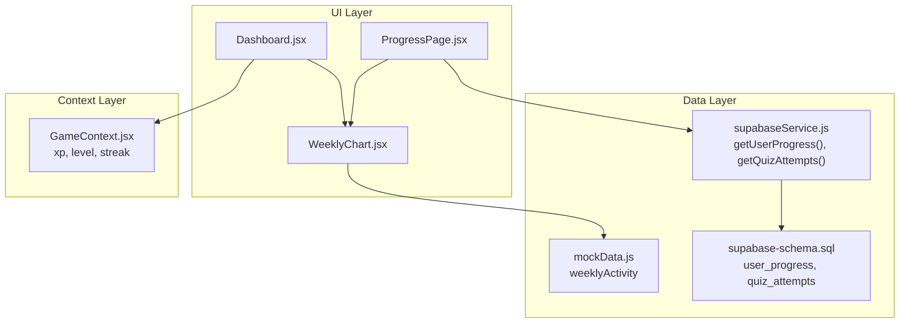
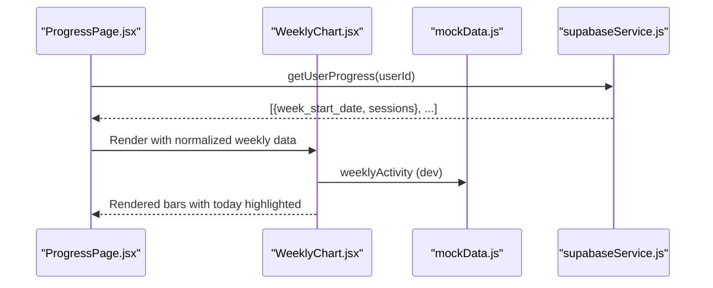
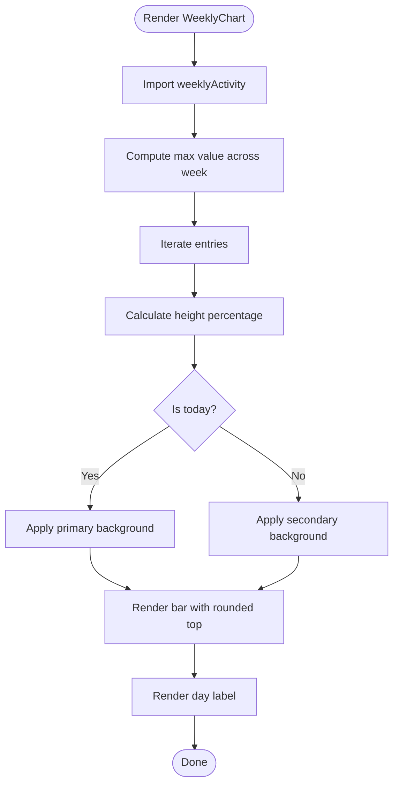
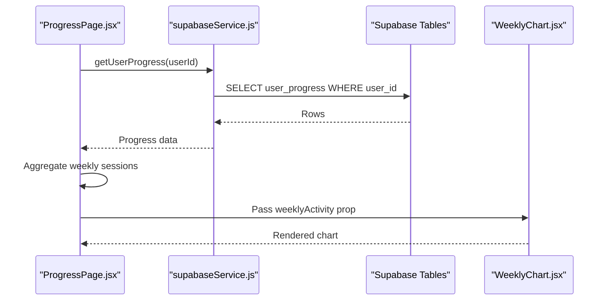
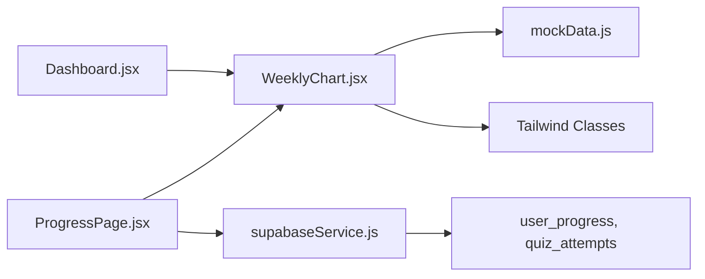
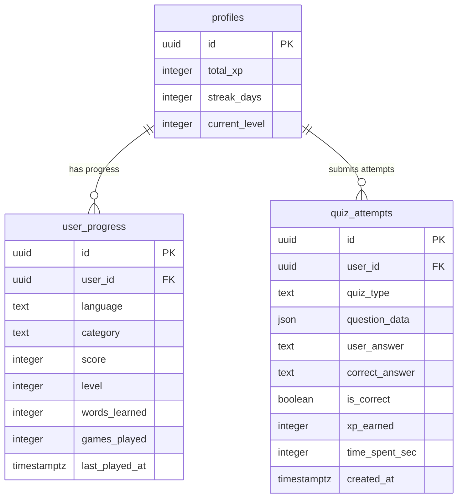

# Weekly Progress Charts

<cite>
**Referenced Files in This Document**
- [WeeklyChart.jsx](file://src/components/WeeklyChart.jsx)
- [mockData.js](file://src/data/mockData.js)
- [ProgressPage.jsx](file://src/pages/dashboard/ProgressPage.jsx)
- [Dashboard.jsx](file://src/pages/dashboard/Dashboard.jsx)
- [supabaseService.js](file://src/services/supabaseService.js)
- [supabase-schema.sql](file://supabase-schema.sql)
- [GameContext.jsx](file://src/contexts/GameContext.jsx)
</cite>

## Table of Contents
1. [Introduction](#introduction)
2. [Project Structure](#project-structure)
3. [Core Components](#core-components)
4. [Architecture Overview](#architecture-overview)
5. [Detailed Component Analysis](#detailed-component-analysis)
6. [Dependency Analysis](#dependency-analysis)
7. [Performance Considerations](#performance-considerations)
8. [Troubleshooting Guide](#troubleshooting-guide)
9. [Conclusion](#conclusion)
10. [Appendices](#appendices)

## Introduction
This document provides comprehensive documentation for the weekly progress charts system, focusing on the WeeklyChart component and its surrounding data pipeline. It explains how raw user progress data is transformed into chart-ready datasets, how the component renders bar-style charts, and how it integrates with progress tracking data sources. It also covers responsive design considerations, styling customization, and practical guidance for extending the system with new visualization modes and external chart libraries while maintaining consistency with the existing design system.

## Project Structure
The weekly progress visualization is implemented as a lightweight, self-contained React component that consumes pre-aggregated weekly activity data. The data originates from mock sources during development and is intended to integrate with Supabase-backed services for production usage. The component is designed to be embedded within dashboard and progress pages.

**Diagram sources**
- [WeeklyChart.jsx:1-33](file://src/components/WeeklyChart.jsx#L1-L33)
- [mockData.js:23-31](file://src/data/mockData.js#L23-L31)
- [ProgressPage.jsx:1-35](file://src/pages/dashboard/ProgressPage.jsx#L1-L35)
- [Dashboard.jsx:1-151](file://src/pages/dashboard/Dashboard.jsx#L1-L151)
- [supabaseService.js:60-85](file://src/services/supabaseService.js#L60-L85)
- [supabase-schema.sql:70-92](file://supabase-schema.sql#L70-L92)
- [GameContext.jsx:57-93](file://src/contexts/GameContext.jsx#L57-L93)

**Section sources**
- [WeeklyChart.jsx:1-33](file://src/components/WeeklyChart.jsx#L1-L33)
- [mockData.js:23-31](file://src/data/mockData.js#L23-L31)
- [ProgressPage.jsx:1-35](file://src/pages/dashboard/ProgressPage.jsx#L1-L35)
- [Dashboard.jsx:1-151](file://src/pages/dashboard/Dashboard.jsx#L1-L151)
- [supabaseService.js:60-85](file://src/services/supabaseService.js#L60-L85)
- [supabase-schema.sql:70-92](file://supabase-schema.sql#L70-L92)
- [GameContext.jsx:57-93](file://src/contexts/GameContext.jsx#L57-L93)

## Core Components
- WeeklyChart: Renders a compact weekly bar chart using Tailwind classes and inline styles. It calculates normalized heights based on the maximum value in the dataset and highlights the most recent day.
- mockData: Provides a static weeklyActivity dataset used for development and demonstration.
- ProgressPage and Dashboard: Pages that demonstrate embedding the chart and integrating with Supabase-backed progress data.
- supabaseService: Supplies data-fetching functions for user progress and quiz attempts.
- GameContext: Provides game-derived metrics (XP, level, streak) used in dashboards.

Key implementation patterns:
- Data normalization: The component computes the maximum value across the week and scales each bar’s height as a percentage of that maximum.
- Responsive layout: Uses flexbox with proportional gaps and fixed container height to maintain consistent proportions across screen sizes.
- Styling via design tokens: Leverages Tailwind utility classes aligned with the base theme (e.g., bg-base-100, bg-primary, text-base-content/40).

**Section sources**
- [WeeklyChart.jsx:3-25](file://src/components/WeeklyChart.jsx#L3-L25)
- [mockData.js:23-31](file://src/data/mockData.js#L23-L31)
- [ProgressPage.jsx:15-25](file://src/pages/dashboard/ProgressPage.jsx#L15-L25)
- [Dashboard.jsx:9-23](file://src/pages/dashboard/Dashboard.jsx#L9-L23)
- [supabaseService.js:60-85](file://src/services/supabaseService.js#L60-L85)
- [GameContext.jsx:57-93](file://src/contexts/GameContext.jsx#L57-L93)

## Architecture Overview
The weekly chart system follows a unidirectional data flow:
- Data source: Either mock data for development or Supabase-backed queries for production.
- Transformation: The component normalizes values to percentages for rendering.
- Rendering: Pure JSX with Tailwind utilities and inline styles for dynamic heights.
- Integration: Embedded in dashboard and progress pages; can be extended to support real-time updates via context or polling.

**Diagram sources**
- [ProgressPage.jsx:15-25](file://src/pages/dashboard/ProgressPage.jsx#L15-L25)
- [WeeklyChart.jsx:1-33](file://src/components/WeeklyChart.jsx#L1-L33)
- [mockData.js:23-31](file://src/data/mockData.js#L23-L31)
- [supabaseService.js:60-85](file://src/services/supabaseService.js#L60-L85)

## Detailed Component Analysis

### WeeklyChart Component
The component encapsulates:
- Data ingestion: Imports a weeklyActivity array containing day labels and numeric values.
- Normalization: Computes the maximum value across the week and derives a percentage height for each bar.
- Conditional styling: Highlights the latest day differently from previous days.
- Layout: Uses a flex container with proportional gaps and a fixed height to ensure consistent aspect ratios.

Rendering algorithm:
- Iterate over weeklyActivity entries.
- Compute height percentage per entry relative to the global maximum.
- Render a vertical bar with rounded top caps and conditional background classes.
- Display abbreviated day labels below each bar.

Responsive design considerations:
- Fixed container height ensures consistent visual weight regardless of viewport width.
- Flex gap spacing adapts proportionally to container width.
- Typography scales with text-[10px] for labels to avoid overflow on narrow screens.

**Diagram sources**
- [WeeklyChart.jsx:3-25](file://src/components/WeeklyChart.jsx#L3-L25)

**Section sources**
- [WeeklyChart.jsx:1-33](file://src/components/WeeklyChart.jsx#L1-L33)
- [mockData.js:23-31](file://src/data/mockData.js#L23-L31)

### Data Aggregation Pipeline
Current state:
- Development: The component consumes a static weeklyActivity array.
- Production intent: The ProgressPage fetches user progress and quiz attempts from Supabase and could feed the chart with aggregated weekly session counts.

Aggregation steps (conceptual):
- Fetch raw progress records from user_progress and quiz_attempts.
- Group records by week (using last_played_at or created_at).
- Count sessions per weekday.
- Normalize counts to percentages for chart rendering.

Integration touchpoints:
- getUserProgress: Retrieve user progress records for a given user.
- getQuizAttempts: Retrieve quiz attempts to derive session counts by date.

**Diagram sources**
- [ProgressPage.jsx:15-25](file://src/pages/dashboard/ProgressPage.jsx#L15-L25)
- [supabaseService.js:60-85](file://src/services/supabaseService.js#L60-L85)
- [supabase-schema.sql:70-92](file://supabase-schema.sql#L70-L92)
- [WeeklyChart.jsx:1-33](file://src/components/WeeklyChart.jsx#L1-L33)

**Section sources**
- [ProgressPage.jsx:15-25](file://src/pages/dashboard/ProgressPage.jsx#L15-L25)
- [supabaseService.js:60-85](file://src/services/supabaseService.js#L60-L85)
- [supabase-schema.sql:70-92](file://supabase-schema.sql#L70-L92)

### Temporal Data Handling and Real-Time Updates
- Temporal granularity: The current mock dataset uses day-of-week labels. For production, align dates to ISO weeks or rolling 7-day windows.
- Real-time updates: To enable live updates, wire the component to:
  - Polling: Periodically refetch weeklyActivity from Supabase.
  - Context: Subscribe to GameContext updates for XP/streak changes that may correlate with increased activity.
  - WebSocket: Use Supabase Realtime for push notifications when new progress data arrives.

Embedding locations:
- Dashboard: Demonstrates quick stats and recent activity; a weekly chart slot can be added alongside these cards.
- ProgressPage: Centralized analytics page where the chart can be prominently featured.

**Section sources**
- [Dashboard.jsx:38-147](file://src/pages/dashboard/Dashboard.jsx#L38-L147)
- [ProgressPage.jsx:34-64](file://src/pages/dashboard/ProgressPage.jsx#L34-L64)
- [GameContext.jsx:57-93](file://src/contexts/GameContext.jsx#L57-L93)

### Styling Customization and Interactive Features
Styling customization:
- Color palette: Primary vs. secondary bars can be toggled via props or theme overrides.
- Typography: Adjust label sizing and truncation for different locales.
- Spacing: Modify gap values and container height to fit various card layouts.

Interactive features (extension ideas):
- Tooltips: Add a small overlay on hover showing exact session counts and timestamps.
- Drill-down: Click a bar to filter detailed activity for that day.
- Animation: Introduce subtle transitions for height changes using CSS transitions or a lightweight animation library.

**Section sources**
- [WeeklyChart.jsx:10-25](file://src/components/WeeklyChart.jsx#L10-L25)

### Extending Chart Types and Integrating External Libraries
Guidance for adding new visualization modes:
- Define a unified data contract (e.g., weeklyActivity) and a render prop or switch to support multiple chart types.
- For external libraries (e.g., lightweight charting libraries), isolate rendering logic behind a wrapper component to preserve design system consistency.

Maintaining design system consistency:
- Use Tailwind utilities and theme tokens (e.g., bg-base-100, text-base-content/40) for colors and typography.
- Align spacing and typography scales with existing components.

[No sources needed since this section provides general guidance]

## Dependency Analysis
The WeeklyChart component currently depends on:
- mockData for development data.
- Tailwind classes for styling.
- Inline styles for dynamic bar heights.

Integration dependencies:
- ProgressPage and Dashboard import and embed the component.
- Supabase service functions provide the production data pipeline.

**Diagram sources**
- [WeeklyChart.jsx:1-33](file://src/components/WeeklyChart.jsx#L1-L33)
- [mockData.js:23-31](file://src/data/mockData.js#L23-L31)
- [ProgressPage.jsx:1-35](file://src/pages/dashboard/ProgressPage.jsx#L1-L35)
- [Dashboard.jsx:1-151](file://src/pages/dashboard/Dashboard.jsx#L1-L151)
- [supabaseService.js:60-85](file://src/services/supabaseService.js#L60-L85)
- [supabase-schema.sql:70-92](file://supabase-schema.sql#L70-L92)

**Section sources**
- [WeeklyChart.jsx:1-33](file://src/components/WeeklyChart.jsx#L1-L33)
- [mockData.js:23-31](file://src/data/mockData.js#L23-L31)
- [ProgressPage.jsx:1-35](file://src/pages/dashboard/ProgressPage.jsx#L1-L35)
- [Dashboard.jsx:1-151](file://src/pages/dashboard/Dashboard.jsx#L1-L151)
- [supabaseService.js:60-85](file://src/services/supabaseService.js#L60-L85)
- [supabase-schema.sql:70-92](file://supabase-schema.sql#L70-L92)

## Performance Considerations
- Rendering cost: The component iterates over a fixed-size weekly dataset; performance impact is minimal.
- Memory usage: Avoid duplicating datasets; pass normalized arrays as props.
- Smooth animations: Prefer CSS transitions for height changes; avoid heavy third-party libraries for simple bar charts.
- Large datasets: If expanding to monthly or yearly views, consider virtualization or sampling strategies.

[No sources needed since this section provides general guidance]

## Troubleshooting Guide
Common issues and resolutions:
- Empty chart: Ensure the weeklyActivity array is populated and not empty. In production, verify that getUserProgress returns data for the requested user.
- Incorrect scaling: Confirm that the maximum value calculation accounts for all entries and handles zero/max scenarios gracefully.
- Styling inconsistencies: Verify Tailwind utilities match the current theme and that color classes are applied conditionally as intended.

**Section sources**
- [WeeklyChart.jsx:3-25](file://src/components/WeeklyChart.jsx#L3-L25)
- [ProgressPage.jsx:15-25](file://src/pages/dashboard/ProgressPage.jsx#L15-L25)
- [supabaseService.js:60-85](file://src/services/supabaseService.js#L60-L85)

## Conclusion
The weekly progress charts system centers on a simple, efficient component that transforms normalized weekly data into a responsive bar chart. By leveraging mock data during development and integrating with Supabase-backed services in production, the system supports scalable growth. Extending the component to support richer visualizations, tooltips, and real-time updates requires careful adherence to the existing design system and thoughtful consideration of performance and user experience.

[No sources needed since this section summarizes without analyzing specific files]

## Appendices

### Data Models and Relationships
The following ER diagram outlines the relevant tables and relationships used by the progress tracking system.

**Diagram sources**
- [supabase-schema.sql:5-15](file://supabase-schema.sql#L5-L15)
- [supabase-schema.sql:70-92](file://supabase-schema.sql#L70-L92)
- [supabase-schema.sql:47-58](file://supabase-schema.sql#L47-L58)