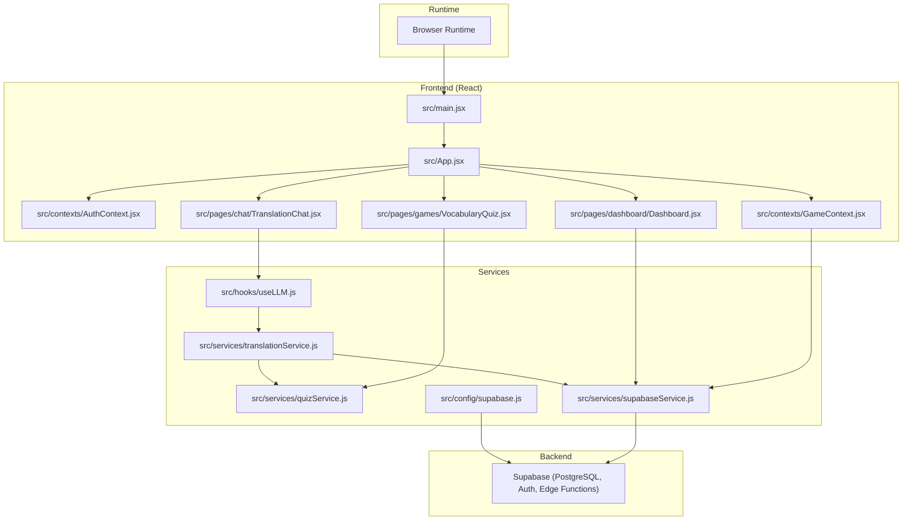
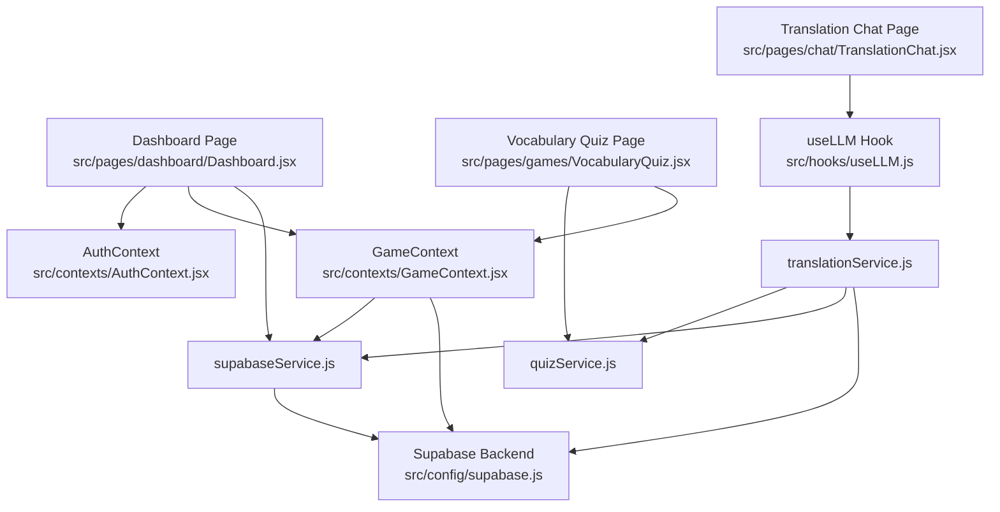
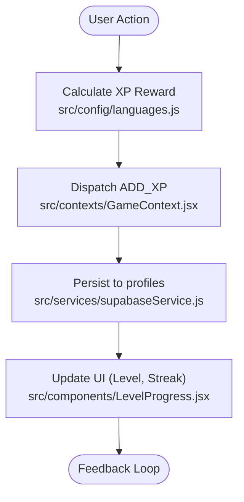
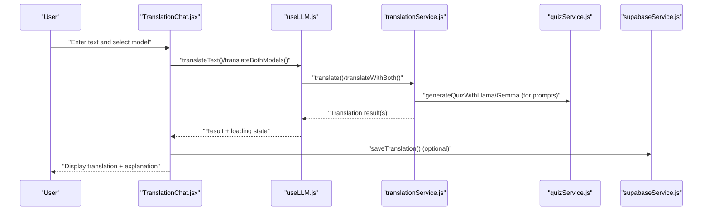
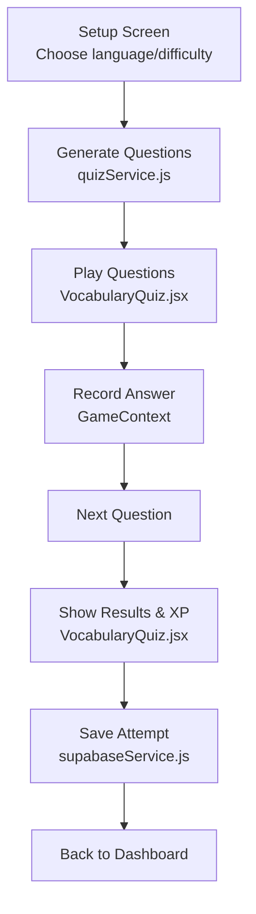
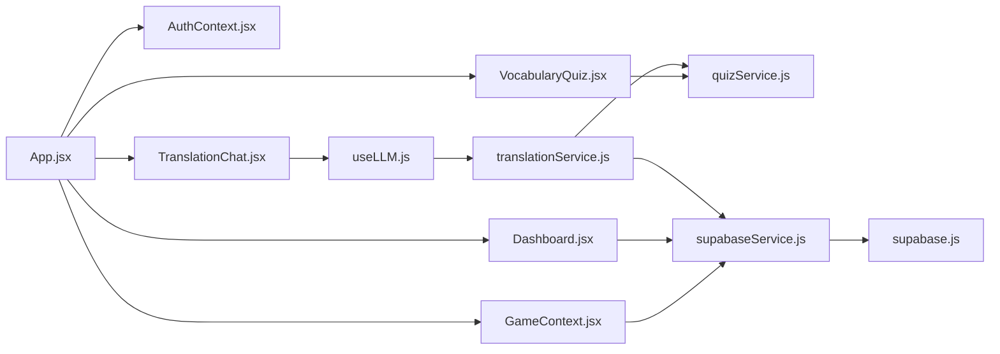

# Project Overview

<cite>
**Referenced Files in This Document**
- [README.md](file://README.md)
- [package.json](file://package.json)
- [src/main.jsx](file://src/main.jsx)
- [src/App.jsx](file://src/App.jsx)
- [src/config/supabase.js](file://src/config/supabase.js)
- [src/config/languages.js](file://src/config/languages.js)
- [src/contexts/AuthContext.jsx](file://src/contexts/AuthContext.jsx)
- [src/contexts/GameContext.jsx](file://src/contexts/GameContext.jsx)
- [src/hooks/useLLM.js](file://src/hooks/useLLM.js)
- [src/services/translationService.js](file://src/services/translationService.js)
- [src/services/quizService.js](file://src/services/quizService.js)
- [src/services/supabaseService.js](file://src/services/supabaseService.js)
- [src/pages/dashboard/Dashboard.jsx](file://src/pages/dashboard/Dashboard.jsx)
- [src/pages/chat/TranslationChat.jsx](file://src/pages/chat/TranslationChat.jsx)
- [src/pages/games/VocabularyQuiz.jsx](file://src/pages/games/VocabularyQuiz.jsx)
- [src/components/LevelProgress.jsx](file://src/components/LevelProgress.jsx)
- [src/components/LanguageProgress.jsx](file://src/components/LanguageProgress.jsx)
</cite>

## Table of Contents
1. [Introduction](#introduction)
2. [Project Structure](#project-structure)
3. [Core Components](#core-components)
4. [Architecture Overview](#architecture-overview)
5. [Detailed Component Analysis](#detailed-component-analysis)
6. [Dependency Analysis](#dependency-analysis)
7. [Performance Considerations](#performance-considerations)
8. [Troubleshooting Guide](#troubleshooting-guide)
9. [Conclusion](#conclusion)

## Introduction
Flinggo-app is an interactive language learning platform designed to accelerate acquisition through gamified mechanics and AI-powered tools. Learners engage with bite-sized challenges, immersive translation practice, and adaptive quizzes, all while earning XP, leveling up, and maintaining streaks. The app combines real-time AI translation with curated learning content, backed by a robust backend for progress tracking and social motivation via leaderboards.

Key educational value:
- Gamified XP and streak systems increase engagement and retention.
- AI-powered translation chat supports conversational fluency and contextual understanding.
- Interactive games reinforce vocabulary and sentence construction skills.
- Progress tracking and leaderboard foster friendly competition and continuous improvement.

Target audience:
- Language learners of all levels seeking an engaging, mobile-first experience.
- Users who prefer self-paced, game-driven practice with immediate feedback.

Main use cases:
- Daily vocabulary and sentence-building challenges.
- Real-time translation practice with model comparison.
- Personalized progress monitoring and leaderboard participation.

## Project Structure
The application follows a React + Vite frontend architecture with modular routing, context providers for global state, and service-layer abstractions for AI and database operations. Authentication and game state are centralized, while feature pages encapsulate domain-specific UI and logic.

**Diagram sources**
- [src/main.jsx:1-14](file://src/main.jsx#L1-L14)
- [src/App.jsx:1-50](file://src/App.jsx#L1-L50)
- [src/contexts/AuthContext.jsx](file://src/contexts/AuthContext.jsx)
- [src/contexts/GameContext.jsx:1-141](file://src/contexts/GameContext.jsx#L1-L141)
- [src/pages/dashboard/Dashboard.jsx:1-151](file://src/pages/dashboard/Dashboard.jsx#L1-L151)
- [src/pages/chat/TranslationChat.jsx:1-197](file://src/pages/chat/TranslationChat.jsx#L1-L197)
- [src/pages/games/VocabularyQuiz.jsx:1-215](file://src/pages/games/VocabularyQuiz.jsx#L1-L215)
- [src/hooks/useLLM.js:1-38](file://src/hooks/useLLM.js#L1-L38)
- [src/services/translationService.js:1-73](file://src/services/translationService.js#L1-L73)
- [src/services/quizService.js:1-154](file://src/services/quizService.js#L1-L154)
- [src/services/supabaseService.js:1-132](file://src/services/supabaseService.js#L1-L132)
- [src/config/supabase.js:1-7](file://src/config/supabase.js#L1-L7)

**Section sources**
- [src/main.jsx:1-14](file://src/main.jsx#L1-L14)
- [src/App.jsx:1-50](file://src/App.jsx#L1-L50)
- [package.json:1-31](file://package.json#L1-L31)

## Core Components
- Routing and Layout: Central route configuration with protected routes and nested layouts for authenticated experiences.
- Authentication Context: Manages user session and profile data for personalized dashboards.
- Game Context: Provides XP, level, streak, and game statistics with persistence to the backend.
- Translation Chat: Real-time translation interface supporting single-model and comparative outputs from AI models.
- Vocabulary Quiz: Adaptive quiz generator and gameplay with scoring and feedback.
- Services: Translation and quiz generation via AI, and Supabase-backed persistence for user progress and analytics.

Key features:
- AI-powered translation chat with model selection and comparison.
- Interactive learning games for vocabulary and sentence construction.
- Progress tracking with XP, level calculation, and streak maintenance.
- Leaderboard and recent activity feeds for motivation and accountability.

**Section sources**
- [src/App.jsx:1-50](file://src/App.jsx#L1-L50)
- [src/contexts/AuthContext.jsx](file://src/contexts/AuthContext.jsx)
- [src/contexts/GameContext.jsx:1-141](file://src/contexts/GameContext.jsx#L1-L141)
- [src/pages/chat/TranslationChat.jsx:1-197](file://src/pages/chat/TranslationChat.jsx#L1-L197)
- [src/pages/games/VocabularyQuiz.jsx:1-215](file://src/pages/games/VocabularyQuiz.jsx#L1-L215)
- [src/services/translationService.js:1-73](file://src/services/translationService.js#L1-L73)
- [src/services/quizService.js:1-154](file://src/services/quizService.js#L1-L154)
- [src/services/supabaseService.js:1-132](file://src/services/supabaseService.js#L1-L132)

## Architecture Overview
The system integrates React UI with Supabase for authentication, storage, and analytics, while leveraging external AI services for translation and quiz generation. Game state is managed centrally and persisted to the backend. The architecture emphasizes separation of concerns: UI pages orchestrate user actions, hooks encapsulate AI interactions, services abstract data access, and contexts manage cross-cutting state.

**Diagram sources**
- [src/pages/dashboard/Dashboard.jsx:1-151](file://src/pages/dashboard/Dashboard.jsx#L1-L151)
- [src/pages/chat/TranslationChat.jsx:1-197](file://src/pages/chat/TranslationChat.jsx#L1-L197)
- [src/pages/games/VocabularyQuiz.jsx:1-215](file://src/pages/games/VocabularyQuiz.jsx#L1-L215)
- [src/contexts/GameContext.jsx:1-141](file://src/contexts/GameContext.jsx#L1-L141)
- [src/hooks/useLLM.js:1-38](file://src/hooks/useLLM.js#L1-L38)
- [src/services/translationService.js:1-73](file://src/services/translationService.js#L1-L73)
- [src/services/quizService.js:1-154](file://src/services/quizService.js#L1-L154)
- [src/services/supabaseService.js:1-132](file://src/services/supabaseService.js#L1-L132)
- [src/config/supabase.js:1-7](file://src/config/supabase.js#L1-L7)

## Detailed Component Analysis

### Gamification Mechanics and Progress Tracking
Flinggo’s gamification centers on XP accumulation, level progression, streak maintenance, and game statistics. The GameContext manages state transitions and persists updates to the backend. XP thresholds and rewards are defined centrally, enabling consistent scoring across activities.

**Diagram sources**
- [src/config/languages.js:20-30](file://src/config/languages.js#L20-L30)
- [src/contexts/GameContext.jsx:20-55](file://src/contexts/GameContext.jsx#L20-L55)
- [src/contexts/GameContext.jsx:75-85](file://src/contexts/GameContext.jsx#L75-L85)
- [src/services/supabaseService.js:62-85](file://src/services/supabaseService.js#L62-L85)
- [src/components/LevelProgress.jsx:1-36](file://src/components/LevelProgress.jsx#L1-L36)

**Section sources**
- [src/contexts/GameContext.jsx:1-141](file://src/contexts/GameContext.jsx#L1-L141)
- [src/config/languages.js:14-30](file://src/config/languages.js#L14-L30)
- [src/services/supabaseService.js:62-85](file://src/services/supabaseService.js#L62-L85)
- [src/components/LevelProgress.jsx:1-36](file://src/components/LevelProgress.jsx#L1-L36)

### Translation Chat Workflow
The translation chat enables real-time translation with optional model comparison. The UI captures user input, delegates to the LLM hook, and persists results when authenticated.

**Diagram sources**
- [src/pages/chat/TranslationChat.jsx:1-197](file://src/pages/chat/TranslationChat.jsx#L1-L197)
- [src/hooks/useLLM.js:1-38](file://src/hooks/useLLM.js#L1-L38)
- [src/services/translationService.js:1-73](file://src/services/translationService.js#L1-L73)
- [src/services/quizService.js:1-154](file://src/services/quizService.js#L1-L154)
- [src/services/supabaseService.js:5-28](file://src/services/supabaseService.js#L5-L28)

**Section sources**
- [src/pages/chat/TranslationChat.jsx:1-197](file://src/pages/chat/TranslationChat.jsx#L1-L197)
- [src/hooks/useLLM.js:1-38](file://src/hooks/useLLM.js#L1-L38)
- [src/services/translationService.js:1-73](file://src/services/translationService.js#L1-L73)
- [src/services/supabaseService.js:5-28](file://src/services/supabaseService.js#L5-L28)

### Vocabulary Quiz Gameplay
The quiz page orchestrates setup, gameplay, and results screens. It generates questions via AI, tracks answers, computes scores, and persists attempts to the backend.

**Diagram sources**
- [src/pages/games/VocabularyQuiz.jsx:1-215](file://src/pages/games/VocabularyQuiz.jsx#L1-L215)
- [src/services/quizService.js:8-32](file://src/services/quizService.js#L8-L32)
- [src/contexts/GameContext.jsx:87-93](file://src/contexts/GameContext.jsx#L87-L93)
- [src/services/supabaseService.js:32-58](file://src/services/supabaseService.js#L32-L58)

**Section sources**
- [src/pages/games/VocabularyQuiz.jsx:1-215](file://src/pages/games/VocabularyQuiz.jsx#L1-L215)
- [src/services/quizService.js:8-32](file://src/services/quizService.js#L8-L32)
- [src/contexts/GameContext.jsx:87-93](file://src/contexts/GameContext.jsx#L87-L93)
- [src/services/supabaseService.js:32-58](file://src/services/supabaseService.js#L32-L58)

### Conceptual Overview for Beginners
Gamified language learning blends education with game mechanics:
- Immediate feedback reinforces correct answers and highlights mistakes.
- Scoring and leveling create a sense of achievement and growth.
- Streaks encourage daily practice and habit formation.
- Social elements like leaderboards add motivation through friendly competition.

How it works in Flinggo:
- Choose a language and difficulty, then answer vocabulary questions.
- Earn XP for correct answers; higher difficulty yields more XP.
- Maintain a streak by practicing daily to unlock bonuses.
- Practice translation in real-time with AI models and compare outputs.

### Technical Details for Experienced Developers
- Frontend framework: React with Vite for fast development and builds.
- State management: Context APIs for authentication and game state.
- Routing: React Router DOM with protected routes and nested layouts.
- Backend: Supabase for authentication, relational data, and analytics.
- AI integration: Hooks coordinate translation and quiz generation via service abstractions.
- Persistence: Supabase service functions encapsulate CRUD operations for user progress, quiz attempts, and translation history.

Technology stack summary:
- Frontend: React, React Router DOM, Framer Motion, TailwindCSS, DaisyUI
- Build: Vite
- Backend: Supabase (PostgreSQL, Auth, Edge Functions)
- AI: Google Generative AI SDK for model interactions
- Icons: React Icons

**Section sources**
- [package.json:11-21](file://package.json#L11-L21)
- [src/config/supabase.js:1-7](file://src/config/supabase.js#L1-L7)
- [src/services/supabaseService.js:1-132](file://src/services/supabaseService.js#L1-L132)
- [src/hooks/useLLM.js:1-38](file://src/hooks/useLLM.js#L1-L38)
- [src/services/translationService.js:1-73](file://src/services/translationService.js#L1-L73)
- [src/services/quizService.js:1-154](file://src/services/quizService.js#L1-L154)

## Dependency Analysis
The application exhibits clean separation of concerns:
- Pages depend on contexts and services for state and data.
- Hooks encapsulate AI logic and expose simple APIs to pages.
- Services depend on configuration and Supabase client for persistence.
- Contexts depend on Supabase for user and progress synchronization.

**Diagram sources**
- [src/App.jsx:1-50](file://src/App.jsx#L1-L50)
- [src/contexts/AuthContext.jsx](file://src/contexts/AuthContext.jsx)
- [src/contexts/GameContext.jsx:1-141](file://src/contexts/GameContext.jsx#L1-L141)
- [src/pages/dashboard/Dashboard.jsx:1-151](file://src/pages/dashboard/Dashboard.jsx#L1-L151)
- [src/pages/chat/TranslationChat.jsx:1-197](file://src/pages/chat/TranslationChat.jsx#L1-L197)
- [src/pages/games/VocabularyQuiz.jsx:1-215](file://src/pages/games/VocabularyQuiz.jsx#L1-L215)
- [src/hooks/useLLM.js:1-38](file://src/hooks/useLLM.js#L1-L38)
- [src/services/translationService.js:1-73](file://src/services/translationService.js#L1-L73)
- [src/services/quizService.js:1-154](file://src/services/quizService.js#L1-L154)
- [src/services/supabaseService.js:1-132](file://src/services/supabaseService.js#L1-L132)
- [src/config/supabase.js:1-7](file://src/config/supabase.js#L1-L7)

**Section sources**
- [src/App.jsx:1-50](file://src/App.jsx#L1-L50)
- [src/contexts/GameContext.jsx:1-141](file://src/contexts/GameContext.jsx#L1-L141)
- [src/services/supabaseService.js:1-132](file://src/services/supabaseService.js#L1-L132)

## Performance Considerations
- Minimize unnecessary re-renders by using memoization and stable callbacks in hooks.
- Debounce or throttle frequent API calls (e.g., translation requests) to reduce load.
- Lazy-load heavy components and images to improve initial render performance.
- Cache recent quiz attempts and translation history to reduce repeated network calls.
- Use efficient list rendering and virtualization for long histories or leaderboards.

## Troubleshooting Guide
Common issues and resolutions:
- Authentication errors: Verify environment variables for Supabase credentials and ensure proper initialization of the Supabase client.
- Translation failures: Confirm AI API keys and model availability; the UI displays user-friendly error messages when API calls fail.
- Streak not updating: Ensure the backend updates the streak field and that the client reads the latest profile data after changes.
- Quiz generation problems: The fallback mechanisms in quiz generation services provide default content when AI responses are malformed.

**Section sources**
- [src/config/supabase.js:1-7](file://src/config/supabase.js#L1-L7)
- [src/pages/chat/TranslationChat.jsx:89-98](file://src/pages/chat/TranslationChat.jsx#L89-L98)
- [src/contexts/GameContext.jsx:107-119](file://src/contexts/GameContext.jsx#L107-L119)
- [src/services/quizService.js:90-154](file://src/services/quizService.js#L90-L154)

## Conclusion
Flinggo-app merges gamified learning with AI-powered language tools to deliver an engaging, effective, and scalable educational experience. Its modular architecture, centered around React and Supabase, enables rapid iteration and reliable data persistence. By combining immediate feedback loops, social motivation, and adaptive content, the platform supports diverse learning goals while remaining technically sound and extensible.