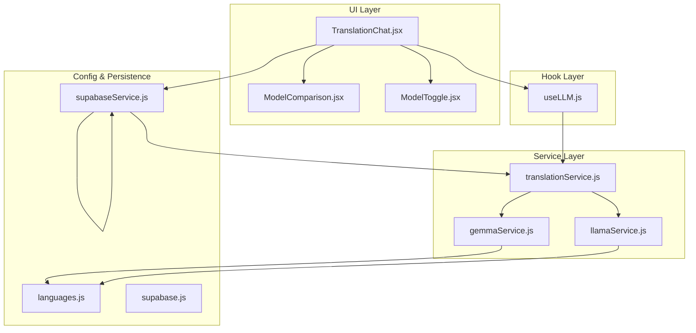
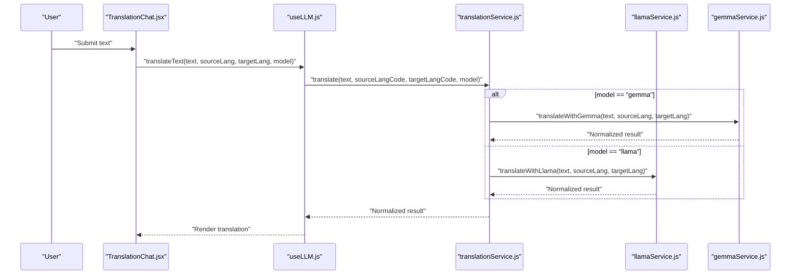
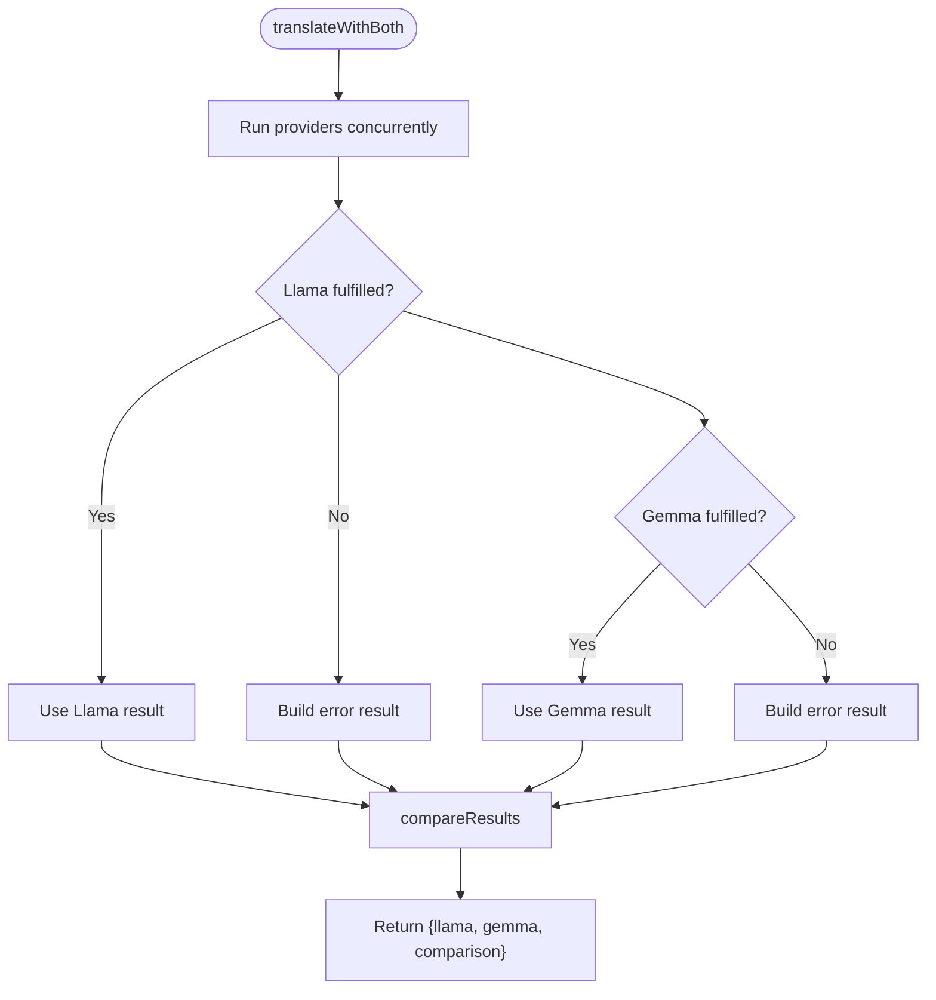
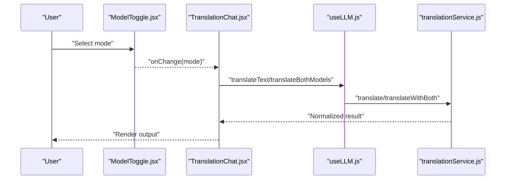
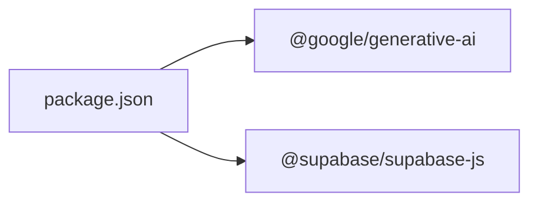

# AI Model Services

<cite>
**Referenced Files in This Document**
- [useLLM.js](file://src/hooks/useLLM.js)
- [translationService.js](file://src/services/translationService.js)
- [gemmaService.js](file://src/services/gemmaService.js)
- [llamaService.js](file://src/services/llamaService.js)
- [TranslationChat.jsx](file://src/pages/chat/TranslationChat.jsx)
- [ModelComparison.jsx](file://src/pages/chat/ModelComparison.jsx)
- [ModelToggle.jsx](file://src/components/ModelToggle.jsx)
- [languages.js](file://src/config/languages.js)
- [supabase.js](file://src/config/supabase.js)
- [supabaseService.js](file://src/services/supabaseService.js)
- [package.json](file://package.json)
</cite>

## Update Summary
**Changes Made**
- Added comprehensive documentation for new Llama and Gemma AI model services
- Documented structured JSON response handling for both providers
- Added model comparison capabilities and metrics
- Updated service architecture with provider-specific implementations
- Enhanced error handling and fallback mechanisms
- Documented API key management and configuration requirements

## Table of Contents
1. [Introduction](#introduction)
2. [Project Structure](#project-structure)
3. [Core Components](#core-components)
4. [Architecture Overview](#architecture-overview)
5. [Detailed Component Analysis](#detailed-component-analysis)
6. [Dependency Analysis](#dependency-analysis)
7. [Performance Considerations](#performance-considerations)
8. [Troubleshooting Guide](#troubleshooting-guide)
9. [Conclusion](#conclusion)
10. [Appendices](#appendices)

## Introduction
This document explains the AI model services powering the translation chat interface, focusing on the integrated Gemma and Llama implementations. The system provides a unified abstraction over two major AI providers, enabling accurate multilingual translation with structured JSON responses, confidence scoring, and comparative analysis capabilities. The services include robust error handling, fallback mechanisms, and comprehensive model comparison features.

## Project Structure
The AI model services are organized around a layered architecture with provider-specific implementations and unified orchestration:

**Diagram sources**
- [TranslationChat.jsx:1-197](file://src/pages/chat/TranslationChat.jsx#L1-L197)
- [useLLM.js:1-38](file://src/hooks/useLLM.js#L1-L38)
- [translationService.js:1-73](file://src/services/translationService.js#L1-L73)
- [gemmaService.js:1-56](file://src/services/gemmaService.js#L1-L56)
- [llamaService.js:1-84](file://src/services/llamaService.js#L1-L84)
- [languages.js:1-30](file://src/config/languages.js#L1-L30)
- [supabase.js:1-32](file://src/config/supabase.js#L1-L32)
- [supabaseService.js:1-210](file://src/services/supabaseService.js#L1-L210)

**Section sources**
- [TranslationChat.jsx:1-197](file://src/pages/chat/TranslationChat.jsx#L1-L197)
- [useLLM.js:1-38](file://src/hooks/useLLM.js#L1-L38)
- [translationService.js:1-73](file://src/services/translationService.js#L1-L73)
- [gemmaService.js:1-56](file://src/services/gemmaService.js#L1-L56)
- [llamaService.js:1-84](file://src/services/llamaService.js#L1-L84)
- [languages.js:1-30](file://src/config/languages.js#L1-L30)
- [supabase.js:1-32](file://src/config/supabase.js#L1-L32)
- [supabaseService.js:1-210](file://src/services/supabaseService.js#L1-L210)

## Core Components
- **useLLM hook**: Provides a unified interface for translation operations, managing loading states and errors, and delegating to the translation service
- **translationService**: Orchestrates model selection and comparison, normalizes responses, and compares outputs with comprehensive metrics
- **gemmaService**: Implements Google Generative AI integration with structured JSON response handling and confidence scoring
- **llamaService**: Implements Meta's Llama API integration with explicit JSON constraints and robust error handling
- **UI components**: ModelToggle for switching modes, ModelComparison for side-by-side results, and TranslationChat for end-to-end UX
- **Configuration**: languages.js defines supported languages and helpers; supabase.js and supabaseService.js persist translation history

**Section sources**
- [useLLM.js:4-37](file://src/hooks/useLLM.js#L4-L37)
- [translationService.js:12-42](file://src/services/translationService.js#L12-L42)
- [gemmaService.js:16-55](file://src/services/gemmaService.js#L16-L55)
- [llamaService.js:14-83](file://src/services/llamaService.js#L14-L83)
- [ModelToggle.jsx:1-25](file://src/components/ModelToggle.jsx#L1-L25)
- [ModelComparison.jsx:1-81](file://src/pages/chat/ModelComparison.jsx#L1-L81)
- [TranslationChat.jsx:11-98](file://src/pages/chat/TranslationChat.jsx#L11-L98)
- [languages.js:1-30](file://src/config/languages.js#L1-L30)
- [supabase.js:1-32](file://src/config/supabase.js#L1-L32)
- [supabaseService.js:5-28](file://src/services/supabaseService.js#L5-L28)

## Architecture Overview
The system follows a layered architecture with provider abstraction and unified orchestration:

**Diagram sources**
- [TranslationChat.jsx:30-98](file://src/pages/chat/TranslationChat.jsx#L30-L98)
- [useLLM.js:8-20](file://src/hooks/useLLM.js#L8-L20)
- [translationService.js:12-20](file://src/services/translationService.js#L12-L20)
- [gemmaService.js:16-45](file://src/services/gemmaService.js#L16-L45)
- [llamaService.js:14-60](file://src/services/llamaService.js#L14-L60)

## Detailed Component Analysis

### useLLM Hook
The useLLM hook provides a unified interface for translation operations with comprehensive state management:

- **Responsibilities**:
  - Manage loading and error states during translation operations
  - Delegate to translationService.translate and translationService.translateWithBoth
  - Expose translateText and translateBothModels for UI consumption
- **Error handling**:
  - Catches exceptions, sets error state, rethrows to caller for UI display
- **Loading state**:
  - Sets isLoading to true before requests and resets in finally blocks

**Section sources**
- [useLLM.js:4-37](file://src/hooks/useLLM.js#L4-L37)

### translationService
The translation orchestrator manages model selection, concurrent processing, and result comparison:

- **Model selection**:
  - translate(text, sourceLangCode, targetLangCode, model): routes to provider-specific functions based on model parameter
  - translateWithBoth(text, sourceLangCode, targetLangCode): runs both providers concurrently and aggregates results
- **Response normalization**:
  - Ensures consistent shape: translation, confidence, explanation, alternatives, model
  - Falls back gracefully when JSON parsing fails
- **Comparison metrics**:
  - compareResults computes word counts, character counts, and a Jaccard-like similarity score

**Diagram sources**
- [translationService.js:25-42](file://src/services/translationService.js#L25-L42)
- [translationService.js:47-72](file://src/services/translationService.js#L47-L72)

**Section sources**
- [translationService.js:12-42](file://src/services/translationService.js#L12-L42)
- [translationService.js:47-72](file://src/services/translationService.js#L47-L72)

### gemmaService
Google Generative AI integration with structured JSON response handling:

- **Provider**: Google Generative AI SDK
- **Configuration**:
  - Uses VITE_GOOGLE_AI_API_KEY from environment
  - Initializes client and model with a system instruction
- **Request formatting**:
  - Builds a user prompt instructing JSON-only responses
  - Calls model.generateContent with the constructed prompt
- **Response parsing**:
  - Attempts JSON.parse on returned text
  - Normalizes to a consistent result shape with defaults for missing fields
- **Additional capability**:
  - generateQuizWithGemma: Generates quiz content using the same normalized pattern

**Section sources**
- [gemmaService.js:1-56](file://src/services/gemmaService.js#L1-L56)

### llamaService
Meta's Llama API integration with explicit JSON constraints:

- **Provider**: Meta's Llama API endpoint
- **Configuration**:
  - Uses VITE_META_AI_API_KEY from environment
  - Sends Authorization: Bearer header and Content-Type: application/json
- **Request formatting**:
  - POST to https://api.llama.com/v1/chat/completions with model identifier and structured messages
  - Includes system instruction and user prompt
  - Temperature and max_tokens configured for deterministic yet creative outputs
- **Response parsing**:
  - Validates response.ok; throws descriptive error on failure
  - Extracts choices[0].message.content and parses JSON if present
  - Normalizes to a consistent result shape with defaults for missing fields
- **Additional capability**:
  - generateQuizWithLlama: Generates quiz content with adjusted temperature and token limits

**Section sources**
- [llamaService.js:1-84](file://src/services/llamaService.js#L1-L84)

### UI Integration
Comprehensive user interface integration with model selection and comparison:

- **ModelToggle**:
  - Modes: llama, gemma, compare
  - Updates parent state to switch model or comparison mode
- **ModelComparison**:
  - Renders side-by-side results with confidence, explanation, and alternatives
  - Displays comparison metrics including word similarity and counts
- **TranslationChat**:
  - Integrates useLLM hook and passes mode to translationService
  - Handles user input, sends messages, and persists results via supabaseService
  - Displays loading dots and error messages

**Diagram sources**
- [ModelToggle.jsx:7-24](file://src/components/ModelToggle.jsx#L7-L24)
- [TranslationChat.jsx:13-98](file://src/pages/chat/TranslationChat.jsx#L13-L98)
- [useLLM.js:8-34](file://src/hooks/useLLM.js#L8-L34)
- [translationService.js:12-42](file://src/services/translationService.js#L12-L42)

**Section sources**
- [ModelToggle.jsx:1-25](file://src/components/ModelToggle.jsx#L1-L25)
- [ModelComparison.jsx:1-81](file://src/pages/chat/ModelComparison.jsx#L1-L81)
- [TranslationChat.jsx:11-197](file://src/pages/chat/TranslationChat.jsx#L11-L197)

### Data Models and Normalization
Both provider services normalize outputs to a consistent shape:

- **translation**: String
- **confidence**: Number (0–1)
- **explanation**: String
- **alternatives**: Array<String>
- **model**: String ("Llama 3" or "Gemma 3")

Fallback logic ensures UI stability when JSON parsing fails.

**Section sources**
- [gemmaService.js:27-44](file://src/services/gemmaService.js#L27-L44)
- [llamaService.js:42-59](file://src/services/llamaService.js#L42-L59)
- [translationService.js:34-42](file://src/services/translationService.js#L34-L42)

### Model Selection Logic and Fallback Strategies
- **Single model selection**:
  - translate(text, sourceLangCode, targetLangCode, model) routes to provider based on model parameter
- **Comparison mode**:
  - translateWithBoth runs both providers concurrently using Promise.allSettled
  - Aggregates results and constructs error payloads when providers fail
- **Fallback behavior**:
  - On provider failure, error result includes a descriptive message and zero confidence

**Section sources**
- [translationService.js:12-20](file://src/services/translationService.js#L12-L20)
- [translationService.js:25-42](file://src/services/translationService.js#L25-L42)

### Comparative Performance Metrics
- **Word similarity**:
  - Jaccard-like similarity computed from tokenized sets of both outputs
- **Counts**:
  - Word and character counts for both outputs
- **Confidence**:
  - Confidence scores exposed for both models

**Section sources**
- [translationService.js:47-72](file://src/services/translationService.js#L47-L72)

### API Key Management, Rate Limiting, and Quota Monitoring
- **Environment variables**:
  - VITE_GOOGLE_AI_API_KEY for Google Generative AI
  - VITE_META_AI_API_KEY for Llama API
  - VITE_SUPABASE_URL and VITE_SUPABASE_ANON_KEY for Supabase persistence
- **Rate limiting and quotas**:
  - Not implemented in code; rely on provider-side policies
  - Consider adding retry/backoff and circuit breaker patterns at the service layer if needed

**Section sources**
- [gemmaService.js:3](file://src/services/gemmaService.js#L3)
- [llamaService.js:1](file://src/services/llamaService.js#L1)
- [supabase.js:3](file://src/config/supabase.js#L3)

### Safety Filters, Cultural Adaptation, and Multilingual Support
- **Safety and moderation**:
  - No explicit safety filters or content moderation implemented in code
- **Cultural adaptation**:
  - System prompts emphasize preserving tone, context, and cultural nuances
- **Multilingual support**:
  - Languages configured via languages.js; translationService resolves language names for prompts

**Section sources**
- [gemmaService.js:6-14](file://src/services/gemmaService.js#L6-L14)
- [llamaService.js:4-12](file://src/services/llamaService.js#L4-L12)
- [languages.js:1-7](file://src/config/languages.js#L1-L7)

### Extending with Additional AI Models
Guidelines for adding a new provider:

- **Create a new service module** (e.g., openaiService.js):
  - Define translateWithProvider(text, sourceLang, targetLang) returning normalized shape
  - Implement request formatting and response parsing
  - Add generateQuizWithProvider if applicable
- **Update translationService**:
  - Add new provider to translate function switch
  - Optionally update translateWithBoth to include the new provider
- **Update UI**:
  - Extend ModelToggle modes
  - Ensure ModelComparison renders new model results consistently
- **Environment configuration**:
  - Add VITE_PROVIDER_API_KEY to .env and reference it in the service
- **Persistence**:
  - Adjust supabaseService insert/update logic if new fields are needed

**Section sources**
- [translationService.js:12-20](file://src/services/translationService.js#L12-L20)
- [translationService.js:25-42](file://src/services/translationService.js#L25-L42)
- [ModelToggle.jsx:1-5](file://src/components/ModelToggle.jsx#L1-L5)

## Dependency Analysis
External dependencies and their roles:

- **@google/generative-ai**: Enables Google Generative AI integration in gemmaService
- **@supabase/supabase-js**: Database persistence for translation history and user progress
- **react, react-dom, react-router-dom**: UI framework and routing
- **daisyui, tailwindcss**: UI styling and components

**Diagram sources**
- [package.json:11-21](file://package.json#L11-L21)

**Section sources**
- [package.json:11-21](file://package.json#L11-L21)

## Performance Considerations
- **Concurrency**:
  - translateWithBoth uses Promise.allSettled to minimize latency when comparing models
- **Token limits**:
  - Llama service sets max_tokens; consider tuning for longer texts
- **Parsing overhead**:
  - JSON parsing occurs in both services; ensure prompts consistently return JSON to reduce fallback costs
- **Network reliability**:
  - Implement retries and exponential backoff at the service layer if provider latency varies

## Troubleshooting Guide
Common issues and resolutions:

- **API key errors**:
  - Verify VITE_GOOGLE_AI_API_KEY and VITE_META_AI_API_KEY are set in environment
  - Llama API error messages include HTTP status and raw response text
- **JSON parsing failures**:
  - When provider returns non-JSON content, services fall back to default normalization
- **Network timeouts**:
  - Increase timeout thresholds or add retry logic in service layer
- **UI not updating**:
  - Ensure useLLM hook error state is handled and displayed to users

**Section sources**
- [llamaService.js:34-37](file://src/services/llamaService.js#L34-L37)
- [gemmaService.js:27-44](file://src/services/gemmaService.js#L27-L44)
- [llamaService.js:42-59](file://src/services/llamaService.js#L42-L59)

## Conclusion
The AI model services provide a clean abstraction over two providers, enabling unified translation experiences with optional comparison. The design emphasizes consistent response normalization, robust error handling, and extensibility for additional providers. Future enhancements could include provider-side safety filters, configurable rate limiting, and richer comparative analytics.

## Appendices

### API Configuration Reference
- **Google Generative AI**:
  - Environment: VITE_GOOGLE_AI_API_KEY
  - Model: gemma-3-27b-it
  - System instruction included in gemmaService
- **Llama API**:
  - Environment: VITE_META_AI_API_KEY
  - Endpoint: https://api.llama.com/v1/chat/completions
  - Messages include system and user content with JSON constraints

**Section sources**
- [gemmaService.js:3](file://src/services/gemmaService.js#L3)
- [gemmaService.js:17-20](file://src/services/gemmaService.js#L17-L20)
- [llamaService.js:1](file://src/services/llamaService.js#L1)
- [llamaService.js:2](file://src/services/llamaService.js#L2)
- [llamaService.js:17-32](file://src/services/llamaService.js#L17-L32)

### Response Normalization Schema
- **Fields**:
  - translation: String
  - confidence: Number
  - explanation: String
  - alternatives: Array<String>
  - model: String

**Section sources**
- [gemmaService.js:29-35](file://src/services/gemmaService.js#L29-L35)
- [llamaService.js:44-50](file://src/services/llamaService.js#L44-L50)
- [translationService.js:34-42](file://src/services/translationService.js#L34-L42)

### Model Comparison Metrics
- **Word Similarity**: Jaccard-like similarity score between translation outputs
- **Word Count**: Number of words in each model's output
- **Character Count**: Number of characters in each model's output
- **Confidence Scores**: Numerical confidence ratings from each model

**Section sources**
- [translationService.js:47-72](file://src/services/translationService.js#L47-L72)