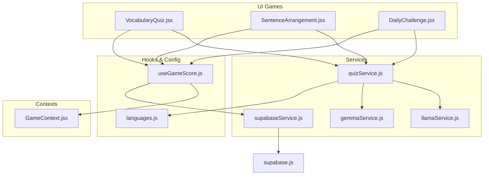
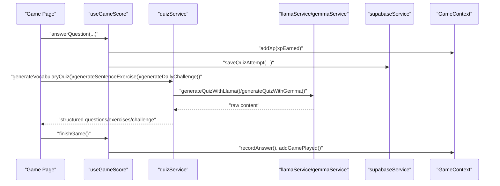
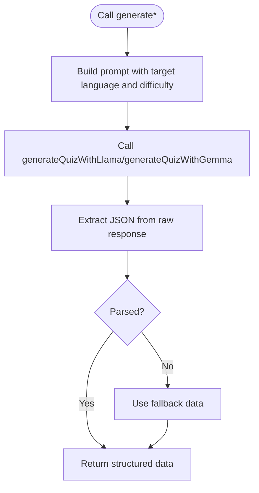
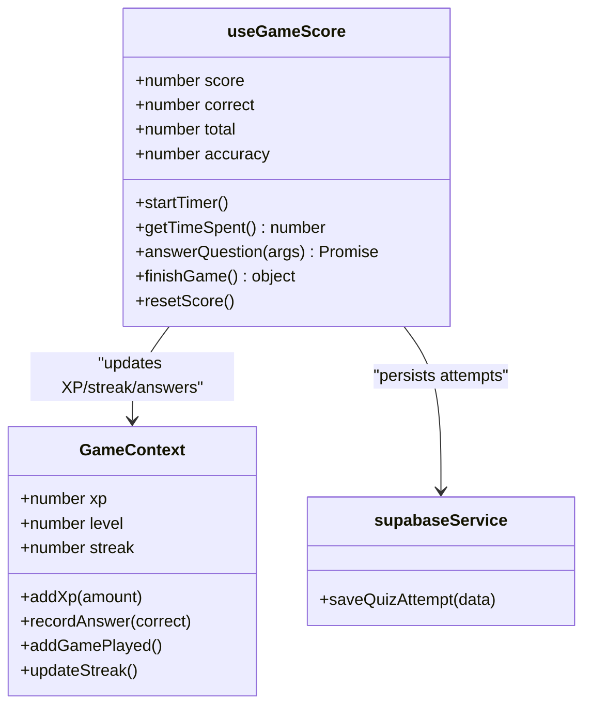
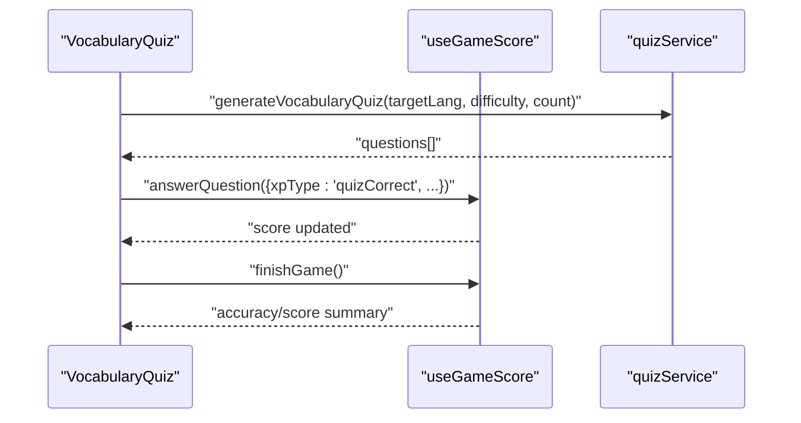
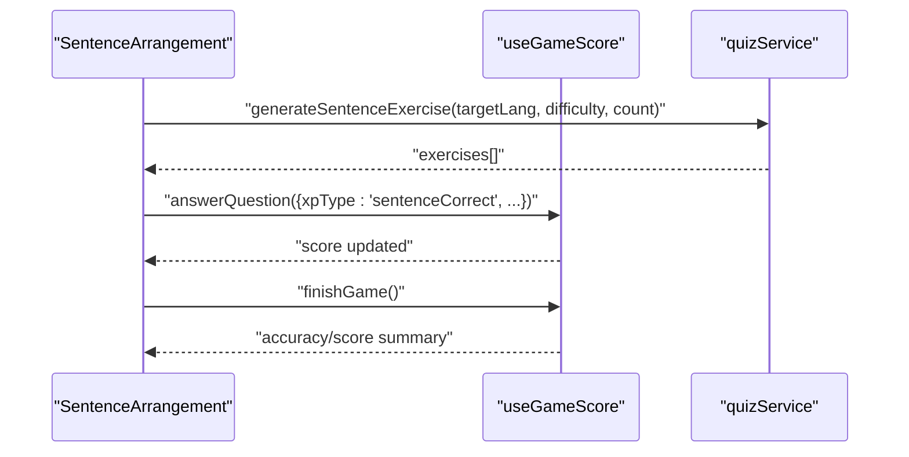
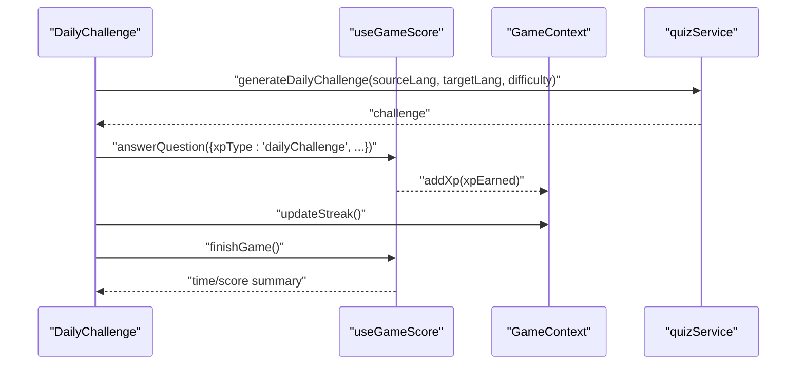
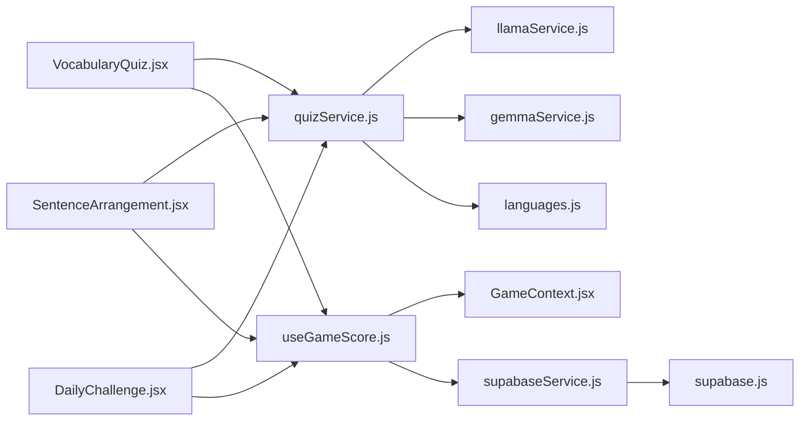

# Quiz Service

<cite>
**Referenced Files in This Document**
- [quizService.js](file://src/services/quizService.js)
- [VocabularyQuiz.jsx](file://src/pages/games/VocabularyQuiz.jsx)
- [SentenceArrangement.jsx](file://src/pages/games/SentenceArrangement.jsx)
- [DailyChallenge.jsx](file://src/pages/games/DailyChallenge.jsx)
- [useGameScore.js](file://src/hooks/useGameScore.js)
- [languages.js](file://src/config/languages.js)
- [llamaService.js](file://src/services/llamaService.js)
- [gemmaService.js](file://src/services/gemmaService.js)
- [supabaseService.js](file://src/services/supabaseService.js)
- [GameContext.jsx](file://src/contexts/GameContext.jsx)
- [supabase.js](file://src/config/supabase.js)
</cite>

## Table of Contents
1. [Introduction](#introduction)
2. [Project Structure](#project-structure)
3. [Core Components](#core-components)
4. [Architecture Overview](#architecture-overview)
5. [Detailed Component Analysis](#detailed-component-analysis)
6. [Dependency Analysis](#dependency-analysis)
7. [Performance Considerations](#performance-considerations)
8. [Troubleshooting Guide](#troubleshooting-guide)
9. [Conclusion](#conclusion)
10. [Appendices](#appendices)

## Introduction
This document provides comprehensive documentation for the quiz service powering dynamic content generation and question management in the language learning app. It explains the algorithms for generating vocabulary quizzes, sentence arrangement challenges, and daily challenge questions, along with question pool management, difficulty scaling, and content personalization strategies. It also details quiz creation, validation, and scoring logic, integration with the useGameScore hook for performance tracking and XP calculation, examples of quiz templates and question formatting, answer validation approaches, content generation patterns, language support, cultural sensitivity considerations, quiz delivery optimization, caching strategies for question pools, offline fallback mechanisms, and guidance for extending quiz types and adding new question formats.

## Project Structure
The quiz service spans several modules:
- Services: quizService orchestrates generation via Llama/Gemma APIs and provides fallbacks.
- Pages: game pages consume quizService and manage UI, feedback, and scoring.
- Hooks: useGameScore centralizes scoring, XP rewards, timing, and persistence.
- Config: languages defines supported languages, difficulty levels, XP rewards, and helpers.
- Contexts: GameContext manages XP, streaks, and level progression.
- Supabase: persistence for quiz attempts, progress, and leaderboard.

**Diagram sources**
- [quizService.js:1-154](file://src/services/quizService.js#L1-L154)
- [VocabularyQuiz.jsx:1-215](file://src/pages/games/VocabularyQuiz.jsx#L1-L215)
- [SentenceArrangement.jsx:1-280](file://src/pages/games/SentenceArrangement.jsx#L1-L280)
- [DailyChallenge.jsx:1-249](file://src/pages/games/DailyChallenge.jsx#L1-L249)
- [useGameScore.js:1-76](file://src/hooks/useGameScore.js#L1-L76)
- [languages.js:1-30](file://src/config/languages.js#L1-L30)
- [llamaService.js:1-84](file://src/services/llamaService.js#L1-L84)
- [gemmaService.js:1-56](file://src/services/gemmaService.js#L1-L56)
- [supabaseService.js:1-132](file://src/services/supabaseService.js#L1-L132)
- [GameContext.jsx:1-141](file://src/contexts/GameContext.jsx#L1-L141)
- [supabase.js:1-7](file://src/config/supabase.js#L1-L7)

**Section sources**
- [quizService.js:1-154](file://src/services/quizService.js#L1-L154)
- [VocabularyQuiz.jsx:1-215](file://src/pages/games/VocabularyQuiz.jsx#L1-L215)
- [SentenceArrangement.jsx:1-280](file://src/pages/games/SentenceArrangement.jsx#L1-L280)
- [DailyChallenge.jsx:1-249](file://src/pages/games/DailyChallenge.jsx#L1-L249)
- [useGameScore.js:1-76](file://src/hooks/useGameScore.js#L1-L76)
- [languages.js:1-30](file://src/config/languages.js#L1-L30)
- [llamaService.js:1-84](file://src/services/llamaService.js#L1-L84)
- [gemmaService.js:1-56](file://src/services/gemmaService.js#L1-L56)
- [supabaseService.js:1-132](file://src/services/supabaseService.js#L1-L132)
- [GameContext.jsx:1-141](file://src/contexts/GameContext.jsx#L1-L141)
- [supabase.js:1-7](file://src/config/supabase.js#L1-L7)

## Core Components
- quizService: Generates vocabulary quizzes, sentence arrangement exercises, and daily translation challenges using Llama and Gemma APIs, with robust fallbacks.
- useGameScore: Centralized scoring, XP reward calculation, timing, and persistence of quiz attempts.
- GameContext: Manages XP, streaks, level progression, and persists state to Supabase.
- Game pages: VocabularyQuiz, SentenceArrangement, and DailyChallenge implement UI, feedback, and interaction flows.
- Configuration: languages.js defines supported languages, difficulty levels, XP rewards, and helpers.

Key responsibilities:
- Dynamic content generation: Prompt engineering for LLMs to produce structured JSON.
- Difficulty scaling: Easy/Medium/Hard mapped to prompts and XP multipliers.
- Content personalization: Language selection and hints tailored to target language.
- Validation and scoring: Exact match for vocab, ordered match for sentences, keyword-based leniency for daily challenge.
- Persistence: Saves attempts and progress to Supabase.

**Section sources**
- [quizService.js:8-88](file://src/services/quizService.js#L8-L88)
- [useGameScore.js:23-55](file://src/hooks/useGameScore.js#L23-L55)
- [GameContext.jsx:76-119](file://src/contexts/GameContext.jsx#L76-L119)
- [languages.js:14-25](file://src/config/languages.js#L14-L25)

## Architecture Overview
The quiz service follows a layered architecture:
- UI Layer: Game pages render setup, gameplay, and results screens.
- Hook Layer: useGameScore encapsulates scoring, timing, and persistence.
- Service Layer: quizService orchestrates generation and fallbacks.
- LLM Layer: llamaService and gemmaService provide content generation.
- Persistence Layer: supabaseService persists quiz attempts and progress.
- Context Layer: GameContext manages XP/streak/level and syncs with Supabase.

**Diagram sources**
- [VocabularyQuiz.jsx:21-68](file://src/pages/games/VocabularyQuiz.jsx#L21-L68)
- [SentenceArrangement.jsx:24-102](file://src/pages/games/SentenceArrangement.jsx#L24-L102)
- [DailyChallenge.jsx:26-85](file://src/pages/games/DailyChallenge.jsx#L26-L85)
- [useGameScore.js:23-61](file://src/hooks/useGameScore.js#L23-L61)
- [quizService.js:8-88](file://src/services/quizService.js#L8-L88)
- [llamaService.js:62-83](file://src/services/llamaService.js#L62-L83)
- [gemmaService.js:47-55](file://src/services/gemmaService.js#L47-L55)
- [supabaseService.js:32-45](file://src/services/supabaseService.js#L32-L45)
- [GameContext.jsx:76-93](file://src/contexts/GameContext.jsx#L76-L93)

## Detailed Component Analysis

### quizService: Generation and Fallbacks
Responsibilities:
- Vocabulary quiz generation: Creates multiple-choice questions with word-to-translation prompts and explanations.
- Sentence arrangement: Produces shuffled tokens requiring correct ordering with grammar tips.
- Daily challenge: Generates translation tasks with keyword-based validation and explanations.
- Fallbacks: Provides curated fallbacks when LLM parsing fails or returns unexpected content.

Generation algorithm highlights:
- Prompt construction: Uses target language name and difficulty to tailor prompts.
- JSON extraction: Attempts to extract JSON arrays/objects from raw LLM responses; falls back to structured parsing.
- Fallback strategies:
  - Vocabulary: curated word lists for Spanish and French.
  - Sentence arrangement: curated Indonesian sentence examples with grammar tips.
  - Daily challenge: curated prompt with keywords and explanation.

**Diagram sources**
- [quizService.js:8-32](file://src/services/quizService.js#L8-L32)
- [quizService.js:37-61](file://src/services/quizService.js#L37-L61)
- [quizService.js:66-88](file://src/services/quizService.js#L66-L88)
- [quizService.js:90-93](file://src/services/quizService.js#L90-L93)
- [quizService.js:95-153](file://src/services/quizService.js#L95-L153)

**Section sources**
- [quizService.js:8-32](file://src/services/quizService.js#L8-L32)
- [quizService.js:37-61](file://src/services/quizService.js#L37-L61)
- [quizService.js:66-88](file://src/services/quizService.js#L66-L88)
- [quizService.js:95-153](file://src/services/quizService.js#L95-L153)

### useGameScore: Scoring, Timing, and Persistence
Responsibilities:
- Tracks score, correct answers, total answers, and accuracy.
- Calculates XP rewards based on XP_REWARDS and correctness.
- Starts and measures time spent per question.
- Persists quiz attempts to Supabase with user context.
- Integrates with GameContext to update XP, streaks, and level.

Scoring logic:
- Correct answers earn XP according to XP_REWARDS keyed by quiz type.
- Incorrect answers yield zero XP.
- finishGame computes accuracy and records game completion.

**Diagram sources**
- [useGameScore.js:7-75](file://src/hooks/useGameScore.js#L7-L75)
- [GameContext.jsx:20-55](file://src/contexts/GameContext.jsx#L20-L55)
- [supabaseService.js:32-45](file://src/services/supabaseService.js#L32-L45)

**Section sources**
- [useGameScore.js:23-55](file://src/hooks/useGameScore.js#L23-L55)
- [useGameScore.js:57-61](file://src/hooks/useGameScore.js#L57-L61)
- [useGameScore.js:63-68](file://src/hooks/useGameScore.js#L63-L68)
- [GameContext.jsx:76-119](file://src/contexts/GameContext.jsx#L76-L119)
- [supabaseService.js:32-45](file://src/services/supabaseService.js#L32-L45)

### Game Pages: Interaction and Validation

#### Vocabulary Quiz
- Setup: Select target language and difficulty; starts quiz generation.
- Gameplay: Presents word-to-translation MCQs; shows immediate feedback and explanations.
- Validation: Exact index match determines correctness.
- Scoring: Uses xpType "quizCorrect".

**Diagram sources**
- [VocabularyQuiz.jsx:21-68](file://src/pages/games/VocabularyQuiz.jsx#L21-L68)
- [useGameScore.js:23-55](file://src/hooks/useGameScore.js#L23-L55)
- [quizService.js:8-32](file://src/services/quizService.js#L8-L32)

**Section sources**
- [VocabularyQuiz.jsx:21-68](file://src/pages/games/VocabularyQuiz.jsx#L21-L68)
- [quizService.js:8-32](file://src/services/quizService.js#L8-L32)

#### Sentence Arrangement
- Setup: Select target language and difficulty; generates exercises.
- Gameplay: Drag-and-drop word tokens to reconstruct the correct sentence; shows grammar tips.
- Validation: Exact ordered match determines correctness.
- Scoring: Uses xpType "sentenceCorrect".

**Diagram sources**
- [SentenceArrangement.jsx:24-102](file://src/pages/games/SentenceArrangement.jsx#L24-L102)
- [useGameScore.js:23-55](file://src/hooks/useGameScore.js#L23-L55)
- [quizService.js:37-61](file://src/services/quizService.js#L37-L61)

**Section sources**
- [SentenceArrangement.jsx:24-102](file://src/pages/games/SentenceArrangement.jsx#L24-L102)
- [quizService.js:37-61](file://src/services/quizService.js#L37-L61)

#### Daily Challenge
- Setup: Select source/target languages and difficulty; starts challenge generation.
- Gameplay: Text-to-translation task with keyword-based validation and timer.
- Validation: Keyword overlap threshold determines correctness; XP multiplier based on difficulty.
- Scoring: Uses xpType "dailyChallenge"; integrates with GameContext streak updates.

**Diagram sources**
- [DailyChallenge.jsx:26-85](file://src/pages/games/DailyChallenge.jsx#L26-L85)
- [useGameScore.js:23-55](file://src/hooks/useGameScore.js#L23-L55)
- [GameContext.jsx:107-119](file://src/contexts/GameContext.jsx#L107-L119)
- [quizService.js:66-88](file://src/services/quizService.js#L66-L88)

**Section sources**
- [DailyChallenge.jsx:26-85](file://src/pages/games/DailyChallenge.jsx#L26-L85)
- [quizService.js:66-88](file://src/services/quizService.js#L66-L88)
- [GameContext.jsx:107-119](file://src/contexts/GameContext.jsx#L107-L119)

### Question Pool Management and Personalization
- Question pool management:
  - Dynamic generation via LLMs ensures varied content per session.
  - Fallback pools provide consistent baseline content when API parsing fails.
- Difficulty scaling:
  - Easy/Medium/Hard mapped to prompts and XP multipliers.
  - Daily challenge applies XP multipliers per difficulty.
- Content personalization:
  - Language selection influences prompts and fallbacks.
  - Hints and explanations are language-aware.

**Section sources**
- [quizService.js:8-32](file://src/services/quizService.js#L8-L32)
- [quizService.js:37-61](file://src/services/quizService.js#L37-L61)
- [quizService.js:66-88](file://src/services/quizService.js#L66-L88)
- [languages.js:14-25](file://src/config/languages.js#L14-L25)

### Content Generation Patterns and Cultural Sensitivity
- Prompt engineering emphasizes accurate translation, tone preservation, and cultural nuance.
- Explanations and grammar tips are included to enhance learning context.
- Fallback content is curated to reflect common phrases and structures in target languages.

**Section sources**
- [llamaService.js:4-12](file://src/services/llamaService.js#L4-L12)
- [gemmaService.js:6-14](file://src/services/gemmaService.js#L6-L14)
- [quizService.js:95-153](file://src/services/quizService.js#L95-L153)

### Quiz Delivery Optimization and Offline Fallbacks
- Delivery optimization:
  - Immediate feedback and animations improve engagement.
  - Progressive disclosure of hints and explanations.
- Offline fallbacks:
  - Robust JSON extraction and fallback data ensure reliability.
  - Fallback vocab quizzes and sentence exercises provide consistent experiences.

**Section sources**
- [VocabularyQuiz.jsx:44-48](file://src/pages/games/VocabularyQuiz.jsx#L44-L48)
- [SentenceArrangement.jsx:74-80](file://src/pages/games/SentenceArrangement.jsx#L74-L80)
- [DailyChallenge.jsx:61-67](file://src/pages/games/DailyChallenge.jsx#L61-L67)
- [quizService.js:25-31](file://src/services/quizService.js#L25-L31)
- [quizService.js:55-60](file://src/services/quizService.js#L55-L60)
- [quizService.js:82-87](file://src/services/quizService.js#L82-L87)

## Dependency Analysis
The quiz service exhibits clear separation of concerns:
- quizService depends on llamaService/gemmaService for generation and languages.js for language metadata.
- Game pages depend on quizService and useGameScore.
- useGameScore depends on GameContext and supabaseService.
- supabaseService depends on supabase client configuration.

**Diagram sources**
- [quizService.js:1-3](file://src/services/quizService.js#L1-L3)
- [VocabularyQuiz.jsx:5-6](file://src/pages/games/VocabularyQuiz.jsx#L5-L6)
- [SentenceArrangement.jsx:5-6](file://src/pages/games/SentenceArrangement.jsx#L5-L6)
- [DailyChallenge.jsx:5-7](file://src/pages/games/DailyChallenge.jsx#L5-L7)
- [useGameScore.js:2-5](file://src/hooks/useGameScore.js#L2-L5)
- [supabaseService.js:1](file://src/services/supabaseService.js#L1)
- [supabase.js:1-7](file://src/config/supabase.js#L1-L7)

**Section sources**
- [quizService.js:1-3](file://src/services/quizService.js#L1-L3)
- [useGameScore.js:2-5](file://src/hooks/useGameScore.js#L2-L5)
- [supabaseService.js:1](file://src/services/supabaseService.js#L1)
- [supabase.js:1-7](file://src/config/supabase.js#L1-L7)

## Performance Considerations
- API latency: LLM calls introduce network latency; consider caching frequently used prompts or results where feasible.
- Parsing robustness: The service extracts JSON from raw responses; ensure prompt consistency to minimize parsing errors.
- Rendering efficiency: Use animation libraries judiciously; keep DOM updates minimal during transitions.
- Persistence overhead: Persisting quiz attempts adds database calls; batch or debounce where appropriate.
- Difficulty scaling: Higher difficulty may increase cognitive load; balance with XP rewards to maintain engagement.

[No sources needed since this section provides general guidance]

## Troubleshooting Guide
Common issues and resolutions:
- LLM parsing failures:
  - Symptoms: Empty arrays/objects returned.
  - Resolution: The service attempts JSON extraction and falls back to curated data.
- API errors:
  - Symptoms: Network errors or invalid responses.
  - Resolution: Catch and log errors; ensure fallbacks are triggered.
- Scoring discrepancies:
  - Symptoms: Unexpected XP amounts.
  - Resolution: Verify XP_REWARDS and xpType usage in answerQuestion.
- Streak not updating:
  - Symptoms: Streak remains unchanged after daily challenge.
  - Resolution: Ensure updateStreak is called and Supabase updates succeed.

**Section sources**
- [quizService.js:25-31](file://src/services/quizService.js#L25-L31)
- [quizService.js:55-60](file://src/services/quizService.js#L55-L60)
- [quizService.js:82-87](file://src/services/quizService.js#L82-L87)
- [useGameScore.js:36-51](file://src/hooks/useGameScore.js#L36-L51)
- [GameContext.jsx:107-119](file://src/contexts/GameContext.jsx#L107-L119)

## Conclusion
The quiz service delivers a robust, scalable solution for dynamic language learning content. By leveraging LLMs with structured prompts and resilient fallbacks, it ensures consistent quality and availability. The integration with useGameScore and GameContext enables comprehensive performance tracking, XP calculation, and progress persistence. The modular design facilitates extension to new quiz types and question formats while maintaining clarity and maintainability.

[No sources needed since this section summarizes without analyzing specific files]

## Appendices

### Example Quiz Templates and Question Formatting
- Vocabulary quiz template:
  - Fields: id, word, options[], correctIndex, explanation.
  - Prompt: Requests word-to-translation MCQs with explanations.
- Sentence arrangement template:
  - Fields: id, original_sentence, english_hint, shuffled_words[], correct_order[], grammar_tip.
  - Prompt: Requires arranging shuffled tokens into correct order.
- Daily challenge template:
  - Fields: prompt_text, english_hint, correct_answer, keywords[], explanation, difficulty.
  - Prompt: Translation task with keyword-based validation.

**Section sources**
- [quizService.js:10-22](file://src/services/quizService.js#L10-L22)
- [quizService.js:39-52](file://src/services/quizService.js#L39-L52)
- [quizService.js:69-79](file://src/services/quizService.js#L69-L79)

### Answer Validation Examples
- Vocabulary: Index-based validation against correctIndex.
- Sentence arrangement: Ordered array comparison for arranged vs correct_order.
- Daily challenge: Keyword overlap threshold determines correctness.

**Section sources**
- [VocabularyQuiz.jsx:42](file://src/pages/games/VocabularyQuiz.jsx#L42)
- [SentenceArrangement.jsx:72](file://src/pages/games/SentenceArrangement.jsx#L72)
- [DailyChallenge.jsx:59](file://src/pages/games/DailyChallenge.jsx#L59)

### Extending Quiz Types and Adding New Formats
- Add new generation function in quizService with tailored prompt and fallback.
- Implement UI page with setup, gameplay, and results screens.
- Integrate with useGameScore using appropriate xpType.
- Update languages.js if new difficulty levels or XP rewards are needed.
- Ensure persistence via supabaseService.saveQuizAttempt.

**Section sources**
- [quizService.js:8-88](file://src/services/quizService.js#L8-L88)
- [useGameScore.js:23-55](file://src/hooks/useGameScore.js#L23-L55)
- [languages.js:14-25](file://src/config/languages.js#L14-L25)
- [supabaseService.js:32-45](file://src/services/supabaseService.js#L32-L45)