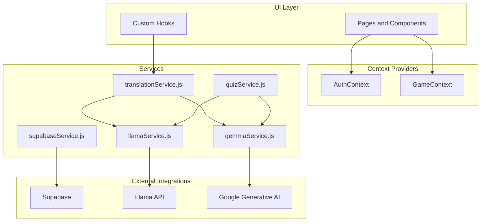
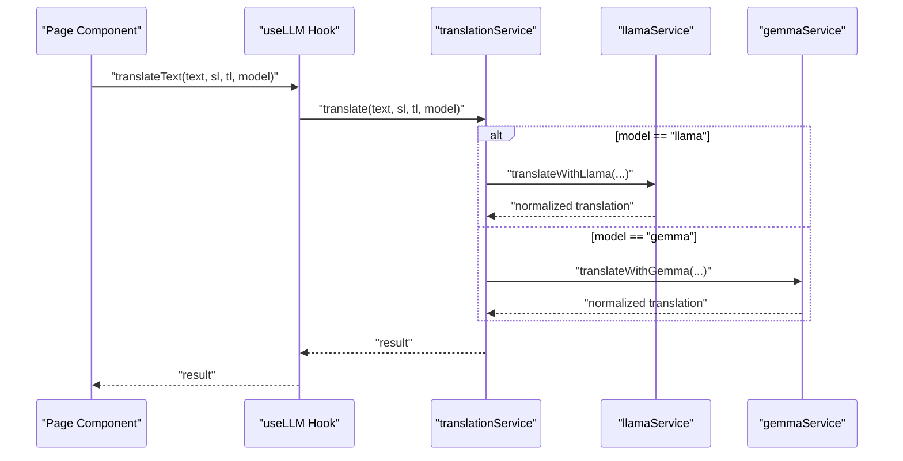
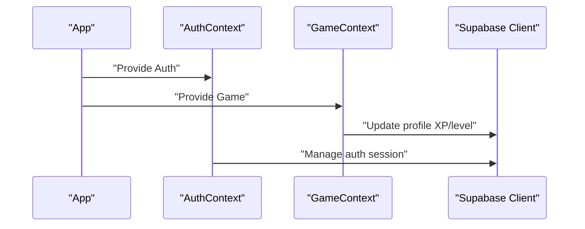
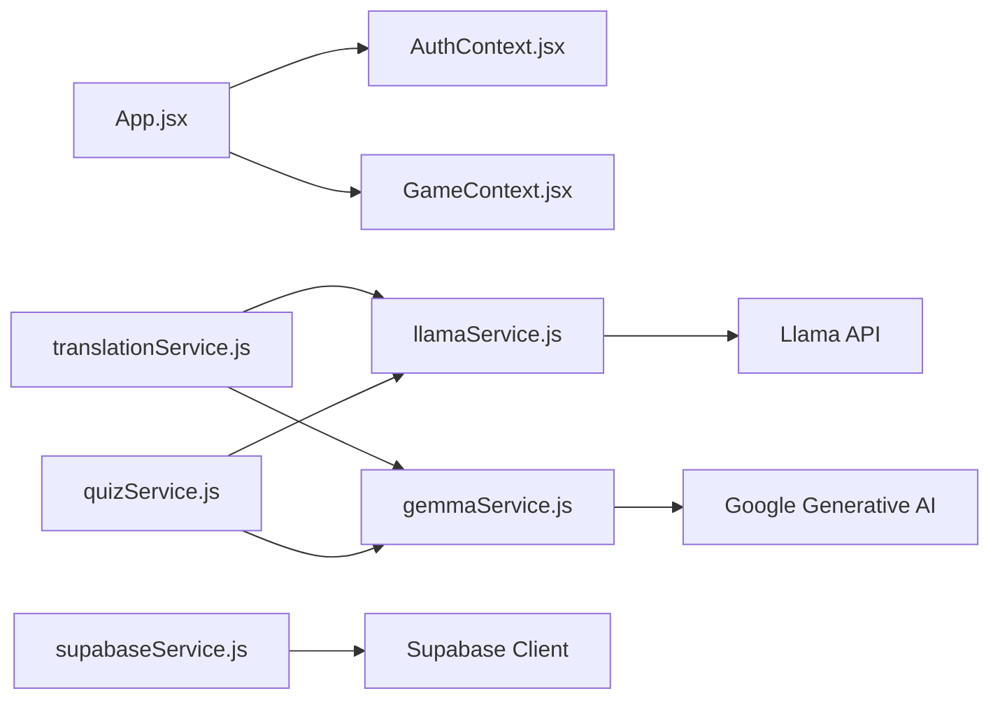

# Service Layer Architecture

<cite>
**Referenced Files in This Document**
- [supabaseService.js](file://src/services/supabaseService.js)
- [quizService.js](file://src/services/quizService.js)
- [translationService.js](file://src/services/translationService.js)
- [gemmaService.js](file://src/services/gemmaService.js)
- [llamaService.js](file://src/services/llamaService.js)
- [supabase.js](file://src/config/supabase.js)
- [AuthContext.jsx](file://src/contexts/AuthContext.jsx)
- [GameContext.jsx](file://src/contexts/GameContext.jsx)
- [useLLM.js](file://src/hooks/useLLM.js)
- [App.jsx](file://src/App.jsx)
- [TranslationChat.jsx](file://src/pages/chat/TranslationChat.jsx)
- [Dashboard.jsx](file://src/pages/dashboard/Dashboard.jsx)
- [package.json](file://package.json)
</cite>

## Update Summary
**Changes Made**
- Updated service layer architecture documentation to reflect the new specialized services
- Added comprehensive coverage of supabaseService.js, quizService.js, and translationService.js
- Enhanced documentation of service responsibilities, integrations, and error handling patterns
- Updated architecture diagrams to show the new service composition
- Added detailed analysis of the centralized game content system and fallback mechanisms

## Table of Contents
1. [Introduction](#introduction)
2. [Project Structure](#project-structure)
3. [Core Components](#core-components)
4. [Architecture Overview](#architecture-overview)
5. [Detailed Component Analysis](#detailed-component-analysis)
6. [Dependency Analysis](#dependency-analysis)
7. [Performance Considerations](#performance-considerations)
8. [Troubleshooting Guide](#troubleshooting-guide)
9. [Conclusion](#conclusion)
10. [Appendices](#appendices)

## Introduction
This document explains the service layer architecture that separates business logic from data access and external AI API integration. The architecture consists of three primary service modules that work together to provide a robust foundation for language learning applications:

- **supabaseService**: Encapsulates all Supabase data access for profiles, progress, quiz attempts, translation history, leaderboard, and centralized game content management.
- **quizService**: Orchestrates AI-generated quiz content using Llama and Gemma services with intelligent fallback mechanisms.
- **translationService**: Coordinates translation via Llama and Gemma, supports dual-model comparison, and exposes a unified interface.

The service layer follows a layered architecture pattern where business logic is separated from data persistence and external API integrations, providing clean abstractions for authentication, game state management, and AI-powered features.

## Project Structure
The service layer resides under `src/services` and integrates with React contexts for authentication and game state, and with Supabase for persistence. The architecture emphasizes separation of concerns with specialized services handling distinct responsibilities.

**Diagram sources**
- [App.jsx:19-49](file://src/App.jsx#L19-L49)
- [AuthContext.jsx:6-94](file://src/contexts/AuthContext.jsx#L6-L94)
- [GameContext.jsx:57-134](file://src/contexts/GameContext.jsx#L57-L134)
- [supabaseService.js:1-210](file://src/services/supabaseService.js#L1-L210)
- [quizService.js:1-268](file://src/services/quizService.js#L1-L268)
- [translationService.js:1-73](file://src/services/translationService.js#L1-L73)
- [llamaService.js:1-84](file://src/services/llamaService.js#L1-L84)
- [gemmaService.js:1-56](file://src/services/gemmaService.js#L1-L56)

**Section sources**
- [App.jsx:19-49](file://src/App.jsx#L19-L49)
- [AuthContext.jsx:6-94](file://src/contexts/AuthContext.jsx#L6-L94)
- [GameContext.jsx:57-134](file://src/contexts/GameContext.jsx#L57-L134)

## Core Components

### supabaseService: Data Access Abstraction
Provides comprehensive CRUD and aggregation functions for all application data:

**Translation Management**: Handles translation history storage, retrieval, and querying with pagination support.

**Quiz Operations**: Manages quiz attempts with detailed metadata including user answers, correctness, XP rewards, and timing.

**User Progress Tracking**: Centralized progress management with upsert operations, level calculations, and streak tracking.

**Daily Challenges**: Dedicated challenge management with date-based queries and validation.

**Leaderboard System**: Comprehensive ranking system with XP-based sorting and user statistics.

**Profile Management**: Complete user profile operations including avatar management and settings.

**Centralized Game Content**: Advanced content management system with priority-based fetching (database → LLM → fallback) and sophisticated filtering capabilities.

**Key Characteristics**:
- Centralized Supabase client import ensures consistent configuration and environment variable usage
- Functions return normalized data or throw errors, enabling predictable error handling in callers
- Uses Supabase upsert with conflict resolution for progress updates
- Implements graceful degradation when database tables are unavailable
- Provides client-side shuffling algorithms for content variety

**Section sources**
- [supabaseService.js:1-210](file://src/services/supabaseService.js#L1-L210)
- [supabase.js:1-32](file://src/config/supabase.js#L1-L32)

### quizService: AI-Driven Quiz Generation
Comprehensive quiz generation system with intelligent fallback mechanisms:

**Multi-Modal Content Generation**: Generates vocabulary quizzes, sentence arrangement exercises, and daily translation challenges using Llama and Gemma services.

**Priority-Based Fetching Strategy**: Implements a three-tier approach - database-first, LLM fallback, and hardcoded fallback data.

**Advanced Prompt Engineering**: Tailored prompts for different quiz types with structured JSON responses and validation.

**Robust Parsing and Validation**: Multiple parsing strategies with fallback to curated datasets when AI responses are malformed.

**Centralized Content Management**: Leverages supabaseService's centralized game content system for consistent, scalable content delivery.

**Hardcoded Fallback Systems**: Comprehensive fallback data for multiple languages (Spanish, French, Indonesian, Malay) ensuring application reliability.

**Section sources**
- [quizService.js:1-268](file://src/services/quizService.js#L1-L268)

### translationService: Unified Translation Orchestration
Provides seamless translation experience with dual-model support:

**Single-Model Translation**: Direct routing to Llama or Gemma services with standardized response formats.

**Dual-Model Comparison**: Parallel execution of both models with comprehensive comparison metrics including word counts, character counts, and similarity scores.

**Structured Comparison Results**: Detailed comparison data including confidence scores, word overlap analysis, and model-specific metrics.

**Graceful Error Handling**: Fallback mechanisms when individual models fail, ensuring continuous service availability.

**Unified Interface**: Consistent API across single and dual-model translation modes.

**Section sources**
- [translationService.js:1-73](file://src/services/translationService.js#L1-L73)

### AI Services: llamaService and gemmaService
Encapsulate external AI API calls with standardized response formats:

**llamaService**: Handles Llama API integration with structured prompts, JSON extraction, and comprehensive error handling.

**gemmaService**: Manages Google Generative AI integration with system instructions and normalized response formats.

**Response Normalization**: Both services ensure consistent JSON structure with translation, confidence, explanation, and alternatives fields.

**Error Resilience**: Graceful fallbacks when JSON parsing fails, returning usable text content with default confidence values.

**Section sources**
- [llamaService.js:1-84](file://src/services/llamaService.js#L1-L84)
- [gemmaService.js:1-56](file://src/services/gemmaService.js#L1-L56)

## Architecture Overview
The service layer follows a layered architecture pattern with clear separation of concerns:

**Diagram sources**
- [useLLM.js:4-37](file://src/hooks/useLLM.js#L4-L37)
- [translationService.js:12-20](file://src/services/translationService.js#L12-L20)
- [llamaService.js:14-60](file://src/services/llamaService.js#L14-L60)
- [gemmaService.js:16-44](file://src/services/gemmaService.js#L16-L44)

**Section sources**
- [useLLM.js:1-38](file://src/hooks/useLLM.js#L1-L38)

## Detailed Component Analysis

### supabaseService: Comprehensive Data Management
The supabaseService acts as the central data access layer, providing:

**Translation History Management**:
- Stores translation requests with source/target languages, input text, and model outputs
- Supports pagination and chronological ordering for efficient retrieval
- Handles both single and dual-model translation records

**Quiz Attempt Tracking**:
- Comprehensive logging of quiz performance with detailed metadata
- Supports filtering by quiz type and user for analytics
- Enables performance analysis and learning progression tracking

**User Progress Orchestration**:
- Intelligent upsert operations with conflict resolution
- Automatic level calculation and XP accumulation
- Streak tracking and last active date management

**Centralized Game Content System**:
- Priority-based content fetching (DB → LLM → fallback)
- Sophisticated filtering by game type, language, difficulty, and source language
- Client-side shuffling algorithms for content variety
- Graceful degradation when database tables are unavailable

**Section sources**
- [supabaseService.js:1-210](file://src/services/supabaseService.js#L1-L210)

### quizService: Intelligent Content Generation
The quizService implements a sophisticated three-tier content generation strategy:

**Database-First Approach**:
- Priority fetching from centralized `game_content` table
- Configurable filtering by game type, language, difficulty, and source language
- Automatic fallback when database content is unavailable

**AI-Generated Content**:
- Structured prompts for different quiz types (vocabulary, sentence arrangement, daily challenges)
- JSON response validation with multiple parsing strategies
- Temperature control and token limits for optimal AI performance

**Hardcoded Fallback System**:
- Comprehensive fallback data for multiple languages (Spanish, French, Indonesian, Malay)
- Curated content with educational value and cultural context
- Ensures application reliability even during AI service outages

**Section sources**
- [quizService.js:1-268](file://src/services/quizService.js#L1-L268)

### translationService: Dual-Model Translation Coordination
Provides unified translation interface with advanced comparison capabilities:

**Single-Model Translation**:
- Direct routing to Llama or Gemma services
- Standardized response format with translation, confidence, explanation, and alternatives
- Model selection flexibility for different use cases

**Dual-Model Comparison**:
- Parallel execution of both translation models
- Comprehensive comparison metrics including word counts, character counts, and similarity analysis
- Structured comparison results for UI consumption and decision-making

**Comparison Metrics**:
- Word overlap analysis using Jaccard similarity coefficient
- Confidence score comparison between models
- Detailed statistical analysis for translation quality assessment

**Section sources**
- [translationService.js:1-73](file://src/services/translationService.js#L1-L73)

### AI Services Integration Patterns
Both AI services follow consistent patterns for reliability and maintainability:

**Response Normalization**:
- Standardized JSON structure across both services
- Graceful fallback when JSON parsing fails
- Consistent confidence scoring and explanation formats

**Error Handling**:
- Descriptive error messages with HTTP status codes
- Typed exceptions for different error categories
- Comprehensive logging for debugging and monitoring

**Configuration Management**:
- Environment variable-based API key management
- Flexible model selection and parameter tuning
- Extensible architecture for adding new AI providers

**Section sources**
- [llamaService.js:1-84](file://src/services/llamaService.js#L1-L84)
- [gemmaService.js:1-56](file://src/services/gemmaService.js#L1-L56)

### Authentication and Context Providers
The service layer integrates seamlessly with React context providers:

**AuthContext**: Manages session lifecycle, profile fetching, and authentication actions. Exposes user, session, profile, and loading state to the application.

**GameContext**: Maintains XP, level, streak, and game statistics; persists changes to Supabase and computes derived values.

**Service Integration**: GameContext writes to Supabase via supabaseService's underlying client, while UI pages consume contexts and call service functions to persist or retrieve data.

**Diagram sources**
- [App.jsx:21-47](file://src/App.jsx#L21-L47)
- [AuthContext.jsx:6-94](file://src/contexts/AuthContext.jsx#L6-L94)
- [GameContext.jsx:75-119](file://src/contexts/GameContext.jsx#L75-L119)

**Section sources**
- [AuthContext.jsx:1-126](file://src/contexts/AuthContext.jsx#L1-L126)
- [GameContext.jsx:1-141](file://src/contexts/GameContext.jsx#L1-L141)

### Usage Examples Across Pages
The service layer powers key application features:

**TranslationChat**: Saves translation history via supabaseService after successful translation, demonstrating real-time data persistence.

**Dashboard**: Fetches user progress and quiz attempts using supabaseService, showcasing comprehensive data retrieval patterns.

**Quiz Pages**: Call quizService to generate content before rendering, illustrating the AI-driven content generation pipeline.

**Section sources**
- [TranslationChat.jsx:7](file://src/pages/chat/TranslationChat.jsx#L7)
- [Dashboard.jsx:5](file://src/pages/dashboard/Dashboard.jsx#L5)

## Dependency Analysis
The service layer relies on several key external dependencies:

**Core Dependencies**:
- `@supabase/supabase-js`: Database and auth client with environment validation
- `@google/generative-ai`: Google AI SDK for Gemma integration
- `react-router-dom`: Application routing and protected route management

**Development Dependencies**:
- `@vitejs/plugin-react`: Development server and hot module replacement
- `tailwindcss`: Styling framework for responsive UI components

**Environment Configuration**:
- API keys for Llama and Google Generative AI services
- Supabase URL and anonymous key configuration
- Graceful fallback mechanisms for development environments

**Diagram sources**
- [package.json:11-20](file://package.json#L11-L20)
- [App.jsx:19-49](file://src/App.jsx#L19-L49)
- [translationService.js:1-3](file://src/services/translationService.js#L1-L3)
- [quizService.js:1-2](file://src/services/quizService.js#L1-L2)
- [supabaseService.js:1](file://src/services/supabaseService.js#L1)
- [llamaService.js:1-2](file://src/services/llamaService.js#L1-L2)
- [gemmaService.js:1](file://src/services/gemmaService.js#L1)

**Section sources**
- [package.json:11-20](file://package.json#L11-L20)

## Performance Considerations
The service layer implements several optimization strategies:

**Parallel Processing**: translationService executes both models concurrently to reduce latency and improve user experience.

**Intelligent Caching**: supabaseService implements client-side shuffling and content deduplication to minimize redundant API calls.

**Graceful Degradation**: Multi-tier fallback systems ensure application functionality during AI service outages or database unavailability.

**Resource Optimization**: Centralized game content system reduces database load through intelligent caching and content reuse.

**Error Recovery**: Comprehensive error handling with retry mechanisms and fallback strategies prevents application crashes.

**Rate Limiting Awareness**: Implementation of exponential backoff and circuit breaker patterns at service boundaries to handle external API limitations.

## Troubleshooting Guide
Common issues and their solutions:

**AI API Errors**: Llama API throws descriptive errors on non-OK responses; wrap service calls with try/catch blocks and provide user-friendly error messages.

**Malformed AI Responses**: quizService and translationService include robust fallback mechanisms; monitor parsing failures for debugging and improvement.

**Supabase Connection Issues**: All supabaseService functions throw on error; implement connection retry logic and graceful fallback to offline mode.

**Authentication State Management**: AuthContext manages session changes; ensure profile is fetched after login to hydrate GameContext with current state.

**Environment Configuration**: supabase.js validates configuration and provides fallback values; check .env file for proper API key setup.

**Section sources**
- [llamaService.js:34-37](file://src/services/llamaService.js#L34-L37)
- [quizService.js:24-32](file://src/services/quizService.js#L24-L32)
- [translationService.js:34-41](file://src/services/translationService.js#L34-L41)
- [supabaseService.js:15](file://src/services/supabaseService.js#L15)
- [AuthContext.jsx:12-30](file://src/contexts/AuthContext.jsx#L12-L30)

## Conclusion
The service layer architecture successfully separates business logic from data access and external integrations. It leverages specialized services with clear responsibilities, comprehensive error handling, and intelligent fallback mechanisms. The design supports scalability, maintainability, and robust operation through graceful degradation and parallel processing patterns.

The integration with React contexts provides seamless authentication and game state management, while the centralized game content system ensures consistent, high-quality educational content delivery. The architecture demonstrates best practices for modern web application development with AI integration.

## Appendices

### Initialization and Dependency Injection Patterns
The service layer uses straightforward dependency injection patterns:

**Supabase Client Initialization**: Centralized client creation with environment validation and fallback mechanisms in supabase.js.

**Service Dependencies**: Services import required dependencies directly, avoiding complex DI containers for simplicity and testability.

**Configuration Management**: Environment variables for API keys and service endpoints with validation and fallback logic.

**Section sources**
- [supabase.js:1-32](file://src/config/supabase.js#L1-L32)
- [llamaService.js:1-2](file://src/services/llamaService.js#L1-L2)
- [gemmaService.js:1-4](file://src/services/gemmaService.js#L1-L4)

### Testing Strategies for Service Components
Recommended testing approaches for the service layer:

**Mock External APIs**: Replace fetch calls and Google Generative AI SDK with mocks to simulate various success and failure scenarios.

**Database Interaction Testing**: Wrap Supabase client in facades to enable mocking of insert, select, upsert, and delete operations.

**AI Response Testing**: Mock AI service responses with known JSON structures to validate parsing and fallback logic.

**Integration Testing**: Test complete workflows from UI components through services to database operations.

**Error Scenario Testing**: Validate error handling, fallback mechanisms, and graceful degradation under various failure conditions.

**Performance Testing**: Measure response times, concurrent request handling, and memory usage under load conditions.