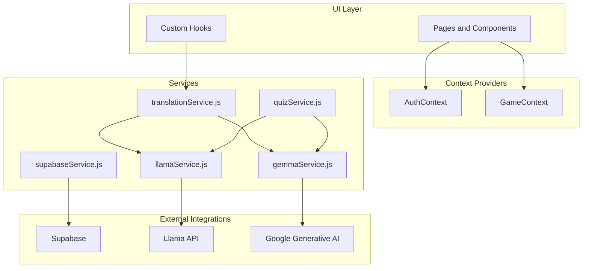
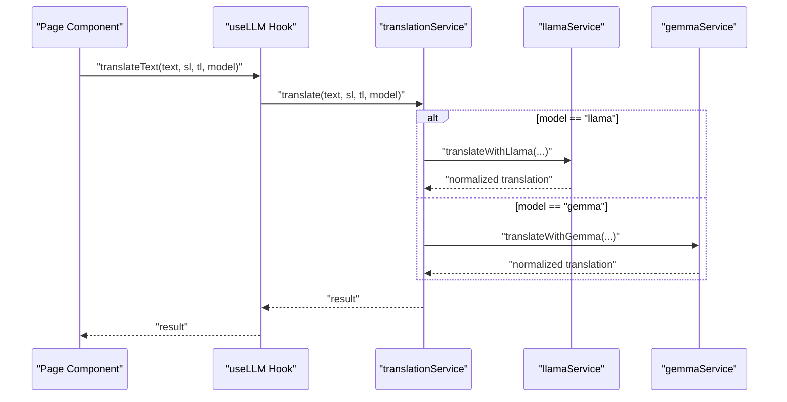
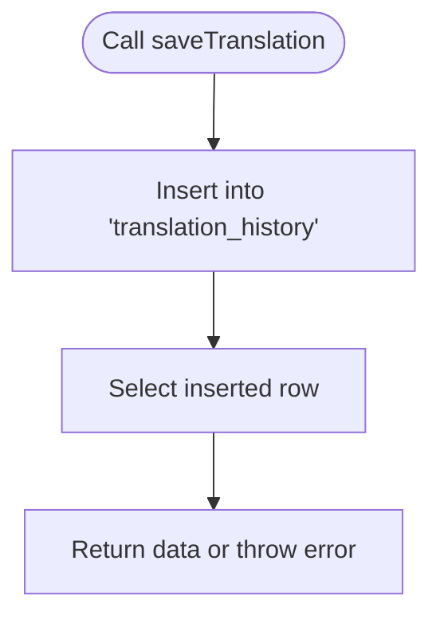
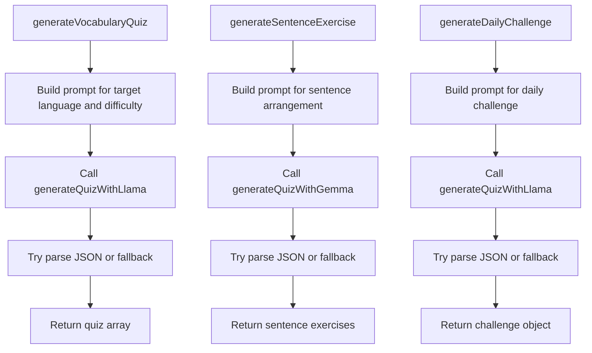
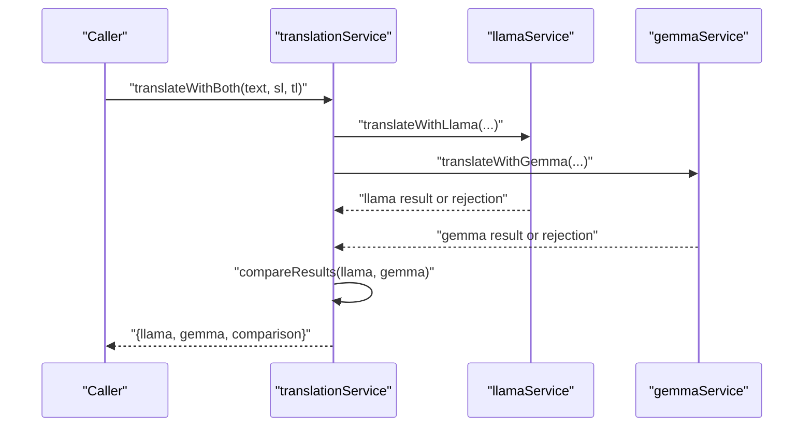
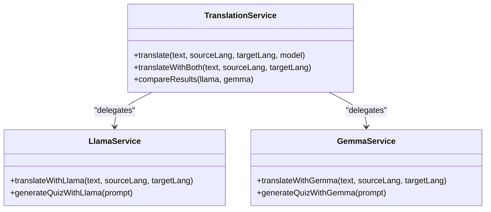
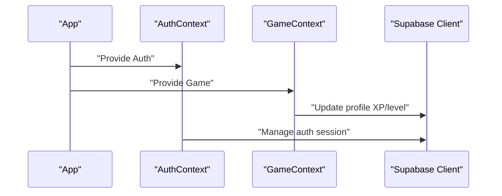
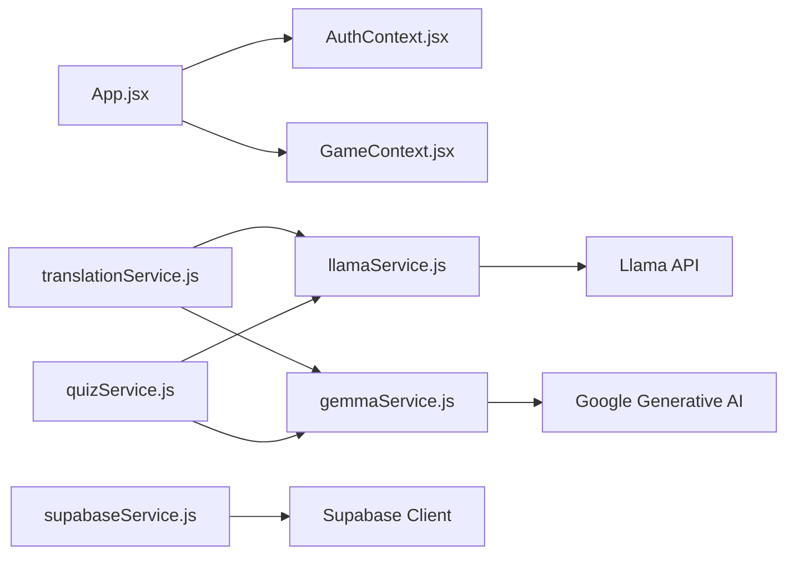

# Service Layer Architecture

<cite>
**Referenced Files in This Document**
- [supabaseService.js](file://src/services/supabaseService.js)
- [quizService.js](file://src/services/quizService.js)
- [translationService.js](file://src/services/translationService.js)
- [gemmaService.js](file://src/services/gemmaService.js)
- [llamaService.js](file://src/services/llamaService.js)
- [supabase.js](file://src/config/supabase.js)
- [AuthContext.jsx](file://src/contexts/AuthContext.jsx)
- [GameContext.jsx](file://src/contexts/GameContext.jsx)
- [useLLM.js](file://src/hooks/useLLM.js)
- [App.jsx](file://src/App.jsx)
- [TranslationChat.jsx](file://src/pages/chat/TranslationChat.jsx)
- [Dashboard.jsx](file://src/pages/dashboard/Dashboard.jsx)
- [LeaderboardPage.jsx](file://src/pages/dashboard/LeaderboardPage.jsx)
- [ProgressPage.jsx](file://src/pages/dashboard/ProgressPage.jsx)
- [DailyChallenge.jsx](file://src/pages/games/DailyChallenge.jsx)
- [SentenceArrangement.jsx](file://src/pages/games/SentenceArrangement.jsx)
- [VocabularyQuiz.jsx](file://src/pages/games/VocabularyQuiz.jsx)
- [package.json](file://package.json)
</cite>

## Table of Contents
1. [Introduction](#introduction)
2. [Project Structure](#project-structure)
3. [Core Components](#core-components)
4. [Architecture Overview](#architecture-overview)
5. [Detailed Component Analysis](#detailed-component-analysis)
6. [Dependency Analysis](#dependency-analysis)
7. [Performance Considerations](#performance-considerations)
8. [Troubleshooting Guide](#troubleshooting-guide)
9. [Conclusion](#conclusion)
10. [Appendices](#appendices)

## Introduction
This document explains the service layer architecture that separates business logic from data access and external AI API integration. It focuses on three primary service modules:
- supabaseService: encapsulates all Supabase data access for profiles, progress, quiz attempts, translation history, and leaderboard.
- quizService: orchestrates AI-generated quiz content using Llama and Gemma services.
- translationService: coordinates translation via Llama and Gemma, supports dual-model comparison, and exposes a unified interface.

The document also covers authentication and context providers, error handling, fallback strategies, and patterns for extension and testing.

## Project Structure
The service layer resides under src/services and integrates with React contexts for authentication and game state, and with Supabase for persistence.

**Diagram sources**
- [App.jsx:19-49](file://src/App.jsx#L19-L49)
- [AuthContext.jsx:6-94](file://src/contexts/AuthContext.jsx#L6-L94)
- [GameContext.jsx:57-134](file://src/contexts/GameContext.jsx#L57-L134)
- [supabaseService.js:1-132](file://src/services/supabaseService.js#L1-L132)
- [quizService.js:1-154](file://src/services/quizService.js#L1-L154)
- [translationService.js:1-73](file://src/services/translationService.js#L1-L73)
- [llamaService.js:1-84](file://src/services/llamaService.js#L1-L84)
- [gemmaService.js:1-56](file://src/services/gemmaService.js#L1-L56)

**Section sources**
- [App.jsx:19-49](file://src/App.jsx#L19-L49)
- [AuthContext.jsx:6-94](file://src/contexts/AuthContext.jsx#L6-L94)
- [GameContext.jsx:57-134](file://src/contexts/GameContext.jsx#L57-L134)

## Core Components
- supabaseService: Provides CRUD and aggregation functions for profiles, user progress, quiz attempts, translation history, and leaderboard.
- quizService: Generates vocabulary quizzes, sentence arrangement exercises, and daily challenges using Llama and Gemma, with robust fallbacks.
- translationService: Offers single-model translation and dual-model comparison with result scoring.
- llamaService and gemmaService: Encapsulate external AI API calls and normalize responses into a consistent shape.

These services form a cohesive abstraction layer:
- Business logic (quiz generation, translation orchestration) lives in dedicated service modules.
- Data persistence and retrieval are centralized in supabaseService.
- External AI integrations are isolated in llamaService and gemmaService.

**Section sources**
- [supabaseService.js:1-132](file://src/services/supabaseService.js#L1-L132)
- [quizService.js:1-154](file://src/services/quizService.js#L1-L154)
- [translationService.js:1-73](file://src/services/translationService.js#L1-L73)
- [llamaService.js:1-84](file://src/services/llamaService.js#L1-L84)
- [gemmaService.js:1-56](file://src/services/gemmaService.js#L1-L56)

## Architecture Overview
The service layer follows a layered architecture:
- UI pages/components depend on contexts and service functions.
- Services encapsulate external API calls and database interactions.
- Context providers supply authentication and game state to the UI.

**Diagram sources**
- [useLLM.js:4-37](file://src/hooks/useLLM.js#L4-L37)
- [translationService.js:12-20](file://src/services/translationService.js#L12-L20)
- [llamaService.js:14-60](file://src/services/llamaService.js#L14-L60)
- [gemmaService.js:16-44](file://src/services/gemmaService.js#L16-L44)

## Detailed Component Analysis

### supabaseService: Data Access Abstraction
Responsibilities:
- Save and retrieve translation history.
- Record and query quiz attempts.
- Upsert and fetch user progress.
- Manage daily challenges.
- Fetch leaderboard and user profile.

Key characteristics:
- Centralized Supabase client import ensures consistent configuration and environment variable usage.
- Functions return normalized data or throw errors, enabling predictable error handling in callers.
- Uses Supabase upsert with conflict resolution for progress updates.

**Diagram sources**
- [supabaseService.js:5-17](file://src/services/supabaseService.js#L5-L17)

**Section sources**
- [supabaseService.js:1-132](file://src/services/supabaseService.js#L1-L132)
- [supabase.js:1-7](file://src/config/supabase.js#L1-L7)

### quizService: AI-Driven Quiz Generation
Responsibilities:
- Generate vocabulary quizzes using Llama.
- Generate sentence arrangement exercises using Gemma.
- Generate daily translation challenges using Llama.
- Provide fallbacks when AI responses are malformed.

Implementation highlights:
- Prompt engineering tailored to each task type.
- Robust parsing with fallbacks to static datasets.
- Declarative fallbacks for quizzes, sentences, and daily challenges.

**Diagram sources**
- [quizService.js:8-32](file://src/services/quizService.js#L8-L32)
- [quizService.js:37-61](file://src/services/quizService.js#L37-L61)
- [quizService.js:66-88](file://src/services/quizService.js#L66-L88)

**Section sources**
- [quizService.js:1-154](file://src/services/quizService.js#L1-L154)

### translationService: Unified Translation Orchestration
Responsibilities:
- Single-model translation routing to Llama or Gemma.
- Dual-model translation with comparison metrics.
- Comparison scoring based on word counts and Jaccard similarity.

Key behaviors:
- Parallel execution of both models with settled promises to avoid partial failures.
- Structured comparison results for UI consumption.

**Diagram sources**
- [translationService.js:25-42](file://src/services/translationService.js#L25-L42)
- [translationService.js:47-72](file://src/services/translationService.js#L47-L72)
- [llamaService.js:14-60](file://src/services/llamaService.js#L14-L60)
- [gemmaService.js:16-44](file://src/services/gemmaService.js#L16-L44)

**Section sources**
- [translationService.js:1-73](file://src/services/translationService.js#L1-L73)

### AI Services: llamaService and gemmaService
Responsibilities:
- llamaService: Calls Llama API with structured prompts and extracts normalized JSON.
- gemmaService: Calls Google Generative AI with system instructions and returns normalized JSON.

Error handling:
- Llama API errors propagate as typed errors with status and message.
- Both services include fallback normalization when JSON parsing fails.

**Diagram sources**
- [llamaService.js:14-83](file://src/services/llamaService.js#L14-L83)
- [gemmaService.js:16-55](file://src/services/gemmaService.js#L16-L55)
- [translationService.js:12-42](file://src/services/translationService.js#L12-L42)

**Section sources**
- [llamaService.js:1-84](file://src/services/llamaService.js#L1-L84)
- [gemmaService.js:1-56](file://src/services/gemmaService.js#L1-L56)

### Authentication and Context Providers
- AuthContext: Manages session lifecycle, profile fetching, and auth actions. Exposes user, session, profile, and loading state.
- GameContext: Maintains XP, level, streak, and game stats; persists changes to Supabase and computes derived values.

Relationship to services:
- GameContext writes to Supabase via supabaseService’s underlying client.
- UI pages consume contexts and call service functions to persist or retrieve data.

**Diagram sources**
- [App.jsx:21-47](file://src/App.jsx#L21-L47)
- [AuthContext.jsx:6-94](file://src/contexts/AuthContext.jsx#L6-L94)
- [GameContext.jsx:75-119](file://src/contexts/GameContext.jsx#L75-L119)

**Section sources**
- [AuthContext.jsx:1-101](file://src/contexts/AuthContext.jsx#L1-L101)
- [GameContext.jsx:1-141](file://src/contexts/GameContext.jsx#L1-L141)

### Usage Examples Across Pages
- TranslationChat saves translation history via supabaseService after successful translation.
- Dashboard and ProgressPage fetch user progress and quiz attempts using supabaseService.
- Quiz pages call quizService to generate content before rendering.

**Section sources**
- [TranslationChat.jsx:7](file://src/pages/chat/TranslationChat.jsx#L7)
- [Dashboard.jsx:5](file://src/pages/dashboard/Dashboard.jsx#L5)
- [ProgressPage.jsx:4](file://src/pages/dashboard/ProgressPage.jsx#L4)
- [DailyChallenge.jsx:6](file://src/pages/games/DailyChallenge.jsx#L6)
- [SentenceArrangement.jsx:5](file://src/pages/games/SentenceArrangement.jsx#L5)
- [VocabularyQuiz.jsx:5](file://src/pages/games/VocabularyQuiz.jsx#L5)

## Dependency Analysis
External dependencies:
- @supabase/supabase-js: Database and auth client.
- @google/generative-ai: Google AI SDK for Gemma.
- react-router-dom: Routing and protected routes.
- Environment variables for API keys and Supabase URLs.

**Diagram sources**
- [package.json:11-20](file://package.json#L11-L20)
- [App.jsx:19-49](file://src/App.jsx#L19-L49)
- [translationService.js:1-3](file://src/services/translationService.js#L1-L3)
- [quizService.js:1-2](file://src/services/quizService.js#L1-L2)
- [supabaseService.js:1](file://src/services/supabaseService.js#L1)
- [llamaService.js:1-2](file://src/services/llamaService.js#L1-L2)
- [gemmaService.js:1](file://src/services/gemmaService.js#L1)

**Section sources**
- [package.json:11-20](file://package.json#L11-L20)

## Performance Considerations
- Parallelization: translationService executes both models concurrently to reduce latency.
- Parsing resilience: quizService attempts multiple parsing strategies and falls back to curated datasets to minimize downtime.
- Supabase upsert: Uses conflict resolution to avoid redundant writes and reduce contention.
- Rate limiting and quotas: External AI APIs impose limits; consider introducing exponential backoff and circuit breaker patterns at the service boundaries.
- Caching: Introduce in-memory caches for repeated reads (e.g., leaderboard, user progress) with TTL and cache invalidation on write.

[No sources needed since this section provides general guidance]

## Troubleshooting Guide
Common issues and strategies:
- AI API errors: Llama API throws descriptive errors on non-OK responses; wrap service calls with try/catch and surface user-friendly messages.
- Malformed AI responses: quizService and translationService include fallbacks; log parsing failures for monitoring.
- Supabase errors: All supabaseService functions throw on error; callers should handle exceptions and retry where appropriate.
- Authentication state: AuthContext manages session changes; ensure profile is fetched after login to hydrate GameContext.

**Section sources**
- [llamaService.js:34-37](file://src/services/llamaService.js#L34-L37)
- [quizService.js:24-32](file://src/services/quizService.js#L24-L32)
- [translationService.js:34-41](file://src/services/translationService.js#L34-L41)
- [supabaseService.js:15](file://src/services/supabaseService.js#L15)
- [AuthContext.jsx:12-30](file://src/contexts/AuthContext.jsx#L12-L30)

## Conclusion
The service layer cleanly separates business logic from data access and external integrations. It leverages context providers for authentication and game state, while services encapsulate Supabase operations and AI API interactions. The design supports robust error handling, fallbacks, and extensibility for future enhancements.

[No sources needed since this section summarizes without analyzing specific files]

## Appendices

### Initialization and Dependency Injection Patterns
- Supabase client is initialized once and imported by supabaseService.
- AI services rely on environment variables for API keys.
- No explicit DI container is used; services are imported and called directly. Consider a factory or registry for testability and swapping providers.

**Section sources**
- [supabase.js:1-7](file://src/config/supabase.js#L1-L7)
- [llamaService.js:1-2](file://src/services/llamaService.js#L1-L2)
- [gemmaService.js:1-4](file://src/services/gemmaService.js#L1-L4)

### Testing Strategies for Service Components
- Mock external APIs: Replace fetch and Google Generative AI SDK with mocks to simulate success and failure scenarios.
- Isolate Supabase calls: Wrap Supabase client in a facade to enable mocking insert/select/upsert calls.
- Test parsing and fallbacks: Verify quizService fallbacks for malformed AI responses.
- Context tests: Validate that GameContext updates persist to Supabase and that AuthContext hydrates profile data.

[No sources needed since this section provides general guidance]