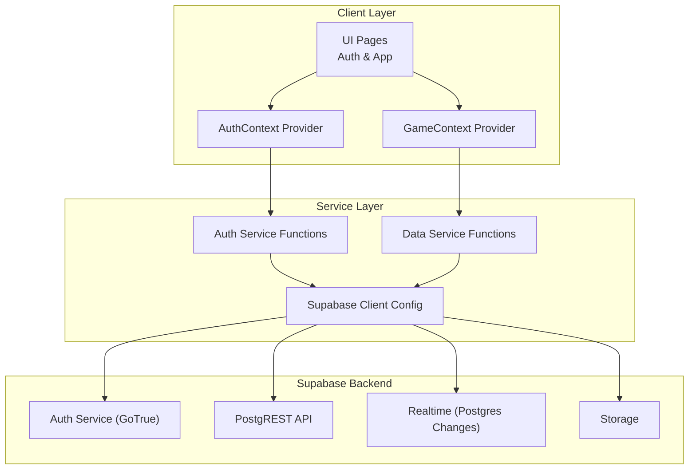
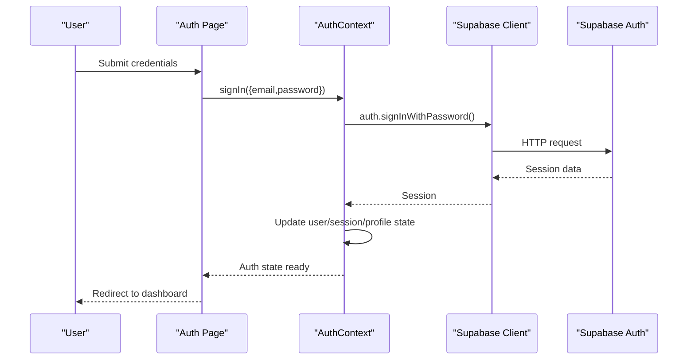
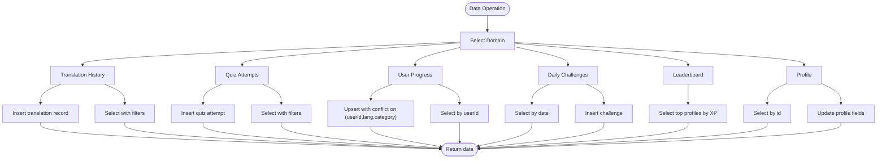
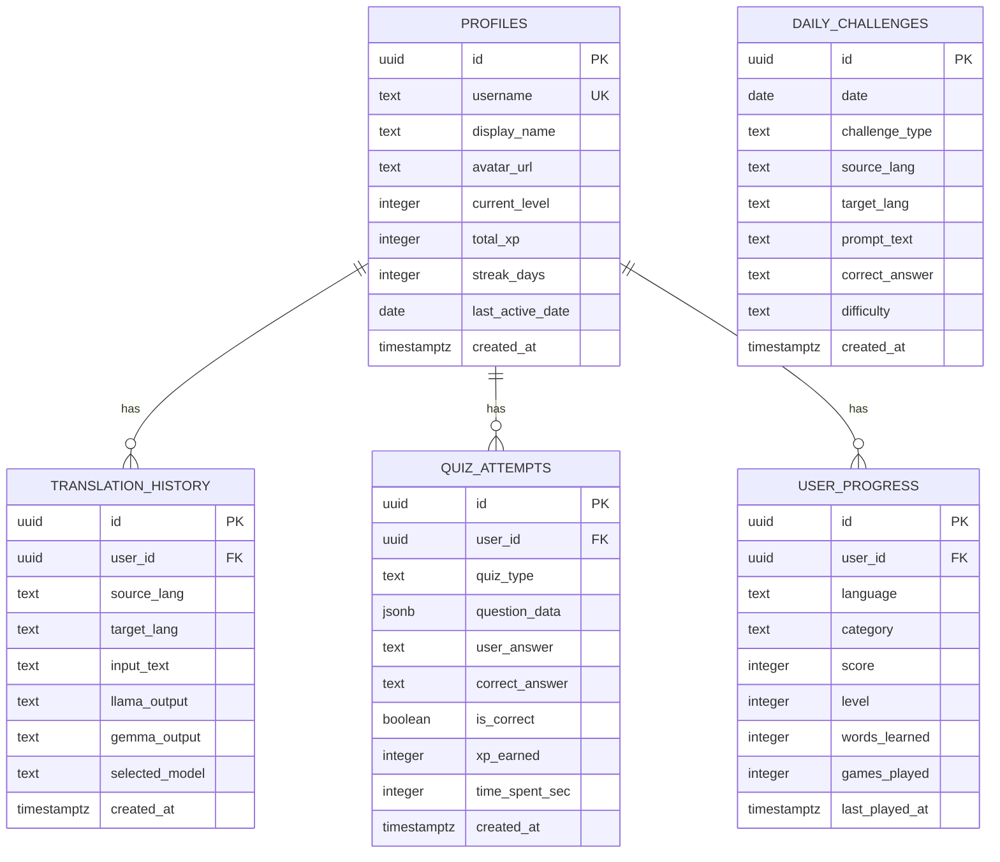
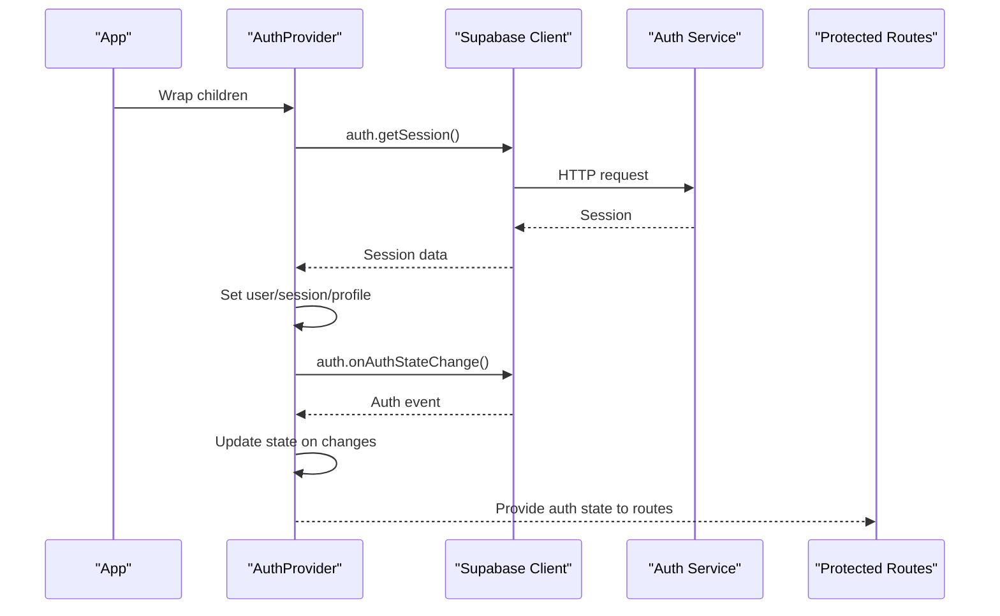
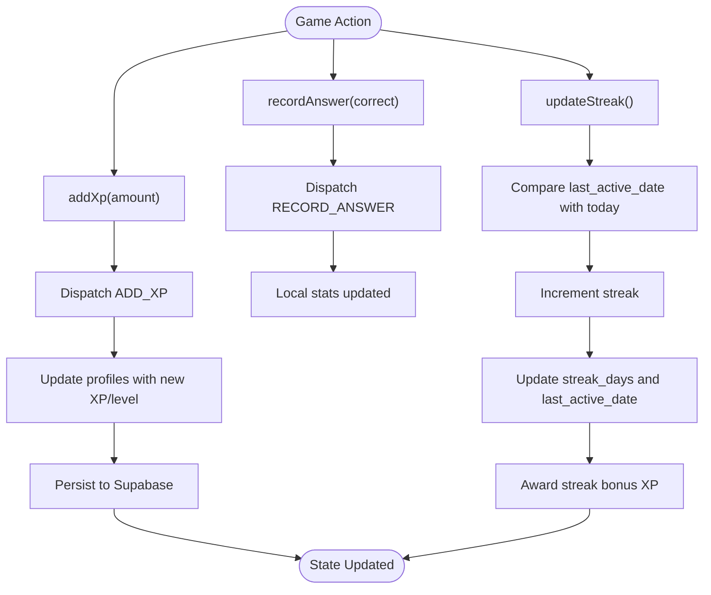
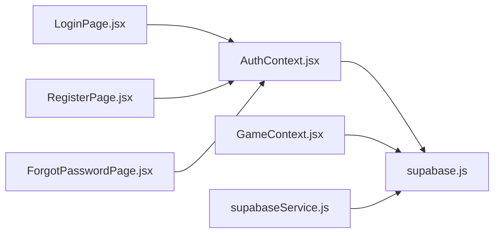

# Supabase Service

<cite>
**Referenced Files in This Document**
- [supabase.js](file://src/config/supabase.js)
- [supabaseService.js](file://src/services/supabaseService.js)
- [AuthContext.jsx](file://src/contexts/AuthContext.jsx)
- [GameContext.jsx](file://src/contexts/GameContext.jsx)
- [LoginPage.jsx](file://src/pages/auth/LoginPage.jsx)
- [RegisterPage.jsx](file://src/pages/auth/RegisterPage.jsx)
- [ForgotPasswordPage.jsx](file://src/pages/auth/ForgotPasswordPage.jsx)
- [App.jsx](file://src/App.jsx)
- [supabase-schema.sql](file://supabase-schema.sql)
</cite>

## Table of Contents
1. [Introduction](#introduction)
2. [Project Structure](#project-structure)
3. [Core Components](#core-components)
4. [Architecture Overview](#architecture-overview)
5. [Detailed Component Analysis](#detailed-component-analysis)
6. [Dependency Analysis](#dependency-analysis)
7. [Performance Considerations](#performance-considerations)
8. [Troubleshooting Guide](#troubleshooting-guide)
9. [Conclusion](#conclusion)

## Introduction
This document provides comprehensive documentation for the Supabase service layer powering the Flinggo application. It covers authentication services (sign-up, login, password reset, session management), the data persistence layer (CRUD operations for profiles, quiz attempts, translation history, user progress, and daily challenges), real-time subscription patterns, database schema relationships, validation and security considerations, and performance optimization strategies. It also includes practical examples of database operations, error handling approaches, and integration with the centralized authentication state via AuthContext.

## Project Structure
The Supabase service layer is organized around three primary areas:
- Supabase client initialization
- Authentication service integrated into a React context provider
- Data access services for CRUD operations and domain-specific features



**Diagram sources**
- [App.jsx:19-49](file://src/App.jsx#L19-L49)
- [AuthContext.jsx:6-94](file://src/contexts/AuthContext.jsx#L6-L94)
- [GameContext.jsx:57-134](file://src/contexts/GameContext.jsx#L57-L134)
- [supabase.js:1-7](file://src/config/supabase.js#L1-L7)

**Section sources**
- [App.jsx:1-50](file://src/App.jsx#L1-L50)
- [supabase.js:1-7](file://src/config/supabase.js#L1-L7)

## Core Components
- Supabase client initialization: Centralizes Supabase client creation and exports a singleton client instance used across the app.
- Authentication service: Provides sign-up, sign-in, sign-out, password reset, and profile update operations, plus session state management via a React context provider.
- Data persistence service: Encapsulates CRUD operations for translation history, quiz attempts, user progress, daily challenges, leaderboard, and profile retrieval.
- Game context: Manages XP, level, streak, and game stats, persisting changes to the profiles table and updating local state.

**Section sources**
- [supabase.js:1-7](file://src/config/supabase.js#L1-L7)
- [AuthContext.jsx:6-94](file://src/contexts/AuthContext.jsx#L6-L94)
- [supabaseService.js:1-132](file://src/services/supabaseService.js#L1-L132)
- [GameContext.jsx:57-134](file://src/contexts/GameContext.jsx#L57-L134)

## Architecture Overview
The architecture follows a layered pattern:
- UI pages trigger actions via React hooks and context providers.
- AuthContext coordinates authentication state and integrates with Supabase Auth.
- Data access functions encapsulate Supabase PostgREST operations.
- Realtime subscriptions enable reactive updates for collaborative features (conceptual; see Realtime Patterns section).



**Diagram sources**
- [LoginPage.jsx:13-25](file://src/pages/auth/LoginPage.jsx#L13-L25)
- [AuthContext.jsx:58-62](file://src/contexts/AuthContext.jsx#L58-L62)

## Detailed Component Analysis

### Authentication Service Implementation
The authentication service is implemented in a React context provider that:
- Initializes session state on mount by reading the current session.
- Subscribes to auth state changes to keep user, session, and profile synchronized.
- Exposes functions for sign-up, sign-in, sign-out, password reset, and profile updates.
- Automatically creates a profile record upon successful sign-up.

```mermaid
classDiagram
class AuthProvider {
+object user
+object session
+object profile
+boolean loading
+useEffect()
+fetchProfile(userId)
+signUp({email,password,username})
+signIn({email,password})
+signOut()
+resetPassword(email)
+updateProfile(updates)
}
class SupabaseClient {
+auth
+from(table)
}
AuthProvider --> SupabaseClient : "uses"
```

**Diagram sources**
- [AuthContext.jsx:6-94](file://src/contexts/AuthContext.jsx#L6-L94)
- [supabase.js:1-7](file://src/config/supabase.js#L1-L7)

Key implementation highlights:
- Initial session hydration and auth state subscription are handled in a single effect hook.
- Profile retrieval is performed after a successful session is established.
- Sign-up triggers profile creation with default values for new users.
- Password reset leverages Supabase Auth’s built-in password recovery mechanism.

**Section sources**
- [AuthContext.jsx:12-30](file://src/contexts/AuthContext.jsx#L12-L30)
- [AuthContext.jsx:32-40](file://src/contexts/AuthContext.jsx#L32-L40)
- [AuthContext.jsx:42-56](file://src/contexts/AuthContext.jsx#L42-L56)
- [AuthContext.jsx:58-62](file://src/contexts/AuthContext.jsx#L58-L62)
- [AuthContext.jsx:64-67](file://src/contexts/AuthContext.jsx#L64-L67)
- [AuthContext.jsx:69-72](file://src/contexts/AuthContext.jsx#L69-L72)
- [AuthContext.jsx:74-84](file://src/contexts/AuthContext.jsx#L74-L84)

#### Authentication UI Integration Examples
- Login page demonstrates form submission, error handling, and navigation on success.
- Registration page performs client-side validation and delegates sign-up to the context.
- Forgot password page triggers password reset and displays success feedback.

**Section sources**
- [LoginPage.jsx:13-25](file://src/pages/auth/LoginPage.jsx#L13-L25)
- [RegisterPage.jsx:16-38](file://src/pages/auth/RegisterPage.jsx#L16-L38)
- [ForgotPasswordPage.jsx:12-24](file://src/pages/auth/ForgotPasswordPage.jsx#L12-L24)

### Data Persistence Layer
The data persistence layer exposes typed functions for CRUD operations across multiple domains:
- Translation history: Save and retrieve translation records with model metadata.
- Quiz attempts: Persist quiz results including correctness, XP earned, and timing.
- User progress: Upsert per-language/category progress with conflict resolution.
- Daily challenges: Retrieve and save daily challenge configurations.
- Leaderboard: Fetch top profiles ordered by XP.
- Profile: Retrieve and update profile details.



**Diagram sources**
- [supabaseService.js:5-28](file://src/services/supabaseService.js#L5-L28)
- [supabaseService.js:32-58](file://src/services/supabaseService.js#L32-L58)
- [supabaseService.js:71-85](file://src/services/supabaseService.js#L71-L85)
- [supabaseService.js:89-107](file://src/services/supabaseService.js#L89-L107)
- [supabaseService.js:111-119](file://src/services/supabaseService.js#L111-L119)
- [supabaseService.js:123-131](file://src/services/supabaseService.js#L123-L131)

**Section sources**
- [supabaseService.js:5-28](file://src/services/supabaseService.js#L5-L28)
- [supabaseService.js:32-58](file://src/services/supabaseService.js#L32-L58)
- [supabaseService.js:71-85](file://src/services/supabaseService.js#L71-L85)
- [supabaseService.js:89-107](file://src/services/supabaseService.js#L89-L107)
- [supabaseService.js:111-119](file://src/services/supabaseService.js#L111-L119)
- [supabaseService.js:123-131](file://src/services/supabaseService.js#L123-L131)

### Real-Time Subscription Patterns
While the current codebase primarily uses REST for data operations, Supabase Realtime enables reactive updates. The Supabase client supports Realtime channels and Postgres changes listeners. Typical patterns include:
- Listening to table changes (INSERT/UPDATE/DELETE) for collaborative features.
- Broadcasting messages for chat-like interactions.
- Presence tracking for online users.

Implementation guidance:
- Initialize a Realtime client using the Supabase client’s exported Realtime client.
- Subscribe to a channel and apply filters for specific tables and events.
- Handle subscription lifecycle (subscribe/unsubscribe) and errors.

[No sources needed since this section provides general guidance]

### Database Schema Relationships
The schema defines core tables and Row Level Security policies:
- Profiles: Extends auth.users; stores user metadata and XP/streak.
- Translation history: Links to profiles via user_id; tracks model outputs.
- Quiz attempts: Records quiz performance and XP/time metrics.
- User progress: Per-language/category tracking with unique constraint.
- Daily challenges: Daily language tasks with difficulty levels.
- Leaderboard: Derived from profiles ordered by XP.



**Diagram sources**
- [supabase-schema.sql:4-15](file://supabase-schema.sql#L4-L15)
- [supabase-schema.sql:26-37](file://supabase-schema.sql#L26-L37)
- [supabase-schema.sql:47-59](file://supabase-schema.sql#L47-L59)
- [supabase-schema.sql:69-81](file://supabase-schema.sql#L69-L81)
- [supabase-schema.sql:94-106](file://supabase-schema.sql#L94-L106)

**Section sources**
- [supabase-schema.sql:1-119](file://supabase-schema.sql#L1-L119)

### Data Validation Patterns
- Client-side validation in UI pages ensures minimal invalid submissions (e.g., password length, confirmation match).
- Supabase RLS policies enforce row-level access control for profiles, translation history, quiz attempts, and user progress.
- Unique constraints prevent duplicate progress entries and maintain data integrity.

**Section sources**
- [RegisterPage.jsx:20-27](file://src/pages/auth/RegisterPage.jsx#L20-L27)
- [supabase-schema.sql:20-25](file://supabase-schema.sql#L20-L25)
- [supabase-schema.sql:69-81](file://supabase-schema.sql#L69-L81)

### Security Considerations
- Environment variables store Supabase URL and anonymous key.
- RLS policies restrict access to user-owned rows.
- Authenticated sessions are required for protected operations.
- Password reset uses Supabase Auth’s secure mechanisms.

**Section sources**
- [supabase.js:3-6](file://src/config/supabase.js#L3-L6)
- [supabaseSchema.sql:17-25](file://supabase-schema.sql#L17-L25)
- [supabaseSchema.sql:39-46](file://supabase-schema.sql#L39-L46)
- [supabaseSchema.sql:61-68](file://supabase-schema.sql#L61-L68)
- [supabaseSchema.sql:83-93](file://supabase-schema.sql#L83-L93)

### Authentication State Management with AuthContext
AuthContext centralizes authentication state and provides:
- Initial session hydration and ongoing auth state subscription.
- Profile synchronization and loading state management.
- Public methods for sign-up, sign-in, sign-out, password reset, and profile updates.



**Diagram sources**
- [AuthContext.jsx:12-30](file://src/contexts/AuthContext.jsx#L12-L30)
- [AuthContext.jsx:21-29](file://src/contexts/AuthContext.jsx#L21-L29)
- [App.jsx:21-47](file://src/App.jsx#L21-L47)

**Section sources**
- [AuthContext.jsx:6-94](file://src/contexts/AuthContext.jsx#L6-L94)
- [App.jsx:19-49](file://src/App.jsx#L19-L49)

### Game Context and XP Persistence
GameContext manages XP, level, streak, and answers, persisting XP and level changes to the profiles table and updating local state reactively.



**Diagram sources**
- [GameContext.jsx:76-85](file://src/contexts/GameContext.jsx#L76-L85)
- [GameContext.jsx:107-119](file://src/contexts/GameContext.jsx#L107-L119)

**Section sources**
- [GameContext.jsx:57-134](file://src/contexts/GameContext.jsx#L57-L134)

## Dependency Analysis
The service layer depends on:
- Supabase client for authentication, database, and realtime operations.
- React context providers for state management.
- UI pages for orchestrating user actions.



**Diagram sources**
- [LoginPage.jsx:1-80](file://src/pages/auth/LoginPage.jsx#L1-L80)
- [RegisterPage.jsx:1-115](file://src/pages/auth/RegisterPage.jsx#L1-L115)
- [ForgotPasswordPage.jsx:1-71](file://src/pages/auth/ForgotPasswordPage.jsx#L1-L71)
- [AuthContext.jsx:1-101](file://src/contexts/AuthContext.jsx#L1-L101)
- [GameContext.jsx:1-141](file://src/contexts/GameContext.jsx#L1-L141)
- [supabaseService.js:1-132](file://src/services/supabaseService.js#L1-L132)
- [supabase.js:1-7](file://src/config/supabase.js#L1-L7)

**Section sources**
- [App.jsx:1-50](file://src/App.jsx#L1-L50)

## Performance Considerations
- Database indexing: The schema includes indexes on frequently queried columns (e.g., translation_history, quiz_attempts, user_progress, daily_challenges, profiles XP).
- Query limits: Services use reasonable limits for history and attempts to control payload sizes.
- Efficient reads: Select only required columns for leaderboard and profile views.
- Caching strategies: Consider client-side caching for leaderboard and daily challenges with cache invalidation on relevant updates.
- Batch operations: Group related writes where possible to reduce round-trips.

**Section sources**
- [supabase-schema.sql:113-119](file://supabase-schema.sql#L113-L119)
- [supabaseService.js:19-28](file://src/services/supabaseService.js#L19-L28)
- [supabaseService.js:47-58](file://src/services/supabaseService.js#L47-L58)
- [supabaseService.js:111-119](file://src/services/supabaseService.js#L111-L119)

## Troubleshooting Guide
Common authentication issues:
- Session not persisting: Verify environment variables for Supabase URL and key are set correctly.
- Auth state not updating: Ensure the auth state subscription is active and not unsubscribed prematurely.
- Password reset failures: Confirm the reset email was sent and the user followed the reset link.

Common database connectivity issues:
- RLS policy violations: Ensure the user ID matches the authenticated user for protected operations.
- Missing indexes: Slow queries may benefit from adding appropriate indexes.
- Network errors: Implement retry logic and user feedback for transient failures.

Error handling strategies:
- Surface user-friendly messages from thrown errors.
- Use loading states to improve UX during async operations.
- Log errors for debugging while avoiding sensitive data exposure.

**Section sources**
- [supabase.js:3-6](file://src/config/supabase.js#L3-L6)
- [AuthContext.jsx:12-30](file://src/contexts/AuthContext.jsx#L12-L30)
- [LoginPage.jsx:15-24](file://src/pages/auth/LoginPage.jsx#L15-L24)
- [RegisterPage.jsx:20-38](file://src/pages/auth/RegisterPage.jsx#L20-L38)
- [ForgotPasswordPage.jsx:14-24](file://src/pages/auth/ForgotPasswordPage.jsx#L14-L24)

## Conclusion
The Supabase service layer provides a robust foundation for authentication, data persistence, and state management in the Flinggo application. By leveraging Supabase Auth for identity, PostgREST for data operations, and React contexts for state, the system achieves clean separation of concerns and scalable growth. The included schema, indexes, and service functions offer a strong baseline for performance and security, with clear extension points for real-time collaboration and advanced caching strategies.