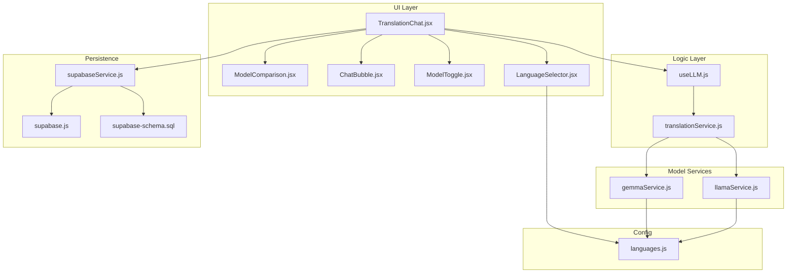
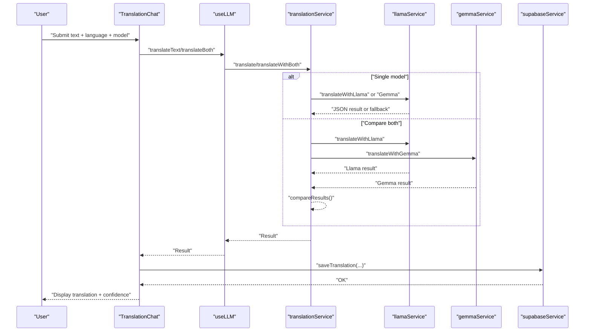
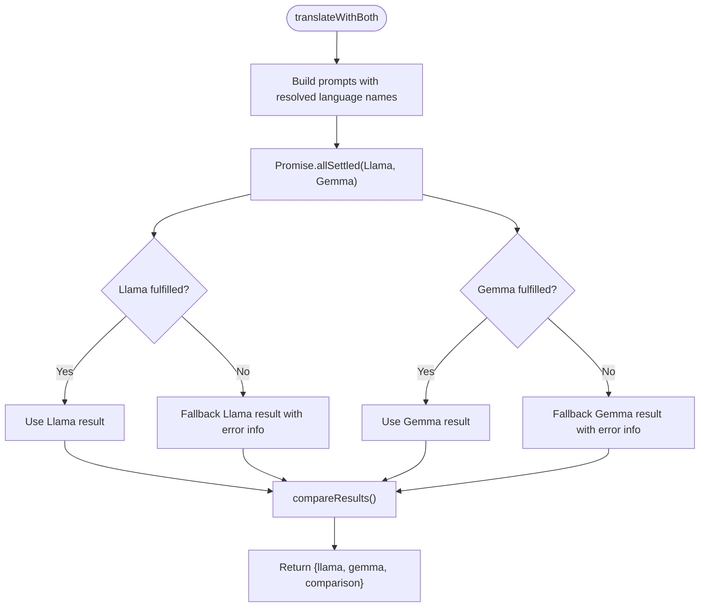
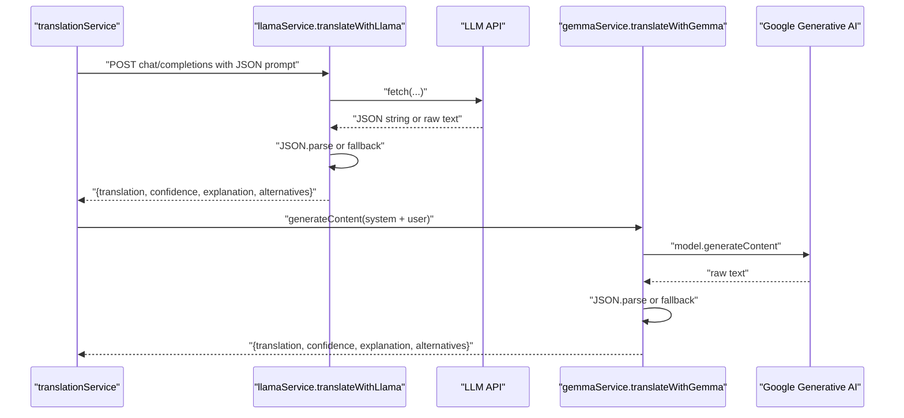
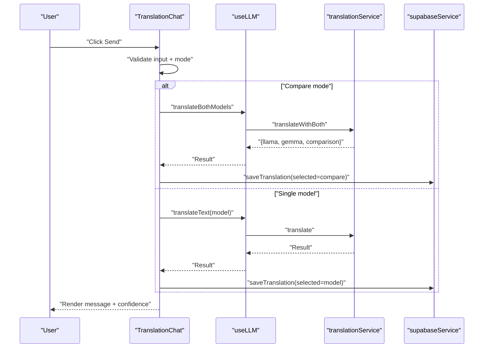
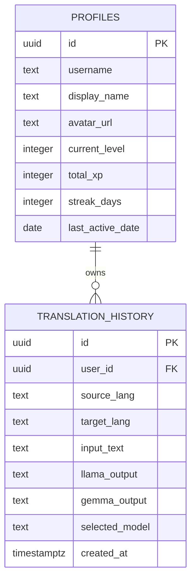
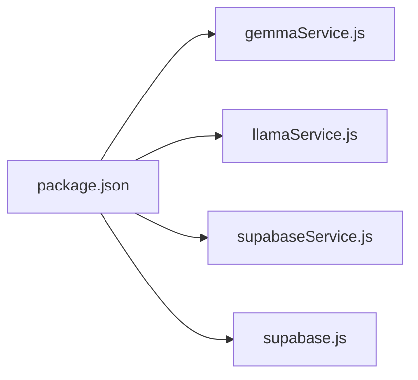

# Translation Service

<cite>
**Referenced Files in This Document**
- [translationService.js](file://src/services/translationService.js)
- [gemmaService.js](file://src/services/gemmaService.js)
- [llamaService.js](file://src/services/llamaService.js)
- [TranslationChat.jsx](file://src/pages/chat/TranslationChat.jsx)
- [ModelComparison.jsx](file://src/pages/chat/ModelComparison.jsx)
- [useLLM.js](file://src/hooks/useLLM.js)
- [languages.js](file://src/config/languages.js)
- [supabaseService.js](file://src/services/supabaseService.js)
- [supabase.js](file://src/config/supabase.js)
- [ChatBubble.jsx](file://src/components/ChatBubble.jsx)
- [ModelToggle.jsx](file://src/components/ModelToggle.jsx)
- [LanguageSelector.jsx](file://src/components/LanguageSelector.jsx)
- [supabase-schema.sql](file://supabase-schema.sql)
- [package.json](file://package.json)
</cite>

## Table of Contents
1. [Introduction](#introduction)
2. [Project Structure](#project-structure)
3. [Core Components](#core-components)
4. [Architecture Overview](#architecture-overview)
5. [Detailed Component Analysis](#detailed-component-analysis)
6. [Dependency Analysis](#dependency-analysis)
7. [Performance Considerations](#performance-considerations)
8. [Troubleshooting Guide](#troubleshooting-guide)
9. [Conclusion](#conclusion)
10. [Appendices](#appendices)

## Introduction
This document describes the translation service that orchestrates AI-powered translation using two language models: Llama and Gemma. It explains how translation requests are processed, how model comparison and result aggregation work, and how translation history is persisted. It also covers user preferences for language pairs and model selection, integration with the TranslationChat and ModelComparison components, error handling and fallbacks, rate limiting and cost optimization strategies, performance monitoring, translation quality assessment via confidence scores, and guidance for extending the system with additional models.

## Project Structure
The translation service spans several layers:
- UI pages and components for chat, comparison, and user controls
- React hooks for orchestrating translation calls
- Service modules for model-specific translation and shared orchestration
- Configuration for supported languages and Supabase client initialization
- Supabase service module for persistence of translation history

**Diagram sources**
- [TranslationChat.jsx:1-197](file://src/pages/chat/TranslationChat.jsx#L1-L197)
- [ModelComparison.jsx:1-81](file://src/pages/chat/ModelComparison.jsx#L1-L81)
- [ChatBubble.jsx:1-32](file://src/components/ChatBubble.jsx#L1-L32)
- [ModelToggle.jsx:1-25](file://src/components/ModelToggle.jsx#L1-L25)
- [LanguageSelector.jsx:1-49](file://src/components/LanguageSelector.jsx#L1-L49)
- [useLLM.js:1-38](file://src/hooks/useLLM.js#L1-L38)
- [translationService.js:1-73](file://src/services/translationService.js#L1-L73)
- [gemmaService.js:1-56](file://src/services/gemmaService.js#L1-L56)
- [llamaService.js:1-84](file://src/services/llamaService.js#L1-L84)
- [supabaseService.js:1-132](file://src/services/supabaseService.js#L1-L132)
- [supabase.js:1-7](file://src/config/supabase.js#L1-L7)
- [languages.js:1-30](file://src/config/languages.js#L1-L30)
- [supabase-schema.sql:1-118](file://supabase-schema.sql#L1-L118)

**Section sources**
- [TranslationChat.jsx:1-197](file://src/pages/chat/TranslationChat.jsx#L1-L197)
- [translationService.js:1-73](file://src/services/translationService.js#L1-L73)
- [gemmaService.js:1-56](file://src/services/gemmaService.js#L1-L56)
- [llamaService.js:1-84](file://src/services/llamaService.js#L1-L84)
- [supabaseService.js:1-132](file://src/services/supabaseService.js#L1-L132)
- [languages.js:1-30](file://src/config/languages.js#L1-L30)
- [supabase.js:1-7](file://src/config/supabase.js#L1-L7)
- [supabase-schema.sql:1-118](file://supabase-schema.sql#L1-L118)

## Core Components
- Translation orchestration: routes translation requests to the selected model and aggregates results for comparison.
- Model services: encapsulate API calls to Llama and Gemma, parsing structured JSON responses and providing fallbacks.
- UI integration: TranslationChat coordinates user input, model selection, and displays results via ChatBubble and ModelComparison.
- Persistence: Supabase-backed storage of translation history with row-level security policies.
- Configuration: Supported languages and language metadata for UI rendering and prompts.

Key responsibilities:
- Single-model translation: translate(text, sourceLangCode, targetLangCode, model)
- Parallel comparison: translateWithBoth(text, sourceLangCode, targetLangCode)
- Result comparison: compareResults(llamaOutput, gemmaOutput)
- Model-specific translation: translateWithLlama(...) and translateWithGemma(...)
- Translation history: saveTranslation(...), getTranslationHistory(...)

**Section sources**
- [translationService.js:1-73](file://src/services/translationService.js#L1-L73)
- [gemmaService.js:1-56](file://src/services/gemmaService.js#L1-L56)
- [llamaService.js:1-84](file://src/services/llamaService.js#L1-L84)
- [TranslationChat.jsx:1-197](file://src/pages/chat/TranslationChat.jsx#L1-L197)
- [ModelComparison.jsx:1-81](file://src/pages/chat/ModelComparison.jsx#L1-L81)
- [supabaseService.js:1-132](file://src/services/supabaseService.js#L1-L132)
- [languages.js:1-30](file://src/config/languages.js#L1-L30)

## Architecture Overview
The translation service follows a layered architecture:
- Presentation layer: TranslationChat manages user interactions, language selection, and model toggles.
- Orchestration layer: useLLM exposes async translation functions and tracks loading/error states.
- Service layer: translationService coordinates model selection and comparison; model services encapsulate provider-specific logic.
- Persistence layer: Supabase persists translation history with secure access policies.
- Configuration layer: languages.js defines supported languages and metadata.

**Diagram sources**
- [TranslationChat.jsx:30-98](file://src/pages/chat/TranslationChat.jsx#L30-L98)
- [useLLM.js:8-34](file://src/hooks/useLLM.js#L8-L34)
- [translationService.js:12-42](file://src/services/translationService.js#L12-L42)
- [llamaService.js:14-60](file://src/services/llamaService.js#L14-L60)
- [gemmaService.js:16-45](file://src/services/gemmaService.js#L16-L45)
- [supabaseService.js:5-17](file://src/services/supabaseService.js#L5-L17)

## Detailed Component Analysis

### Translation Orchestration
Responsibilities:
- Resolve language names for prompts
- Route to selected model or run both models in parallel
- Aggregate results and compute basic comparison metrics

Processing logic:
- translate(): selects model and delegates to model-specific service
- translateWithBoth(): runs both services concurrently, captures outcomes, and constructs comparison metrics
- compareResults(): computes word counts, character counts, and a Jaccard-like similarity score; preserves confidence values

**Diagram sources**
- [translationService.js:25-42](file://src/services/translationService.js#L25-L42)
- [translationService.js:47-72](file://src/services/translationService.js#L47-L72)

**Section sources**
- [translationService.js:12-72](file://src/services/translationService.js#L12-L72)

### Model Services
Responsibilities:
- Llama service: sends JSON-structured prompts to a hosted LLM API, parses JSON response, and falls back gracefully on parse errors
- Gemma service: initializes Google Generative AI client, sends system+user prompts, parses JSON, and falls back on parse errors

Key behaviors:
- Structured prompting with system instructions to enforce JSON responses
- Robust parsing with fallback defaults for confidence, explanation, and alternatives
- Error propagation for API failures

**Diagram sources**
- [llamaService.js:14-60](file://src/services/llamaService.js#L14-L60)
- [gemmaService.js:16-45](file://src/services/gemmaService.js#L16-L45)

**Section sources**
- [llamaService.js:14-84](file://src/services/llamaService.js#L14-L84)
- [gemmaService.js:16-56](file://src/services/gemmaService.js#L16-L56)

### UI Integration: TranslationChat
Responsibilities:
- Manage state for input, languages, mode, and messages
- Invoke useLLM functions based on mode ("llama", "gemma", "compare")
- Persist translation history when user is authenticated
- Render ChatBubble for single-model results and ModelComparison for dual results

Error handling:
- Displays user-friendly error messages derived from thrown exceptions
- Prevents concurrent submissions and disables input during loading

**Diagram sources**
- [TranslationChat.jsx:30-98](file://src/pages/chat/TranslationChat.jsx#L30-L98)
- [useLLM.js:8-34](file://src/hooks/useLLM.js#L8-L34)
- [translationService.js:12-42](file://src/services/translationService.js#L12-L42)
- [supabaseService.js:5-17](file://src/services/supabaseService.js#L5-L17)

**Section sources**
- [TranslationChat.jsx:11-98](file://src/pages/chat/TranslationChat.jsx#L11-L98)
- [useLLM.js:4-37](file://src/hooks/useLLM.js#L4-L37)

### ModelComparison Component
Responsibilities:
- Render side-by-side model outputs with confidence badges
- Display optional explanation and alternatives
- Show comparison metrics: word similarity, word counts, character counts

**Section sources**
- [ModelComparison.jsx:3-78](file://src/pages/chat/ModelComparison.jsx#L3-L78)

### ChatBubble Component
Responsibilities:
- Render user and bot messages with optional model badge and confidence indicator
- Provide subtle animations for conversational UX

**Section sources**
- [ChatBubble.jsx:3-29](file://src/components/ChatBubble.jsx#L3-L29)

### Language Pair Support and Preferences
- Supported languages are defined centrally and used across UI selectors and prompts
- LanguageSelector restricts target language to avoid duplicates
- getLanguageByCode and getLanguageName resolve display metadata and names for prompts

**Section sources**
- [languages.js:1-30](file://src/config/languages.js#L1-L30)
- [LanguageSelector.jsx:3-49](file://src/components/LanguageSelector.jsx#L3-L49)

### Translation History Management
- saveTranslation persists input text, language pair, outputs from both models, and selected model
- getTranslationHistory retrieves recent entries per user with ordering and limits
- Supabase schema enforces row-level security so users can only access their own data
- Indexes optimize retrieval by user and timestamps

**Diagram sources**
- [supabase-schema.sql:26-37](file://supabase-schema.sql#L26-L37)
- [supabase-service.js:5-28](file://src/services/supabaseService.js#L5-L28)

**Section sources**
- [supabaseService.js:5-28](file://src/services/supabaseService.js#L5-L28)
- [supabase-schema.sql:26-46](file://supabase-schema.sql#L26-L46)

## Dependency Analysis
External dependencies relevant to translation:
- @google/generative-ai: used by gemmaService for Google AI model interactions
- @supabase/supabase-js: used by supabaseService and supabase.js for database operations
- Environment variables for API keys and Supabase credentials

**Diagram sources**
- [package.json:11-20](file://package.json#L11-L20)
- [gemmaService.js:1](file://src/services/gemmaService.js#L1)
- [llamaService.js:1](file://src/services/llamaService.js#L1)
- [supabaseService.js:1](file://src/services/supabaseService.js#L1)
- [supabase.js:1](file://src/config/supabase.js#L1)

**Section sources**
- [package.json:11-20](file://package.json#L11-L20)

## Performance Considerations
- Concurrency: translateWithBoth uses Promise.allSettled to maximize throughput and ensure one failure does not block the other
- Parsing robustness: both model services include JSON.parse try/catch with sensible fallbacks to reduce brittle failures
- Prompt efficiency: structured prompts with explicit JSON requirements help keep model outputs predictable
- UI responsiveness: useLLM manages loading states to prevent overlapping requests and improve perceived performance
- Database queries: getTranslationHistory uses ordering and limits; schema includes indexes on user_id and timestamps for fast retrieval

Recommendations:
- Add request deduplication for identical inputs to reduce redundant API calls
- Introduce local caching for frequent phrases or recent translations
- Monitor API latency and adjust max_tokens and temperature for cost/performance balance
- Implement exponential backoff for transient API errors

[No sources needed since this section provides general guidance]

## Troubleshooting Guide
Common issues and resolutions:
- API key errors: Llama service throws descriptive errors on non-2xx responses; verify VITE_META_AI_API_KEY
- JSON parsing failures: Model services fall back to raw content with conservative confidence; check model response format
- Network timeouts: wrap calls with retry logic and user feedback
- Authentication: ensure user is logged in before saving translation history; UI prevents submission when user is null
- Rate limiting: implement client-side throttling or queueing; monitor provider quotas and consider staggered retries

**Section sources**
- [llamaService.js:34-37](file://src/services/llamaService.js#L34-L37)
- [TranslationChat.jsx:89-97](file://src/pages/chat/TranslationChat.jsx#L89-L97)

## Conclusion
The translation service integrates two AI models with a clean separation of concerns: UI orchestration, model-specific services, and centralized persistence. It supports single-model translation, parallel comparison, and structured result aggregation with confidence metrics. Robust error handling and fallbacks ensure resilience, while Supabase-backed history enables user-centric tracking. The modular design facilitates adding new models and tuning parameters for quality and cost optimization.

[No sources needed since this section summarizes without analyzing specific files]

## Appendices

### Implementation Examples

- Single-model translation flow
  - UI: TranslationChat handles input and mode selection
  - Hook: useLLM.translateText invokes translationService.translate
  - Service: translationService.translate delegates to llamaService or gemmaService
  - Persistence: supabaseService.saveTranslation records the result

- Dual-model comparison flow
  - UI: TranslationChat switches to "compare" mode
  - Hook: useLLM.translateBoth invokes translationService.translateWithBoth
  - Service: translationService.runs both model services concurrently
  - UI: ModelComparison renders side-by-side results and metrics

- Adding a new AI model
  - Create a new service module similar to llamaService or gemmaService
  - Implement translateWith<Model>(...) with structured JSON parsing and fallbacks
  - Extend translationService.translate and translateWithBoth to route to the new model
  - Update ModelToggle and UI to expose the new model option

- Configuring translation parameters
  - Adjust temperature and max_tokens in model service functions for desired creativity vs. cost
  - Modify system prompts to refine output style and JSON enforcement
  - Tune comparison metrics in compareResults for domain-specific similarity measures

**Section sources**
- [TranslationChat.jsx:30-98](file://src/pages/chat/TranslationChat.jsx#L30-L98)
- [useLLM.js:8-34](file://src/hooks/useLLM.js#L8-L34)
- [translationService.js:12-42](file://src/services/translationService.js#L12-L42)
- [llamaService.js:14-60](file://src/services/llamaService.js#L14-L60)
- [gemmaService.js:16-45](file://src/services/gemmaService.js#L16-L45)
- [ModelToggle.jsx:1-25](file://src/components/ModelToggle.jsx#L1-L25)