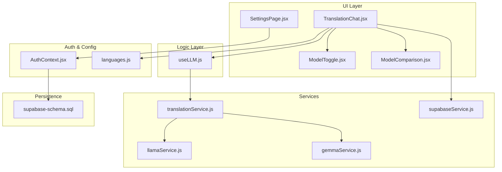
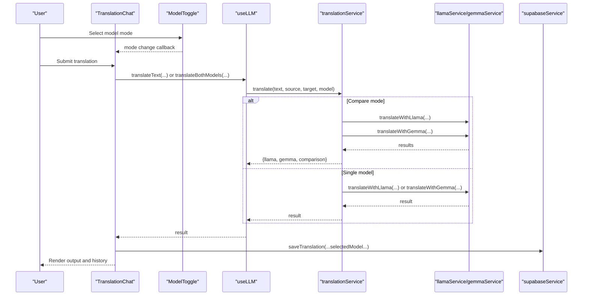
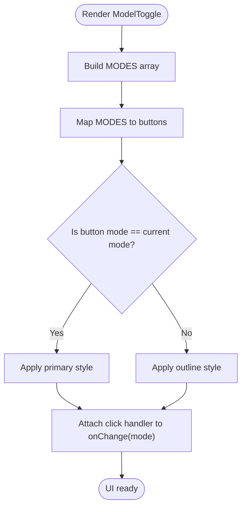
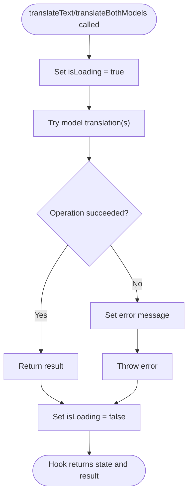
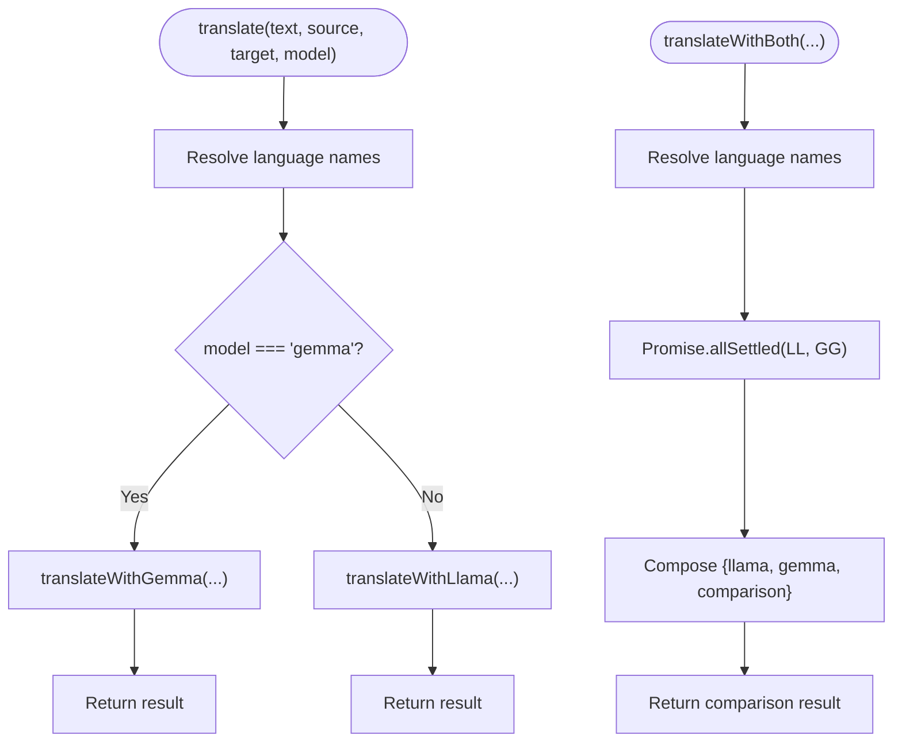
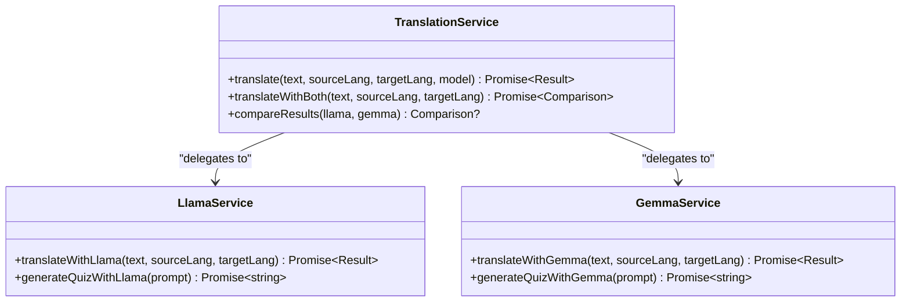
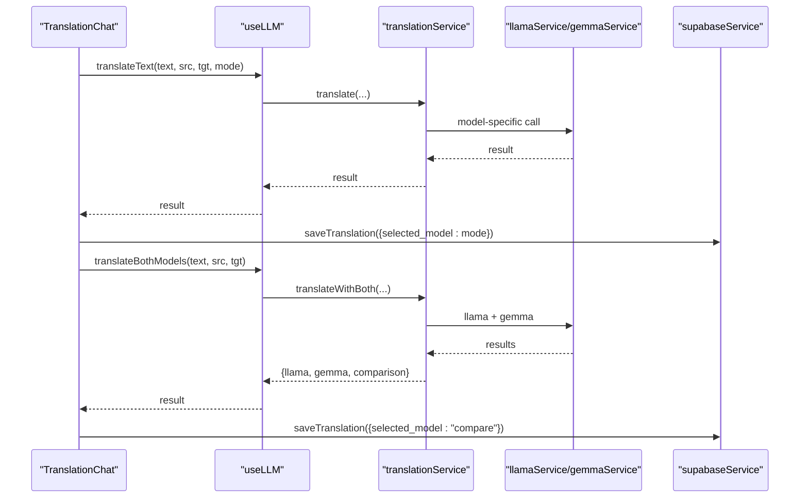
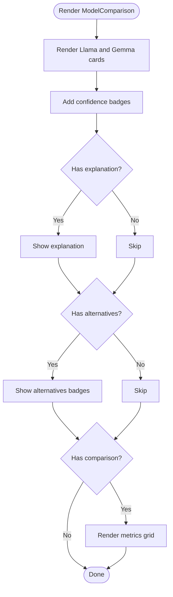
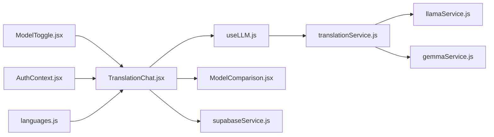

# AI Model Configuration and Preferences

<cite>
**Referenced Files in This Document**
- [ModelToggle.jsx](file://src/components/ModelToggle.jsx)
- [useLLM.js](file://src/hooks/useLLM.js)
- [translationService.js](file://src/services/translationService.js)
- [llamaService.js](file://src/services/llamaService.js)
- [gemmaService.js](file://src/services/gemmaService.js)
- [TranslationChat.jsx](file://src/pages/chat/TranslationChat.jsx)
- [ModelComparison.jsx](file://src/pages/chat/ModelComparison.jsx)
- [SettingsPage.jsx](file://src/pages/dashboard/SettingsPage.jsx)
- [AuthContext.jsx](file://src/contexts/AuthContext.jsx)
- [supabaseService.js](file://src/services/supabaseService.js)
- [languages.js](file://src/config/languages.js)
- [supabase-schema.sql](file://supabase-schema.sql)
</cite>

## Table of Contents
1. [Introduction](#introduction)
2. [Project Structure](#project-structure)
3. [Core Components](#core-components)
4. [Architecture Overview](#architecture-overview)
5. [Detailed Component Analysis](#detailed-component-analysis)
6. [Dependency Analysis](#dependency-analysis)
7. [Performance Considerations](#performance-considerations)
8. [Troubleshooting Guide](#troubleshooting-guide)
9. [Conclusion](#conclusion)
10. [Appendices](#appendices)

## Introduction
This document explains the AI model configuration and preferences management system for the application. It focuses on the ModelToggle component for model selection, preference storage, real-time switching, and integration with translation services. It also documents how model preferences influence API calls, response handling, and user experience features such as model comparison and recommendation considerations. Guidance is included for extending the system to additional AI models while maintaining consistent configuration patterns and user experience standards.

## Project Structure
The AI model configuration spans UI components, hooks, services, pages, and persistence layers:
- UI and state: ModelToggle, TranslationChat, ModelComparison
- Business logic: useLLM hook orchestrating translation operations
- Services: translationService, llamaService, gemmaService
- Persistence: supabaseService and Supabase schema
- Authentication and profile: AuthContext and profile updates
- Language configuration: languages.js

**Diagram sources**
- [ModelToggle.jsx:1-25](file://src/components/ModelToggle.jsx#L1-L25)
- [TranslationChat.jsx:1-197](file://src/pages/chat/TranslationChat.jsx#L1-L197)
- [ModelComparison.jsx:1-81](file://src/pages/chat/ModelComparison.jsx#L1-L81)
- [SettingsPage.jsx:1-122](file://src/pages/dashboard/SettingsPage.jsx#L1-L122)
- [useLLM.js:1-38](file://src/hooks/useLLM.js#L1-L38)
- [translationService.js:1-73](file://src/services/translationService.js#L1-L73)
- [llamaService.js:1-84](file://src/services/llamaService.js#L1-L84)
- [gemmaService.js:1-56](file://src/services/gemmaService.js#L1-L56)
- [supabaseService.js:1-42](file://src/services/supabaseService.js#L1-L42)
- [AuthContext.jsx:1-101](file://src/contexts/AuthContext.jsx#L1-L101)
- [languages.js:1-30](file://src/config/languages.js#L1-L30)
- [supabase-schema.sql:1-113](file://supabase-schema.sql#L1-L113)

**Section sources**
- [ModelToggle.jsx:1-25](file://src/components/ModelToggle.jsx#L1-L25)
- [TranslationChat.jsx:1-197](file://src/pages/chat/TranslationChat.jsx#L1-L197)
- [useLLM.js:1-38](file://src/hooks/useLLM.js#L1-L38)
- [translationService.js:1-73](file://src/services/translationService.js#L1-L73)
- [llamaService.js:1-84](file://src/services/llamaService.js#L1-L84)
- [gemmaService.js:1-56](file://src/services/gemmaService.js#L1-L56)
- [supabaseService.js:1-42](file://src/services/supabaseService.js#L1-L42)
- [AuthContext.jsx:1-101](file://src/contexts/AuthContext.jsx#L1-L101)
- [languages.js:1-30](file://src/config/languages.js#L1-L30)
- [supabase-schema.sql:1-113](file://supabase-schema.sql#L1-L113)

## Core Components
- ModelToggle: Provides a compact, real-time model selector with three modes: Llama 3, Gemma 3, and Compare Both. It updates the parent’s mode state via a callback prop.
- useLLM: Encapsulates translation operations, exposing translateText and translateBothModels with loading/error state management.
- translationService: Routes translation requests to either Llama or Gemma based on the selected model, and coordinates parallel comparisons.
- llamaService and gemmaService: Implement model-specific API integrations, including prompts, request bodies, and response parsing.
- TranslationChat: Integrates model selection, language selection, and chat UI; persists translation history and selected model.
- ModelComparison: Renders side-by-side model outputs and basic similarity metrics.
- AuthContext and SettingsPage: Manage user profile updates and provide a foundation for future model preference persistence.
- supabaseService and supabase-schema: Persist translation history and enable row-level security policies.

**Section sources**
- [ModelToggle.jsx:1-25](file://src/components/ModelToggle.jsx#L1-L25)
- [useLLM.js:1-38](file://src/hooks/useLLM.js#L1-L38)
- [translationService.js:1-73](file://src/services/translationService.js#L1-L73)
- [llamaService.js:1-84](file://src/services/llamaService.js#L1-L84)
- [gemmaService.js:1-56](file://src/services/gemmaService.js#L1-L56)
- [TranslationChat.jsx:1-197](file://src/pages/chat/TranslationChat.jsx#L1-L197)
- [ModelComparison.jsx:1-81](file://src/pages/chat/ModelComparison.jsx#L1-L81)
- [AuthContext.jsx:1-101](file://src/contexts/AuthContext.jsx#L1-L101)
- [SettingsPage.jsx:1-122](file://src/pages/dashboard/SettingsPage.jsx#L1-L122)
- [supabaseService.js:1-42](file://src/services/supabaseService.js#L1-L42)
- [supabase-schema.sql:1-113](file://supabase-schema.sql#L1-L113)

## Architecture Overview
The system follows a layered architecture:
- UI layer: ModelToggle and TranslationChat manage user interactions and state.
- Logic layer: useLLM centralizes async translation orchestration.
- Service layer: translationService delegates to model-specific services.
- Persistence layer: supabaseService writes translation history with selected model metadata.
- Auth layer: AuthContext supplies user/session/profile data.

**Diagram sources**
- [TranslationChat.jsx:1-197](file://src/pages/chat/TranslationChat.jsx#L1-L197)
- [ModelToggle.jsx:1-25](file://src/components/ModelToggle.jsx#L1-L25)
- [useLLM.js:1-38](file://src/hooks/useLLM.js#L1-L38)
- [translationService.js:1-73](file://src/services/translationService.js#L1-L73)
- [llamaService.js:1-84](file://src/services/llamaService.js#L1-L84)
- [gemmaService.js:1-56](file://src/services/gemmaService.js#L1-L56)
- [supabaseService.js:1-42](file://src/services/supabaseService.js#L1-L42)

## Detailed Component Analysis

### ModelToggle Component
- Purpose: Provide a real-time model selector with three modes: "llama", "gemma", and "compare".
- Behavior: Renders a join-style button group; applies primary vs outline styling based on active mode; invokes onChange with the selected mode id.
- UX: Responsive layout with icons and labels; small buttons suitable for inline header controls.

**Diagram sources**
- [ModelToggle.jsx:1-25](file://src/components/ModelToggle.jsx#L1-L25)

**Section sources**
- [ModelToggle.jsx:1-25](file://src/components/ModelToggle.jsx#L1-L25)

### useLLM Hook
- Responsibilities:
  - Expose translateText(text, sourceLang, targetLang, model) for single-model translation.
  - Expose translateBothModels(text, sourceLang, targetLang) for parallel comparison.
  - Manage isLoading and error states during async operations.
- Implementation pattern: Uses React state and useCallback to memoize handlers, ensuring stable references for event handlers.

**Diagram sources**
- [useLLM.js:1-38](file://src/hooks/useLLM.js#L1-L38)

**Section sources**
- [useLLM.js:1-38](file://src/hooks/useLLM.js#L1-L38)

### translationService
- Routing: Delegates to llamaService or gemmaService based on model parameter.
- Parallel comparison: Executes both models concurrently and computes basic similarity metrics.
- Output shape: Ensures consistent fields (translation, confidence, explanation, alternatives, model) across providers.

**Diagram sources**
- [translationService.js:1-73](file://src/services/translationService.js#L1-L73)
- [llamaService.js:1-84](file://src/services/llamaService.js#L1-L84)
- [gemmaService.js:1-56](file://src/services/gemmaService.js#L1-L56)

**Section sources**
- [translationService.js:1-73](file://src/services/translationService.js#L1-L73)

### Model-Specific Services
- llamaService:
  - Sends structured prompts to a hosted Llama API endpoint.
  - Parses JSON responses and falls back gracefully if parsing fails.
  - Returns standardized fields including confidence and alternatives.
- gemmaService:
  - Uses Google Generative AI SDK to call Gemma models.
  - Enforces system prompts and validates JSON responses.
  - Returns standardized fields with model branding.

**Diagram sources**
- [llamaService.js:1-84](file://src/services/llamaService.js#L1-L84)
- [gemmaService.js:1-56](file://src/services/gemmaService.js#L1-L56)
- [translationService.js:1-73](file://src/services/translationService.js#L1-L73)

**Section sources**
- [llamaService.js:1-84](file://src/services/llamaService.js#L1-L84)
- [gemmaService.js:1-56](file://src/services/gemmaService.js#L1-L56)

### TranslationChat Integration
- Real-time switching: The mode state drives which translation path is taken.
- Single model flow: Calls translateText with the selected mode and persists selectedModel.
- Compare flow: Calls translateBothModels, renders ModelComparison, and persists both outputs with selectedModel set to "compare".
- Error handling: Displays user-friendly error messages and prevents concurrent submissions.

**Diagram sources**
- [TranslationChat.jsx:1-197](file://src/pages/chat/TranslationChat.jsx#L1-L197)
- [useLLM.js:1-38](file://src/hooks/useLLM.js#L1-L38)
- [translationService.js:1-73](file://src/services/translationService.js#L1-L73)
- [llamaService.js:1-84](file://src/services/llamaService.js#L1-L84)
- [gemmaService.js:1-56](file://src/services/gemmaService.js#L1-L56)
- [supabaseService.js:1-42](file://src/services/supabaseService.js#L1-L42)

**Section sources**
- [TranslationChat.jsx:1-197](file://src/pages/chat/TranslationChat.jsx#L1-L197)

### ModelComparison Component
- Displays side-by-side model outputs with confidence badges and optional explanations/alternatives.
- Renders comparison metrics including word similarity and character counts for both models.

**Diagram sources**
- [ModelComparison.jsx:1-81](file://src/pages/chat/ModelComparison.jsx#L1-L81)

**Section sources**
- [ModelComparison.jsx:1-81](file://src/pages/chat/ModelComparison.jsx#L1-L81)

### Preferences Management and Persistence
- Current state: Model selection is local to the TranslationChat component (mode state). There is no persistent model preference stored in the database yet.
- Profile settings: SettingsPage supports updating display_name via AuthContext; other preferences are placeholders.
- Persistence layer: supabaseService provides saveTranslation with selected_model field; translation_history table defaults selected_model to "llama".

Recommendations for persistence:
- Extend AuthContext to load/save a user preference for default model.
- Store default_model in the profiles table and hydrate it on login.
- On translation submission, prefer user preference if mode is not explicitly "compare".

**Section sources**
- [SettingsPage.jsx:1-122](file://src/pages/dashboard/SettingsPage.jsx#L1-L122)
- [AuthContext.jsx:1-101](file://src/contexts/AuthContext.jsx#L1-L101)
- [supabaseService.js:1-42](file://src/services/supabaseService.js#L1-L42)
- [supabase-schema.sql:26-42](file://supabase-schema.sql#L26-L42)

## Dependency Analysis
- Component coupling:
  - TranslationChat depends on ModelToggle, useLLM, ModelComparison, and supabaseService.
  - useLLM depends on translationService.
  - translationService depends on llamaService and gemmaService.
- Data flow:
  - UI state flows upward via callbacks (onChange).
  - Results flow downward to UI rendering and persistence.
- External dependencies:
  - Llama API endpoint and Gemini SDK for model providers.
  - Supabase for authentication, profile storage, and translation history.

**Diagram sources**
- [ModelToggle.jsx:1-25](file://src/components/ModelToggle.jsx#L1-L25)
- [TranslationChat.jsx:1-197](file://src/pages/chat/TranslationChat.jsx#L1-L197)
- [ModelComparison.jsx:1-81](file://src/pages/chat/ModelComparison.jsx#L1-L81)
- [useLLM.js:1-38](file://src/hooks/useLLM.js#L1-L38)
- [translationService.js:1-73](file://src/services/translationService.js#L1-L73)
- [llamaService.js:1-84](file://src/services/llamaService.js#L1-L84)
- [gemmaService.js:1-56](file://src/services/gemmaService.js#L1-L56)
- [supabaseService.js:1-42](file://src/services/supabaseService.js#L1-L42)
- [AuthContext.jsx:1-101](file://src/contexts/AuthContext.jsx#L1-L101)
- [languages.js:1-30](file://src/config/languages.js#L1-L30)

**Section sources**
- [TranslationChat.jsx:1-197](file://src/pages/chat/TranslationChat.jsx#L1-L197)
- [translationService.js:1-73](file://src/services/translationService.js#L1-L73)
- [llamaService.js:1-84](file://src/services/llamaService.js#L1-L84)
- [gemmaService.js:1-56](file://src/services/gemmaService.js#L1-L56)

## Performance Considerations
- Network latency:
  - Llama and Gemma calls are network-bound; use loading indicators and disable inputs during requests.
  - Parallel comparison doubles API calls; consider throttling or caching for repeated queries.
- Parsing overhead:
  - JSON parsing occurs in both services; ensure robust error handling and fallbacks.
- Rendering costs:
  - ModelComparison computes similarity metrics; keep computations lightweight and memoize where appropriate.
- Resource intensity:
  - Longer prompts and higher max_tokens increase latency and cost; tune temperature and token limits per provider.
- Caching and reuse:
  - Consider caching recent translations keyed by input text and language pair to reduce redundant API calls.

## Troubleshooting Guide
- API errors:
  - Llama service throws descriptive errors on non-OK responses; display user-friendly messages and allow retry.
  - Gemini SDK errors propagate through translationService; ensure error boundaries capture and surface messages.
- JSON parsing failures:
  - Both services fall back to returning raw content with conservative confidence; log failures for monitoring.
- No results:
  - If translationService.compareResults receives null outputs, avoid rendering metrics; guard UI logic accordingly.
- Authentication and persistence:
  - Ensure user is signed in before saving translation history; handle Supabase errors gracefully.

**Section sources**
- [llamaService.js:34-40](file://src/services/llamaService.js#L34-L40)
- [translationService.js:47-72](file://src/services/translationService.js#L47-L72)
- [TranslationChat.jsx:89-97](file://src/pages/chat/TranslationChat.jsx#L89-L97)

## Conclusion
The AI model configuration and preferences system centers on a clean separation of concerns: UI selection, centralized logic, provider-agnostic services, and persistence. ModelToggle enables real-time switching, useLLM encapsulates async flows, and translationService provides routing and comparison. While model preferences are currently local, the architecture supports persistence by extending AuthContext and the translation_history schema. The system balances user experience with performance by offering comparison insights and guarding against provider failures.

## Appendices

### Configuration Options and Trade-offs
- Llama 3:
  - Characteristics: Strong instruction-following, deterministic prompts; tuned for structured JSON responses.
  - Cost: Moderate; depends on hosted provider pricing.
  - Quality: High-quality translations with confidence scores; supports alternatives.
- Gemma 3:
  - Characteristics: Open-source friendly model via Google Generative AI; consistent JSON expectations.
  - Cost: Competitive; subject to provider quotas.
  - Quality: Comparable to Llama with nuanced explanations and alternatives.

### Example Workflows
- Single model translation:
  - Select model via ModelToggle.
  - Submit text in TranslationChat.
  - Receive result with confidence and explanation; persist selected model.
- Compare both models:
  - Choose "Compare Both" mode.
  - Trigger parallel translation and render ModelComparison.
  - Save both outputs and selected_model "compare".

### Extending to Additional Models
- Add a new MODE entry in ModelToggle and expand routing in translationService.
- Implement a new service module mirroring llamaService/gemmaService patterns.
- Update translationService to route to the new provider and ensure consistent output fields.
- Update UI components to render new model metadata if needed.
- For persistence, add default_model to profiles and hydrate on login; adjust saveTranslation to honor user preference.