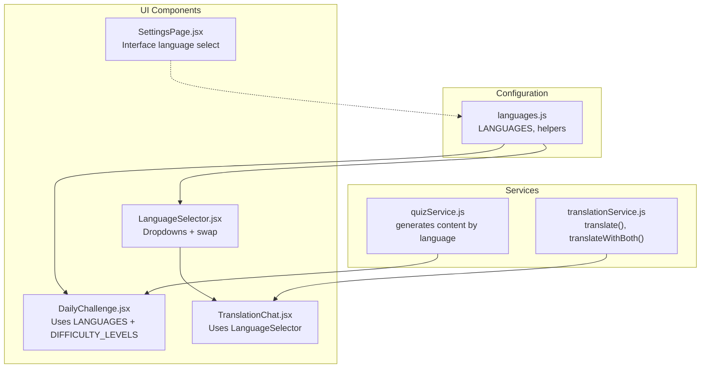
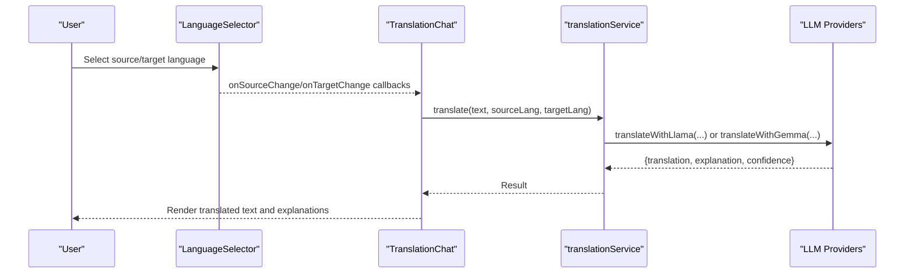
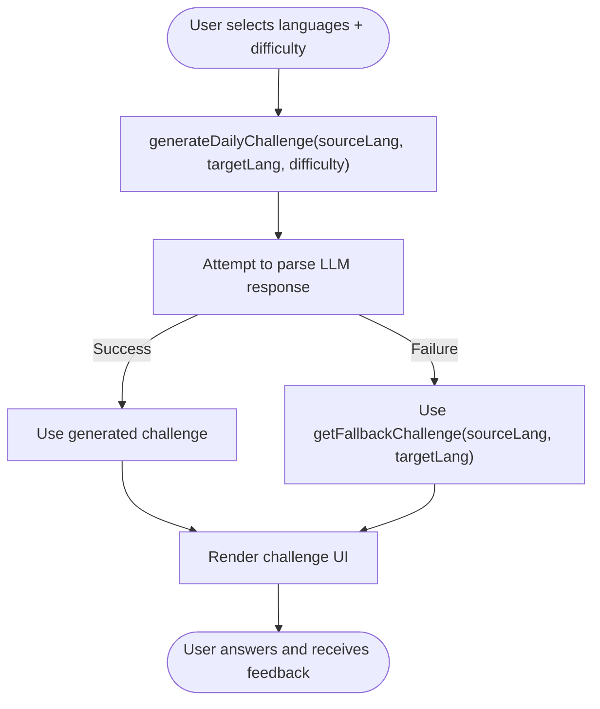
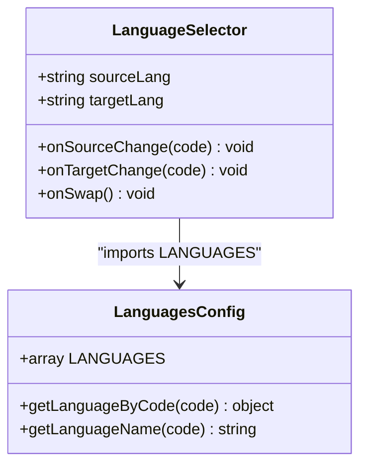
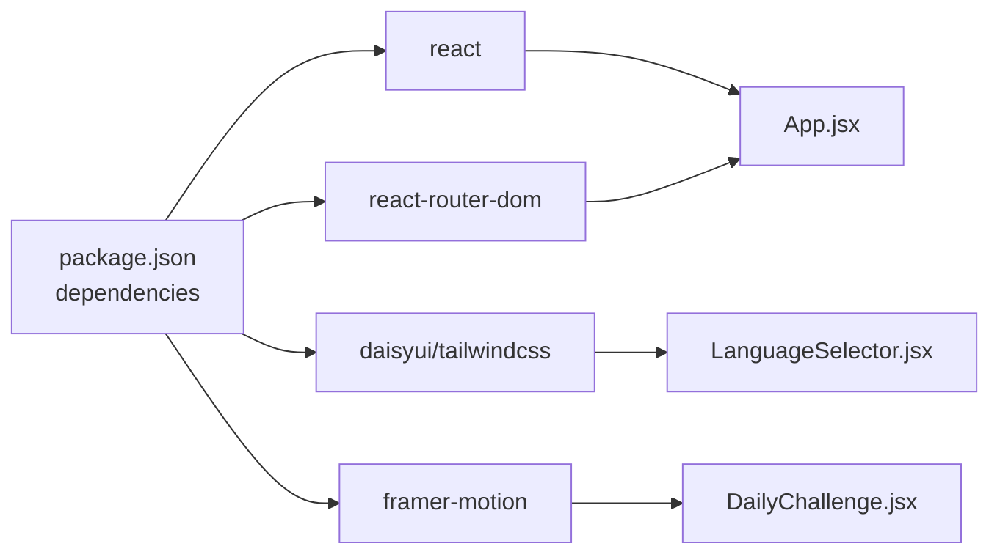

# Language Selection and Localization

<cite>
**Referenced Files in This Document**
- [LanguageSelector.jsx](file://src/components/LanguageSelector.jsx)
- [languages.js](file://src/config/languages.js)
- [TranslationChat.jsx](file://src/pages/chat/TranslationChat.jsx)
- [DailyChallenge.jsx](file://src/pages/games/DailyChallenge.jsx)
- [translationService.js](file://src/services/translationService.js)
- [quizService.js](file://src/services/quizService.js)
- [SettingsPage.jsx](file://src/pages/dashboard/SettingsPage.jsx)
- [AppLayout.jsx](file://src/layouts/AppLayout.jsx)
- [App.jsx](file://src/App.jsx)
- [package.json](file://package.json)
</cite>

## Table of Contents
1. [Introduction](#introduction)
2. [Project Structure](#project-structure)
3. [Core Components](#core-components)
4. [Architecture Overview](#architecture-overview)
5. [Detailed Component Analysis](#detailed-component-analysis)
6. [Dependency Analysis](#dependency-analysis)
7. [Performance Considerations](#performance-considerations)
8. [Troubleshooting Guide](#troubleshooting-guide)
9. [Conclusion](#conclusion)

## Introduction
This document explains the language selection and localization system in the Flinggo application. It covers the LanguageSelector component, the languages configuration, the internationalization workflow from user selection to UI updates, integration with AI translation services, and how language preferences influence content generation for learning materials and games. It also addresses accessibility considerations, right-to-left language support, character encoding, and guidelines for adding new languages while maintaining consistency and proper fallback handling.

## Project Structure
The language system spans three primary areas:
- Configuration: Centralized language metadata and helpers
- UI Components: LanguageSelector for interactive language choice
- Services: Translation and quiz services that consume language preferences

**Diagram sources**
- [languages.js:1-30](file://src/config/languages.js#L1-L30)
- [LanguageSelector.jsx:1-49](file://src/components/LanguageSelector.jsx#L1-L49)
- [DailyChallenge.jsx:1-249](file://src/pages/games/DailyChallenge.jsx#L1-L249)
- [TranslationChat.jsx:1-197](file://src/pages/chat/TranslationChat.jsx#L1-L197)
- [translationService.js:1-35](file://src/services/translationService.js#L1-L35)
- [quizService.js:70-153](file://src/services/quizService.js#L70-L153)
- [SettingsPage.jsx:1-122](file://src/pages/dashboard/SettingsPage.jsx#L1-L122)

**Section sources**
- [languages.js:1-30](file://src/config/languages.js#L1-L30)
- [LanguageSelector.jsx:1-49](file://src/components/LanguageSelector.jsx#L1-L49)
- [TranslationChat.jsx:1-197](file://src/pages/chat/TranslationChat.jsx#L1-L197)
- [DailyChallenge.jsx:1-249](file://src/pages/games/DailyChallenge.jsx#L1-L249)
- [translationService.js:1-35](file://src/services/translationService.js#L1-L35)
- [quizService.js:70-153](file://src/services/quizService.js#L70-L153)
- [SettingsPage.jsx:1-122](file://src/pages/dashboard/SettingsPage.jsx#L1-L122)
- [AppLayout.jsx:1-42](file://src/layouts/AppLayout.jsx#L1-L42)
- [App.jsx:1-50](file://src/App.jsx#L1-L50)

## Core Components
- LanguageSelector: Provides a compact UI with "From" and "To" language dropdowns and a swap button. It renders options from the centralized LANGUAGES array and enforces that target language differs from source.
- languages.js: Defines supported languages, emoji flags, lookup helpers, difficulty levels, XP rewards, and level calculation utilities.
- TranslationChat: Integrates LanguageSelector and uses translation services to generate localized content and explanations.
- DailyChallenge: Uses language and difficulty selections to generate localized quiz content and manage scoring.
- translationService.js: Bridges UI language codes to service calls by resolving human-readable names for LLM providers.
- quizService.js: Generates localized learning content and falls back to curated content when parsing fails.

Key implementation patterns:
- Controlled components: LanguageSelector props drive UI state; parent components manage state and pass callbacks.
- Centralized configuration: All language metadata resides in one module for consistency.
- Fallback handling: Services provide fallback content when external generation fails.

**Section sources**
- [LanguageSelector.jsx:1-49](file://src/components/LanguageSelector.jsx#L1-L49)
- [languages.js:1-30](file://src/config/languages.js#L1-L30)
- [TranslationChat.jsx:1-197](file://src/pages/chat/TranslationChat.jsx#L1-L197)
- [DailyChallenge.jsx:1-249](file://src/pages/games/DailyChallenge.jsx#L1-L249)
- [translationService.js:1-35](file://src/services/translationService.js#L1-L35)
- [quizService.js:70-153](file://src/services/quizService.js#L70-L153)

## Architecture Overview
The language selection workflow connects UI choices to content generation and service calls:

**Diagram sources**
- [LanguageSelector.jsx:1-49](file://src/components/LanguageSelector.jsx#L1-L49)
- [TranslationChat.jsx:1-197](file://src/pages/chat/TranslationChat.jsx#L1-L197)
- [translationService.js:1-35](file://src/services/translationService.js#L1-L35)

Additional flow for quiz content generation:

**Diagram sources**
- [DailyChallenge.jsx:1-249](file://src/pages/games/DailyChallenge.jsx#L1-L249)
- [quizService.js:70-153](file://src/services/quizService.js#L70-L153)

## Detailed Component Analysis

### LanguageSelector Component
The LanguageSelector component encapsulates:
- Dropdown rendering from LANGUAGES
- Controlled state via props (sourceLang, targetLang)
- Event handlers for changes and swapping
- Accessibility-friendly labels and concise layout

Implementation highlights:
- Option rendering includes emoji flags and language names
- Target dropdown filters out the current source language to prevent identical selections
- Swap button toggles source and target language codes

**Diagram sources**
- [LanguageSelector.jsx:1-49](file://src/components/LanguageSelector.jsx#L1-L49)
- [languages.js:1-30](file://src/config/languages.js#L1-L30)

**Section sources**
- [LanguageSelector.jsx:1-49](file://src/components/LanguageSelector.jsx#L1-L49)
- [languages.js:1-30](file://src/config/languages.js#L1-L30)

### languages.js Configuration
Structure and responsibilities:
- LANGUAGES: Array of language objects with code, name, and flag emoji
- Helpers: getLanguageByCode(code), getLanguageName(code)
- Difficulty levels and XP configuration for gamification
- Utility calcLevel(xp) for level computation

Usage patterns:
- UI dropdowns render LANGUAGES entries
- Services resolve human-readable names for provider calls
- Gamified components reference difficulty and XP constants

**Section sources**
- [languages.js:1-30](file://src/config/languages.js#L1-L30)

### TranslationChat Integration
Integration points:
- Maintains local state for sourceLang, targetLang, mode
- Passes state and callbacks to LanguageSelector
- Calls translationService.translate or translationService.translateWithBoth
- Displays results with model-specific metadata and explanations

Example paths:
- LanguageSelector usage: [TranslationChat.jsx:108-114](file://src/pages/chat/TranslationChat.jsx#L108-L114)
- Translation invocation: [TranslationChat.jsx:68-88](file://src/pages/chat/TranslationChat.jsx#L68-L88)
- Service implementation: [translationService.js:12-20](file://src/services/translationService.js#L12-L20)

**Section sources**
- [TranslationChat.jsx:1-197](file://src/pages/chat/TranslationChat.jsx#L1-L197)
- [translationService.js:1-35](file://src/services/translationService.js#L1-L35)

### DailyChallenge Integration
Integration points:
- Renders language and difficulty selectors
- Generates challenges using quizService.generateDailyChallenge
- Falls back to curated content when parsing fails
- Computes XP rewards based on difficulty

Example paths:
- Language selectors: [DailyChallenge.jsx:111-119](file://src/pages/games/DailyChallenge.jsx#L111-L119)
- Difficulty buttons: [DailyChallenge.jsx:126-135](file://src/pages/games/DailyChallenge.jsx#L126-L135)
- Content generation: [DailyChallenge.jsx:30-44](file://src/pages/games/DailyChallenge.jsx#L30-L44)
- Fallback logic: [quizService.js:82-87](file://src/services/quizService.js#L82-L87)

**Section sources**
- [DailyChallenge.jsx:1-249](file://src/pages/games/DailyChallenge.jsx#L1-L249)
- [quizService.js:70-153](file://src/services/quizService.js#L70-L153)

### SettingsPage Language Preference
Current state:
- Interface language select exists but is not bound to application-wide state
- Suggests future enhancement to persist and apply language preference globally

Recommendations:
- Bind select to application state (context or localStorage)
- Apply locale to UI text and date/time formatting
- Integrate RTL detection and directionality for right-to-left languages

**Section sources**
- [SettingsPage.jsx:100-106](file://src/pages/dashboard/SettingsPage.jsx#L100-L106)

## Dependency Analysis
External dependencies relevant to internationalization:
- No dedicated i18n library is imported in the current codebase
- UI text is primarily static and does not dynamically switch locales
- Character encoding relies on standard UTF-8 handling in the browser

**Diagram sources**
- [package.json:11-30](file://package.json#L11-L30)
- [App.jsx:1-50](file://src/App.jsx#L1-L50)
- [LanguageSelector.jsx:1-49](file://src/components/LanguageSelector.jsx#L1-L49)
- [DailyChallenge.jsx:1-249](file://src/pages/games/DailyChallenge.jsx#L1-L249)

**Section sources**
- [package.json:11-30](file://package.json#L11-L30)
- [App.jsx:1-50](file://src/App.jsx#L1-L50)

## Performance Considerations
- LanguageSelector dropdowns filter options client-side; with larger language lists, consider virtualization or server-side filtering
- TranslationService calls are asynchronous; ensure loading states and cancellation where appropriate
- Quiz generation may involve network requests; cache results when feasible and implement retry with exponential backoff
- Avoid unnecessary re-renders by memoizing language option lists and derived values

## Troubleshooting Guide
Common issues and resolutions:
- Invalid language code: getLanguageByCode returns the first language by default; ensure all selections are validated against LANGUAGES
- Duplicate language selections: LanguageSelector prevents identical source and target; verify that swap logic maintains this constraint
- Translation errors: translationService wraps errors and surfaces messages; display user-friendly messages and enable retry
- Quiz parsing failures: quizService falls back to curated content; log failures for monitoring and improve prompts

Operational checks:
- Verify LANGUAGES array includes required entries before runtime
- Confirm translationService receives valid language codes and names
- Ensure quizService fallbacks are reachable and provide meaningful defaults

**Section sources**
- [languages.js:9-12](file://src/config/languages.js#L9-L12)
- [LanguageSelector.jsx:39-43](file://src/components/LanguageSelector.jsx#L39-L43)
- [translationService.js:12-20](file://src/services/translationService.js#L12-L20)
- [quizService.js:82-87](file://src/services/quizService.js#L82-L87)

## Conclusion
The language selection and localization system centers on a clean separation of concerns: a shared configuration module supplies language metadata, UI components present controlled language selection, and services convert user choices into provider calls and localized content. While the current implementation focuses on static UI text and provider-driven translations, the architecture supports future enhancements such as persistent language preferences, dynamic locale switching, and improved accessibility for right-to-left languages.