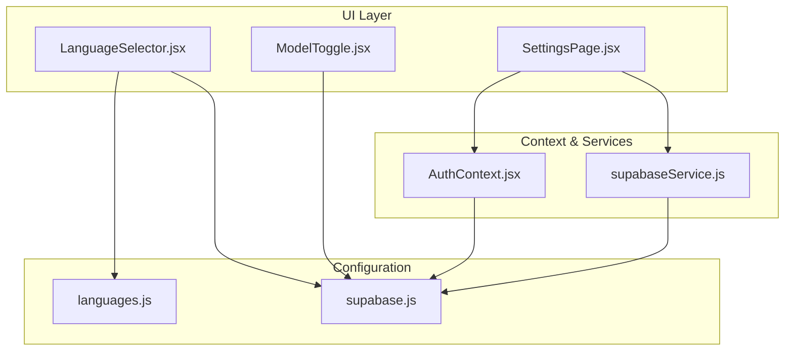
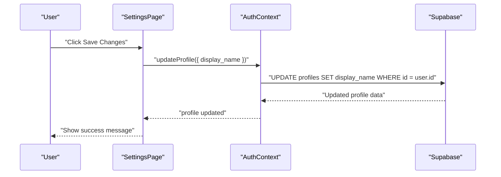
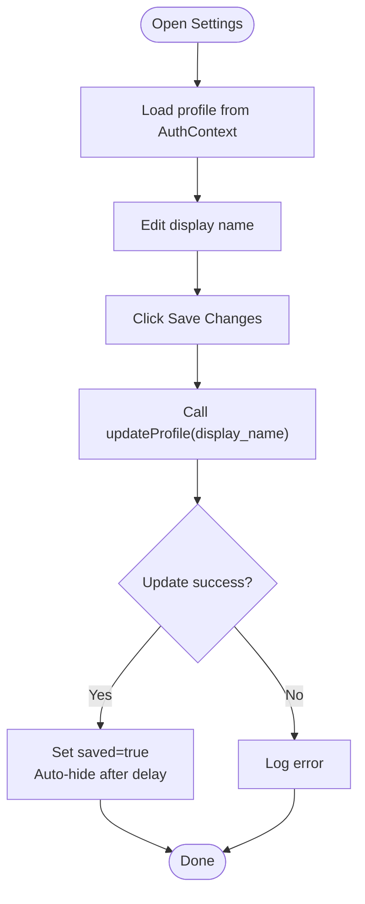
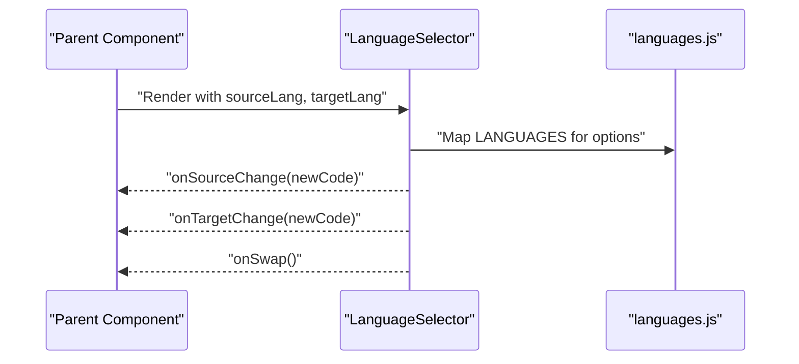
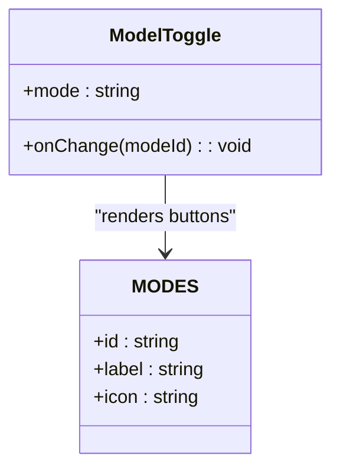
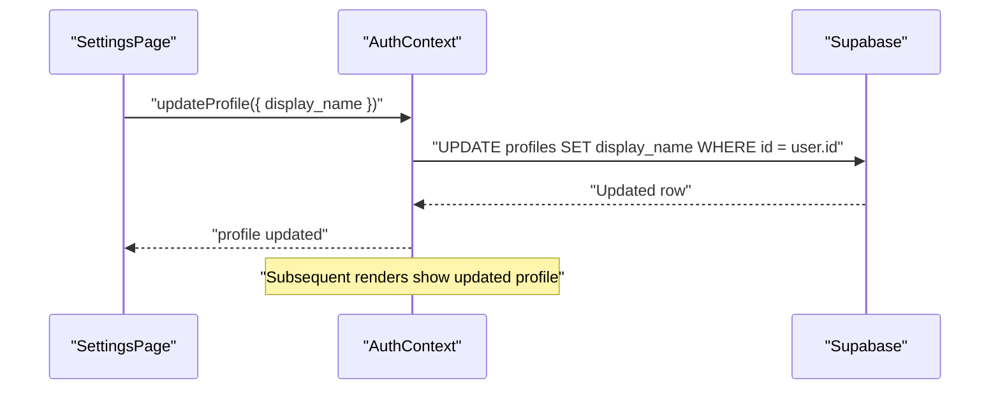
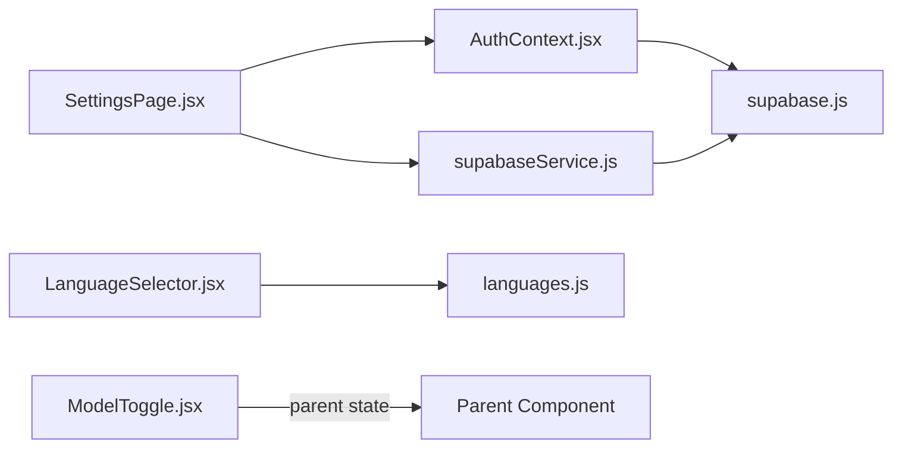

# Settings and Configuration

<cite>
**Referenced Files in This Document**
- [SettingsPage.jsx](file://src/pages/dashboard/SettingsPage.jsx)
- [LanguageSelector.jsx](file://src/components/LanguageSelector.jsx)
- [ModelToggle.jsx](file://src/components/ModelToggle.jsx)
- [languages.js](file://src/config/languages.js)
- [supabase.js](file://src/config/supabase.js)
- [AuthContext.jsx](file://src/contexts/AuthContext.jsx)
- [supabaseService.js](file://src/services/supabaseService.js)
- [DailyChallenge.jsx](file://src/pages/games/DailyChallenge.jsx)
</cite>

## Table of Contents
1. [Introduction](#introduction)
2. [Project Structure](#project-structure)
3. [Core Components](#core-components)
4. [Architecture Overview](#architecture-overview)
5. [Detailed Component Analysis](#detailed-component-analysis)
6. [Dependency Analysis](#dependency-analysis)
7. [Performance Considerations](#performance-considerations)
8. [Troubleshooting Guide](#troubleshooting-guide)
9. [Conclusion](#conclusion)
10. [Appendices](#appendices)

## Introduction
This document explains the settings and configuration system, focusing on user preferences management, language selection functionality, and model configuration options. It documents how SettingsPage stores and retrieves user preferences, how LanguageSelector enables multi-language support, and how ModelToggle controls AI model selection. It also covers the configuration system including supported languages and authentication settings, integration with user profiles, preference persistence across sessions, default settings, validation rules, and UX considerations. Guidance is included for extending configuration options and adding new languages while maintaining system consistency.

## Project Structure
The settings and configuration system spans several areas:
- UI settings page for profile and preferences
- Language selector component backed by a centralized language registry
- Model toggle component for choosing AI models
- Authentication and profile management via Supabase
- Centralized configuration for languages and Supabase client initialization

**Diagram sources**
- [SettingsPage.jsx:1-122](file://src/pages/dashboard/SettingsPage.jsx#L1-L122)
- [LanguageSelector.jsx:1-49](file://src/components/LanguageSelector.jsx#L1-L49)
- [ModelToggle.jsx:1-25](file://src/components/ModelToggle.jsx#L1-L25)
- [languages.js:1-30](file://src/config/languages.js#L1-L30)
- [supabase.js:1-7](file://src/config/supabase.js#L1-L7)
- [AuthContext.jsx:1-101](file://src/contexts/AuthContext.jsx#L1-L101)
- [supabaseService.js:1-132](file://src/services/supabaseService.js#L1-L132)

**Section sources**
- [SettingsPage.jsx:1-122](file://src/pages/dashboard/SettingsPage.jsx#L1-L122)
- [languages.js:1-30](file://src/config/languages.js#L1-L30)
- [supabase.js:1-7](file://src/config/supabase.js#L1-L7)
- [AuthContext.jsx:1-101](file://src/contexts/AuthContext.jsx#L1-L101)
- [supabaseService.js:1-132](file://src/services/supabaseService.js#L1-L132)

## Core Components
- SettingsPage: Presents profile editing and preferences UI, persists display name via updateProfile, and handles sign-out navigation.
- LanguageSelector: Provides a dual-select interface for source/target languages with swap capability, powered by the shared language registry.
- ModelToggle: Offers a compact model selection UI for choosing between Llama, Gemma, or comparison modes.
- languages.js: Central registry for supported languages, language helpers, difficulty levels, XP rewards, and level calculation.
- supabase.js: Initializes the Supabase client using environment variables.
- AuthContext: Manages authentication state, profile retrieval, and profile updates.
- supabaseService.js: Encapsulates Supabase queries and mutations for profiles, translations, quizzes, progress, challenges, and leaderboard.

**Section sources**
- [SettingsPage.jsx:5-28](file://src/pages/dashboard/SettingsPage.jsx#L5-L28)
- [LanguageSelector.jsx:3-47](file://src/components/LanguageSelector.jsx#L3-L47)
- [ModelToggle.jsx:7-23](file://src/components/ModelToggle.jsx#L7-L23)
- [languages.js:1-30](file://src/config/languages.js#L1-L30)
- [supabase.js:3-6](file://src/config/supabase.js#L3-L6)
- [AuthContext.jsx:32-84](file://src/contexts/AuthContext.jsx#L32-L84)
- [supabaseService.js:123-131](file://src/services/supabaseService.js#L123-L131)

## Architecture Overview
The configuration system integrates UI components with centralized configuration and backend persistence:
- UI components read and write preferences through React state and context hooks.
- LanguageSelector relies on languages.js for language metadata.
- SettingsPage uses AuthContext to update the user profile in Supabase.
- ModelToggle communicates model choices to parent components for downstream actions.
- Supabase client initialization is handled centrally via supabase.js.

**Diagram sources**
- [SettingsPage.jsx:12-23](file://src/pages/dashboard/SettingsPage.jsx#L12-L23)
- [AuthContext.jsx:74-84](file://src/contexts/AuthContext.jsx#L74-L84)

## Detailed Component Analysis

### SettingsPage Implementation
SettingsPage manages:
- Display name editing with immediate local state and server sync via updateProfile.
- Persistence feedback with saved state and saving spinner.
- Navigation after sign-out.

**Diagram sources**
- [SettingsPage.jsx:8-23](file://src/pages/dashboard/SettingsPage.jsx#L8-L23)
- [AuthContext.jsx:74-84](file://src/contexts/AuthContext.jsx#L74-L84)

**Section sources**
- [SettingsPage.jsx:5-28](file://src/pages/dashboard/SettingsPage.jsx#L5-L28)
- [AuthContext.jsx:74-84](file://src/contexts/AuthContext.jsx#L74-L84)

### Language Selection Functionality
LanguageSelector provides:
- Dual dropdowns for source and target languages.
- Language filtering so target cannot equal source.
- Swap action to exchange selections.
- Flag and name rendering from languages.js.

**Diagram sources**
- [LanguageSelector.jsx:3-47](file://src/components/LanguageSelector.jsx#L3-L47)
- [languages.js:1-7](file://src/config/languages.js#L1-L7)

Concrete examples from the codebase:
- Language options rendering and filtering in LanguageSelector: [LanguageSelector.jsx:14-43](file://src/components/LanguageSelector.jsx#L14-L43)
- Supported languages registry: [languages.js:1-7](file://src/config/languages.js#L1-L7)
- Example usage in Daily Challenge page: [DailyChallenge.jsx:109-121](file://src/pages/games/DailyChallenge.jsx#L109-L121)

**Section sources**
- [LanguageSelector.jsx:3-47](file://src/components/LanguageSelector.jsx#L3-L47)
- [languages.js:1-7](file://src/config/languages.js#L1-L7)
- [DailyChallenge.jsx:109-121](file://src/pages/games/DailyChallenge.jsx#L109-L121)

### Model Configuration Options
ModelToggle offers:
- Three modes: Llama, Gemma, Compare Both.
- Visual indication of the active mode.
- Icon and label rendering for clarity.

**Diagram sources**
- [ModelToggle.jsx:7-23](file://src/components/ModelToggle.jsx#L7-L23)

Concrete examples from the codebase:
- Mode definitions and rendering: [ModelToggle.jsx:1-5](file://src/components/ModelToggle.jsx#L1-L5), [ModelToggle.jsx:10-22](file://src/components/ModelToggle.jsx#L10-L22)

**Section sources**
- [ModelToggle.jsx:1-25](file://src/components/ModelToggle.jsx#L1-L25)

### Configuration System Details
- Supported languages and helpers: [languages.js:1-30](file://src/config/languages.js#L1-L30)
- Supabase client initialization: [supabase.js:3-6](file://src/config/supabase.js#L3-L6)
- Authentication and profile management: [AuthContext.jsx:32-84](file://src/contexts/AuthContext.jsx#L32-L84)
- Profile retrieval and updates: [supabaseService.js:123-131](file://src/services/supabaseService.js#L123-L131)

Default settings and UX considerations:
- SettingsPage defaults display name from profile and disables username/email edits.
- Preferences section includes toggles with default checked states.
- Language selector filters out the source language from the target list.

Validation rules:
- LanguageSelector prevents identical source and target languages.
- SettingsPage saves only display_name updates via updateProfile.

**Section sources**
- [SettingsPage.jsx:38-67](file://src/pages/dashboard/SettingsPage.jsx#L38-L67)
- [SettingsPage.jsx:86-106](file://src/pages/dashboard/SettingsPage.jsx#L86-L106)
- [LanguageSelector.jsx:39-43](file://src/components/LanguageSelector.jsx#L39-L43)
- [AuthContext.jsx:74-84](file://src/contexts/AuthContext.jsx#L74-L84)

### Preference Persistence Across Sessions
- AuthContext fetches and updates profile data, ensuring preferences persist across sessions.
- SettingsPage triggers updateProfile which refreshes the context’s profile state.

**Diagram sources**
- [SettingsPage.jsx:12-23](file://src/pages/dashboard/SettingsPage.jsx#L12-L23)
- [AuthContext.jsx:74-84](file://src/contexts/AuthContext.jsx#L74-L84)

**Section sources**
- [AuthContext.jsx:32-40](file://src/contexts/AuthContext.jsx#L32-L40)
- [AuthContext.jsx:74-84](file://src/contexts/AuthContext.jsx#L74-L84)

## Dependency Analysis
- SettingsPage depends on AuthContext for profile data and updateProfile.
- LanguageSelector depends on languages.js for language metadata.
- ModelToggle is self-contained but integrates with parent components’ state.
- Supabase client initialization is centralized in supabase.js and consumed by AuthContext and services.

**Diagram sources**
- [SettingsPage.jsx:2-6](file://src/pages/dashboard/SettingsPage.jsx#L2-L6)
- [LanguageSelector.jsx:1](file://src/components/LanguageSelector.jsx#L1)
- [ModelToggle.jsx:7](file://src/components/ModelToggle.jsx#L7)
- [languages.js:1](file://src/config/languages.js#L1)
- [supabase.js:1](file://src/config/supabase.js#L1)
- [AuthContext.jsx:2](file://src/contexts/AuthContext.jsx#L2)
- [supabaseService.js:1](file://src/services/supabaseService.js#L1)

**Section sources**
- [SettingsPage.jsx:1-3](file://src/pages/dashboard/SettingsPage.jsx#L1-L3)
- [LanguageSelector.jsx:1](file://src/components/LanguageSelector.jsx#L1)
- [ModelToggle.jsx:7](file://src/components/ModelToggle.jsx#L7)
- [languages.js:1](file://src/config/languages.js#L1)
- [supabase.js:1](file://src/config/supabase.js#L1)
- [AuthContext.jsx:2](file://src/contexts/AuthContext.jsx#L2)
- [supabaseService.js:1](file://src/services/supabaseService.js#L1)

## Performance Considerations
- Minimize re-renders by keeping preference updates scoped to necessary components.
- Debounce frequent updates if additional preferences are introduced.
- Use filtered language lists efficiently; current filtering is O(n) per render, acceptable for small language sets.

## Troubleshooting Guide
Common issues and resolutions:
- Profile updates fail silently: Verify updateProfile is called with a logged-in user and inspect Supabase errors.
- Language swap does not work: Ensure onSwap handler is passed and invoked correctly in the parent component.
- Model toggle state not reflected: Confirm the parent component updates mode state and passes it to ModelToggle.

**Section sources**
- [AuthContext.jsx:74-84](file://src/contexts/AuthContext.jsx#L74-L84)
- [LanguageSelector.jsx:23-29](file://src/components/LanguageSelector.jsx#L23-L29)
- [ModelToggle.jsx:16](file://src/components/ModelToggle.jsx#L16)

## Conclusion
The settings and configuration system combines a clean UI layer with centralized configuration and robust backend persistence. SettingsPage focuses on profile updates, LanguageSelector ensures coherent language selection, and ModelToggle simplifies model choice. The system leverages Supabase for authentication and data consistency, with clear extension points for new preferences and languages.

## Appendices

### Adding New Configuration Options
Steps to add a new preference:
1. Extend the preferences section in SettingsPage with appropriate inputs and state.
2. Add a mutation/update function in supabaseService.js if persistence is required.
3. Update AuthContext to expose a method for updating the new field.
4. Wire SettingsPage to call the update function and reflect changes in UI.

Guidance:
- Keep defaults explicit and validated before saving.
- Use existing patterns for loading states and success/error feedback.
- Ensure backward compatibility if migrating legacy preferences.

### Extending Language Support
Steps to add a new language:
1. Add a new entry to the LANGUAGES array in languages.js with code, name, and flag.
2. Verify LanguageSelector renders the new option and filtering remains intact.
3. Confirm usage sites (e.g., DailyChallenge) render the new language option.

Validation checklist:
- Code uniqueness and correctness.
- Flag renders properly in UI.
- Filtering prevents selecting the same language for source and target.

**Section sources**
- [languages.js:1-7](file://src/config/languages.js#L1-L7)
- [LanguageSelector.jsx:14-18](file://src/components/LanguageSelector.jsx#L14-L18)
- [DailyChallenge.jsx:112](file://src/pages/games/DailyChallenge.jsx#L112)