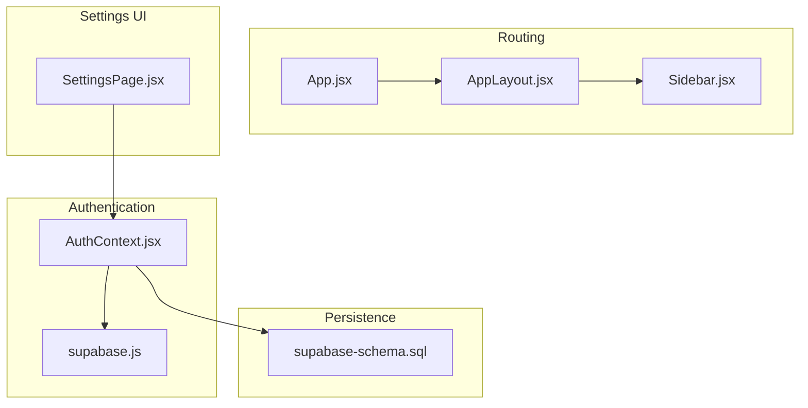
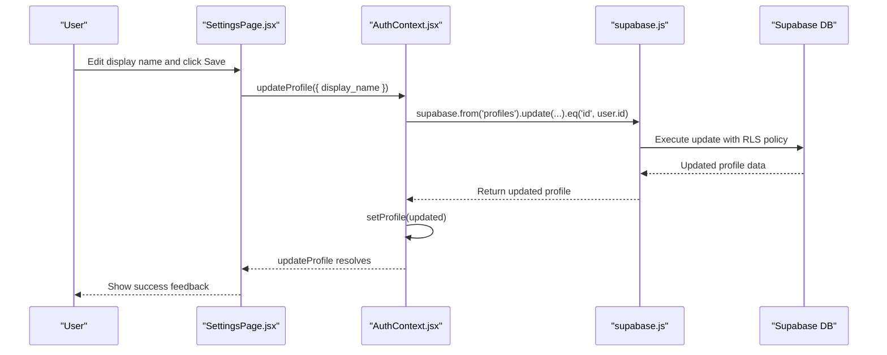
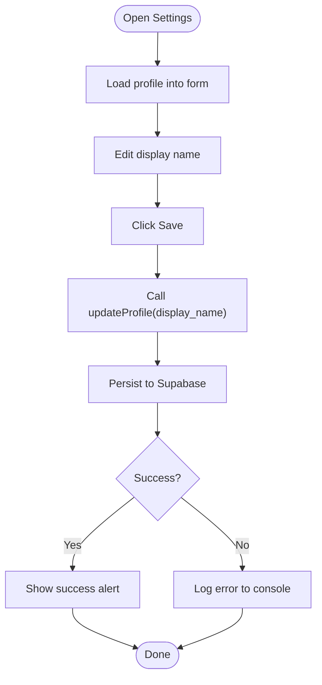
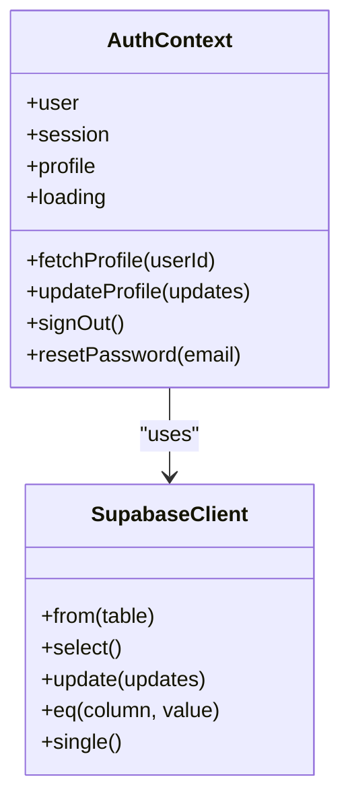
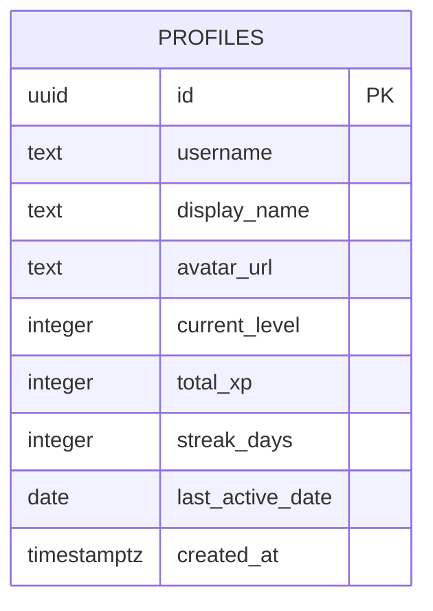
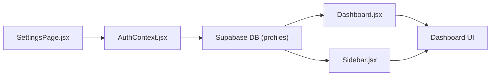
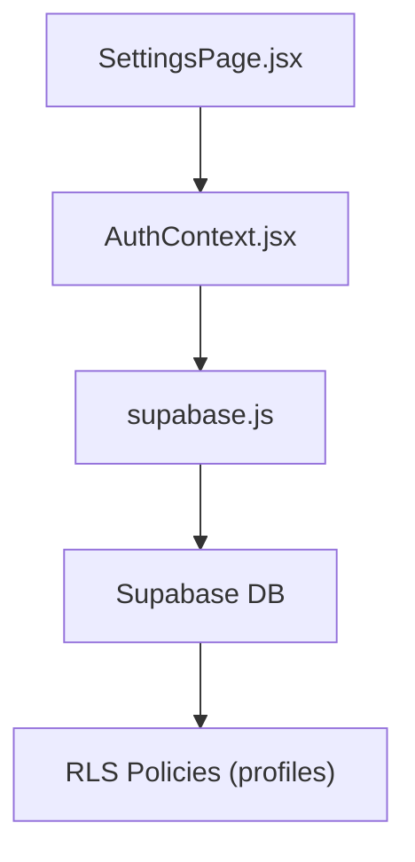
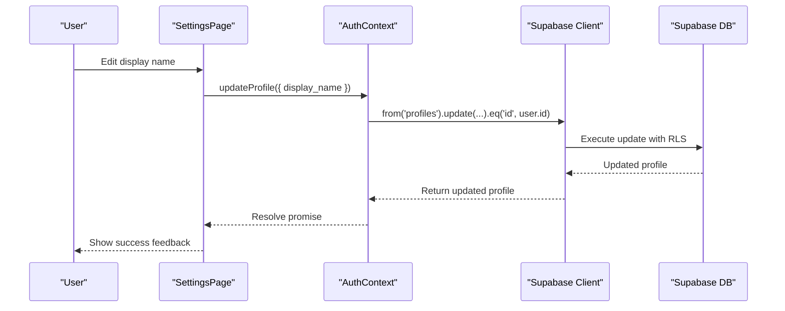

# User Preferences and Account Settings

<cite>
**Referenced Files in This Document**
- [SettingsPage.jsx](file://src/pages/dashboard/SettingsPage.jsx)
- [AuthContext.jsx](file://src/contexts/AuthContext.jsx)
- [supabase.js](file://src/config/supabase.js)
- [supabaseService.js](file://src/services/supabaseService.js)
- [supabase-schema.sql](file://supabase-schema.sql)
- [App.jsx](file://src/App.jsx)
- [AppLayout.jsx](file://src/layouts/AppLayout.jsx)
- [Sidebar.jsx](file://src/components/Sidebar.jsx)
- [Dashboard.jsx](file://src/pages/dashboard/Dashboard.jsx)
- [OtherPages.jsx](file://src/pages/OtherPages.jsx)
</cite>

## Table of Contents
1. [Introduction](#introduction)
2. [Project Structure](#project-structure)
3. [Core Components](#core-components)
4. [Architecture Overview](#architecture-overview)
5. [Detailed Component Analysis](#detailed-component-analysis)
6. [Dependency Analysis](#dependency-analysis)
7. [Performance Considerations](#performance-considerations)
8. [Troubleshooting Guide](#troubleshooting-guide)
9. [Conclusion](#conclusion)
10. [Appendices](#appendices)

## Introduction
This document explains how user preferences and account settings are implemented in the application, focusing on the SettingsPage, authentication integration, and Supabase-backed persistence. It covers form controls, validation, data persistence, and the end-to-end flow from UI interactions to database updates and vice versa. It also documents how preferences influence dashboard display and game mechanics, and provides guidance for extending the settings interface with new preference categories while maintaining consistency with existing patterns.

## Project Structure
The settings feature spans several layers:
- Routing and layout: App routes protected pages under AppLayout, which hosts Sidebar and Topbar.
- Authentication: AuthContext manages session, profile, and profile updates.
- Settings UI: SettingsPage renders profile editing and preferences, and triggers updates via AuthContext.
- Persistence: Supabase client configured in supabase.js; Supabase service utilities exist for other features; profile updates leverage Supabase RLS policies.

**Diagram sources**
- [App.jsx:19-49](file://src/App.jsx#L19-L49)
- [AppLayout.jsx:17-41](file://src/layouts/AppLayout.jsx#L17-L41)
- [Sidebar.jsx:19-121](file://src/components/Sidebar.jsx#L19-L121)
- [SettingsPage.jsx:5-28](file://src/pages/dashboard/SettingsPage.jsx#L5-L28)
- [AuthContext.jsx:6-94](file://src/contexts/AuthContext.jsx#L6-L94)
- [supabase.js:1-7](file://src/config/supabase.js#L1-L7)
- [supabase-schema.sql:4-25](file://supabase-schema.sql#L4-L25)

**Section sources**
- [App.jsx:19-49](file://src/App.jsx#L19-L49)
- [AppLayout.jsx:6-15](file://src/layouts/AppLayout.jsx#L6-L15)
- [Sidebar.jsx:5-17](file://src/components/Sidebar.jsx#L5-L17)
- [SettingsPage.jsx:5-28](file://src/pages/dashboard/SettingsPage.jsx#L5-L28)
- [AuthContext.jsx:6-94](file://src/contexts/AuthContext.jsx#L6-L94)
- [supabase.js:1-7](file://src/config/supabase.js#L1-L7)
- [supabase-schema.sql:4-25](file://supabase-schema.sql#L4-L25)

## Core Components
- SettingsPage: Renders profile editing and preferences, handles saving and sign-out.
- AuthContext: Provides profile data, exposes updateProfile and signOut, and fetches profile on auth state change.
- Supabase client: Configured in supabase.js; used by AuthContext for profile updates and RLS enforcement.
- Supabase schema: Defines profiles table and RLS policies for profile updates.

Key responsibilities:
- SettingsPage: Form controls for display name, preferences toggles, and language selection; user feedback on save; sign-out action.
- AuthContext: Centralizes profile state, fetches profile on auth events, persists profile updates via Supabase, and exposes signOut.
- Supabase: Enforces row-level security so users can only update their own profile.

**Section sources**
- [SettingsPage.jsx:5-28](file://src/pages/dashboard/SettingsPage.jsx#L5-L28)
- [AuthContext.jsx:32-84](file://src/contexts/AuthContext.jsx#L32-L84)
- [supabase.js:1-7](file://src/config/supabase.js#L1-L7)
- [supabase-schema.sql:4-25](file://supabase-schema.sql#L4-L25)

## Architecture Overview
The settings feature follows a clean separation of concerns:
- UI layer (SettingsPage) binds form state to local state and calls AuthContext methods.
- Business logic layer (AuthContext) encapsulates Supabase interactions and profile state synchronization.
- Persistence layer (Supabase) enforces RLS and stores profile data.

**Diagram sources**
- [SettingsPage.jsx:12-23](file://src/pages/dashboard/SettingsPage.jsx#L12-L23)
- [AuthContext.jsx:74-84](file://src/contexts/AuthContext.jsx#L74-L84)
- [supabase.js:1-7](file://src/config/supabase.js#L1-L7)
- [supabase-schema.sql:20-24](file://supabase-schema.sql#L20-L24)

## Detailed Component Analysis

### SettingsPage Implementation
SettingsPage is a controlled form that:
- Initializes display name from the current profile.
- Updates the profile via AuthContext.updateProfile on save.
- Provides user feedback via a success alert and loading spinner during save.
- Offers a sign-out action that navigates to the login page.

Form controls:
- Username: Disabled input showing immutable username.
- Display name: Editable input bound to local state.
- Email: Disabled input showing profile identifier.
- Preferences: Placeholder toggles and language selector for future persistence.
- Danger zone: Sign-out button.

Validation and feedback:
- Local validation is minimal; the primary validation occurs server-side via Supabase RLS.
- On successful save, a success alert appears briefly; errors are logged to console.

Data persistence:
- Uses AuthContext.updateProfile to persist display_name to the profiles table.

**Diagram sources**
- [SettingsPage.jsx:8-23](file://src/pages/dashboard/SettingsPage.jsx#L8-L23)
- [AuthContext.jsx:74-84](file://src/contexts/AuthContext.jsx#L74-L84)

**Section sources**
- [SettingsPage.jsx:5-122](file://src/pages/dashboard/SettingsPage.jsx#L5-L122)

### Authentication Context and Profile Updates
AuthContext manages:
- Session and profile lifecycle, fetching profile on auth state changes.
- Profile updates via Supabase with RLS enforcement.
- Sign-out and password reset helpers.

Profile update flow:
- updateProfile constructs an update payload and calls supabase.from("profiles").update(...).eq("id", user.id).
- On success, the updated profile replaces the cached profile state.

RLS policies:
- Users can update their own profile because the policy checks auth.uid() equals the profile id.

**Diagram sources**
- [AuthContext.jsx:32-84](file://src/contexts/AuthContext.jsx#L32-L84)
- [supabase.js:1-7](file://src/config/supabase.js#L1-L7)

**Section sources**
- [AuthContext.jsx:6-94](file://src/contexts/AuthContext.jsx#L6-L94)
- [supabase-schema.sql:20-24](file://supabase-schema.sql#L20-L24)

### Supabase Integration and Data Model
Supabase client is initialized with environment variables and used by AuthContext for profile operations. The profiles table and RLS policies ensure that:
- Only the owning user can update their profile.
- Profile data includes identifiers and metrics used across the app (e.g., display_name used in Sidebar and Dashboard).

**Diagram sources**
- [supabase-schema.sql:4-15](file://supabase-schema.sql#L4-L15)

**Section sources**
- [supabase.js:1-7](file://src/config/supabase.js#L1-L7)
- [supabase-schema.sql:4-15](file://supabase-schema.sql#L4-L15)

### Relationship Between Settings and System Components
- Dashboard display: The dashboard reads profile.display_name to greet the user and show stats. Updating display_name in SettingsPage affects the greeting and sidebar user info.
- Sidebar user info: The sidebar displays the user’s initials and level, derived from profile data. SettingsPage updates are reflected here after refresh.
- Game mechanics: While SettingsPage currently focuses on profile display_name, the profile table holds XP and streak metrics that drive game mechanics (e.g., streak banners).

**Diagram sources**
- [SettingsPage.jsx:12-23](file://src/pages/dashboard/SettingsPage.jsx#L12-L23)
- [AuthContext.jsx:74-84](file://src/contexts/AuthContext.jsx#L74-L84)
- [Dashboard.jsx:25](file://src/pages/dashboard/Dashboard.jsx#L25)
- [Sidebar.jsx:25](file://src/components/Sidebar.jsx#L25)

**Section sources**
- [Dashboard.jsx:25](file://src/pages/dashboard/Dashboard.jsx#L25)
- [Sidebar.jsx:25](file://src/components/Sidebar.jsx#L25)

### Extending Settings with New Preference Categories
Guidance for adding new preferences while maintaining consistency:
- Add form controls in SettingsPage with controlled state.
- Extend updateProfile to accept new preference fields; ensure they map to the profiles table or a dedicated preferences table.
- For toggles and selects, bind to local state and pass to updateProfile on save.
- For multi-language support, consider storing locale in profile or a separate preferences table and reading it in AppLayout for theme and content localization.
- Ensure RLS policies allow updates for the new fields; if stored in profiles, rely on existing policies; otherwise, define appropriate policies.

Example categories to consider:
- Display settings: Dark/light theme toggle (already present in AppLayout), language selection.
- Notification preferences: Daily challenge notifications, streak reminders.
- Account security: Password reset, two-factor authentication (if enabled), and account deletion flows.

**Section sources**
- [SettingsPage.jsx:81-108](file://src/pages/dashboard/SettingsPage.jsx#L81-L108)
- [AppLayout.jsx:18-28](file://src/layouts/AppLayout.jsx#L18-L28)
- [supabase-schema.sql:4-15](file://supabase-schema.sql#L4-L15)

## Dependency Analysis
SettingsPage depends on:
- AuthContext for profile data and updateProfile.
- React Router for navigation on sign-out.

AuthContext depends on:
- Supabase client for profile operations.
- Supabase RLS policies for security.

**Diagram sources**
- [SettingsPage.jsx:6](file://src/pages/dashboard/SettingsPage.jsx#L6)
- [AuthContext.jsx:2](file://src/contexts/AuthContext.jsx#L2)
- [supabase.js:1-7](file://src/config/supabase.js#L1-L7)
- [supabase-schema.sql:20-24](file://supabase-schema.sql#L20-L24)

**Section sources**
- [SettingsPage.jsx:6](file://src/pages/dashboard/SettingsPage.jsx#L6)
- [AuthContext.jsx:2](file://src/contexts/AuthContext.jsx#L2)
- [supabase.js:1-7](file://src/config/supabase.js#L1-L7)
- [supabase-schema.sql:20-24](file://supabase-schema.sql#L20-L24)

## Performance Considerations
- Minimize re-renders: Keep SettingsPage state minimal and only update when necessary.
- Debounce saves: For frequent preference toggles, consider debouncing updateProfile calls to reduce network requests.
- Local caching: AuthContext already caches profile; avoid unnecessary fetches by relying on the cached state.
- RLS overhead: Supabase RLS adds minimal overhead; ensure queries remain simple and indexed appropriately.

## Troubleshooting Guide
Common issues and resolutions:
- Save fails silently: Ensure updateProfile is awaited and handle errors. SettingsPage logs errors to the console; add user-facing error messages if needed.
- Profile not updating in UI: Verify that AuthContext.setProfile is invoked with the returned data after updateProfile completes.
- RLS prevents updates: Confirm the user is authenticated and the policy auth.uid() = id matches the current user id.
- Navigation after sign-out: Ensure signOut clears session and redirects to login route.

**Section sources**
- [SettingsPage.jsx:12-23](file://src/pages/dashboard/SettingsPage.jsx#L12-L23)
- [AuthContext.jsx:74-84](file://src/contexts/AuthContext.jsx#L74-L84)

## Conclusion
The settings feature integrates cleanly with the authentication and persistence layers. SettingsPage provides a focused UI for profile editing and placeholders for preferences, while AuthContext centralizes profile updates and RLS enforcement. The dashboard and sidebar reflect profile changes immediately, and the architecture supports extension with new preference categories following established patterns.

## Appendices

### UI Interaction to Database Update Flow

**Diagram sources**
- [SettingsPage.jsx:12-23](file://src/pages/dashboard/SettingsPage.jsx#L12-L23)
- [AuthContext.jsx:74-84](file://src/contexts/AuthContext.jsx#L74-L84)

### Example Preference Categories
- Display settings: Theme toggle (already present), language selection.
- Notification preferences: Daily challenge notifications, streak reminders.
- Account security: Password reset flow (via AuthContext), sign-out.

**Section sources**
- [SettingsPage.jsx:81-108](file://src/pages/dashboard/SettingsPage.jsx#L81-L108)
- [AppLayout.jsx:18-28](file://src/layouts/AppLayout.jsx#L18-L28)
- [AuthContext.jsx:64-72](file://src/contexts/AuthContext.jsx#L64-L72)