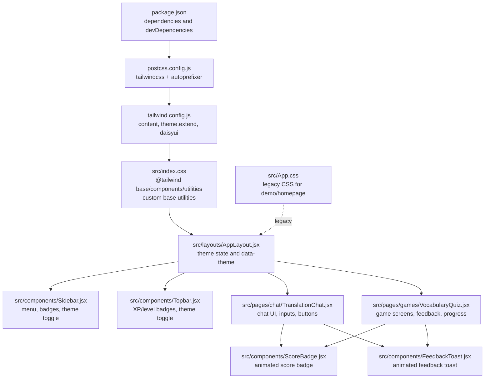
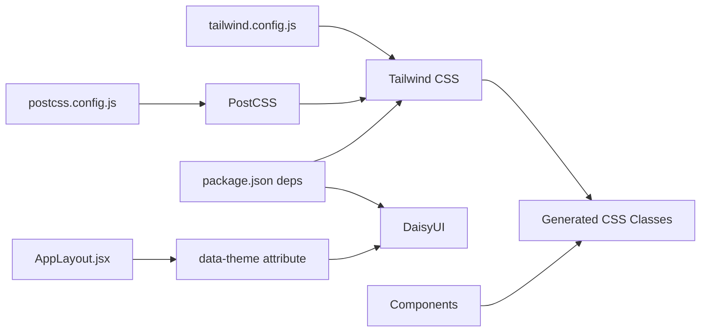

# Styling and Theming

<cite>
**Referenced Files in This Document**
- [tailwind.config.js](file://tailwind.config.js)
- [index.css](file://src/index.css)
- [App.css](file://src/App.css)
- [postcss.config.js](file://postcss.config.js)
- [package.json](file://package.json)
- [AppLayout.jsx](file://src/layouts/AppLayout.jsx)
- [Sidebar.jsx](file://src/components/Sidebar.jsx)
- [Topbar.jsx](file://src/components/Topbar.jsx)
- [ModelToggle.jsx](file://src/components/ModelToggle.jsx)
- [TranslationChat.jsx](file://src/pages/chat/TranslationChat.jsx)
- [VocabularyQuiz.jsx](file://src/pages/games/VocabularyQuiz.jsx)
- [Dashboard.jsx](file://src/pages/dashboard/Dashboard.jsx)
- [ScoreBadge.jsx](file://src/components/ScoreBadge.jsx)
- [FeedbackToast.jsx](file://src/components/FeedbackToast.jsx)
</cite>

## Table of Contents
1. [Introduction](#introduction)
2. [Project Structure](#project-structure)
3. [Core Components](#core-components)
4. [Architecture Overview](#architecture-overview)
5. [Detailed Component Analysis](#detailed-component-analysis)
6. [Dependency Analysis](#dependency-analysis)
7. [Performance Considerations](#performance-considerations)
8. [Accessibility and Responsive Design](#accessibility-and-responsive-design)
9. [Troubleshooting Guide](#troubleshooting-guide)
10. [Conclusion](#conclusion)
11. [Appendices](#appendices)

## Introduction
This document explains the styling and theming system used across the application. It covers Tailwind CSS configuration, the custom theme and dark/light modes, global styles, utility class usage, and responsive design patterns. It also documents component styling conventions, CSS-in-JS patterns via Framer Motion, and strategies for maintaining visual consistency at scale.

## Project Structure
The styling pipeline is built around Tailwind CSS with PostCSS and DaisyUI. Global base styles and custom utilities are defined in the application’s CSS entry, while theme tokens and DaisyUI presets are configured centrally. Layout components orchestrate theme state and apply design tokens consistently across pages and components.



**Diagram sources**
- [package.json:11-30](file://package.json#L11-L30)
- [postcss.config.js:1-7](file://postcss.config.js#L1-L7)
- [tailwind.config.js:1-66](file://tailwind.config.js#L1-L66)
- [index.css:1-14](file://src/index.css#L1-L14)
- [App.css:1-185](file://src/App.css#L1-L185)
- [AppLayout.jsx:17-41](file://src/layouts/AppLayout.jsx#L17-L41)
- [Sidebar.jsx:36-121](file://src/components/Sidebar.jsx#L36-L121)
- [Topbar.jsx:12-56](file://src/components/Topbar.jsx#L12-L56)
- [TranslationChat.jsx:103-196](file://src/pages/chat/TranslationChat.jsx#L103-L196)
- [VocabularyQuiz.jsx:9-214](file://src/pages/games/VocabularyQuiz.jsx#L9-L214)
- [ScoreBadge.jsx:3-37](file://src/components/ScoreBadge.jsx#L3-L37)
- [FeedbackToast.jsx:4-39](file://src/components/FeedbackToast.jsx#L4-L39)

**Section sources**
- [package.json:11-30](file://package.json#L11-L30)
- [postcss.config.js:1-7](file://postcss.config.js#L1-L7)
- [tailwind.config.js:1-66](file://tailwind.config.js#L1-L66)
- [index.css:1-14](file://src/index.css#L1-L14)
- [App.css:1-185](file://src/App.css#L1-L185)

## Core Components
- Tailwind configuration defines content scanning, theme extension for brand colors, and DaisyUI with two custom themes and defaults.
- Global CSS sets base fonts and adds a thin scrollbar utility.
- Layout orchestrates theme persistence and applies the active theme via a data attribute.
- Components consistently use DaisyUI semantic tokens (e.g., base-*, primary, secondary, success, error) and Tailwind utilities for spacing, typography, and interactivity.

Key styling conventions observed:
- Semantic tokens: Use base-* for backgrounds, borders, and content; primary/secondary/accent for emphasis and actions.
- Utility-first: Combine spacing, sizing, typography, and state utilities directly on JSX elements.
- DaisyUI components: Buttons, inputs, cards, alerts, and badges are used extensively for consistent UI.
- Responsive grids and breakpoints: md:grid-cols-* and similar variants appear across components.

**Section sources**
- [tailwind.config.js:4-18](file://tailwind.config.js#L4-L18)
- [tailwind.config.js:20-64](file://tailwind.config.js#L20-L64)
- [index.css:5-13](file://src/index.css#L5-L13)
- [AppLayout.jsx:18-31](file://src/layouts/AppLayout.jsx#L18-L31)
- [Sidebar.jsx:36-121](file://src/components/Sidebar.jsx#L36-L121)
- [Topbar.jsx:12-56](file://src/components/Topbar.jsx#L12-L56)
- [TranslationChat.jsx:103-196](file://src/pages/chat/TranslationChat.jsx#L103-L196)
- [VocabularyQuiz.jsx:9-214](file://src/pages/games/VocabularyQuiz.jsx#L9-L214)

## Architecture Overview
The theming architecture centers on a single source of truth for theme selection and propagation. The layout component manages theme state, persists it to local storage, and applies the appropriate DaisyUI theme via a data attribute. Components consume DaisyUI tokens and Tailwind utilities to render consistent visuals across light and dark palettes.

```mermaid
sequenceDiagram
participant U as "User"
participant L as "AppLayout"
participant S as "Sidebar"
participant T as "Topbar"
U->>L : Toggle theme preference
L->>L : Update state and persist to localStorage
L->>L : Compute theme name ("flingo" or "flingo-dark")
L->>S : Pass isDark, setIsDark props
L->>T : Pass isDark, setIsDark props
S->>S : Render theme toggle UI
T->>T : Render theme toggle UI
L->>L : Apply data-theme attribute on container
Note over L,S,T : DaisyUI reads data-theme and applies palette
```

**Diagram sources**
- [AppLayout.jsx:17-41](file://src/layouts/AppLayout.jsx#L17-L41)
- [Sidebar.jsx:19-102](file://src/components/Sidebar.jsx#L19-L102)
- [Topbar.jsx:4-38](file://src/components/Topbar.jsx#L4-L38)
- [tailwind.config.js:20-64](file://tailwind.config.js#L20-L64)

## Detailed Component Analysis

### Tailwind Configuration and DaisyUI Themes
- Content scanning targets HTML and all JSX/TSX under src.
- Brand color namespace extends the default palette for consistent brand usage.
- DaisyUI provides:
  - Custom theme flingo with carefully chosen primary, secondary, accent, neutral, and base tokens.
  - Custom theme flingo-dark with adjusted base tones for dark mode.
  - Default light/dark themes for fallbacks.
- Default theme is flingo.

Practical implications:
- Tokens like bg-primary, text-primary-content, border-base-300, and alert-success/error are available across components.
- Use data-theme on the root container to switch palettes.

**Section sources**
- [tailwind.config.js:3](file://tailwind.config.js#L3)
- [tailwind.config.js:6-16](file://tailwind.config.js#L6-L16)
- [tailwind.config.js:20-64](file://tailwind.config.js#L20-L64)

### Global Styles and Utilities
- Base layer sets Inter as the default font family.
- A custom utility class adjusts the width, track, and thumb of scrollbars for a subtle, theme-aligned appearance.

Usage examples:
- Components apply bg-base-100/border-base-300 for surfaces and borders.
- Scroll areas use the scrollbar-thin utility for consistent scrollbar styling.

**Section sources**
- [index.css:5-7](file://src/index.css#L5-L7)
- [index.css:9-13](file://src/index.css#L9-L13)
- [Sidebar.jsx:45](file://src/components/Sidebar.jsx#L45)
- [TranslationChat.jsx:120](file://src/pages/chat/TranslationChat.jsx#L120)

### Layout and Theme Propagation
- Theme state is initialized from localStorage and toggled locally.
- The computed theme name is passed down to child components.
- The root container applies data-theme to activate DaisyUI’s theme.

Design impact:
- Consistent theme switching across the app without per-component overrides.
- Smooth transitions via Tailwind transition utilities on containers.

**Section sources**
- [AppLayout.jsx:18-31](file://src/layouts/AppLayout.jsx#L18-L31)

### Sidebar and Topbar Styling Patterns
- Sidebar:
  - Uses bg-base-100 and border-base-300 for surface and borders.
  - Menu items conditionally highlight using bg-primary/10 and text-primary.
  - Badges and avatars leverage primary/accent tokens and content contrasts.
- Topbar:
  - Displays XP and level badges using badge-primary and badge-ghost.
  - Theme toggle uses swap and button utilities with emoji icons.
  - Avatar uses rounded-full and primary tokens for contrast.

Responsive and interactive patterns:
- Text truncation and spacing utilities ensure readability on small screens.
- Hover states and transitions improve affordance.

**Section sources**
- [Sidebar.jsx:36-121](file://src/components/Sidebar.jsx#L36-L121)
- [Topbar.jsx:12-56](file://src/components/Topbar.jsx#L12-L56)

### Chat Page Styling Conventions
- Header controls use bg-base-100 and border-base-300 for separation.
- Message area leverages base-100 and base-300 borders for visual hierarchy.
- Inputs and buttons use input/input-sm and btn btn-primary btn-sm respectively.
- Loading states use skeleton loaders from DaisyUI.
- Empty state uses centered layout utilities and small buttons for discoverability.

Responsive behavior:
- Flex wrapping and gap utilities adapt controls to narrow widths.
- Grid and spacing utilities ensure consistent card layouts.

**Section sources**
- [TranslationChat.jsx:103-196](file://src/pages/chat/TranslationChat.jsx#L103-L196)

### Game Screens and Animated Feedback
- VocabularyQuiz:
  - Setup and results screens use cards and form controls with btn-outline and btn-primary variants.
  - Animated transitions via Framer Motion for question changes.
  - FeedbackToast uses alert-success/alert-error with animated entrance/exit.
  - ScoreBadge displays animated XP score with motion primitives.
- TranslationChat:
  - Animated feedback toast for correctness and optional messages.
  - Model toggle uses join and join-item utilities for segmented control.

Accessibility and UX:
- Animated feedback improves user awareness of correctness.
- Clear visual states for selected answers and disabled states.

**Section sources**
- [VocabularyQuiz.jsx:9-214](file://src/pages/games/VocabularyQuiz.jsx#L9-L214)
- [ScoreBadge.jsx:3-37](file://src/components/ScoreBadge.jsx#L3-L37)
- [FeedbackToast.jsx:4-39](file://src/components/FeedbackToast.jsx#L4-L39)
- [ModelToggle.jsx:7-24](file://src/components/ModelToggle.jsx#L7-L24)

### Dashboard and Stat Cards
- Dashboard uses grid layouts with md:grid-cols-* for responsive stat cards.
- Stat cards employ bg-base-200 and rounded-xl for depth.
- Alerts and quick-play cards use primary/accent tokens for emphasis.

**Section sources**
- [Dashboard.jsx:58-110](file://src/pages/dashboard/Dashboard.jsx#L58-L110)
- [StatsRow.jsx:5-16](file://src/components/StatsRow.jsx#L5-L16)

## Dependency Analysis
The styling stack relies on Tailwind CSS and DaisyUI, processed by PostCSS with autoprefixing. The runtime theme is controlled by the layout component and propagated via a data attribute.



**Diagram sources**
- [tailwind.config.js:1-66](file://tailwind.config.js#L1-L66)
- [postcss.config.js:1-7](file://postcss.config.js#L1-L7)
- [package.json:22-28](file://package.json#L22-L28)
- [AppLayout.jsx:31](file://src/layouts/AppLayout.jsx#L31)

**Section sources**
- [package.json:22-28](file://package.json#L22-L28)
- [postcss.config.js:1-7](file://postcss.config.js#L1-L7)
- [tailwind.config.js:1-66](file://tailwind.config.js#L1-L66)
- [AppLayout.jsx:31](file://src/layouts/AppLayout.jsx#L31)

## Performance Considerations
- Keep content scanning scoped to minimize rebuilds; current pattern scans src/**/*.{js,jsx,ts,tsx}.
- Prefer DaisyUI utility classes over ad-hoc CSS to reduce bundle size and increase consistency.
- Use minimal animations and avoid heavy transforms on frequently re-rendered nodes.
- Consolidate theme toggles in a single layout component to prevent redundant DOM updates.

## Accessibility and Responsive Design
- Color contrast:
  - DaisyUI provides primary-content and secondary-content tokens to ensure readable text against colored backgrounds.
  - Verify contrast ratios for custom shades when extending the palette.
- Responsive breakpoints:
  - Use md:grid-cols-* and similar variants to progressively enhance layouts on larger screens.
  - Maintain readable font sizes and adequate touch targets across breakpoints.
- Focus and interaction:
  - Utilize focus-visible utilities and semantic buttons for keyboard navigation.
  - Provide visible focus indicators and sufficient hover/focus states.
- Screen reader compatibility:
  - Pair icons with meaningful text or aria-labels.
  - Use semantic HTML and proper heading hierarchy.

## Troubleshooting Guide
- Theme not applying:
  - Ensure the root container has the data-theme attribute set by the layout.
  - Confirm the theme name matches one of the configured themes.
- DaisyUI classes not working:
  - Verify Tailwind is processing DaisyUI plugins and that content globs include your files.
- Scrollbar styling not visible:
  - Confirm the scrollbar-thin utility is present in the generated CSS and that the element has overflow.

**Section sources**
- [AppLayout.jsx:31](file://src/layouts/AppLayout.jsx#L31)
- [tailwind.config.js:3](file://tailwind.config.js#L3)
- [tailwind.config.js:19-64](file://tailwind.config.js#L19-L64)
- [index.css:9-13](file://src/index.css#L9-L13)

## Conclusion
The application employs a clean, scalable styling architecture:
- Centralized theme configuration via Tailwind and DaisyUI.
- Consistent design tokens and utility-first patterns across components.
- Responsive and accessible UI with smooth transitions and clear feedback.
- Maintainable conventions that enable rapid development and visual consistency.

## Appendices

### Creating New Themed Components
- Use DaisyUI semantic tokens (e.g., bg-base-100, border-base-300, text-primary-content) for surfaces and text.
- Apply btn variants (btn-primary, btn-outline) and badge/alert utilities for interactive elements.
- Wrap dynamic content in motion wrappers sparingly for meaningful feedback.
- Test component in both flingo and flingo-dark themes.

### Extending the Design System
- Add new brand colors to theme.extend.colors and reference them consistently.
- Introduce new DaisyUI themes by adding entries to daisyui.themes and selecting defaultTheme appropriately.
- Define global utilities in index.css for cross-cutting concerns (e.g., scrollbars).

### Maintaining Visual Consistency
- Establish component-level style guidelines and document common patterns.
- Use shared components (e.g., buttons, inputs, badges) to enforce uniformity.
- Audit color usage periodically to preserve contrast and accessibility.