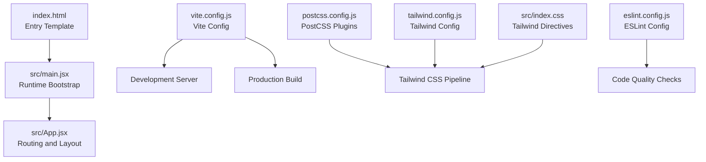
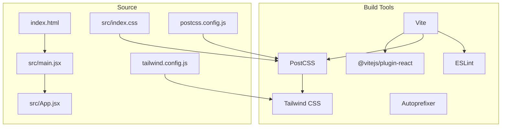
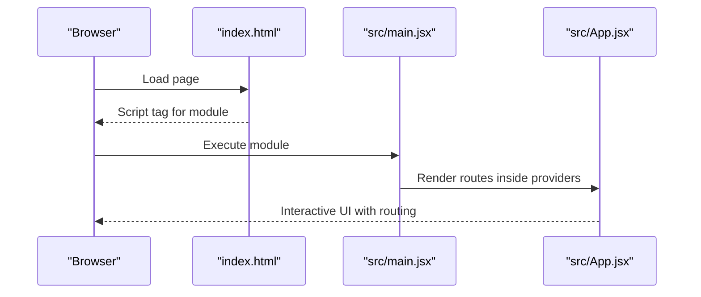
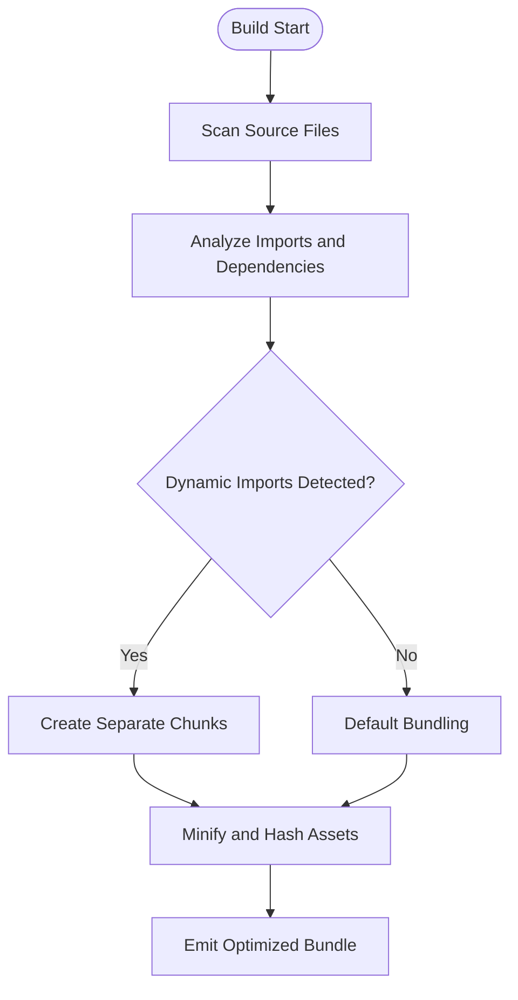
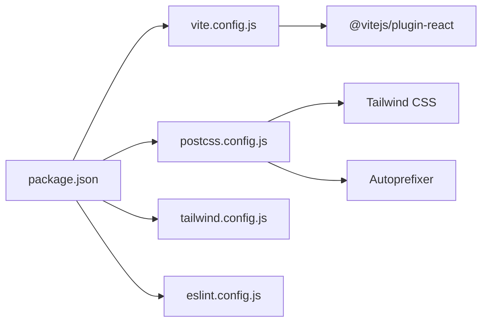

# Build Configuration and Optimization

<cite>
**Referenced Files in This Document**
- [vite.config.js](file://vite.config.js)
- [package.json](file://package.json)
- [postcss.config.js](file://postcss.config.js)
- [tailwind.config.js](file://tailwind.config.js)
- [eslint.config.js](file://eslint.config.js)
- [index.html](file://index.html)
- [src/index.css](file://src/index.css)
- [src/App.jsx](file://src/App.jsx)
- [src/main.jsx](file://src/main.jsx)
</cite>

## Table of Contents
1. [Introduction](#introduction)
2. [Project Structure](#project-structure)
3. [Core Components](#core-components)
4. [Architecture Overview](#architecture-overview)
5. [Detailed Component Analysis](#detailed-component-analysis)
6. [Dependency Analysis](#dependency-analysis)
7. [Performance Considerations](#performance-considerations)
8. [Troubleshooting Guide](#troubleshooting-guide)
9. [Conclusion](#conclusion)
10. [Appendices](#appendices)

## Introduction
This document explains the build configuration and optimization processes for the Vite-based React application. It covers the development server setup, production build optimization, asset handling, bundling and code-splitting strategies, and tree-shaking behavior. It also documents PostCSS and Tailwind CSS integration for styling optimization, including purging unused styles and responsive design considerations. The ESLint configuration for code quality enforcement during builds is described, along with practical guidance for extending the build configuration, adding custom plugins, and optimizing for different deployment targets.

## Project Structure
The project follows a conventional Vite + React layout with a clear separation between source code, configuration files, and static assets. Key build-related files include the Vite configuration, PostCSS configuration, Tailwind CSS configuration, ESLint configuration, and the HTML entry template.

**Diagram sources**
- [index.html:1-16](file://index.html#L1-L16)
- [src/main.jsx:1-14](file://src/main.jsx#L1-L14)
- [src/App.jsx:1-50](file://src/App.jsx#L1-L50)
- [vite.config.js:1-7](file://vite.config.js#L1-L7)
- [postcss.config.js:1-7](file://postcss.config.js#L1-L7)
- [tailwind.config.js:1-66](file://tailwind.config.js#L1-L66)
- [eslint.config.js:1-22](file://eslint.config.js#L1-L22)
- [src/index.css:1-14](file://src/index.css#L1-L14)

**Section sources**
- [vite.config.js:1-7](file://vite.config.js#L1-L7)
- [package.json:1-31](file://package.json#L1-L31)
- [postcss.config.js:1-7](file://postcss.config.js#L1-L7)
- [tailwind.config.js:1-66](file://tailwind.config.js#L1-L66)
- [eslint.config.js:1-22](file://eslint.config.js#L1-L22)
- [index.html:1-16](file://index.html#L1-L16)
- [src/index.css:1-14](file://src/index.css#L1-L14)
- [src/main.jsx:1-14](file://src/main.jsx#L1-L14)
- [src/App.jsx:1-50](file://src/App.jsx#L1-L50)

## Core Components
- Vite configuration defines the React plugin and serves as the central build orchestrator.
- PostCSS configuration enables Tailwind CSS and Autoprefixer for CSS processing.
- Tailwind CSS configuration defines content globs, theme extensions, DaisyUI integration, and multiple themes.
- ESLint configuration enforces recommended rules for JavaScript/JSX, React Hooks, and React Refresh in Vite.
- The HTML entry template wires the runtime bootstrap script and preconnects fonts for performance.

Key responsibilities:
- Development server: Hot module replacement and fast refresh via the React plugin.
- Production build: Bundling, minification, and asset optimization through Vite’s defaults.
- Styling pipeline: Tailwind directives processed by PostCSS with PurgeCSS-like behavior via content globs.
- Code quality: ESLint checks applied to source files during development and CI.

**Section sources**
- [vite.config.js:1-7](file://vite.config.js#L1-L7)
- [postcss.config.js:1-7](file://postcss.config.js#L1-L7)
- [tailwind.config.js:1-66](file://tailwind.config.js#L1-L66)
- [eslint.config.js:1-22](file://eslint.config.js#L1-L22)
- [index.html:1-16](file://index.html#L1-L16)

## Architecture Overview
The build pipeline integrates Vite, React, PostCSS, Tailwind CSS, and ESLint. The development server leverages the React plugin for JSX transformations and fast refresh. The production build relies on Rollup under the hood with esbuild for transforms. Tailwind CSS compiles utility classes defined in templates and components, while PurgeCSS-like behavior is achieved via content globs. ESLint runs against source files to maintain code quality.

**Diagram sources**
- [vite.config.js:1-7](file://vite.config.js#L1-L7)
- [postcss.config.js:1-7](file://postcss.config.js#L1-L7)
- [tailwind.config.js:1-66](file://tailwind.config.js#L1-L66)
- [eslint.config.js:1-22](file://eslint.config.js#L1-L22)
- [index.html:1-16](file://index.html#L1-L16)
- [src/index.css:1-14](file://src/index.css#L1-L14)
- [src/main.jsx:1-14](file://src/main.jsx#L1-L14)
- [src/App.jsx:1-50](file://src/App.jsx#L1-L50)

## Detailed Component Analysis

### Vite Configuration
- Purpose: Minimal configuration enabling the React plugin for JSX parsing and Fast Refresh.
- Behavior: Uses Vite’s defaults for bundling, asset handling, and development server.
- Extensibility: Add plugins, resolve aliases, define build.rollupOptions, or configure environment variables.

Optimization opportunities:
- Enable code splitting via dynamic imports for route-based lazy loading.
- Configure build.rollupOptions.output.manualChunks for vendor chunk separation.
- Integrate compression plugins for production builds.

**Section sources**
- [vite.config.js:1-7](file://vite.config.js#L1-L7)
- [package.json:6-10](file://package.json#L6-L10)

### Development Server Setup
- Entry point: index.html injects the module script pointing to src/main.jsx.
- Runtime bootstrap: src/main.jsx initializes React, Router, and mounts the root.
- Routing: src/App.jsx defines nested routes and protected routes.

**Diagram sources**
- [index.html:11-14](file://index.html#L11-L14)
- [src/main.jsx:1-14](file://src/main.jsx#L1-L14)
- [src/App.jsx:1-50](file://src/App.jsx#L1-L50)

**Section sources**
- [index.html:1-16](file://index.html#L1-L16)
- [src/main.jsx:1-14](file://src/main.jsx#L1-L14)
- [src/App.jsx:1-50](file://src/App.jsx#L1-L50)

### Production Build Optimization
- Scripts: package.json defines dev, build, and preview commands.
- Defaults: Vite’s production build applies minification and asset optimization automatically.
- Asset handling: Static assets under public are served as-is; others are bundled and hashed.

Recommended enhancements:
- Add build.rollupOptions.output.manualChunks to split vendor bundles.
- Enable external compression (e.g., brotli/gzip) via server middleware or CDN.
- Use dynamic imports for route-level lazy loading to reduce initial bundle size.

**Section sources**
- [package.json:6-10](file://package.json#L6-L10)
- [vite.config.js:1-7](file://vite.config.js#L1-L7)

### Asset Handling Strategies
- Public assets: Place static resources in the public directory for direct serving.
- Module assets: Import images/styles to leverage Vite’s bundling and hashing.

Guidance:
- Prefer importing assets so Vite can optimize and cache-bust them.
- Keep large media assets outside of JS bundles when possible.

**Section sources**
- [package.json:11-29](file://package.json#L11-L29)
- [index.html:1-16](file://index.html#L1-L16)

### Bundling Process and Code Splitting
Current state:
- No explicit manualChunks configuration; Vite uses defaults.
- Route-based lazy loading can be introduced via dynamic imports for major pages.

Techniques to implement:
- Dynamic imports for routes to achieve automatic code splitting.
- Manual chunking for large libraries to improve caching.

[No sources needed since this diagram shows conceptual workflow, not actual code structure]

**Section sources**
- [src/App.jsx:19-49](file://src/App.jsx#L19-L49)

### Tree Shaking Optimizations
- Enabled by default in modern Vite/ES modules setups.
- Ensure library imports use named exports and avoid pulling entire modules.
- Keep dependencies up to date to benefit from smaller, optimized packages.

**Section sources**
- [package.json:11-29](file://package.json#L11-L29)

### PostCSS and Tailwind CSS Integration
- PostCSS configuration: Enables Tailwind CSS and Autoprefixer.
- Tailwind configuration: Defines content globs to purge unused styles, extends theme colors, and integrates DaisyUI with multiple themes.
- CSS entry: src/index.css includes Tailwind directives layered appropriately.

Purging and responsiveness:
- Tailwind’s content globs scan index.html and all JSX/TSX files under src, ensuring unused styles are removed.
- Responsive utilities are included via Tailwind’s default breakpoints; custom breakpoints can be added in the theme configuration.

**Section sources**
- [postcss.config.js:1-7](file://postcss.config.js#L1-L7)
- [tailwind.config.js:1-66](file://tailwind.config.js#L1-L66)
- [src/index.css:1-14](file://src/index.css#L1-L14)

### ESLint Configuration for Code Quality
- Enforces recommended rules for JavaScript/JSX, React Hooks, and React Refresh tailored for Vite.
- Ignores the dist output directory to prevent linting built artifacts.
- Supports browser globals and JSX parsing options.

Usage:
- Run linting during development and CI to catch issues early.
- Extend rules for stricter checks in production-grade applications.

**Section sources**
- [eslint.config.js:1-22](file://eslint.config.js#L1-L22)

### Development vs Production Differences
- Development: Fast refresh, minimal transforms, no minification.
- Production: Minification, asset hashing, code splitting, and optimized output.

Environment-specific configurations:
- Define NODE_ENV and custom environment variables via .env files and Vite’s dotenv support.
- Use define in Vite config to inject constants at build time.

**Section sources**
- [vite.config.js:1-7](file://vite.config.js#L1-L7)
- [package.json:6-10](file://package.json#L6-L10)

### Optimization Strategies for Deployment Targets
- Static hosting: Ensure base paths and asset URLs are correct; verify public assets are served.
- CDN: Leverage hashed filenames for long-term caching; enable brotli/gzip compression.
- SSR/SSG: If adopting SSR later, configure Vite plugins accordingly and adjust asset handling.

**Section sources**
- [index.html:1-16](file://index.html#L1-L16)
- [tailwind.config.js:1-66](file://tailwind.config.js#L1-L66)

## Dependency Analysis
The build stack relies on Vite, React plugin, PostCSS, Tailwind CSS, and Autoprefixer. Dependencies are declared in package.json. The React plugin is configured in vite.config.js. PostCSS and Tailwind are wired via postcss.config.js and tailwind.config.js respectively.

**Diagram sources**
- [package.json:1-31](file://package.json#L1-L31)
- [vite.config.js:1-7](file://vite.config.js#L1-L7)
- [postcss.config.js:1-7](file://postcss.config.js#L1-L7)
- [tailwind.config.js:1-66](file://tailwind.config.js#L1-L66)
- [eslint.config.js:1-22](file://eslint.config.js#L1-L22)

**Section sources**
- [package.json:1-31](file://package.json#L1-L31)
- [vite.config.js:1-7](file://vite.config.js#L1-L7)
- [postcss.config.js:1-7](file://postcss.config.js#L1-L7)
- [tailwind.config.js:1-66](file://tailwind.config.js#L1-L66)
- [eslint.config.js:1-22](file://eslint.config.js#L1-L22)

## Performance Considerations
- Code splitting: Use dynamic imports for routes and heavy components to reduce initial payload.
- Vendor chunking: Separate frequently changing application code from large vendor libraries.
- Asset compression: Enable brotli/gzip on the server or CDN; ensure proper MIME types.
- Caching: Rely on hashed filenames for long-term caching; invalidate caches on version changes.
- CSS optimization: Tailwind purges unused styles via content globs; keep content globs precise to avoid removing legitimate classes.
- Fonts: Preconnect to external font hosts to improve rendering performance.

[No sources needed since this section provides general guidance]

## Troubleshooting Guide
Common issues and resolutions:
- Styles not applying: Verify Tailwind directives are present in the CSS entry and content globs include all relevant files.
- Unused styles remain: Ensure content globs in Tailwind config match all template and component files.
- Build errors with plugins: Confirm plugin versions are compatible with current Vite and Node versions.
- Dev server hot reload not working: Check React plugin configuration and ensure JSX syntax is valid.

**Section sources**
- [tailwind.config.js:3](file://tailwind.config.js#L3)
- [src/index.css:1-3](file://src/index.css#L1-L3)
- [vite.config.js:5](file://vite.config.js#L5)
- [package.json:22-28](file://package.json#L22-L28)

## Conclusion
The project employs a clean, minimal Vite configuration with React, PostCSS, Tailwind CSS, and ESLint. The current setup benefits from automatic optimizations such as tree shaking and Tailwind purging. To further enhance performance, introduce route-based code splitting, vendor chunking, and compression. Tailor environment-specific configurations and validate asset delivery for your chosen deployment target.

[No sources needed since this section summarizes without analyzing specific files]

## Appendices

### Practical Build Commands
- Development: npm run dev
- Production build: npm run build
- Preview production build locally: npm run preview

**Section sources**
- [package.json:6-10](file://package.json#L6-L10)

### Extending the Build Configuration
- Add plugins: Install and register additional Vite plugins in vite.config.js.
- Environment variables: Use define in Vite config or .env files for feature flags and API endpoints.
- Output customization: Adjust build.rollupOptions for advanced chunking and asset placement.

**Section sources**
- [vite.config.js:1-7](file://vite.config.js#L1-L7)
- [package.json:11-29](file://package.json#L11-L29)