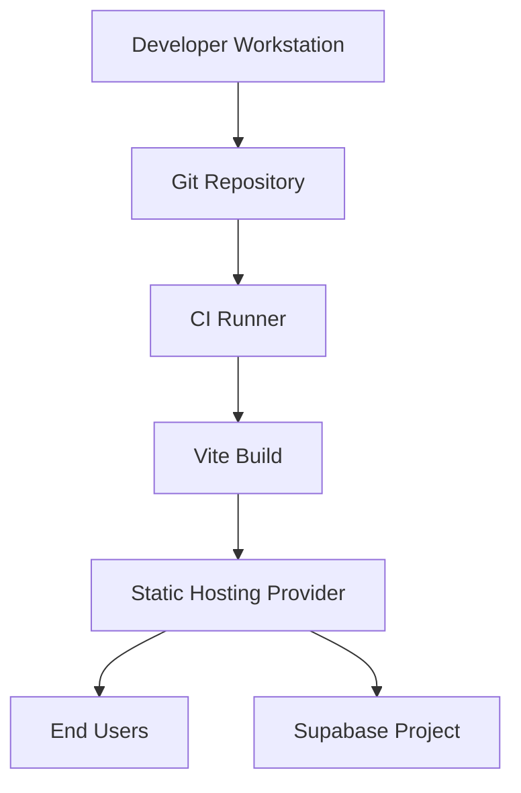
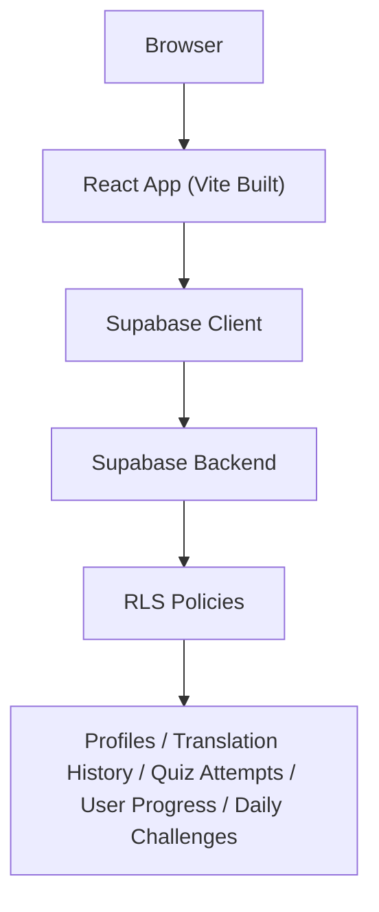
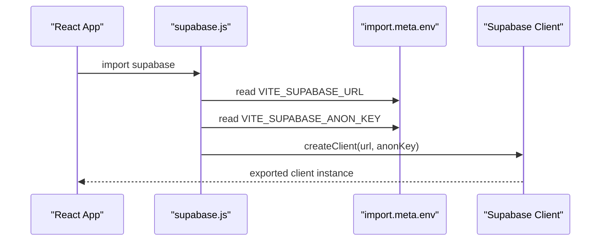
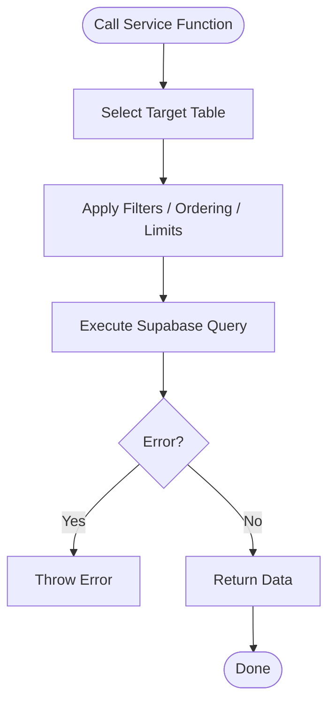
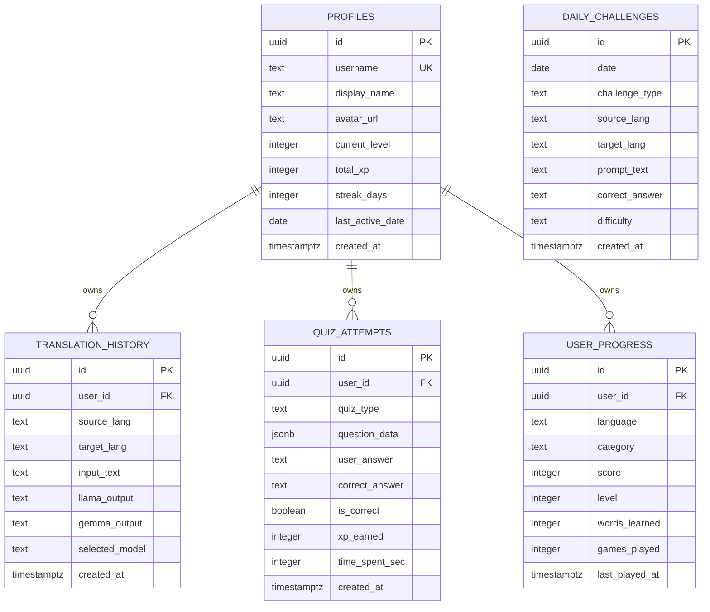

# Deployment Procedures and CI/CD Integration

<cite>
**Referenced Files in This Document**
- [package.json](file://package.json)
- [vite.config.js](file://vite.config.js)
- [supabase-schema.sql](file://supabase-schema.sql)
- [src/config/supabase.js](file://src/config/supabase.js)
- [src/services/supabaseService.js](file://src/services/supabaseService.js)
- [README.md](file://README.md)
</cite>

## Table of Contents
1. [Introduction](#introduction)
2. [Project Structure](#project-structure)
3. [Core Components](#core-components)
4. [Architecture Overview](#architecture-overview)
5. [Detailed Component Analysis](#detailed-component-analysis)
6. [Environment Configuration Management](#environment-configuration-management)
7. [Database Schema Deployment Using Supabase](#database-schema-deployment-using-supabase)
8. [Automated Deployment Pipeline Setup](#automated-deployment-pipeline-setup)
9. [Production Optimization Techniques](#production-optimization-techniques)
10. [Security Considerations](#security-considerations)
11. [Release Management and Versioning](#release-management-and-versioning)
12. [Monitoring and Health Validation](#monitoring-and-health-validation)
13. [Rollback Procedures](#rollback-procedures)
14. [Troubleshooting Guide](#troubleshooting-guide)
15. [Conclusion](#conclusion)

## Introduction
This document provides comprehensive deployment guidance for the Flinggo app, covering production deployment procedures, environment configuration, Supabase database schema deployment, CI/CD integration, and operational best practices. It explains how to deploy across development, staging, and production environments, manage secrets, optimize for production, monitor health, and recover from incidents.

## Project Structure
The application is a React single-page application built with Vite. Build artifacts are produced via the Vite build pipeline and intended for static hosting. Supabase is used for authentication, row-level security, and relational data persistence.

**Section sources**
- [package.json:6-10](file://package.json#L6-L10)
- [vite.config.js:1-7](file://vite.config.js#L1-L7)

## Core Components
- Build and bundling: Vite produces optimized static assets for deployment.
- Runtime configuration: Environment variables are accessed via Vite’s import.meta.env during build-time injection.
- Supabase client: A configured Supabase client reads runtime environment variables and connects to the Supabase backend.
- Supabase service layer: Application logic interacts with Supabase tables through typed service functions.

**Section sources**
- [package.json:6-10](file://package.json#L6-L10)
- [vite.config.js:1-7](file://vite.config.js#L1-L7)
- [src/config/supabase.js:1-7](file://src/config/supabase.js#L1-L7)
- [src/services/supabaseService.js:1-132](file://src/services/supabaseService.js#L1-L132)

## Architecture Overview
The runtime architecture relies on a static frontend deployed to a CDN or static host, communicating with Supabase for authentication and data persistence. Row-level security policies enforce per-user access control.

**Diagram sources**
- [src/config/supabase.js:1-7](file://src/config/supabase.js#L1-L7)
- [supabase-schema.sql:17-119](file://supabase-schema.sql#L17-L119)
- [src/services/supabaseService.js:1-132](file://src/services/supabaseService.js#L1-L132)

## Detailed Component Analysis

### Supabase Client Initialization
- Reads Vite environment variables for Supabase URL and anonymous key.
- Exports a singleton client instance for use across the app.

**Diagram sources**
- [src/config/supabase.js:1-7](file://src/config/supabase.js#L1-L7)

**Section sources**
- [src/config/supabase.js:1-7](file://src/config/supabase.js#L1-L7)

### Supabase Service Layer
- Provides CRUD operations for translation history, quiz attempts, user progress, daily challenges, leaderboard, and profile queries.
- Uses Supabase client to interact with tables and enforces RLS policy boundaries.

**Diagram sources**
- [src/services/supabaseService.js:1-132](file://src/services/supabaseService.js#L1-L132)

**Section sources**
- [src/services/supabaseService.js:1-132](file://src/services/supabaseService.js#L1-L132)

## Environment Configuration Management
- Build-time environment variables are injected by Vite. Variables prefixed with VITE_ are exposed to the browser.
- Required variables for Supabase integration:
  - VITE_SUPABASE_URL
  - VITE_SUPABASE_ANON_KEY
- Additional environment variables can be introduced for feature flags, analytics, or external integrations.

Recommended approach:
- Define environment variables per environment (development, staging, production) in your CI/CD platform and static host provider.
- Keep secrets out of the repository; inject them securely at build or deploy time.

**Section sources**
- [src/config/supabase.js:3-4](file://src/config/supabase.js#L3-L4)
- [vite.config.js:1-7](file://vite.config.js#L1-L7)

## Database Schema Deployment Using Supabase
- The schema defines five primary tables with row-level security and tailored policies.
- Indexes are included to optimize common query patterns.
- Apply the schema using the Supabase SQL Editor or migration tooling.

Schema highlights:
- Profiles: user metadata and XP/streak tracking.
- Translation History: stores translation requests and model outputs.
- Quiz Attempts: records quiz performance and XP earned.
- User Progress: per-language progress tracking.
- Daily Challenges: curated daily tasks.

**Diagram sources**
- [supabase-schema.sql:4-119](file://supabase-schema.sql#L4-L119)

**Section sources**
- [supabase-schema.sql:1-119](file://supabase-schema.sql#L1-L119)

## Automated Deployment Pipeline Setup
High-level pipeline stages:
- Checkout code
- Install dependencies
- Lint and test (unit/integration)
- Build static assets
- Deploy to staging
- Manual approval gate (optional)
- Deploy to production
- Post-deploy validation

CI/CD integration patterns:
- Use a hosted runner or self-hosted runner to execute jobs.
- Store secrets in the CI provider’s secret storage (e.g., VITE_SUPABASE_URL, VITE_SUPABASE_ANON_KEY).
- Configure separate secrets per environment (staging vs production).
- Use matrix builds to test multiple browsers or Node versions if applicable.

Example job outline (conceptual):
- Job: Build and Test
  - Steps: checkout → install → lint → unit tests → build
- Job: Deploy Staging
  - Steps: build → upload artifacts → deploy to staging host → notify
- Job: Deploy Production
  - Steps: promote from staging (if using promotion) → deploy to prod host → notify

[No sources needed since this section provides general CI/CD guidance]

## Production Optimization Techniques
- Asset optimization: rely on Vite’s production defaults; ensure minification and chunk splitting are active.
- Caching: configure long-term caching for immutable assets and short-term caching for HTML; set cache-control headers appropriately.
- CDN: serve static assets via a global CDN to reduce latency.
- HTTPS and HSTS: enforce TLS termination at the CDN or host; enable HTTP Strict Transport Security.
- Compression: enable gzip or Brotli compression on your host.
- Analytics and observability: integrate lightweight analytics and error reporting without compromising privacy.

[No sources needed since this section provides general guidance]

## Security Considerations
- Secrets management: never commit secrets; inject via CI/CD and environment variables.
- Supabase keys: use the anonymous key for client-side initialization; keep service keys server-side if building backend functions.
- CORS: ensure your host allows necessary Supabase headers and methods.
- Authentication: rely on Supabase Auth; enforce RLS policies to restrict data access.
- Audit logging: track deploys and configuration changes; maintain logs for incident response.

[No sources needed since this section provides general guidance]

## Release Management and Versioning
- Versioning: use semantic versioning; bump patch/minor/major according to changes.
- Tagging: tag releases on the main branch after successful production deployment.
- Changelog: maintain a concise changelog summarizing features, fixes, and breaking changes.
- Rollout strategy: adopt canary or blue-green deployments where supported by your host.

[No sources needed since this section provides general guidance]

## Monitoring and Health Validation
- Health checks: expose a simple endpoint or rely on static hosting’s health probes.
- Uptime monitoring: use external services to monitor site availability.
- Error tracking: integrate lightweight error reporting for frontend exceptions.
- Performance monitoring: measure Largest Contentful Paint (LCP), First Input Delay (FID), and Cumulative Layout Shift (CLS).
- Post-deploy validation: verify key routes and Supabase connectivity after deployment.

[No sources needed since this section provides general guidance]

## Rollback Procedures
- Revert to previous artifact: redeploy the last known-good build.
- Database safety: schema changes should be reversible; maintain migration scripts and backups.
- Canary rollback: if using staged rollout, disable traffic to the failing version and re-route to the healthy version.
- Communication: inform stakeholders and document rollback actions.

[No sources needed since this section provides general guidance]

## Troubleshooting Guide
Common deployment issues and remedies:
- Missing environment variables: ensure VITE_SUPABASE_URL and VITE_SUPABASE_ANON_KEY are present in the build environment.
- Build fails locally or in CI: confirm Node.js and npm/yarn versions match project requirements; clear caches and reinstall dependencies.
- Supabase connection errors: verify Supabase project URL and keys; check network access and firewall rules.
- CORS errors: confirm the host allows Supabase-required headers and methods.
- Static asset not loading: verify CDN caching and cache-control headers; invalidate cache if needed.

[No sources needed since this section provides general guidance]

## Conclusion
By following this guide, you can reliably deploy the Flinggo app across environments, manage secrets securely, deploy and evolve the Supabase schema, automate CI/CD pipelines, and operate the system with strong performance, security, and observability practices.