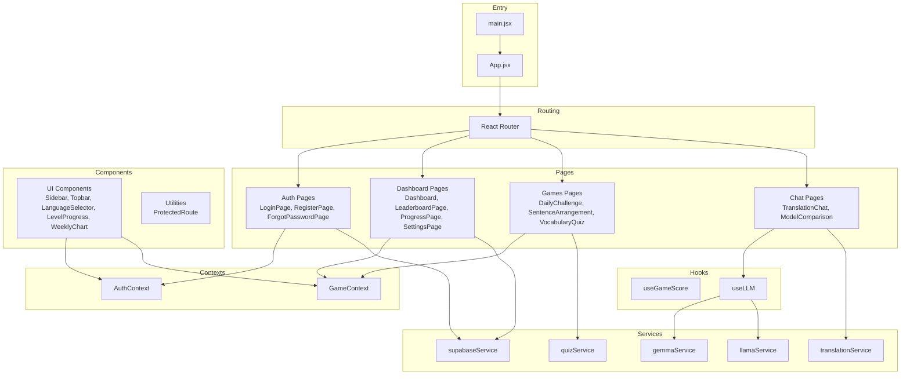
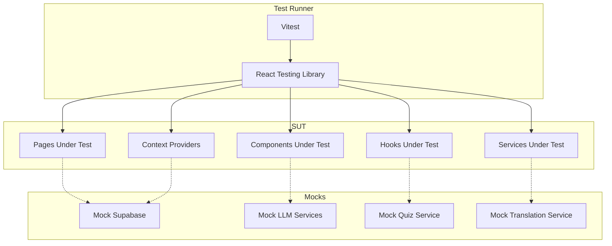
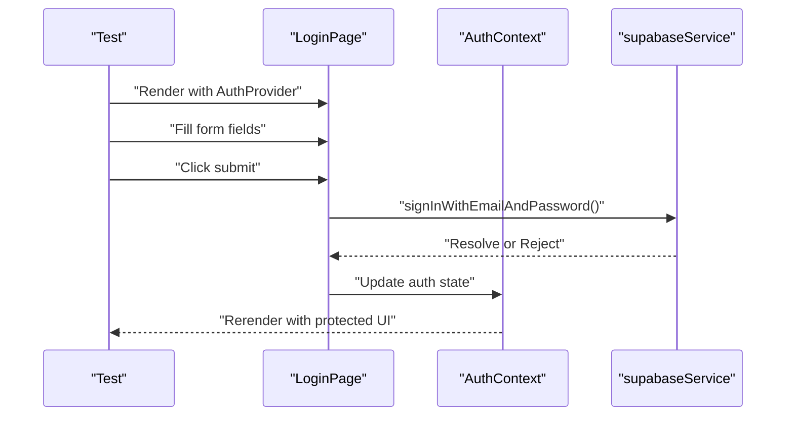
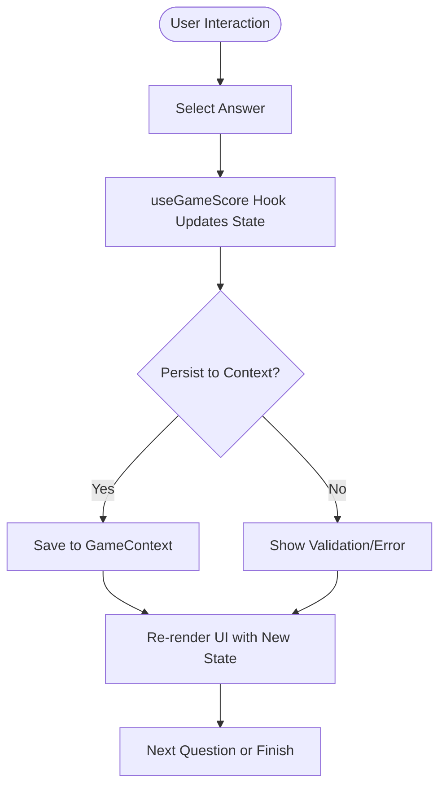
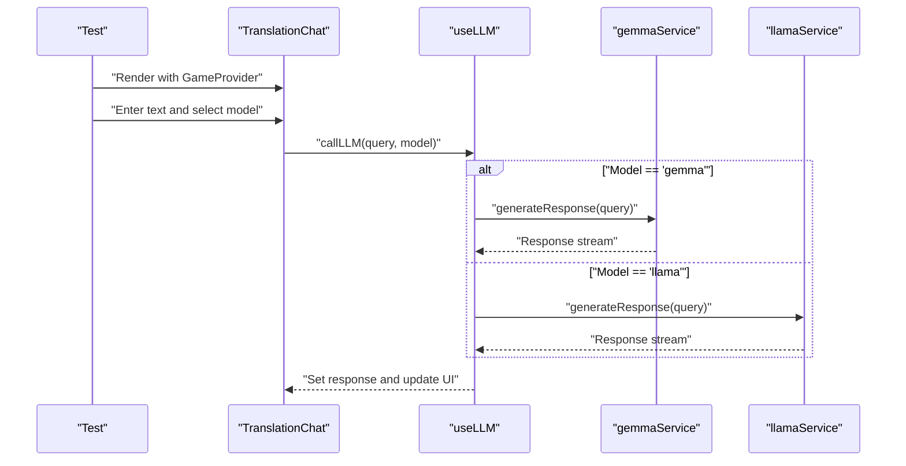
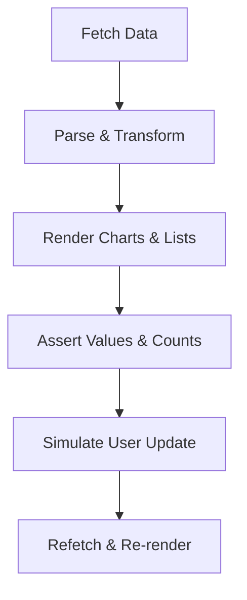
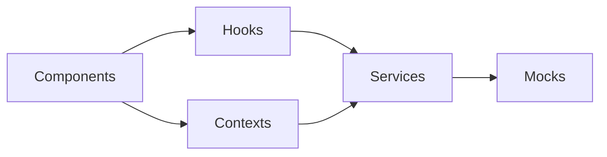

# Testing Strategies and Implementation

<cite>
**Referenced Files in This Document**
- [package.json](file://package.json)
- [vite.config.js](file://vite.config.js)
- [README.md](file://README.md)
- [App.jsx](file://src/App.jsx)
- [main.jsx](file://src/main.jsx)
- [AuthContext.jsx](file://src/contexts/AuthContext.jsx)
- [GameContext.jsx](file://src/contexts/GameContext.jsx)
- [useGameScore.js](file://src/hooks/useGameScore.js)
- [useLLM.js](file://src/hooks/useLLM.js)
- [supabaseService.js](file://src/services/supabaseService.js)
- [gemService.js](file://src/services/gemmaService.js)
- [llamaService.js](file://src/services/llamaService.js)
- [quizService.js](file://src/services/quizService.js)
- [translationService.js](file://src/services/translationService.js)
- [mockData.js](file://src/data/mockData.js)
- [LoginPage.jsx](file://src/pages/auth/LoginPage.jsx)
- [RegisterPage.jsx](file://src/pages/auth/RegisterPage.jsx)
- [ForgotPasswordPage.jsx](file://src/pages/auth/ForgotPasswordPage.jsx)
- [Dashboard.jsx](file://src/pages/dashboard/Dashboard.jsx)
- [LeaderboardPage.jsx](file://src/pages/dashboard/LeaderboardPage.jsx)
- [ProgressPage.jsx](file://src/pages/dashboard/ProgressPage.jsx)
- [SettingsPage.jsx](file://src/pages/dashboard/SettingsPage.jsx)
- [DailyChallenge.jsx](file://src/pages/games/DailyChallenge.jsx)
- [SentenceArrangement.jsx](file://src/pages/games/SentenceArrangement.jsx)
- [VocabularyQuiz.jsx](file://src/pages/games/VocabularyQuiz.jsx)
- [TranslationChat.jsx](file://src/pages/chat/TranslationChat.jsx)
- [ModelComparison.jsx](file://src/pages/chat/ModelComparison.jsx)
- [ProtectedRoute.jsx](file://src/components/ProtectedRoute.jsx)
- [Sidebar.jsx](file://src/components/Sidebar.jsx)
- [Topbar.jsx](file://src/components/Topbar.jsx)
- [LanguageSelector.jsx](file://src/components/LanguageSelector.jsx)
- [LevelProgress.jsx](file://src/components/LevelProgress.jsx)
- [WeeklyChart.jsx](file://src/components/WeeklyChart.jsx)
</cite>

## Table of Contents
1. [Introduction](#introduction)
2. [Project Structure](#project-structure)
3. [Core Components](#core-components)
4. [Architecture Overview](#architecture-overview)
5. [Detailed Component Analysis](#detailed-component-analysis)
6. [Dependency Analysis](#dependency-analysis)
7. [Performance Considerations](#performance-considerations)
8. [Troubleshooting Guide](#troubleshooting-guide)
9. [Conclusion](#conclusion)
10. [Appendices](#appendices)

## Introduction
This document outlines the testing strategy for the Flinggo-app using React Testing Library. It covers unit testing approaches for components, hooks, services, and context providers; strategies for mocking Supabase, LLM services, and quiz/translation APIs; and practical guidance for testing authentication flows, game mechanics, and AI integrations. It also provides best practices for asynchronous operations, error handling, edge cases, user interactions, form validation, and state management. Guidance is included for organizing test suites and integrating continuous testing workflows.

## Project Structure
The application follows a feature-based structure with clear separation of concerns:
- Pages under src/pages for route-level views (auth, dashboard, games, chat)
- Components under src/components for reusable UI elements
- Hooks under src/hooks for custom logic (game scoring, LLM integration)
- Services under src/services for backend and AI integrations
- Contexts under src/contexts for global state (authentication, game)
- Data under src/data for mock datasets
- Layouts under src/layouts for page wrappers
- Config under src/config for environment-specific settings

**Diagram sources**
- [main.jsx](file://src/main.jsx)
- [App.jsx](file://src/App.jsx)
- [LoginPage.jsx](file://src/pages/auth/LoginPage.jsx)
- [RegisterPage.jsx](file://src/pages/auth/RegisterPage.jsx)
- [ForgotPasswordPage.jsx](file://src/pages/auth/ForgotPasswordPage.jsx)
- [Dashboard.jsx](file://src/pages/dashboard/Dashboard.jsx)
- [LeaderboardPage.jsx](file://src/pages/dashboard/LeaderboardPage.jsx)
- [ProgressPage.jsx](file://src/pages/dashboard/ProgressPage.jsx)
- [SettingsPage.jsx](file://src/pages/dashboard/SettingsPage.jsx)
- [DailyChallenge.jsx](file://src/pages/games/DailyChallenge.jsx)
- [SentenceArrangement.jsx](file://src/pages/games/SentenceArrangement.jsx)
- [VocabularyQuiz.jsx](file://src/pages/games/VocabularyQuiz.jsx)
- [TranslationChat.jsx](file://src/pages/chat/TranslationChat.jsx)
- [ModelComparison.jsx](file://src/pages/chat/ModelComparison.jsx)
- [Sidebar.jsx](file://src/components/Sidebar.jsx)
- [Topbar.jsx](file://src/components/Topbar.jsx)
- [LanguageSelector.jsx](file://src/components/LanguageSelector.jsx)
- [LevelProgress.jsx](file://src/components/LevelProgress.jsx)
- [WeeklyChart.jsx](file://src/components/WeeklyChart.jsx)
- [useGameScore.js](file://src/hooks/useGameScore.js)
- [useLLM.js](file://src/hooks/useLLM.js)
- [supabaseService.js](file://src/services/supabaseService.js)
- [gemService.js](file://src/services/gemmaService.js)
- [llamaService.js](file://src/services/llamaService.js)
- [quizService.js](file://src/services/quizService.js)
- [translationService.js](file://src/services/translationService.js)
- [AuthContext.jsx](file://src/contexts/AuthContext.jsx)
- [GameContext.jsx](file://src/contexts/GameContext.jsx)

**Section sources**
- [main.jsx](file://src/main.jsx)
- [App.jsx](file://src/App.jsx)

## Core Components
This section identifies the primary targets for unit testing:
- Authentication pages and flows: LoginPage, RegisterPage, ForgotPasswordPage
- Dashboard pages: Dashboard, LeaderboardPage, ProgressPage, SettingsPage
- Games pages: DailyChallenge, SentenceArrangement, VocabularyQuiz
- Chat pages: TranslationChat, ModelComparison
- UI components: Sidebar, Topbar, LanguageSelector, LevelProgress, WeeklyChart
- Custom hooks: useGameScore, useLLM
- Context providers: AuthContext, GameContext
- Services: supabaseService, gemmaService, llamaService, quizService, translationService
- Mock data: mockData for deterministic scenarios

Key testing areas:
- Form submission and validation in auth pages
- Protected routing and context-driven rendering
- Game logic hooks and state updates
- AI model interactions via useLLM and service layers
- Data fetching and caching in dashboard components
- Mock data usage for predictable tests

**Section sources**
- [LoginPage.jsx](file://src/pages/auth/LoginPage.jsx)
- [RegisterPage.jsx](file://src/pages/auth/RegisterPage.jsx)
- [ForgotPasswordPage.jsx](file://src/pages/auth/ForgotPasswordPage.jsx)
- [Dashboard.jsx](file://src/pages/dashboard/Dashboard.jsx)
- [LeaderboardPage.jsx](file://src/pages/dashboard/LeaderboardPage.jsx)
- [ProgressPage.jsx](file://src/pages/dashboard/ProgressPage.jsx)
- [SettingsPage.jsx](file://src/pages/dashboard/SettingsPage.jsx)
- [DailyChallenge.jsx](file://src/pages/games/DailyChallenge.jsx)
- [SentenceArrangement.jsx](file://src/pages/games/SentenceArrangement.jsx)
- [VocabularyQuiz.jsx](file://src/pages/games/VocabularyQuiz.jsx)
- [TranslationChat.jsx](file://src/pages/chat/TranslationChat.jsx)
- [ModelComparison.jsx](file://src/pages/chat/ModelComparison.jsx)
- [Sidebar.jsx](file://src/components/Sidebar.jsx)
- [Topbar.jsx](file://src/components/Topbar.jsx)
- [LanguageSelector.jsx](file://src/components/LanguageSelector.jsx)
- [LevelProgress.jsx](file://src/components/LevelProgress.jsx)
- [WeeklyChart.jsx](file://src/components/WeeklyChart.jsx)
- [useGameScore.js](file://src/hooks/useGameScore.js)
- [useLLM.js](file://src/hooks/useLLM.js)
- [AuthContext.jsx](file://src/contexts/AuthContext.jsx)
- [GameContext.jsx](file://src/contexts/GameContext.jsx)
- [supabaseService.js](file://src/services/supabaseService.js)
- [gemService.js](file://src/services/gemmaService.js)
- [llamaService.js](file://src/services/llamaService.js)
- [quizService.js](file://src/services/quizService.js)
- [translationService.js](file://src/services/translationService.js)
- [mockData.js](file://src/data/mockData.js)

## Architecture Overview
The testing architecture leverages React Testing Library for DOM-centric tests, Vitest for fast unit tests, and Vite for build/testing integration. Mocks replace external dependencies (Supabase, LLM APIs) to ensure deterministic and isolated tests. Context providers are wrapped around components under test to simulate global state.

**Diagram sources**
- [vite.config.js](file://vite.config.js)
- [supabaseService.js](file://src/services/supabaseService.js)
- [gemService.js](file://src/services/gemmaService.js)
- [llamaService.js](file://src/services/llamaService.js)
- [quizService.js](file://src/services/quizService.js)
- [translationService.js](file://src/services/translationService.js)
- [AuthContext.jsx](file://src/contexts/AuthContext.jsx)
- [GameContext.jsx](file://src/contexts/GameContext.jsx)

## Detailed Component Analysis

### Authentication Testing Patterns
Focus areas:
- Form submission and validation for LoginPage, RegisterPage, ForgotPasswordPage
- ProtectedRoute behavior and AuthContext integration
- Supabase authentication service mocking

Recommended patterns:
- Render components within AuthProvider and MemoryRouter
- Mock supabaseService methods to simulate success/failure paths
- Test form field interactions, validation messages, and navigation on submit
- Verify ProtectedRoute redirects unauthenticated users appropriately

**Diagram sources**
- [LoginPage.jsx](file://src/pages/auth/LoginPage.jsx)
- [AuthContext.jsx](file://src/contexts/AuthContext.jsx)
- [supabaseService.js](file://src/services/supabaseService.js)

**Section sources**
- [LoginPage.jsx](file://src/pages/auth/LoginPage.jsx)
- [RegisterPage.jsx](file://src/pages/auth/RegisterPage.jsx)
- [ForgotPasswordPage.jsx](file://src/pages/auth/ForgotPasswordPage.jsx)
- [ProtectedRoute.jsx](file://src/components/ProtectedRoute.jsx)
- [AuthContext.jsx](file://src/contexts/AuthContext.jsx)
- [supabaseService.js](file://src/services/supabaseService.js)

### Game Mechanics Testing Patterns
Focus areas:
- useGameScore hook for score calculation and persistence
- GameContext for game state management
- Game pages: DailyChallenge, SentenceArrangement, VocabularyQuiz

Recommended patterns:
- Wrap components with GameProvider
- Mock quizService to return controlled questions and outcomes
- Simulate user interactions (selections, timers, submissions)
- Assert state transitions and UI updates
- Test edge cases: empty questions, invalid selections, timeouts

**Diagram sources**
- [useGameScore.js](file://src/hooks/useGameScore.js)
- [GameContext.jsx](file://src/contexts/GameContext.jsx)
- [DailyChallenge.jsx](file://src/pages/games/DailyChallenge.jsx)
- [SentenceArrangement.jsx](file://src/pages/games/SentenceArrangement.jsx)
- [VocabularyQuiz.jsx](file://src/pages/games/VocabularyQuiz.jsx)
- [quizService.js](file://src/services/quizService.js)

**Section sources**
- [useGameScore.js](file://src/hooks/useGameScore.js)
- [GameContext.jsx](file://src/contexts/GameContext.jsx)
- [DailyChallenge.jsx](file://src/pages/games/DailyChallenge.jsx)
- [SentenceArrangement.jsx](file://src/pages/games/SentenceArrangement.jsx)
- [VocabularyQuiz.jsx](file://src/pages/games/VocabularyQuiz.jsx)
- [quizService.js](file://src/services/quizService.js)

### AI Service Integration Testing Patterns
Focus areas:
- useLLM hook orchestrating model selection and responses
- gemmaService and llamaService implementations
- TranslationChat and ModelComparison pages

Recommended patterns:
- Mock useLLM to return predefined responses
- Stub gemmaService and llamaService methods
- Test model switching, streaming-like behavior, and error fallbacks
- Validate UI updates for loading states and error messages

**Diagram sources**
- [TranslationChat.jsx](file://src/pages/chat/TranslationChat.jsx)
- [ModelComparison.jsx](file://src/pages/chat/ModelComparison.jsx)
- [useLLM.js](file://src/hooks/useLLM.js)
- [gemService.js](file://src/services/gemmaService.js)
- [llamaService.js](file://src/services/llamaService.js)

**Section sources**
- [TranslationChat.jsx](file://src/pages/chat/TranslationChat.jsx)
- [ModelComparison.jsx](file://src/pages/chat/ModelComparison.jsx)
- [useLLM.js](file://src/hooks/useLLM.js)
- [gemService.js](file://src/services/gemmaService.js)
- [llamaService.js](file://src/services/llamaService.js)

### Dashboard and Data Visualization Testing Patterns
Focus areas:
- Dashboard, LeaderboardPage, ProgressPage, SettingsPage
- LevelProgress and WeeklyChart components
- Data fetching and rendering with mockData

Recommended patterns:
- Mock services to return stable datasets
- Test chart rendering and data binding
- Validate leaderboard sorting and pagination behavior
- Ensure SettingsPage persists user preferences without network errors

**Diagram sources**
- [Dashboard.jsx](file://src/pages/dashboard/Dashboard.jsx)
- [LeaderboardPage.jsx](file://src/pages/dashboard/LeaderboardPage.jsx)
- [ProgressPage.jsx](file://src/pages/dashboard/ProgressPage.jsx)
- [SettingsPage.jsx](file://src/pages/dashboard/SettingsPage.jsx)
- [LevelProgress.jsx](file://src/components/LevelProgress.jsx)
- [WeeklyChart.jsx](file://src/components/WeeklyChart.jsx)
- [mockData.js](file://src/data/mockData.js)

**Section sources**
- [Dashboard.jsx](file://src/pages/dashboard/Dashboard.jsx)
- [LeaderboardPage.jsx](file://src/pages/dashboard/LeaderboardPage.jsx)
- [ProgressPage.jsx](file://src/pages/dashboard/ProgressPage.jsx)
- [SettingsPage.jsx](file://src/pages/dashboard/SettingsPage.jsx)
- [LevelProgress.jsx](file://src/components/LevelProgress.jsx)
- [WeeklyChart.jsx](file://src/components/WeeklyChart.jsx)
- [mockData.js](file://src/data/mockData.js)

### Testing Utilities and Mock Data Management
- Mock data: Use mockData.js for consistent datasets across tests
- Service mocks: Create per-test mocks for supabaseService, gemmaService, llamaService, quizService, translationService
- Context providers: Wrap tests with AuthProvider and GameProvider to simulate global state
- Rendering helpers: Use render from React Testing Library with appropriate wrappers
- Event simulation: fireEvent and userEvent for realistic interactions
- Assertions: screen queries and waitFor for async assertions

Best practices:
- Keep mocks minimal and focused on the tested scenario
- Use beforeEach to reset mocks and provider state
- Prefer userEvent for accessibility-aligned interactions
- Isolate tests with independent mock setups

**Section sources**
- [mockData.js](file://src/data/mockData.js)
- [supabaseService.js](file://src/services/supabaseService.js)
- [gemService.js](file://src/services/gemmaService.js)
- [llamaService.js](file://src/services/llamaService.js)
- [quizService.js](file://src/services/quizService.js)
- [translationService.js](file://src/services/translationService.js)
- [AuthContext.jsx](file://src/contexts/AuthContext.jsx)
- [GameContext.jsx](file://src/contexts/GameContext.jsx)

### Asynchronous Operations, Error Handling, and Edge Cases
Asynchronous patterns:
- Use waitFor and screen queries to assert async UI changes
- Mock async service calls to resolve/reject deterministically
- Test loading states and skeleton UIs

Error handling:
- Mock service failures and assert error messages
- Verify fallback UIs and retry mechanisms
- Test empty states and invalid inputs

Edge cases:
- Empty lists, missing data, and partial responses
- Network timeouts and intermittent failures
- Internationalization and localization edge cases

**Section sources**
- [useLLM.js](file://src/hooks/useLLM.js)
- [supabaseService.js](file://src/services/supabaseService.js)
- [quizService.js](file://src/services/quizService.js)
- [translationService.js](file://src/services/translationService.js)

### User Interactions, Form Validation, and State Management
Patterns:
- Form validation: Assert validation messages appear on invalid input and disappear on valid input
- State updates: Verify context and local state reflect user actions
- Navigation: Test route transitions after successful actions

Guidance:
- Use userEvent for realistic typing and clicking
- Test keyboard shortcuts and accessibility attributes
- Validate that state resets appropriately after navigation or errors

**Section sources**
- [LoginPage.jsx](file://src/pages/auth/LoginPage.jsx)
- [RegisterPage.jsx](file://src/pages/auth/RegisterPage.jsx)
- [ForgotPasswordPage.jsx](file://src/pages/auth/ForgotPasswordPage.jsx)
- [Sidebar.jsx](file://src/components/Sidebar.jsx)
- [Topbar.jsx](file://src/components/Topbar.jsx)
- [LanguageSelector.jsx](file://src/components/LanguageSelector.jsx)

## Dependency Analysis
Testing dependencies and coupling:
- Components depend on hooks and services; isolate services via mocks
- Hooks depend on context providers; wrap tests with appropriate providers
- Pages depend on components and services; test composition and data flow
- Contexts encapsulate state; test state transitions and derived values

Potential issues:
- Circular dependencies between hooks and services
- Over-reliance on real network calls
- Inconsistent mock setups across tests

Recommendations:
- Centralize mock creation in test setup files
- Avoid importing real services in tests; always use mocks
- Keep provider wrappers consistent across test suites

**Diagram sources**
- [Sidebar.jsx](file://src/components/Sidebar.jsx)
- [Topbar.jsx](file://src/components/Topbar.jsx)
- [LanguageSelector.jsx](file://src/components/LanguageSelector.jsx)
- [useGameScore.js](file://src/hooks/useGameScore.js)
- [useLLM.js](file://src/hooks/useLLM.js)
- [supabaseService.js](file://src/services/supabaseService.js)
- [gemService.js](file://src/services/gemmaService.js)
- [llamaService.js](file://src/services/llamaService.js)
- [quizService.js](file://src/services/quizService.js)
- [translationService.js](file://src/services/translationService.js)
- [AuthContext.jsx](file://src/contexts/AuthContext.jsx)
- [GameContext.jsx](file://src/contexts/GameContext.jsx)

**Section sources**
- [Sidebar.jsx](file://src/components/Sidebar.jsx)
- [Topbar.jsx](file://src/components/Topbar.jsx)
- [LanguageSelector.jsx](file://src/components/LanguageSelector.jsx)
- [useGameScore.js](file://src/hooks/useGameScore.js)
- [useLLM.js](file://src/hooks/useLLM.js)
- [supabaseService.js](file://src/services/supabaseService.js)
- [gemService.js](file://src/services/gemmaService.js)
- [llamaService.js](file://src/services/llamaService.js)
- [quizService.js](file://src/services/quizService.js)
- [translationService.js](file://src/services/translationService.js)
- [AuthContext.jsx](file://src/contexts/AuthContext.jsx)
- [GameContext.jsx](file://src/contexts/GameContext.jsx)

## Performance Considerations
- Prefer shallow rendering for leaf components; use full rendering for composite components
- Use act for batching updates in tests
- Minimize real network calls; rely on deterministic mocks
- Use waitFor sparingly; prefer explicit waits for critical assertions
- Organize tests to avoid unnecessary re-renders

## Troubleshooting Guide
Common issues and resolutions:
- Tests hanging on async operations: ensure all promises are resolved and use waitFor appropriately
- Context state not updating: verify provider wrappers and initial state setup
- Mocks not applied: check import order and ensure mocks are configured before imports
- Accessibility errors: use userEvent and ensure proper labeling and roles

Debugging tips:
- Log intermediate state with debug from React Testing Library
- Split complex tests into smaller, focused assertions
- Use describe blocks to group related tests and reduce setup overhead

**Section sources**
- [AuthContext.jsx](file://src/contexts/AuthContext.jsx)
- [GameContext.jsx](file://src/contexts/GameContext.jsx)

## Conclusion
The Flinggo-app testing strategy emphasizes isolation through mocks, deterministic behavior via mock data, and comprehensive coverage of authentication, game mechanics, and AI integrations. By structuring tests around React Testing Library, Vitest, and provider wrappers, teams can maintain reliable, readable, and fast tests. Adopting the recommended patterns ensures robustness across asynchronous operations, error handling, and edge cases while keeping tests maintainable and scalable.

## Appendices

### Test Setup Configuration
- Test runner: Vitest
- Renderer: React Testing Library
- Build tool: Vite
- Environment: jsdom for DOM APIs
- Coverage: Instrumentation via Vite config

Recommended setup steps:
- Configure Vitest in vite.config.js
- Set up React Testing Library globals
- Define test environment and aliases
- Add coverage thresholds and reporters

**Section sources**
- [vite.config.js](file://vite.config.js)
- [package.json](file://package.json)

### Example Test Targets and Scenarios
- Authentication
  - LoginPage: valid/invalid credentials, loading states, error messages
  - RegisterPage: validation, duplicate email handling
  - ForgotPasswordPage: email not found, success feedback
- Dashboard
  - LeaderboardPage: sorting, pagination, empty state
  - ProgressPage: chart rendering, data gaps
  - SettingsPage: preference updates, validation
- Games
  - DailyChallenge: timer, selection persistence, completion
  - SentenceArrangement: drag-and-drop simulation, scoring
  - VocabularyQuiz: question flow, answer validation
- Chat
  - TranslationChat: model switching, response streaming, error fallback
  - ModelComparison: side-by-side responses, loading indicators
- Hooks
  - useGameScore: score computation, persistence, reset
  - useLLM: model dispatch, response handling, error propagation
- Contexts
  - AuthContext: login/logout, user state, protected routes
  - GameContext: game state lifecycle, score persistence

**Section sources**
- [LoginPage.jsx](file://src/pages/auth/LoginPage.jsx)
- [RegisterPage.jsx](file://src/pages/auth/RegisterPage.jsx)
- [ForgotPasswordPage.jsx](file://src/pages/auth/ForgotPasswordPage.jsx)
- [LeaderboardPage.jsx](file://src/pages/dashboard/LeaderboardPage.jsx)
- [ProgressPage.jsx](file://src/pages/dashboard/ProgressPage.jsx)
- [SettingsPage.jsx](file://src/pages/dashboard/SettingsPage.jsx)
- [DailyChallenge.jsx](file://src/pages/games/DailyChallenge.jsx)
- [SentenceArrangement.jsx](file://src/pages/games/SentenceArrangement.jsx)
- [VocabularyQuiz.jsx](file://src/pages/games/VocabularyQuiz.jsx)
- [TranslationChat.jsx](file://src/pages/chat/TranslationChat.jsx)
- [ModelComparison.jsx](file://src/pages/chat/ModelComparison.jsx)
- [useGameScore.js](file://src/hooks/useGameScore.js)
- [useLLM.js](file://src/hooks/useLLM.js)
- [AuthContext.jsx](file://src/contexts/AuthContext.jsx)
- [GameContext.jsx](file://src/contexts/GameContext.jsx)