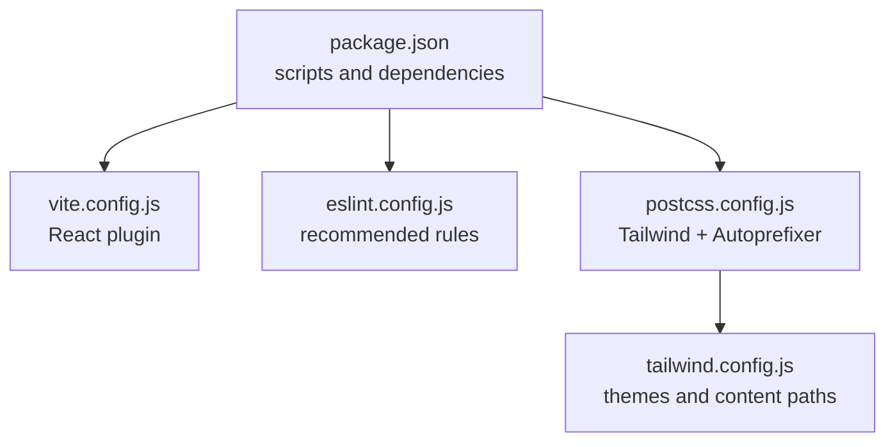
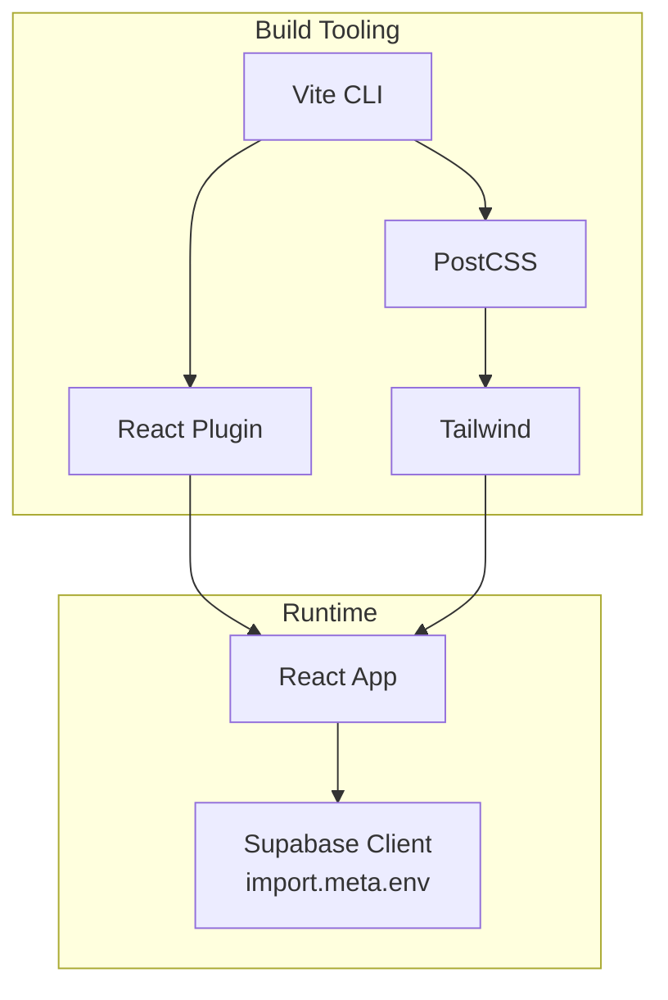
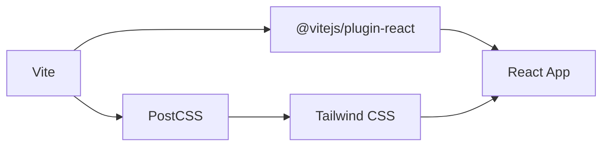

# Testing and Deployment

<cite>
**Referenced Files in This Document**
- [package.json](file://package.json)
- [vite.config.js](file://vite.config.js)
- [eslint.config.js](file://eslint.config.js)
- [postcss.config.js](file://postcss.config.js)
- [tailwind.config.js](file://tailwind.config.js)
- [src/config/supabase.js](file://src/config/supabase.js)
- [src/components/ActivityLog.jsx](file://src/components/ActivityLog.jsx)
</cite>

## Table of Contents
1. [Introduction](#introduction)
2. [Project Structure](#project-structure)
3. [Core Components](#core-components)
4. [Architecture Overview](#architecture-overview)
5. [Detailed Component Analysis](#detailed-component-analysis)
6. [Dependency Analysis](#dependency-analysis)
7. [Performance Considerations](#performance-considerations)
8. [Troubleshooting Guide](#troubleshooting-guide)
9. [Conclusion](#conclusion)
10. [Appendices](#appendices)

## Introduction
This document provides a comprehensive guide to testing strategies and deployment procedures for the Flinggo app. It covers unit and component testing approaches, integration testing patterns, build configuration with Vite, environment configuration, and production optimization techniques. It also outlines CI/CD considerations, automated testing integration, release management, and performance monitoring strategies. Guidance is grounded in the actual repository configuration and code structure.

## Project Structure
The project is a React + Vite application configured with Tailwind CSS and PostCSS. The build and linting tooling is minimalistic, enabling fast development and straightforward deployment. Key configuration files include Vite, ESLint, PostCSS, and Tailwind.

**Diagram sources**
- [package.json:1-31](file://package.json#L1-L31)
- [vite.config.js:1-7](file://vite.config.js#L1-L7)
- [eslint.config.js:1-22](file://eslint.config.js#L1-L22)
- [postcss.config.js:1-7](file://postcss.config.js#L1-L7)
- [tailwind.config.js:1-66](file://tailwind.config.js#L1-L66)

**Section sources**
- [package.json:1-31](file://package.json#L1-L31)
- [vite.config.js:1-7](file://vite.config.js#L1-L7)
- [eslint.config.js:1-22](file://eslint.config.js#L1-L22)
- [postcss.config.js:1-7](file://postcss.config.js#L1-L7)
- [tailwind.config.js:1-66](file://tailwind.config.js#L1-L66)

## Core Components
- Build and Dev Scripts: The project defines scripts for development, production build, and local preview via Vite.
- Linting: ESLint is configured with recommended rules for JS/JSX and React-specific hooks and refresh plugins.
- Styling Pipeline: Tailwind CSS is integrated with PostCSS and Autoprefixer, scanning JSX/TSX files for class usage.

Practical implications:
- Fast iteration during development due to minimal toolchain.
- Consistent styling across components using Tailwind utilities and DaisyUI themes.
- Environment separation handled via Vite’s import.meta.env for Supabase client initialization.

**Section sources**
- [package.json:6-10](file://package.json#L6-L10)
- [eslint.config.js:7-21](file://eslint.config.js#L7-L21)
- [postcss.config.js:1-7](file://postcss.config.js#L1-L7)
- [tailwind.config.js:3](file://tailwind.config.js#L3)

## Architecture Overview
The runtime architecture centers on a React frontend built with Vite and styled with Tailwind/DaisyUI. Supabase is initialized using environment variables exposed at build time.

**Diagram sources**
- [vite.config.js:4-6](file://vite.config.js#L4-L6)
- [postcss.config.js:1-7](file://postcss.config.js#L1-L7)
- [tailwind.config.js:3](file://tailwind.config.js#L3)
- [src/config/supabase.js:3-6](file://src/config/supabase.js#L3-L6)

## Detailed Component Analysis

### Testing Strategy Overview
Given the current repository configuration, there is no dedicated testing framework installed. To implement a robust testing strategy, introduce unit and component tests alongside integration tests. The following sections outline practical approaches aligned with the existing toolchain.

- Unit Testing with React Testing Library
  - Install React Testing Library and related utilities.
  - Configure a test environment compatible with Vite and React.
  - Write focused unit tests for pure functions and small logic units.

- Component Testing Methodologies
  - Use React Testing Library to render components in isolation.
  - Mock external dependencies (e.g., Supabase client) to isolate component behavior.
  - Test user interactions and rendering correctness under different props and states.

- Integration Testing Patterns
  - Test page-level flows and routing integration.
  - Mock network services and database interactions to simulate real-world scenarios.
  - Validate navigation, form submissions, and authenticated routes using context providers.

Concrete examples from the codebase:
- Environment-driven Supabase initialization demonstrates the importance of mocking environment variables in tests.
- The ActivityLog component showcases a presentational component suitable for unit testing with controlled props and event handlers.

**Section sources**
- [src/config/supabase.js:3-6](file://src/config/supabase.js#L3-L6)
- [src/components/ActivityLog.jsx:1-28](file://src/components/ActivityLog.jsx#L1-L28)

### Build Process with Vite
Current configuration:
- Single React plugin enables JSX transform and HMR.
- No explicit build optimization or aliasing configured.

Recommended enhancements:
- Add build sourcemaps for debugging.
- Introduce environment variable validation during build.
- Enable asset optimization and chunk splitting for production.

Optimization strategies:
- Leverage Vite’s built-in minification and tree-shaking.
- Use dynamic imports for route-based code splitting.
- Configure PostCSS and Tailwind for production purging of unused styles.

Bundle analysis:
- Use Vite’s built-in preview server to inspect generated assets.
- Consider integrating a third-party analyzer for deeper insights.

**Section sources**
- [vite.config.js:4-6](file://vite.config.js#L4-L6)
- [package.json:6-10](file://package.json#L6-L10)

### Environment Configuration and Supabase Integration
Supabase client initialization relies on environment variables exposed at build time. Ensure environment variables are defined per environment and validated during build.

Guidance:
- Define VITE_SUPABASE_URL and VITE_SUPABASE_ANON_KEY in development and CI environments.
- Add environment validation to prevent runtime errors when variables are missing.
- Use separate Supabase projects for development and production.

**Section sources**
- [src/config/supabase.js:3-6](file://src/config/supabase.js#L3-L6)

### CI/CD Considerations and Release Management
Proposed workflow:
- Linting and unit tests on pull requests.
- Integration tests against mocked services.
- Build and preview verification.
- Automated deployment to hosting provider after successful checks.

Release management:
- Tag releases and generate changelogs.
- Promote builds from staging to production after approval.
- Monitor deployment health and rollback capability.

[No sources needed since this section provides general guidance]

### Browser Compatibility and Accessibility
Browser support:
- Align supported browsers with Tailwind’s default configuration.
- Validate on target devices and browsers before release.

Accessibility:
- Audit components for WCAG compliance using automated tools and manual checks.
- Ensure keyboard navigation and screen reader compatibility.

Cross-platform deployment:
- Use containerized builds for reproducibility.
- Verify asset loading and routing on various hosting platforms.

[No sources needed since this section provides general guidance]

### Extending the Testing Suite
- Add React Testing Library and setup files.
- Create a shared testing utilities module for renderers, mocks, and custom queries.
- Implement snapshot tests for stable UI components and regression detection.
- Integrate coverage reporting to track test completeness.

[No sources needed since this section provides general guidance]

## Dependency Analysis
The project’s build-time and runtime dependencies influence testing and deployment choices. React and React DOM are core runtime dependencies, while Vite and PostCSS/Tailwind handle build-time concerns.

**Diagram sources**
- [vite.config.js:4-6](file://vite.config.js#L4-L6)
- [postcss.config.js:1-7](file://postcss.config.js#L1-L7)
- [tailwind.config.js:3](file://tailwind.config.js#L3)

**Section sources**
- [package.json:11-29](file://package.json#L11-L29)
- [vite.config.js:4-6](file://vite.config.js#L4-L6)
- [postcss.config.js:1-7](file://postcss.config.js#L1-L7)
- [tailwind.config.js:3](file://tailwind.config.js#L3)

## Performance Considerations
- Keep the build configuration minimal to preserve fast rebuilds.
- Use lazy loading and code splitting for large features.
- Optimize images and fonts; leverage Tailwind utilities to avoid redundant CSS.
- Monitor bundle size and remove unused dependencies regularly.

[No sources needed since this section provides general guidance]

## Troubleshooting Guide
Common issues and resolutions:
- Missing environment variables cause Supabase initialization failures. Ensure VITE_SUPABASE_URL and VITE_SUPABASE_ANON_KEY are set in all environments.
- Tailwind utilities not applied: verify content paths in Tailwind configuration match JSX/TSX locations.
- PostCSS/Autoprefixer not taking effect: confirm plugin order and presence in postcss.config.js.
- ESLint errors: align with the recommended configuration and resolve rule violations.

**Section sources**
- [src/config/supabase.js:3-6](file://src/config/supabase.js#L3-L6)
- [tailwind.config.js:3](file://tailwind.config.js#L3)
- [postcss.config.js:1-7](file://postcss.config.js#L1-L7)
- [eslint.config.js:7-21](file://eslint.config.js#L7-L21)

## Conclusion
The Flinggo app’s current setup offers a clean foundation for rapid development and straightforward deployment. By introducing a structured testing strategy—unit, component, and integration tests—and enhancing the Vite build configuration with environment validation, optimization, and bundle analysis—the project can achieve robust quality assurance and reliable deployments. Aligning CI/CD practices, accessibility standards, and performance monitoring ensures long-term maintainability and scalability.

## Appendices
- Build Artifacts: Production builds generate optimized static assets. Use the preview command to inspect output locally.
- Asset Optimization: Tailwind purges unused styles; ensure content globs cover all source files to avoid missing utilities.
- Performance Monitoring: Integrate metrics collection and error tracking in production to monitor user experience and detect regressions.

[No sources needed since this section provides general guidance]