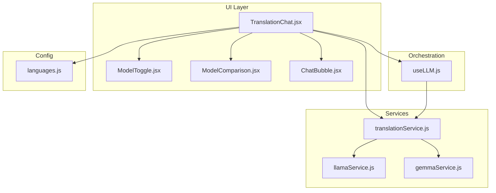
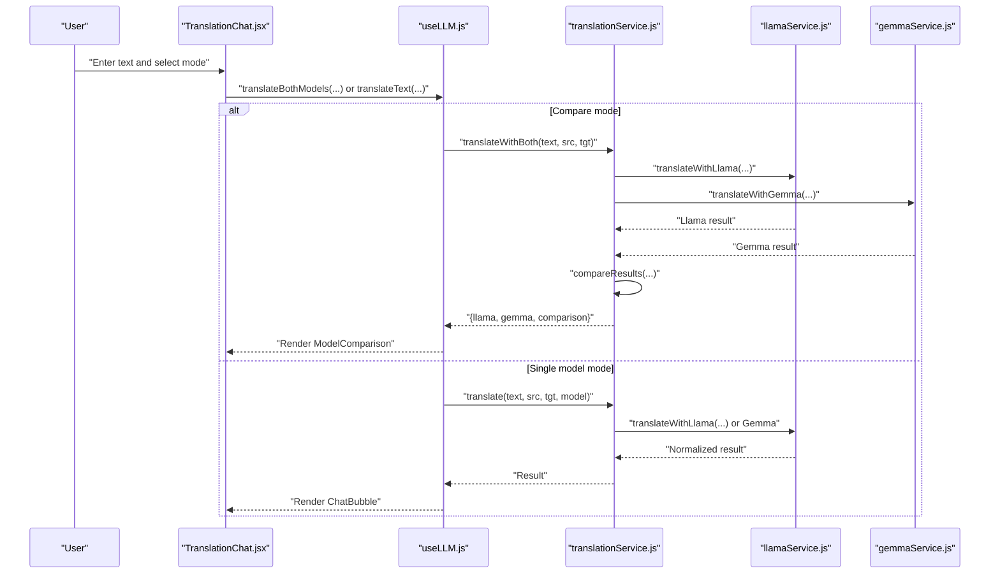
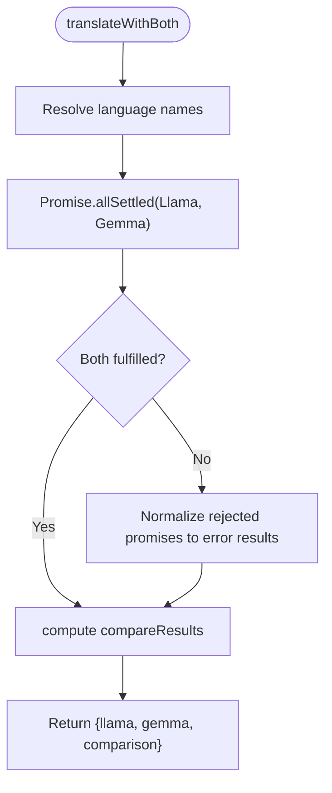
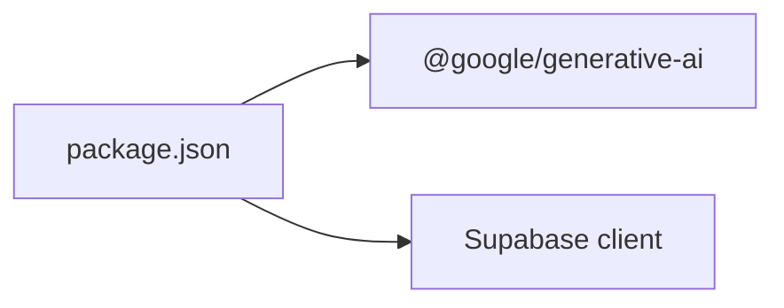
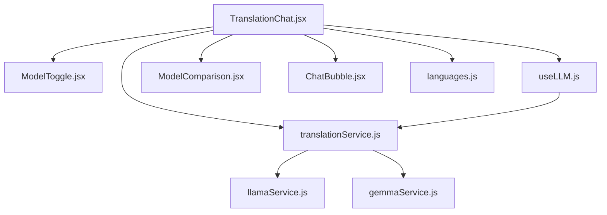

# AI Model Comparison and Selection

<cite>
**Referenced Files in This Document**
- [ModelComparison.jsx](file://src/pages/chat/ModelComparison.jsx)
- [ModelToggle.jsx](file://src/components/ModelToggle.jsx)
- [TranslationChat.jsx](file://src/pages/chat/TranslationChat.jsx)
- [useLLM.js](file://src/hooks/useLLM.js)
- [translationService.js](file://src/services/translationService.js)
- [llamaService.js](file://src/services/llamaService.js)
- [gemmaService.js](file://src/services/gemmaService.js)
- [ChatBubble.jsx](file://src/components/ChatBubble.jsx)
- [languages.js](file://src/config/languages.js)
- [package.json](file://package.json)
</cite>

## Table of Contents
1. [Introduction](#introduction)
2. [Project Structure](#project-structure)
3. [Core Components](#core-components)
4. [Architecture Overview](#architecture-overview)
5. [Detailed Component Analysis](#detailed-component-analysis)
6. [Dependency Analysis](#dependency-analysis)
7. [Performance Considerations](#performance-considerations)
8. [Troubleshooting Guide](#troubleshooting-guide)
9. [Conclusion](#conclusion)

## Introduction
This document explains the AI model comparison and selection functionality implemented in the translation chat interface. It focuses on:
- Real-time side-by-side translation comparison between Llama and Gemma models
- Model switching logic and UI controls
- Concurrent translation requests orchestration
- Result comparison algorithms and metrics
- Model configuration options and response formats
- User workflow for initiating comparisons and interpreting results
- Technical considerations for managing multiple AI service connections

## Project Structure
The comparison feature spans UI components, a hook for orchestration, and service modules for each AI provider. The primary files involved are:
- UI: TranslationChat.jsx (page), ModelToggle.jsx (controls), ModelComparison.jsx (results), ChatBubble.jsx (single-model results)
- Orchestration: useLLM.js (hook)
- Services: translationService.js (coordinator), llamaService.js (Llama API), gemmaService.js (Gemma API)
- Configuration: languages.js (language metadata)

**Diagram sources**
- [TranslationChat.jsx:11-197](file://src/pages/chat/TranslationChat.jsx#L11-L197)
- [ModelToggle.jsx:7-24](file://src/components/ModelToggle.jsx#L7-L24)
- [ModelComparison.jsx:3-81](file://src/pages/chat/ModelComparison.jsx#L3-L81)
- [ChatBubble.jsx:3-32](file://src/components/ChatBubble.jsx#L3-L32)
- [useLLM.js:4-38](file://src/hooks/useLLM.js#L4-L38)
- [translationService.js:12-73](file://src/services/translationService.js#L12-L73)
- [llamaService.js:14-60](file://src/services/llamaService.js#L14-L60)
- [gemmaService.js:16-45](file://src/services/gemmaService.js#L16-L45)
- [languages.js:1-30](file://src/config/languages.js#L1-L30)

**Section sources**
- [TranslationChat.jsx:11-197](file://src/pages/chat/TranslationChat.jsx#L11-L197)
- [ModelToggle.jsx:7-24](file://src/components/ModelToggle.jsx#L7-L24)
- [ModelComparison.jsx:3-81](file://src/pages/chat/ModelComparison.jsx#L3-L81)
- [ChatBubble.jsx:3-32](file://src/components/ChatBubble.jsx#L3-L32)
- [useLLM.js:4-38](file://src/hooks/useLLM.js#L4-L38)
- [translationService.js:12-73](file://src/services/translationService.js#L12-L73)
- [llamaService.js:14-60](file://src/services/llamaService.js#L14-L60)
- [gemmaService.js:16-45](file://src/services/gemmaService.js#L16-L45)
- [languages.js:1-30](file://src/config/languages.js#L1-L30)

## Core Components
- ModelToggle.jsx: Provides a button group to switch between Llama, Gemma, and Compare Both modes.
- TranslationChat.jsx: Orchestrates user input, language selection, mode selection, and renders either single-model results (via ChatBubble) or comparison results (via ModelComparison).
- useLLM.js: Exposes translateText and translateBothModels functions with loading/error state management.
- translationService.js: Central coordinator that routes to the appropriate model service and performs parallel translation and comparison.
- llamaService.js and gemmaService.js: Implement model-specific translation requests and normalize responses to a unified format.
- ModelComparison.jsx: Renders side-by-side results and comparison metrics.
- ChatBubble.jsx: Renders a single model’s translation with confidence and explanation.

Key responsibilities:
- Mode selection and rendering: ModelToggle and TranslationChat
- Request orchestration: useLLM and translationService
- Provider-specific implementations: llamaService and gemmaService
- Result presentation: ModelComparison and ChatBubble

**Section sources**
- [ModelToggle.jsx:7-24](file://src/components/ModelToggle.jsx#L7-L24)
- [TranslationChat.jsx:11-197](file://src/pages/chat/TranslationChat.jsx#L11-L197)
- [useLLM.js:4-38](file://src/hooks/useLLM.js#L4-L38)
- [translationService.js:12-73](file://src/services/translationService.js#L12-L73)
- [llamaService.js:14-60](file://src/services/llamaService.js#L14-L60)
- [gemmaService.js:16-45](file://src/services/gemmaService.js#L16-L45)
- [ModelComparison.jsx:3-81](file://src/pages/chat/ModelComparison.jsx#L3-L81)
- [ChatBubble.jsx:3-32](file://src/components/ChatBubble.jsx#L3-L32)

## Architecture Overview
The system follows a layered architecture:
- UI layer handles user interactions and rendering
- Hook layer manages state and orchestrates requests
- Service layer encapsulates provider-specific logic
- Configuration layer supplies language metadata

**Diagram sources**
- [TranslationChat.jsx:30-98](file://src/pages/chat/TranslationChat.jsx#L30-L98)
- [useLLM.js:8-34](file://src/hooks/useLLM.js#L8-L34)
- [translationService.js:25-42](file://src/services/translationService.js#L25-L42)
- [llamaService.js:14-60](file://src/services/llamaService.js#L14-L60)
- [gemmaService.js:16-45](file://src/services/gemmaService.js#L16-L45)

## Detailed Component Analysis

### ModelToggle.jsx
- Purpose: Provide a compact button group to switch between Llama, Gemma, and Compare Both modes.
- Behavior: Uses a predefined MODES array to render buttons. Calls onChange with the selected mode id on click.
- UI: Uses Tailwind classes and badges for visual feedback.

Implementation highlights:
- Modes: "llama", "gemma", "compare"
- Active mode styling: Primary vs outline based on equality
- Accessibility: Click handler triggers mode change

**Section sources**
- [ModelToggle.jsx:1-5](file://src/components/ModelToggle.jsx#L1-L5)
- [ModelToggle.jsx:7-24](file://src/components/ModelToggle.jsx#L7-L24)

### TranslationChat.jsx
- Purpose: Main chat page for translation interactions.
- Features:
  - Language selector and swap functionality
  - Model toggle integration
  - Message history with user and bot messages
  - Sample prompts for quick testing
  - Save translation records when authenticated
- Mode handling:
  - Single model: Calls translateText with selected model
  - Compare mode: Calls translateBothModels and renders ModelComparison

Key flows:
- handleSend: Validates input, dispatches translation, constructs bot messages, saves translation if user is logged in
- Rendering: Conditional rendering of ModelComparison for compare mode and ChatBubble for single model

**Section sources**
- [TranslationChat.jsx:11-197](file://src/pages/chat/TranslationChat.jsx#L11-L197)

### useLLM.js
- Purpose: Encapsulate translation logic with loading and error states.
- Functions:
  - translateText: Single model translation
  - translateBothModels: Parallel translation with comparison
- State: isLoading and error managed internally

**Section sources**
- [useLLM.js:4-38](file://src/hooks/useLLM.js#L4-L38)

### translationService.js
- Purpose: Centralized coordination for translation requests and comparison.
- translate(text, sourceLangCode, targetLangCode, model):
  - Resolves language names via languages.js
  - Routes to llamaService or gemmaService based on model
- translateWithBoth(text, sourceLangCode, targetLangCode):
  - Executes both providers concurrently using Promise.allSettled
  - Normalizes failures into structured results with error messages
  - Computes comparison metrics via compareResults
- compareResults(llamaOutput, gemmaOutput):
  - Word counts and character counts
  - Word similarity using Jaccard-like metric on token sets
  - Confidence scores included for downstream display

**Diagram sources**
- [translationService.js:25-42](file://src/services/translationService.js#L25-L42)
- [translationService.js:47-72](file://src/services/translationService.js#L47-L72)

**Section sources**
- [translationService.js:12-20](file://src/services/translationService.js#L12-L20)
- [translationService.js:25-42](file://src/services/translationService.js#L25-L42)
- [translationService.js:47-72](file://src/services/translationService.js#L47-L72)

### llamaService.js
- Purpose: Implement Llama translation via a REST API.
- Request construction:
  - Endpoint: Llama API chat completions
  - Headers: Content-Type and Authorization
  - Body: System prompt + user prompt, model id, temperature, max tokens
- Response parsing:
  - Extracts content from choices[0].message.content
  - Parses JSON payload if present; otherwise falls back to raw content
  - Normalizes to a unified result shape with model name, confidence, explanation, alternatives

**Section sources**
- [llamaService.js:14-60](file://src/services/llamaService.js#L14-L60)

### gemmaService.js
- Purpose: Implement Gemma translation via Google Generative AI SDK.
- Request construction:
  - Initializes GoogleGenerativeAI with API key
  - Sets system instruction and model id
  - Sends user prompt and expects JSON response
- Response parsing:
  - Parses JSON payload if present; otherwise falls back to raw content
  - Normalizes to a unified result shape with model name, confidence, explanation, alternatives

**Section sources**
- [gemmaService.js:16-45](file://src/services/gemmaService.js#L16-L45)

### ModelComparison.jsx
- Purpose: Render side-by-side translation results and comparison metrics.
- Layout: Two-column cards for Llama and Gemma, plus a metrics card below.
- Data fields:
  - Translation text
  - Confidence percentage
  - Explanation (if present)
  - Alternatives list (if present)
  - Metrics: word similarity percentage, word counts, character counts

**Section sources**
- [ModelComparison.jsx:3-81](file://src/pages/chat/ModelComparison.jsx#L3-L81)

### ChatBubble.jsx
- Purpose: Render a single model’s translation with optional model badge, explanation, and confidence.
- Behavior: Uses animation library for smooth appearance and displays timestamp footer.

**Section sources**
- [ChatBubble.jsx:3-32](file://src/components/ChatBubble.jsx#L3-L32)

## Dependency Analysis
External dependencies relevant to the comparison feature:
- @google/generative-ai: Used by gemmaService.js for Gemini API integration
- @supabase/supabase-js: Used by TranslationChat.jsx for saving translation records
- framer-motion: Used by ChatBubble.jsx for animations

**Diagram sources**
- [package.json:11-20](file://package.json#L11-L20)

Internal dependencies:
- TranslationChat.jsx depends on ModelToggle, useLLM, ModelComparison, ChatBubble, and services
- useLLM depends on translationService
- translationService depends on llamaService and gemmaService
- translationService depends on languages.js for language name resolution

**Diagram sources**
- [TranslationChat.jsx:11-197](file://src/pages/chat/TranslationChat.jsx#L11-L197)
- [ModelToggle.jsx:7-24](file://src/components/ModelToggle.jsx#L7-L24)
- [useLLM.js:4-38](file://src/hooks/useLLM.js#L4-L38)
- [translationService.js:12-73](file://src/services/translationService.js#L12-L73)
- [llamaService.js:14-60](file://src/services/llamaService.js#L14-L60)
- [gemmaService.js:16-45](file://src/services/gemmaService.js#L16-L45)
- [languages.js:1-30](file://src/config/languages.js#L1-L30)

**Section sources**
- [package.json:11-20](file://package.json#L11-L20)
- [TranslationChat.jsx:11-197](file://src/pages/chat/TranslationChat.jsx#L11-L197)
- [translationService.js:12-73](file://src/services/translationService.js#L12-L73)

## Performance Considerations
- Concurrency: translateWithBoth uses Promise.allSettled to issue both requests simultaneously, reducing total latency compared to sequential calls.
- Error resilience: Even if one provider fails, the other result is still returned with an error message embedded in the result object.
- Parsing robustness: Both services include fallbacks when JSON parsing fails, preventing crashes and returning usable content.
- Tokenization: compareResults uses simple whitespace splitting and set-based intersection for similarity; this is fast but basic. For improved accuracy, consider tokenizers (e.g., sentencepiece) or more advanced similarity metrics (cosine similarity on embeddings).
- Network overhead: Using a single system prompt and concise user prompts minimizes payload sizes.

[No sources needed since this section provides general guidance]

## Troubleshooting Guide
Common issues and resolutions:
- API key errors:
  - Llama: translateWithLlama throws on non-OK responses; ensure VITE_META_AI_API_KEY is configured and valid.
  - Gemma: gemmaService initializes GoogleGenerativeAI with VITE_GOOGLE_AI_API_KEY; ensure the environment variable is set.
- JSON parsing failures:
  - Both services fall back to raw content when JSON parsing fails; verify provider responses conform to expected JSON schema.
- Translation not appearing:
  - Ensure mode is set correctly; compare mode requires mode "compare".
  - Confirm language codes are valid and supported by the language list.
- Supabase save failures:
  - Saving translations occurs only when user is authenticated; check authentication state and network connectivity.

Operational checks:
- Environment variables: Verify VITE_META_AI_API_KEY and VITE_GOOGLE_AI_API_KEY are present.
- Network connectivity: Ensure outbound access to provider APIs is permitted.
- UI state: isLoading prevents duplicate submissions; confirm it resets after completion.

**Section sources**
- [llamaService.js:34-37](file://src/services/llamaService.js#L34-L37)
- [gemmaService.js:27-44](file://src/services/gemmaService.js#L27-L44)
- [TranslationChat.jsx:89-97](file://src/pages/chat/TranslationChat.jsx#L89-L97)

## Conclusion
The AI model comparison and selection feature provides a seamless, real-time side-by-side translation experience between Llama and Gemma. Users can:
- Select a single model for focused translation
- Switch to Compare Both to see side-by-side results and metrics
- Interpret confidence levels, explanations, and alternative suggestions
- Understand word similarity and length differences between models

The implementation leverages concurrent requests, resilient parsing, and a unified result format to deliver a robust and user-friendly experience. Future enhancements could include richer similarity metrics, model-specific tuning parameters, and expanded provider support.