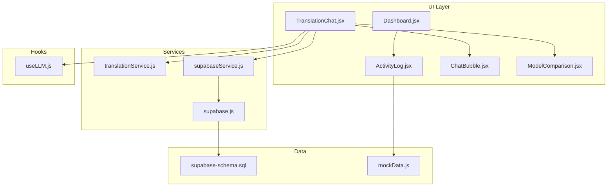
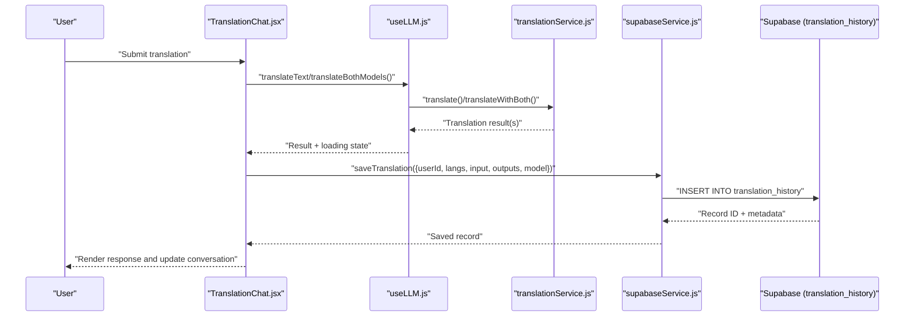
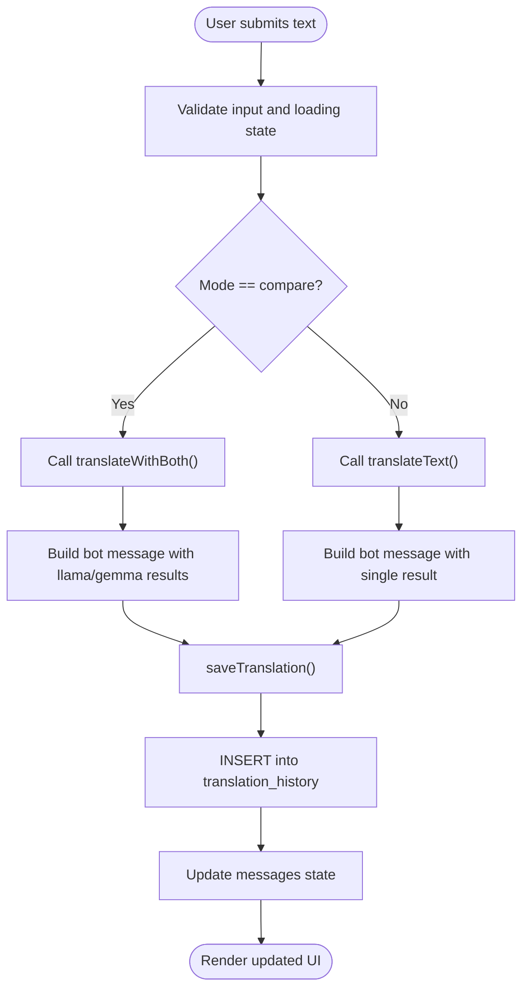
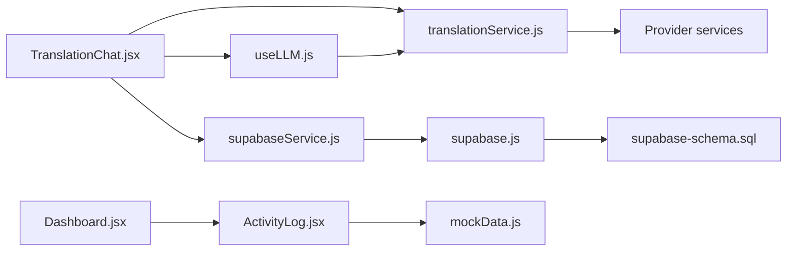

# Conversation History and Storage

<cite>
**Referenced Files in This Document**
- [ActivityLog.jsx](file://src/components/ActivityLog.jsx)
- [mockData.js](file://src/data/mockData.js)
- [TranslationChat.jsx](file://src/pages/chat/TranslationChat.jsx)
- [translationService.js](file://src/services/translationService.js)
- [supabaseService.js](file://src/services/supabaseService.js)
- [supabase.js](file://src/config/supabase.js)
- [supabase-schema.sql](file://supabase-schema.sql)
- [useLLM.js](file://src/hooks/useLLM.js)
- [ChatBubble.jsx](file://src/components/ChatBubble.jsx)
- [ModelComparison.jsx](file://src/pages/chat/ModelComparison.jsx)
- [Dashboard.jsx](file://src/pages/dashboard/Dashboard.jsx)
</cite>

## Table of Contents
1. [Introduction](#introduction)
2. [Project Structure](#project-structure)
3. [Core Components](#core-components)
4. [Architecture Overview](#architecture-overview)
5. [Detailed Component Analysis](#detailed-component-analysis)
6. [Dependency Analysis](#dependency-analysis)
7. [Performance Considerations](#performance-considerations)
8. [Troubleshooting Guide](#troubleshooting-guide)
9. [Privacy and Data Retention](#privacy-and-data-retention)
10. [Export and Sharing Features](#export-and-sharing-features)
11. [Conclusion](#conclusion)

## Introduction
This document explains the conversation history management and storage system for translation interactions. It covers how translation conversations are tracked, stored, and displayed to users, focusing on the data lifecycle from creation to potential archival or deletion. It also documents the UI components involved in browsing and presenting conversation history, outlines the underlying database schema, and provides guidance for extending functionality such as search, filtering, export, and integration with external storage systems.

## Project Structure
The conversation history system spans several layers:
- UI surfaces for translation and recent activity
- Services for translation and persistence
- Supabase client and schema for secure, server-side storage
- Hooks and components for rendering and user interaction

**Diagram sources**
- [TranslationChat.jsx:1-197](file://src/pages/chat/TranslationChat.jsx#L1-L197)
- [ActivityLog.jsx:1-29](file://src/components/ActivityLog.jsx#L1-L29)
- [ChatBubble.jsx:1-32](file://src/components/ChatBubble.jsx#L1-L32)
- [ModelComparison.jsx:1-81](file://src/pages/chat/ModelComparison.jsx#L1-L81)
- [Dashboard.jsx:1-151](file://src/pages/dashboard/Dashboard.jsx#L1-L151)
- [translationService.js:1-73](file://src/services/translationService.js#L1-L73)
- [supabaseService.js:1-132](file://src/services/supabaseService.js#L1-L132)
- [supabase.js:1-7](file://src/config/supabase.js#L1-L7)
- [supabase-schema.sql:1-119](file://supabase-schema.sql#L1-L119)
- [mockData.js:1-47](file://src/data/mockData.js#L1-L47)
- [useLLM.js:1-38](file://src/hooks/useLLM.js#L1-L38)

**Section sources**
- [TranslationChat.jsx:1-197](file://src/pages/chat/TranslationChat.jsx#L1-L197)
- [ActivityLog.jsx:1-29](file://src/components/ActivityLog.jsx#L1-L29)
- [supabaseService.js:1-132](file://src/services/supabaseService.js#L1-L132)
- [supabase-schema.sql:1-119](file://supabase-schema.sql#L1-L119)

## Core Components
- TranslationChat: Manages live conversation state, renders messages, and persists translation requests/responses to the backend.
- translationService: Orchestrates translation via multiple providers and computes comparison metrics.
- supabaseService: Provides CRUD operations for translation history and other platform data.
- ActivityLog: Displays recent activity entries (mocked) for quick overview.
- ChatBubble and ModelComparison: Render individual messages and model comparison results.
- useLLM: Hook that encapsulates translation calls and loading/error states.
- Supabase client and schema: Define connection and row-level security for translation_history.

**Section sources**
- [TranslationChat.jsx:1-197](file://src/pages/chat/TranslationChat.jsx#L1-L197)
- [translationService.js:1-73](file://src/services/translationService.js#L1-L73)
- [supabaseService.js:1-132](file://src/services/supabaseService.js#L1-L132)
- [ActivityLog.jsx:1-29](file://src/components/ActivityLog.jsx#L1-L29)
- [ChatBubble.jsx:1-32](file://src/components/ChatBubble.jsx#L1-L32)
- [ModelComparison.jsx:1-81](file://src/pages/chat/ModelComparison.jsx#L1-L81)
- [useLLM.js:1-38](file://src/hooks/useLLM.js#L1-L38)
- [supabase.js:1-7](file://src/config/supabase.js#L1-L7)
- [supabase-schema.sql:26-46](file://supabase-schema.sql#L26-L46)

## Architecture Overview
The system follows a clean separation of concerns:
- UI captures user input and renders conversation messages.
- Services delegate translation to provider-specific implementations.
- Persistence service writes translation records to Supabase with row-level security enforced.
- Dashboard displays recent activity using mocked data; future enhancements can integrate real history.

**Diagram sources**
- [TranslationChat.jsx:30-98](file://src/pages/chat/TranslationChat.jsx#L30-L98)
- [useLLM.js:8-34](file://src/hooks/useLLM.js#L8-L34)
- [translationService.js:12-72](file://src/services/translationService.js#L12-L72)
- [supabaseService.js:5-17](file://src/services/supabaseService.js#L5-L17)

## Detailed Component Analysis

### TranslationChat: Conversation Lifecycle
Responsibilities:
- Capture user input and maintain an in-memory messages array.
- Invoke translation services depending on mode (single or comparison).
- Persist successful translation requests and responses to the backend.
- Render messages using ChatBubble or ModelComparison components.
- Manage loading states and error messaging.

Key behaviors:
- Creation: On send, user and bot messages are appended to state; timestamps are generated locally for UI display.
- Update: Messages are updated reactively as new results arrive.
- Deletion: Not implemented in the current code; deletion would require adding a delete action and backend endpoint.
- Archiving: Not implemented; could be modeled as marking records inactive or moving to historical tables.

**Diagram sources**
- [TranslationChat.jsx:30-98](file://src/pages/chat/TranslationChat.jsx#L30-L98)
- [supabaseService.js:5-17](file://src/services/supabaseService.js#L5-L17)

**Section sources**
- [TranslationChat.jsx:1-197](file://src/pages/chat/TranslationChat.jsx#L1-L197)
- [ChatBubble.jsx:1-32](file://src/components/ChatBubble.jsx#L1-L32)
- [ModelComparison.jsx:1-81](file://src/pages/chat/ModelComparison.jsx#L1-L81)
- [useLLM.js:1-38](file://src/hooks/useLLM.js#L1-L38)
- [translationService.js:12-72](file://src/services/translationService.js#L12-L72)

### translationService: Translation Orchestration
Responsibilities:
- Route translation requests to provider-specific services.
- Compute comparison metrics between two model outputs.
- Normalize language codes to readable names for display.

Important outputs:
- Single model translation result includes translation text, model name, optional explanation, and confidence.
- Combined comparison result includes word counts, character counts, and similarity percentage.

**Section sources**
- [translationService.js:1-73](file://src/services/translationService.js#L1-L73)

### supabaseService: Persistence Layer
Responsibilities:
- Insert translation records with user context and model outputs.
- Retrieve user-specific translation history with ordering and limits.
- Provide other platform data accessors (quiz attempts, progress, etc.).

Data shape for translation_history:
- Fields include identifiers, user reference, source/target languages, input text, provider outputs, selected model, and timestamps.

Security:
- Row-level security policies restrict access to authenticated users’ own records.

**Section sources**
- [supabaseService.js:5-28](file://src/services/supabaseService.js#L5-L28)
- [supabase-schema.sql:26-46](file://supabase-schema.sql#L26-L46)

### ActivityLog: Recent Activity Display
Current behavior:
- Renders a static list of recent activity entries from mock data.
- Provides a “View all” button for navigation.

Future enhancements:
- Replace mock data with dynamic translation history fetched from the backend.
- Add filtering by date range, language pair, or model selection.
- Add search capability to filter by input text or translated text.

**Section sources**
- [ActivityLog.jsx:1-29](file://src/components/ActivityLog.jsx#L1-L29)
- [mockData.js:16-21](file://src/data/mockData.js#L16-L21)
- [Dashboard.jsx:112-147](file://src/pages/dashboard/Dashboard.jsx#L112-L147)

### UI Rendering Components
- ChatBubble: Renders user/bot messages with optional model badges, explanations, and confidence indicators.
- ModelComparison: Renders side-by-side model outputs and comparison metrics.

**Section sources**
- [ChatBubble.jsx:1-32](file://src/components/ChatBubble.jsx#L1-L32)
- [ModelComparison.jsx:1-81](file://src/pages/chat/ModelComparison.jsx#L1-L81)

## Dependency Analysis
High-level dependencies:
- TranslationChat depends on useLLM, translationService, and supabaseService.
- useLLM depends on translationService.
- translationService depends on provider services and language utilities.
- supabaseService depends on the Supabase client and schema.
- ActivityLog depends on mockData; Dashboard composes ActivityLog.

**Diagram sources**
- [TranslationChat.jsx:1-10](file://src/pages/chat/TranslationChat.jsx#L1-L10)
- [useLLM.js:1-3](file://src/hooks/useLLM.js#L1-L3)
- [translationService.js:1-3](file://src/services/translationService.js#L1-L3)
- [supabaseService.js](file://src/services/supabaseService.js#L1)
- [supabase.js:1-7](file://src/config/supabase.js#L1-L7)
- [supabase-schema.sql:1-119](file://supabase-schema.sql#L1-L119)
- [Dashboard.jsx](file://src/pages/dashboard/Dashboard.jsx#L5)
- [ActivityLog.jsx](file://src/components/ActivityLog.jsx#L1)
- [mockData.js:16-21](file://src/data/mockData.js#L16-L21)

**Section sources**
- [TranslationChat.jsx:1-10](file://src/pages/chat/TranslationChat.jsx#L1-L10)
- [supabaseService.js:1-1](file://src/services/supabaseService.js#L1-L1)
- [supabase.js:1-7](file://src/config/supabase.js#L1-L7)
- [supabase-schema.sql:1-119](file://supabase-schema.sql#L1-L119)
- [Dashboard.jsx](file://src/pages/dashboard/Dashboard.jsx#L5)
- [ActivityLog.jsx](file://src/components/ActivityLog.jsx#L1)
- [mockData.js:16-21](file://src/data/mockData.js#L16-L21)

## Performance Considerations
- Network latency: Translation calls are asynchronous; ensure loading states are visible to users.
- Pagination: History retrieval supports a configurable limit; consider pagination or infinite scroll for long histories.
- Sorting: Backend sorts by creation time descending; keep this index for optimal performance.
- Caching: Consider local caching of recent history to reduce network calls and improve responsiveness.
- Comparison computations: Word overlap metrics are computed client-side; keep inputs bounded to avoid heavy computations.

[No sources needed since this section provides general guidance]

## Troubleshooting Guide
Common issues and remedies:
- Translation errors: The UI displays an error message derived from the thrown error; verify API keys and service availability.
- Missing history: Ensure the user is authenticated; RLS policies restrict access to authenticated users’ own records.
- Empty activity log: ActivityLog currently uses mock data; connect it to real history data for accurate display.

**Section sources**
- [TranslationChat.jsx:89-97](file://src/pages/chat/TranslationChat.jsx#L89-L97)
- [supabaseService.js:19-28](file://src/services/supabaseService.js#L19-L28)
- [supabase-schema.sql:41-45](file://supabase-schema.sql#L41-L45)

## Privacy and Data Retention
Privacy considerations:
- Data minimization: Only persist necessary fields (input text, outputs, model selection, timestamps).
- User consent: Ensure users understand what data is stored and how it is used.
- Access control: RLS policies restrict access to authenticated users’ own records.

Retention policies:
- Define a policy to automatically archive or delete old records after a fixed period (e.g., 12 months).
- Provide users with explicit controls to delete their history.
- Consider anonymization for analytics while preserving compliance.

[No sources needed since this section provides general guidance]

## Export and Sharing Features
Proposed extension points:
- Export endpoint: Add a backend route to export translation history as CSV/JSON for a given user.
- Shareable links: Generate short-lived signed URLs for specific conversations (requires backend signing and access control).
- Bulk actions: Allow users to select multiple conversations and export or delete them in batches.

Implementation guidance:
- Frontend: Add export UI controls and handle download prompts.
- Backend: Enforce user ownership and apply rate limiting; sanitize exported content.
- Security: Use signed URLs or server-side generation to prevent unauthorized access.

[No sources needed since this section provides general guidance]

## Conclusion
The conversation history system integrates UI, translation orchestration, and secure persistence to capture and present translation interactions. While the current implementation focuses on saving translation requests and responses, future enhancements can include robust browsing, filtering, search, export, and retention controls to meet user needs and regulatory requirements.