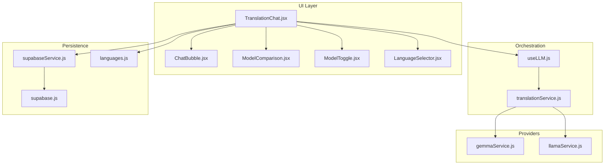
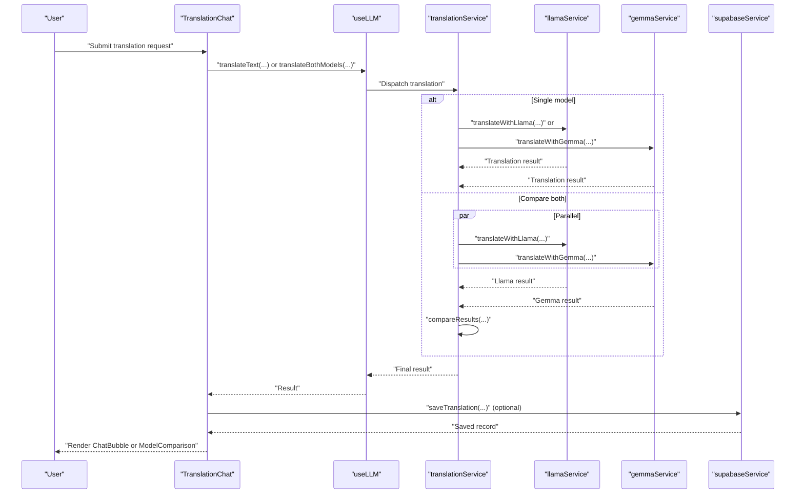
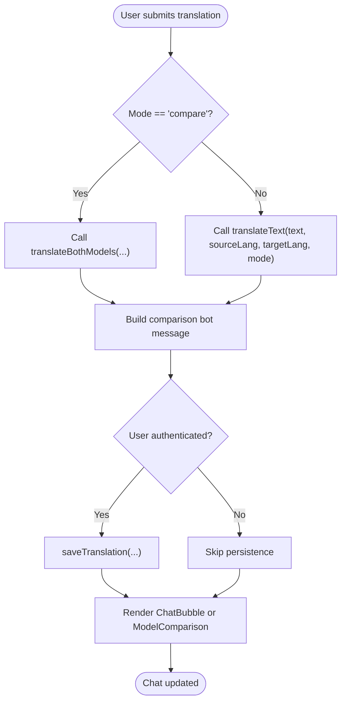
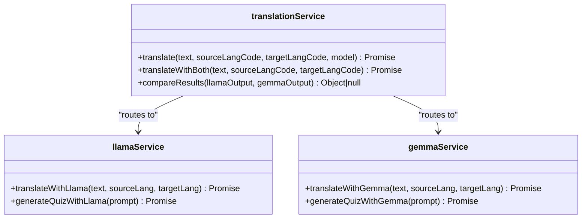
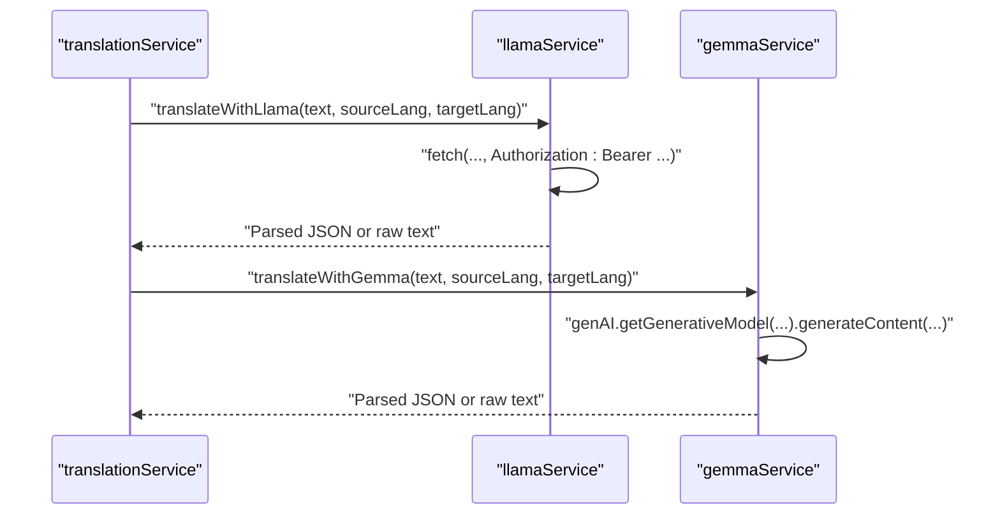
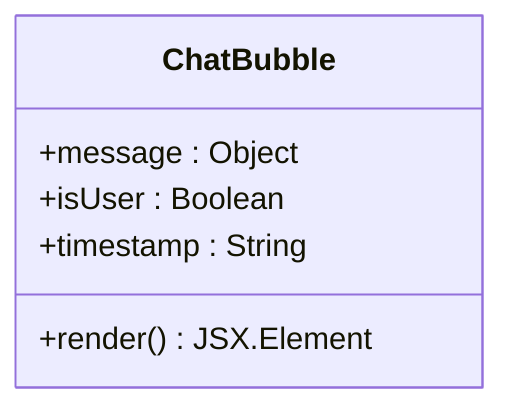
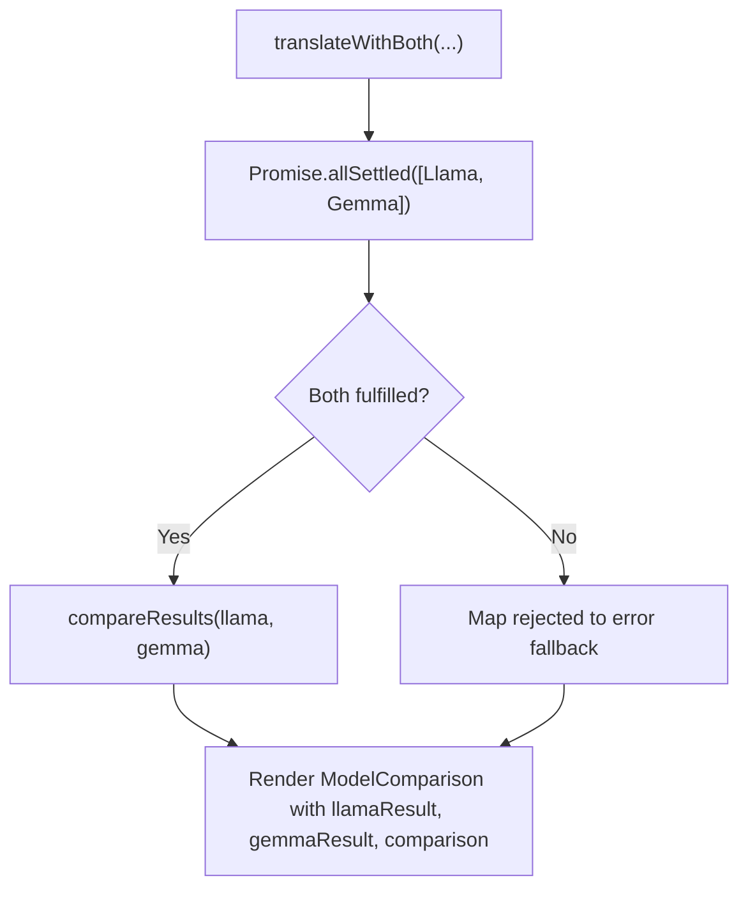
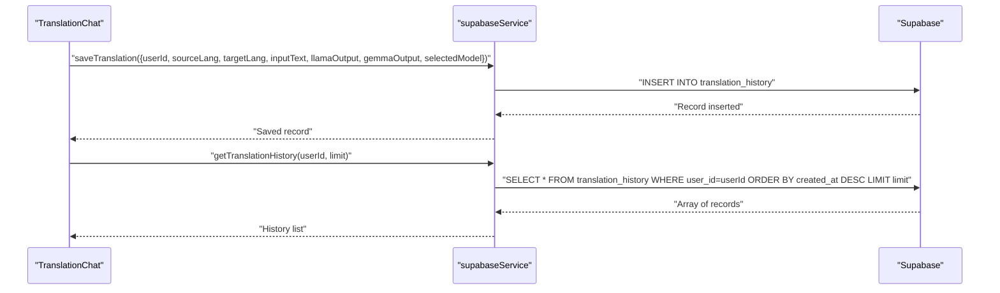
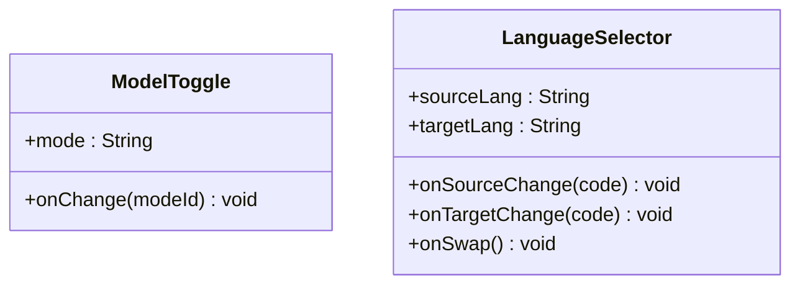
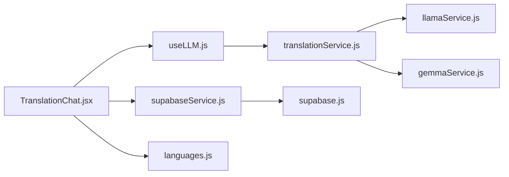

# Translation Chat System

<cite>
**Referenced Files in This Document**
- [TranslationChat.jsx](file://src/pages/chat/TranslationChat.jsx)
- [translationService.js](file://src/services/translationService.js)
- [ChatBubble.jsx](file://src/components/ChatBubble.jsx)
- [ModelComparison.jsx](file://src/pages/chat/ModelComparison.jsx)
- [gemmaService.js](file://src/services/gemmaService.js)
- [llamaService.js](file://src/services/llamaService.js)
- [useLLM.js](file://src/hooks/useLLM.js)
- [ModelToggle.jsx](file://src/components/ModelToggle.jsx)
- [LanguageSelector.jsx](file://src/components/LanguageSelector.jsx)
- [supabaseService.js](file://src/services/supabaseService.js)
- [languages.js](file://src/config/languages.js)
- [supabase.js](file://src/config/supabase.js)
</cite>

## Table of Contents
1. [Introduction](#introduction)
2. [Project Structure](#project-structure)
3. [Core Components](#core-components)
4. [Architecture Overview](#architecture-overview)
5. [Detailed Component Analysis](#detailed-component-analysis)
6. [Dependency Analysis](#dependency-analysis)
7. [Performance Considerations](#performance-considerations)
8. [Troubleshooting Guide](#troubleshooting-guide)
9. [Conclusion](#conclusion)
10. [Appendices](#appendices)

## Introduction
This document explains the translation chat system built with React and Vite. It covers the real-time translation interface, AI model comparison, translation history management, and the orchestration layer that coordinates between Llama and Gemma models. It also documents the ChatBubble component for rendering conversation history, the model comparison feature, Google Generative AI integration, error handling strategies, performance considerations, and guidance for extending the system with additional AI models.

## Project Structure
The translation chat system is organized around a page component that manages UI state, integrates with a service orchestration layer, and renders model-specific outputs and comparisons. Supporting services encapsulate provider-specific logic, while shared components render UI and manage user interactions.

**Diagram sources**
- [TranslationChat.jsx:11-197](file://src/pages/chat/TranslationChat.jsx#L11-L197)
- [useLLM.js:4-38](file://src/hooks/useLLM.js#L4-L38)
- [translationService.js:12-73](file://src/services/translationService.js#L12-L73)
- [gemmaService.js:16-45](file://src/services/gemmaService.js#L16-L45)
- [llamaService.js:14-60](file://src/services/llamaService.js#L14-L60)
- [ChatBubble.jsx:3-32](file://src/components/ChatBubble.jsx#L3-L32)
- [ModelComparison.jsx:3-81](file://src/pages/chat/ModelComparison.jsx#L3-L81)
- [ModelToggle.jsx:7-24](file://src/components/ModelToggle.jsx#L7-L24)
- [LanguageSelector.jsx:3-49](file://src/components/LanguageSelector.jsx#L3-L49)
- [supabaseService.js:5-28](file://src/services/supabaseService.js#L5-L28)
- [supabase.js:1-7](file://src/config/supabase.js#L1-L7)
- [languages.js:1-30](file://src/config/languages.js#L1-L30)

**Section sources**
- [TranslationChat.jsx:11-197](file://src/pages/chat/TranslationChat.jsx#L11-L197)
- [translationService.js:12-73](file://src/services/translationService.js#L12-L73)
- [useLLM.js:4-38](file://src/hooks/useLLM.js#L4-L38)
- [gemmaService.js:16-45](file://src/services/gemmaService.js#L16-L45)
- [llamaService.js:14-60](file://src/services/llamaService.js#L14-L60)
- [ChatBubble.jsx:3-32](file://src/components/ChatBubble.jsx#L3-L32)
- [ModelComparison.jsx:3-81](file://src/pages/chat/ModelComparison.jsx#L3-L81)
- [ModelToggle.jsx:7-24](file://src/components/ModelToggle.jsx#L7-L24)
- [LanguageSelector.jsx:3-49](file://src/components/LanguageSelector.jsx#L3-L49)
- [supabaseService.js:5-28](file://src/services/supabaseService.js#L5-L28)
- [supabase.js:1-7](file://src/config/supabase.js#L1-L7)
- [languages.js:1-30](file://src/config/languages.js#L1-L30)

## Core Components
- TranslationChat: Orchestrates user input, language selection, model mode, and message rendering. Handles sending requests, saving history, and error messaging.
- translationService: Central orchestration layer that routes to provider-specific services and compares outputs.
- useLLM: Hook that exposes translateText and translateBothModels with loading/error state.
- gemmaService and llamaService: Provider-specific services integrating with Google Generative AI and Meta’s Llama API respectively.
- ChatBubble: Renders individual chat messages with model metadata, confidence, and explanation.
- ModelComparison: Side-by-side comparison of Llama and Gemma outputs with metrics.
- ModelToggle and LanguageSelector: UI controls for model selection and language swapping.
- supabaseService: Persists translation history and retrieves it for users.

**Section sources**
- [TranslationChat.jsx:11-197](file://src/pages/chat/TranslationChat.jsx#L11-L197)
- [translationService.js:12-73](file://src/services/translationService.js#L12-L73)
- [useLLM.js:4-38](file://src/hooks/useLLM.js#L4-L38)
- [gemmaService.js:16-45](file://src/services/gemmaService.js#L16-L45)
- [llamaService.js:14-60](file://src/services/llamaService.js#L14-L60)
- [ChatBubble.jsx:3-32](file://src/components/ChatBubble.jsx#L3-L32)
- [ModelComparison.jsx:3-81](file://src/pages/chat/ModelComparison.jsx#L3-L81)
- [ModelToggle.jsx:7-24](file://src/components/ModelToggle.jsx#L7-L24)
- [LanguageSelector.jsx:3-49](file://src/components/LanguageSelector.jsx#L3-L49)
- [supabaseService.js:5-28](file://src/services/supabaseService.js#L5-L28)

## Architecture Overview
The system follows a layered architecture:
- UI Layer: Page and components manage user interactions and rendering.
- Orchestration Layer: Hook and service coordinate model selection and request dispatch.
- Provider Layer: Services encapsulate external API integrations.
- Persistence Layer: Supabase-backed service persists and retrieves translation history.

**Diagram sources**
- [TranslationChat.jsx:30-98](file://src/pages/chat/TranslationChat.jsx#L30-L98)
- [useLLM.js:8-34](file://src/hooks/useLLM.js#L8-L34)
- [translationService.js:12-73](file://src/services/translationService.js#L12-L73)
- [llamaService.js:14-60](file://src/services/llamaService.js#L14-L60)
- [gemmaService.js:16-45](file://src/services/gemmaService.js#L16-L45)
- [supabaseService.js:5-17](file://src/services/supabaseService.js#L5-L17)

## Detailed Component Analysis

### Real-Time Translation Interface
The TranslationChat component manages:
- State for messages, input text, source/target languages, and model mode.
- Scroll-to-bottom behavior for continuous chat UX.
- Language swap functionality.
- Submission handler that:
  - Creates user messages.
  - Calls useLLM.translateText or useLLM.translateBothModels depending on mode.
  - Builds bot messages with model metadata, confidence, and explanations.
  - Saves translation history when a user is authenticated.
  - Displays loading indicators and error messages.

**Diagram sources**
- [TranslationChat.jsx:30-98](file://src/pages/chat/TranslationChat.jsx#L30-L98)
- [supabaseService.js:5-17](file://src/services/supabaseService.js#L5-L17)

**Section sources**
- [TranslationChat.jsx:11-197](file://src/pages/chat/TranslationChat.jsx#L11-L197)

### TranslationService Orchestration Layer
The translationService centralizes:
- Single-model translation routing to either Llama or Gemma.
- Parallel execution of both models for comparison.
- Comparison metrics computation across outputs.

**Diagram sources**
- [translationService.js:12-73](file://src/services/translationService.js#L12-L73)
- [llamaService.js:14-60](file://src/services/llamaService.js#L14-L60)
- [gemmaService.js:16-45](file://src/services/gemmaService.js#L16-L45)

**Section sources**
- [translationService.js:12-73](file://src/services/translationService.js#L12-L73)

### AI Model Integrations
- Llama integration:
  - Uses a Meta-hosted endpoint with a Bearer token.
  - Sends structured prompts and expects JSON-formatted responses.
  - Parses and normalizes outputs with confidence, explanation, and alternatives.
- Gemma integration:
  - Uses Google Generative AI SDK with a configured API key.
  - Sends structured prompts and expects JSON-formatted responses.
  - Parses and normalizes outputs similarly.

**Diagram sources**
- [llamaService.js:14-60](file://src/services/llamaService.js#L14-L60)
- [gemmaService.js:16-45](file://src/services/gemmaService.js#L16-L45)

**Section sources**
- [llamaService.js:14-60](file://src/services/llamaService.js#L14-L60)
- [gemmaService.js:16-45](file://src/services/gemmaService.js#L16-L45)

### ChatBubble Component
Renders individual messages with:
- Model badge (Llama or Gemma).
- Confidence percentage when available.
- Explanation text when present.
- Timestamp footer.

**Diagram sources**
- [ChatBubble.jsx:3-32](file://src/components/ChatBubble.jsx#L3-L32)

**Section sources**
- [ChatBubble.jsx:3-32](file://src/components/ChatBubble.jsx#L3-L32)

### Model Comparison Feature
ModelComparison displays:
- Side-by-side cards for Llama and Gemma outputs.
- Confidence badges, explanations, and alternative suggestions.
- Comparative metrics including word similarity, word counts, and character counts.

**Diagram sources**
- [translationService.js:25-42](file://src/services/translationService.js#L25-L42)
- [translationService.js:47-72](file://src/services/translationService.js#L47-L72)
- [ModelComparison.jsx:3-81](file://src/pages/chat/ModelComparison.jsx#L3-L81)

**Section sources**
- [translationService.js:25-42](file://src/services/translationService.js#L25-L42)
- [translationService.js:47-72](file://src/services/translationService.js#L47-L72)
- [ModelComparison.jsx:3-81](file://src/pages/chat/ModelComparison.jsx#L3-L81)

### Translation History Management
Supabase-backed persistence:
- saveTranslation stores user ID, languages, input text, provider outputs, and selected model.
- getTranslationHistory retrieves recent entries for a user.

**Diagram sources**
- [supabaseService.js:5-28](file://src/services/supabaseService.js#L5-L28)
- [TranslationChat.jsx:60-87](file://src/pages/chat/TranslationChat.jsx#L60-L87)

**Section sources**
- [supabaseService.js:5-28](file://src/services/supabaseService.js#L5-L28)
- [TranslationChat.jsx:60-87](file://src/pages/chat/TranslationChat.jsx#L60-L87)

### UI Controls and Language Selection
- ModelToggle switches between Llama, Gemma, and Compare modes.
- LanguageSelector handles source/target language selection and swapping.

**Diagram sources**
- [ModelToggle.jsx:7-24](file://src/components/ModelToggle.jsx#L7-L24)
- [LanguageSelector.jsx:3-49](file://src/components/LanguageSelector.jsx#L3-L49)

**Section sources**
- [ModelToggle.jsx:7-24](file://src/components/ModelToggle.jsx#L7-L24)
- [LanguageSelector.jsx:3-49](file://src/components/LanguageSelector.jsx#L3-L49)

## Dependency Analysis
The system exhibits clear separation of concerns:
- UI depends on hooks and services for state and logic.
- translationService depends on provider services.
- Provider services depend on external APIs and environment variables.
- Persistence depends on Supabase client configuration.

**Diagram sources**
- [TranslationChat.jsx:11-197](file://src/pages/chat/TranslationChat.jsx#L11-L197)
- [useLLM.js:4-38](file://src/hooks/useLLM.js#L4-L38)
- [translationService.js:12-73](file://src/services/translationService.js#L12-L73)
- [llamaService.js:14-60](file://src/services/llamaService.js#L14-L60)
- [gemmaService.js:16-45](file://src/services/gemmaService.js#L16-L45)
- [supabaseService.js:5-28](file://src/services/supabaseService.js#L5-L28)
- [supabase.js:1-7](file://src/config/supabase.js#L1-L7)
- [languages.js:1-30](file://src/config/languages.js#L1-L30)

**Section sources**
- [TranslationChat.jsx:11-197](file://src/pages/chat/TranslationChat.jsx#L11-L197)
- [translationService.js:12-73](file://src/services/translationService.js#L12-L73)
- [useLLM.js:4-38](file://src/hooks/useLLM.js#L4-L38)
- [llamaService.js:14-60](file://src/services/llamaService.js#L14-L60)
- [gemmaService.js:16-45](file://src/services/gemmaService.js#L16-L45)
- [supabaseService.js:5-28](file://src/services/supabaseService.js#L5-L28)
- [supabase.js:1-7](file://src/config/supabase.js#L1-L7)
- [languages.js:1-30](file://src/config/languages.js#L1-L30)

## Performance Considerations
- Parallel model comparison: translationService uses Promise.allSettled to run Llama and Gemma concurrently, reducing perceived latency for comparison mode.
- Loading states: useLLM sets isLoading during requests to prevent duplicate submissions and improve UX.
- Minimal parsing overhead: Both providers return JSON; translationService normalizes outputs uniformly.
- Caching strategies:
  - Client-side: Memoize results keyed by input text, source/target languages, and model to avoid redundant network calls.
  - Server-side: Store translation history in Supabase for quick retrieval and analytics.
- Network resilience: Provider services throw descriptive errors; translationService maps rejections to structured fallbacks for comparison mode.

[No sources needed since this section provides general guidance]

## Troubleshooting Guide
Common issues and resolutions:
- API key misconfiguration:
  - Ensure VITE_GOOGLE_AI_API_KEY and VITE_META_AI_API_KEY are set in environment.
  - Llama service throws descriptive errors on non-OK responses; check status codes and messages.
- JSON parsing failures:
  - Provider responses are parsed defensively; if parsing fails, raw content is used with default confidence.
- Authentication:
  - saveTranslation requires an authenticated user; otherwise, history is not persisted.
- Network errors:
  - useLLM captures errors and exposes them via the error state; TranslationChat displays user-friendly error messages.

**Section sources**
- [llamaService.js:34-37](file://src/services/llamaService.js#L34-L37)
- [gemmaService.js:27-44](file://src/services/gemmaService.js#L27-L44)
- [TranslationChat.jsx:89-97](file://src/pages/chat/TranslationChat.jsx#L89-L97)
- [supabaseService.js:5-17](file://src/services/supabaseService.js#L5-L17)

## Conclusion
The translation chat system cleanly separates UI, orchestration, provider integrations, and persistence. It supports real-time translation, model comparison, and history tracking, with robust error handling and extensibility for additional AI models.

[No sources needed since this section summarizes without analyzing specific files]

## Appendices

### Extending with Additional AI Models
Steps to add a new provider:
1. Create a new service module under src/services (e.g., openaiService.js).
2. Implement a translateWithX function that:
   - Sends a standardized prompt to the provider.
   - Parses the response into a normalized shape (translation, confidence, explanation, alternatives).
   - Throws descriptive errors on API failures.
3. Add a new mode option in ModelToggle and update TranslationChat mode handling.
4. Integrate the new service in translationService.translate and translateWithBoth.
5. Update UI to render model-specific badges and metadata in ChatBubble and ModelComparison.

**Section sources**
- [translationService.js:12-42](file://src/services/translationService.js#L12-L42)
- [ModelToggle.jsx:7-24](file://src/components/ModelToggle.jsx#L7-L24)
- [ChatBubble.jsx:11-24](file://src/components/ChatBubble.jsx#L11-L24)
- [ModelComparison.jsx:10-54](file://src/pages/chat/ModelComparison.jsx#L10-L54)

### Customizing Translation Workflows
- Prompt engineering: Adjust system instructions in provider services to tailor translation styles.
- Output normalization: Extend translationService to support richer metadata (e.g., sentiment, formality).
- UI customization: Modify ChatBubble and ModelComparison to surface additional fields from provider outputs.

[No sources needed since this section provides general guidance]