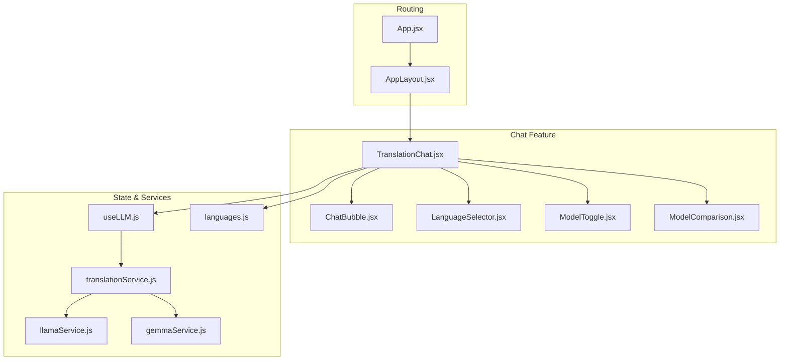
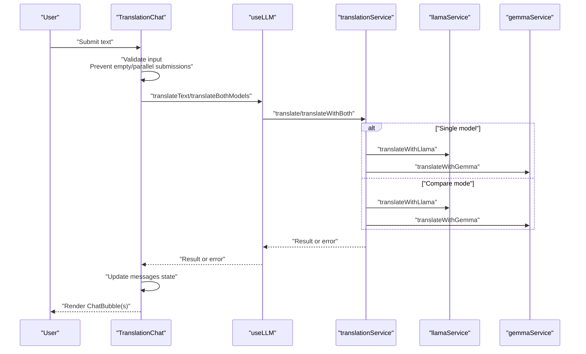
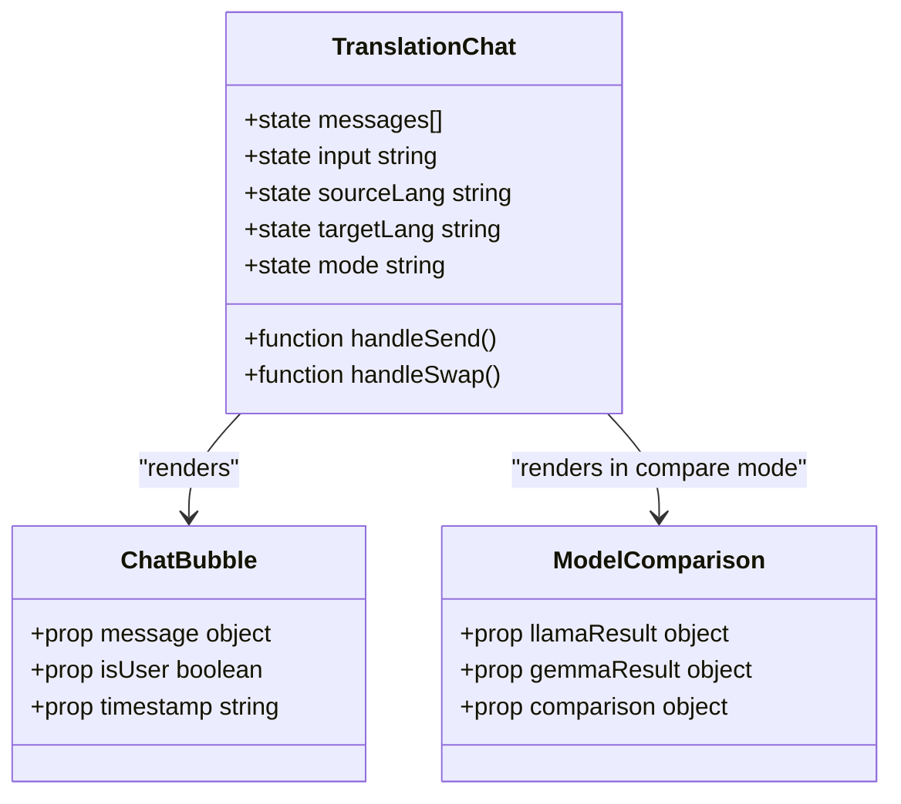
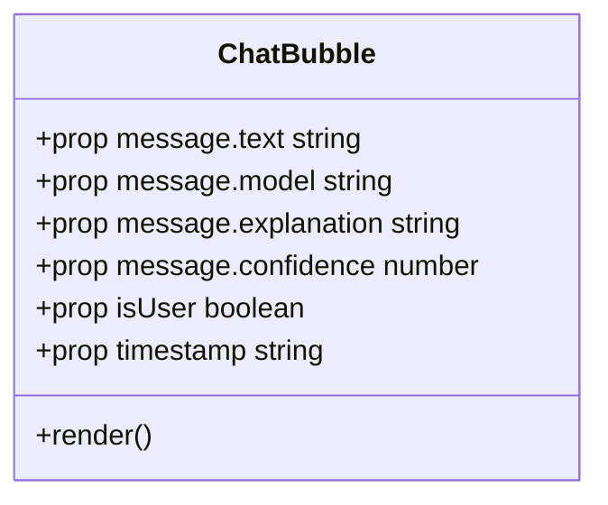
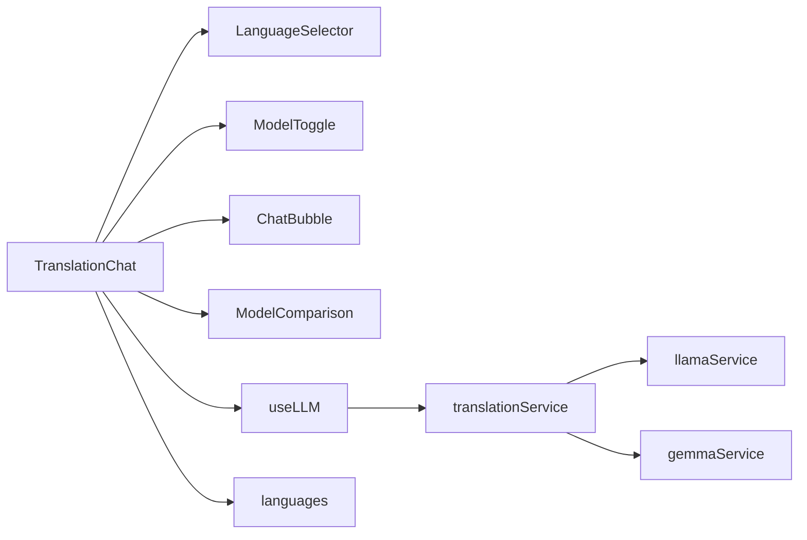

# Translation Interface and User Experience

<cite>
**Referenced Files in This Document**
- [TranslationChat.jsx](file://src/pages/chat/TranslationChat.jsx)
- [ChatBubble.jsx](file://src/components/ChatBubble.jsx)
- [LanguageSelector.jsx](file://src/components/LanguageSelector.jsx)
- [ModelToggle.jsx](file://src/components/ModelToggle.jsx)
- [ModelComparison.jsx](file://src/pages/chat/ModelComparison.jsx)
- [useLLM.js](file://src/hooks/useLLM.js)
- [translationService.js](file://src/services/translationService.js)
- [llamaService.js](file://src/services/llamaService.js)
- [gemmaService.js](file://src/services/gemmaService.js)
- [languages.js](file://src/config/languages.js)
- [AppLayout.jsx](file://src/layouts/AppLayout.jsx)
- [App.jsx](file://src/App.jsx)
- [tailwind.config.js](file://tailwind.config.js)
</cite>

## Table of Contents
1. [Introduction](#introduction)
2. [Project Structure](#project-structure)
3. [Core Components](#core-components)
4. [Architecture Overview](#architecture-overview)
5. [Detailed Component Analysis](#detailed-component-analysis)
6. [Dependency Analysis](#dependency-analysis)
7. [Performance Considerations](#performance-considerations)
8. [Accessibility and Keyboard Navigation](#accessibility-and-keyboard-navigation)
9. [Responsive Design and Mobile Features](#responsive-design-and-mobile-features)
10. [Customization Guide](#customization-guide)
11. [Troubleshooting Guide](#troubleshooting-guide)
12. [Conclusion](#conclusion)

## Introduction
This document provides comprehensive documentation for the translation chat interface and user experience components. It focuses on the TranslationChat main component and related UI elements that enable real-time translation conversations. The documentation covers user input handling, language selection, model toggling, message rendering, and the underlying service integrations. It also includes guidance on customization, accessibility, responsiveness, and troubleshooting.

## Project Structure
The translation chat feature is organized around a central page component and several reusable UI components. The page integrates with hooks and services to orchestrate translation requests and manage state. Layout components provide global theming and routing context.

**Diagram sources**
- [App.jsx:19-49](file://src/App.jsx#L19-L49)
- [AppLayout.jsx:17-41](file://src/layouts/AppLayout.jsx#L17-L41)
- [TranslationChat.jsx:11-196](file://src/pages/chat/TranslationChat.jsx#L11-L196)
- [useLLM.js:4-37](file://src/hooks/useLLM.js#L4-L37)
- [translationService.js:12-42](file://src/services/translationService.js#L12-L42)
- [llamaService.js:14-60](file://src/services/llamaService.js#L14-L60)
- [gemmaService.js:16-44](file://src/services/gemmaService.js#L16-L44)
- [languages.js:1-30](file://src/config/languages.js#L1-L30)

**Section sources**
- [App.jsx:19-49](file://src/App.jsx#L19-L49)
- [AppLayout.jsx:17-41](file://src/layouts/AppLayout.jsx#L17-L41)
- [TranslationChat.jsx:11-196](file://src/pages/chat/TranslationChat.jsx#L11-L196)

## Core Components
This section outlines the primary components involved in the translation chat experience and their responsibilities.

- TranslationChat: Orchestrates user input, manages conversation state, coordinates model selection, and renders messages and UI controls.
- ChatBubble: Renders individual messages with user/bot differentiation, optional model badges, explanations, confidence indicators, and timestamps.
- LanguageSelector: Provides dropdowns for selecting source and target languages with a swap action.
- ModelToggle: Allows switching between Llama, Gemma, and Compare modes.
- ModelComparison: Displays side-by-side translation outputs and comparison metrics.
- useLLM: Hook managing loading/error states and delegating translation calls to services.
- translationService: Aggregates translation results from multiple providers and computes comparison metrics.
- llamaService/gemmaService: Provider-specific translation implementations with structured JSON responses.
- languages.js: Centralized language metadata used across components.

**Section sources**
- [TranslationChat.jsx:11-196](file://src/pages/chat/TranslationChat.jsx#L11-L196)
- [ChatBubble.jsx:3-31](file://src/components/ChatBubble.jsx#L3-L31)
- [LanguageSelector.jsx:3-48](file://src/components/LanguageSelector.jsx#L3-L48)
- [ModelToggle.jsx:7-24](file://src/components/ModelToggle.jsx#L7-L24)
- [ModelComparison.jsx:3-80](file://src/pages/chat/ModelComparison.jsx#L3-L80)
- [useLLM.js:4-37](file://src/hooks/useLLM.js#L4-L37)
- [translationService.js:12-72](file://src/services/translationService.js#L12-L72)
- [llamaService.js:14-60](file://src/services/llamaService.js#L14-L60)
- [gemmaService.js:16-44](file://src/services/gemmaService.js#L16-L44)
- [languages.js:1-30](file://src/config/languages.js#L1-L30)

## Architecture Overview
The translation chat follows a unidirectional data flow: user actions trigger state updates, which render UI and initiate service calls. The hook encapsulates asynchronous translation operations and exposes loading/error states. The page composes UI controls and message lists, delegating provider-specific logic to services.

**Diagram sources**
- [TranslationChat.jsx:30-98](file://src/pages/chat/TranslationChat.jsx#L30-L98)
- [useLLM.js:8-34](file://src/hooks/useLLM.js#L8-L34)
- [translationService.js:12-42](file://src/services/translationService.js#L12-L42)
- [llamaService.js:14-60](file://src/services/llamaService.js#L14-L60)
- [gemmaService.js:16-44](file://src/services/gemmaService.js#L16-L44)

## Detailed Component Analysis

### TranslationChat Component
TranslationChat is the central orchestrator for the translation chat experience. It maintains state for messages, user input, language pair, model mode, and scroll positioning. It handles form submission, delegates translation to the hook, constructs user and bot messages, and renders either individual chat bubbles or a model comparison view.

Key responsibilities:
- State management: messages, input, source/target languages, mode, loading state.
- Event handling: form submission, language swap, input change.
- Conditional rendering: empty-state guidance, chat bubbles, comparison cards, loading indicator.
- Persistence: saves translation records when a user is authenticated.

User interaction patterns:
- Text input submission via form submit triggers translation.
- Mode toggle switches between single-model and comparison views.
- Language selector updates source/target languages; swap reverses them.
- Dynamic content updates reflect loading states and error messages.

Event handlers and state management examples:
- Form submission handler validates input and prevents concurrent operations.
- Input change handler updates local state for immediate UI feedback.
- Mode change handler switches between "llama", "gemma", and "compare".
- Language change handlers update source/target codes; swap toggles them.

Dynamic content updates:
- Messages array drives chat rendering; each message carries user/bot flags and optional fields.
- Loading spinner appears during translation requests.
- Error messages are inserted into the chat stream when API calls fail.

**Section sources**
- [TranslationChat.jsx:11-196](file://src/pages/chat/TranslationChat.jsx#L11-L196)

#### Class Diagram: Message Types and Rendering

**Diagram sources**
- [TranslationChat.jsx:14-167](file://src/pages/chat/TranslationChat.jsx#L14-L167)
- [ChatBubble.jsx:3-31](file://src/components/ChatBubble.jsx#L3-L31)
- [ModelComparison.jsx:3-80](file://src/pages/chat/ModelComparison.jsx#L3-L80)

### ChatBubble Component
ChatBubble renders individual messages with user versus bot differentiation. It supports optional model badges, explanations, confidence percentages, and timestamps. It uses animation for smooth entry transitions.

Rendering logic:
- User messages use primary chat bubble styling; bot messages use neutral styling.
- Optional model badge displays model identifier with emoji.
- Explanation and confidence are shown conditionally when present.
- Timestamp footer provides localized time display.

Accessibility considerations:
- Semantic structure with chat roles and bubbles.
- Clear contrast and readable typography via Tailwind classes.

**Section sources**
- [ChatBubble.jsx:3-31](file://src/components/ChatBubble.jsx#L3-L31)

#### Class Diagram: ChatBubble Props and Rendering

**Diagram sources**
- [ChatBubble.jsx:3-31](file://src/components/ChatBubble.jsx#L3-L31)

### LanguageSelector Component
LanguageSelector provides two dropdowns for choosing source and target languages, along with a swap button. The target dropdown excludes the current source language to prevent identical selections.

Interaction patterns:
- Selecting a source language updates the source state.
- Selecting a target language updates the target state.
- Swap toggles source and target values.

**Section sources**
- [LanguageSelector.jsx:3-48](file://src/components/LanguageSelector.jsx#L3-L48)
- [languages.js:1-30](file://src/config/languages.js#L1-L30)

### ModelToggle Component
ModelToggle offers three modes: Llama, Gemma, and Compare. It visually highlights the active mode and provides icons for quick recognition.

Interaction pattern:
- Clicking a mode updates the parent state, switching translation behavior.

**Section sources**
- [ModelToggle.jsx:7-24](file://src/components/ModelToggle.jsx#L7-L24)

### ModelComparison Component
ModelComparison displays parallel outputs from Llama and Gemma, including confidence, explanations, and alternative suggestions. It also presents comparison metrics such as word similarity and character counts.

Rendering logic:
- Two-column layout on larger screens, stacked on smaller screens.
- Metrics card shows word similarity percentage, word counts, and character counts.

**Section sources**
- [ModelComparison.jsx:3-80](file://src/pages/chat/ModelComparison.jsx#L3-L80)
- [translationService.js:47-72](file://src/services/translationService.js#L47-L72)

### useLLM Hook
The useLLM hook encapsulates translation operations and exposes loading/error states. It provides two primary functions:
- translateText: Single-model translation with explicit model selection.
- translateBothModels: Parallel translation with comparison aggregation.

State management:
- isLoading indicates ongoing translation requests.
- error stores the last error message for display.

**Section sources**
- [useLLM.js:4-37](file://src/hooks/useLLM.js#L4-L37)

### translationService
The translation service coordinates provider-specific implementations and comparison logic:
- translate: Delegates to the appropriate provider based on model selection.
- translateWithBoth: Executes both providers concurrently and aggregates results.
- compareResults: Computes similarity metrics and counts for comparison.

**Section sources**
- [translationService.js:12-72](file://src/services/translationService.js#L12-L72)

### Provider Services
Provider services implement the actual translation calls:
- llamaService: Calls a Llama API endpoint with a structured system prompt and parses JSON responses.
- gemmaService: Uses Google Generative AI SDK to generate content and parse JSON responses.

Both services return standardized result objects with translation text, confidence, explanation, and alternatives.

**Section sources**
- [llamaService.js:14-60](file://src/services/llamaService.js#L14-L60)
- [gemmaService.js:16-44](file://src/services/gemmaService.js#L16-L44)

## Dependency Analysis
The translation chat feature exhibits clear separation of concerns:
- Page depends on UI components and the useLLM hook.
- useLLM depends on translationService.
- translationService depends on provider-specific services.
- UI components depend on shared configuration for language metadata.

**Diagram sources**
- [TranslationChat.jsx:11-196](file://src/pages/chat/TranslationChat.jsx#L11-L196)
- [useLLM.js:4-37](file://src/hooks/useLLM.js#L4-L37)
- [translationService.js:12-42](file://src/services/translationService.js#L12-L42)
- [llamaService.js:14-60](file://src/services/llamaService.js#L14-L60)
- [gemmaService.js:16-44](file://src/services/gemmaService.js#L16-L44)
- [languages.js:1-30](file://src/config/languages.js#L1-L30)

**Section sources**
- [TranslationChat.jsx:11-196](file://src/pages/chat/TranslationChat.jsx#L11-L196)
- [useLLM.js:4-37](file://src/hooks/useLLM.js#L4-L37)
- [translationService.js:12-42](file://src/services/translationService.js#L12-L42)

## Performance Considerations
- Debounce or rate-limit input changes to avoid excessive re-renders during rapid typing.
- Virtualize long message lists to reduce DOM nodes and improve scrolling performance.
- Cache provider responses for identical inputs to minimize network calls.
- Use lazy loading for comparison metrics panels if the dataset grows large.
- Optimize animations: disable motion preferences or use reduced motion variants for accessibility.

## Accessibility and Keyboard Navigation
Current implementation highlights:
- Semantic HTML: form elements, buttons, and chat containers use appropriate roles.
- Focus management: input field receives focus after submission; ensure tab order remains logical.
- Keyboard support: Enter submits the form; buttons are operable via keyboard.
- Contrast and readability: Tailwind theme provides sufficient contrast for text and backgrounds.

Recommendations:
- Add aria-live regions for dynamic loading and error announcements.
- Provide skip links to navigate to the input area after loading.
- Ensure color-blind friendly indicators for model badges and confidence levels.
- Test with screen readers for proper announcement of timestamps and explanations.

## Responsive Design and Mobile Features
The interface leverages Tailwind CSS utilities for responsive behavior:
- Flexbox-based layout adapts to narrow widths on mobile devices.
- Grid layout for comparison cards stacks on small screens and splits into columns on medium screens.
- Input and button arrangement remain usable on touchscreens with adequate spacing.
- Empty state guidance includes sample prompts for quick interaction.

Mobile-specific enhancements:
- Touch-friendly button sizes and spacing.
- Auto-focus on the input field after clearing or swapping languages.
- Reduced horizontal padding for compact screens.

**Section sources**
- [TranslationChat.jsx:103-196](file://src/pages/chat/TranslationChat.jsx#L103-L196)
- [ModelComparison.jsx:5-80](file://src/pages/chat/ModelComparison.jsx#L5-L80)
- [tailwind.config.js:20-64](file://tailwind.config.js#L20-L64)

## Customization Guide
Appearance customization:
- Theme: Modify daisyUI themes in the Tailwind configuration to adjust primary/secondary colors and base palettes.
- Typography: Adjust font sizes and weights in Tailwind classes for chat bubbles and headers.
- Spacing: Tune padding and margin classes for input areas and message lists.

Adding new interaction modes:
- Extend the mode options in ModelToggle and handle the new mode in TranslationChat.
- Implement a new service or integrate an existing provider in translationService.
- Create a dedicated component for displaying results if the new mode requires complex UI.

Extending language support:
- Add entries to the language configuration with appropriate codes, names, and flags.
- Ensure LanguageSelector filters exclude invalid combinations when adding new languages.

Integrating additional models:
- Implement a new provider service similar to llamaService or gemmaService.
- Update translationService to route to the new provider and handle its response format.
- Update useLLM to expose a new function if needed.

## Troubleshooting Guide
Common issues and resolutions:
- API errors: The page inserts an error message into the chat stream. Verify API keys and network connectivity.
- Empty input submissions: The handler prevents submission when input is empty or when a translation is already in progress.
- Loading states: The send button and input are disabled during loading; ensure proper cleanup in finally blocks.
- Authentication persistence: Saved translations require a logged-in user; ensure AuthContext is properly configured.

Debugging tips:
- Inspect network requests to provider services for malformed responses or unexpected statuses.
- Log messages state to verify message ordering and timestamps.
- Confirm language codes match supported provider formats.

**Section sources**
- [TranslationChat.jsx:89-97](file://src/pages/chat/TranslationChat.jsx#L89-L97)
- [useLLM.js:8-34](file://src/hooks/useLLM.js#L8-L34)
- [translationService.js:34-41](file://src/services/translationService.js#L34-L41)

## Conclusion
The translation chat interface combines a clean page component with modular UI elements and robust service integrations. It supports single-model and comparison modes, provides responsive design, and offers extensibility for new models and interaction patterns. By following the customization and troubleshooting guidance, developers can enhance the interface while maintaining accessibility and performance.