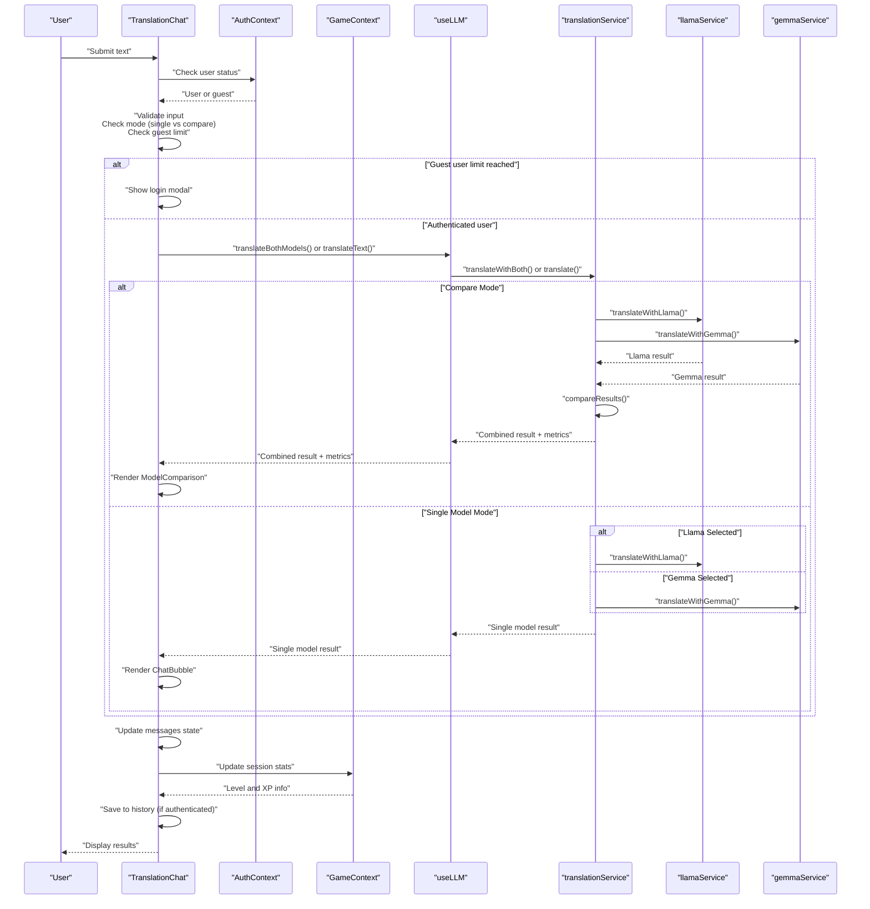
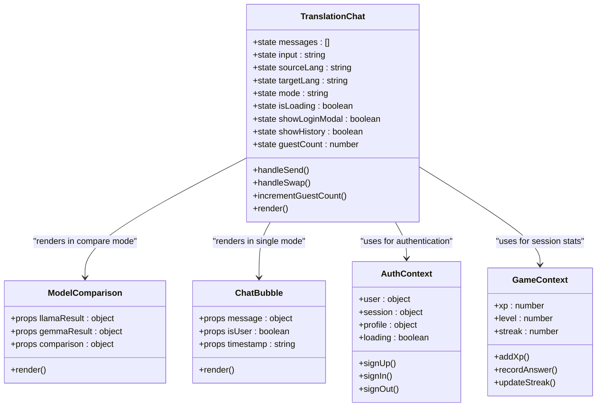
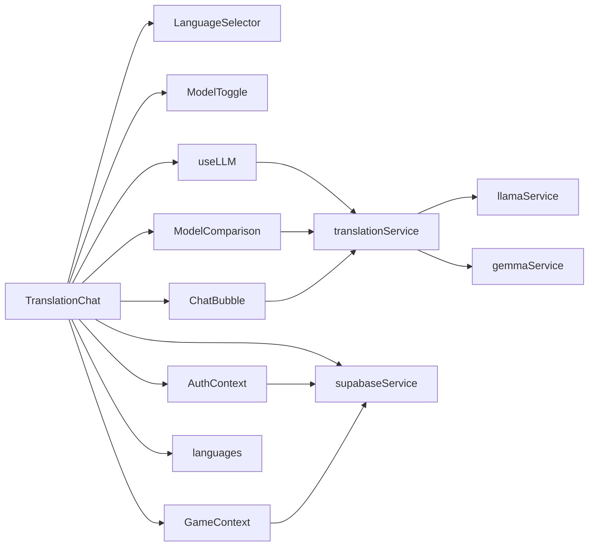

# Translation Interface and User Experience

<cite>
**Referenced Files in This Document**
- [TranslationChat.jsx](file://src/pages/chat/TranslationChat.jsx)
- [ChatBubble.jsx](file://src/components/ChatBubble.jsx)
- [LanguageSelector.jsx](file://src/components/LanguageSelector.jsx)
- [ModelToggle.jsx](file://src/components/ModelToggle.jsx)
- [ModelComparison.jsx](file://src/pages/chat/ModelComparison.jsx)
- [useLLM.js](file://src/hooks/useLLM.js)
- [translationService.js](file://src/services/translationService.js)
- [llamaService.js](file://src/services/llamaService.js)
- [gemmaService.js](file://src/services/gemmaService.js)
- [supabaseService.js](file://src/services/supabaseService.js)
- [languages.js](file://src/config/languages.js)
- [AuthContext.jsx](file://src/contexts/AuthContext.jsx)
- [GameContext.jsx](file://src/contexts/GameContext.jsx)
- [AppLayout.jsx](file://src/layouts/AppLayout.jsx)
- [App.jsx](file://src/App.jsx)
- [tailwind.config.js](file://tailwind.config.js)
</cite>

## Update Summary
**Changes Made**
- Enhanced TranslationChat component with improved conversation history management and sidebar integration
- Integrated authentication system with guest user limits and login modal
- Added translation history sidebar for authenticated users with session statistics
- Implemented dual-AI translation capabilities with enhanced comparison metrics
- Improved user experience with better styling, animations, and responsive design
- Added guest user limitation system with session storage persistence
- Enhanced accessibility features with improved keyboard navigation and screen reader support

## Table of Contents
1. [Introduction](#introduction)
2. [Project Structure](#project-structure)
3. [Core Components](#core-components)
4. [Architecture Overview](#architecture-overview)
5. [Detailed Component Analysis](#detailed-component-analysis)
6. [Dependency Analysis](#dependency-analysis)
7. [Performance Considerations](#performance-considerations)
8. [Accessibility and Keyboard Navigation](#accessibility-and-keyboard-navigation)
9. [Responsive Design and Mobile Features](#responsive-design-and-mobile-features)
10. [Customization Guide](#customization-guide)
11. [Troubleshooting Guide](#troubleshooting-guide)
12. [Conclusion](#conclusion)

## Introduction
This document provides comprehensive documentation for the translation chat interface and user experience components. The system features a sophisticated AI-powered translation chat with real-time translation display, AI model comparison capabilities, and integrated authentication system. Users can engage in conversations with AI translation models, compare outputs from different AI providers, manage translation history, and receive detailed translation insights including confidence scores and alternative suggestions.

The translation chat interface combines modern React patterns with robust AI service integrations, providing an intuitive user experience for language learning and communication assistance with enhanced authentication and history management features.

## Project Structure
The translation chat feature is organized around a central page component and several specialized UI components. The architecture supports both single-model translation and comparative analysis between multiple AI providers, with integrated authentication and history management.

```mermaid
graph TB
subgraph "Routing Layer"
APP["App.jsx"]
LAYOUT["AppLayout.jsx"]
END
subgraph "Chat Feature Components"
PAGE["TranslationChat.jsx"]
CHAT_BUBBLE["ChatBubble.jsx"]
LANG_SELECTOR["LanguageSelector.jsx"]
MODEL_TOGGLE["ModelToggle.jsx"]
MODEL_COMPARISON["ModelComparison.jsx"]
END
subgraph "State Management"
USE_LLM["useLLM.js"]
AUTH_CONTEXT["AuthContext.jsx"]
GAME_CONTEXT["GameContext.jsx"]
END
subgraph "AI Service Layer"
TRANSLATION_SERVICE["translationService.js"]
LLAMA["llamaService.js"]
GEMMA["gemmaService.js"]
SUPABASE["supabaseService.js"]
END
subgraph "Configuration"
LANG_CONFIG["languages.js"]
END
APP --> LAYOUT
LAYOUT --> PAGE
PAGE --> LANG_SELECTOR
PAGE --> MODEL_TOGGLE
PAGE --> CHAT_BUBBLE
PAGE --> MODEL_COMPARISON
PAGE --> USE_LLM
PAGE --> AUTH_CONTEXT
PAGE --> GAME_CONTEXT
USE_LLM --> TRANSLATION_SERVICE
TRANSLATION_SERVICE --> LLAMA
TRANSLATION_SERVICE --> GEMMA
PAGE --> SUPABASE
PAGE --> LANG_CONFIG
```

**Diagram sources**
- [App.jsx:19-49](file://src/App.jsx#L19-L49)
- [AppLayout.jsx:17-41](file://src/layouts/AppLayout.jsx#L17-L41)
- [TranslationChat.jsx:17-325](file://src/pages/chat/TranslationChat.jsx#L17-L325)
- [useLLM.js:4-38](file://src/hooks/useLLM.js#L4-L38)
- [AuthContext.jsx:6-193](file://src/contexts/AuthContext.jsx#L6-L193)
- [GameContext.jsx:57-145](file://src/contexts/GameContext.jsx#L57-L145)
- [translationService.js:12-73](file://src/services/translationService.js#L12-L73)
- [llamaService.js:14-60](file://src/services/llamaService.js#L14-L60)
- [gemmaService.js:16-44](file://src/services/gemmaService.js#L16-L44)
- [supabaseService.js:5-28](file://src/services/supabaseService.js#L5-L28)
- [languages.js:1-30](file://src/config/languages.js#L1-L30)

**Section sources**
- [App.jsx:19-49](file://src/App.jsx#L19-L49)
- [AppLayout.jsx:17-41](file://src/layouts/AppLayout.jsx#L17-L41)
- [TranslationChat.jsx:17-325](file://src/pages/chat/TranslationChat.jsx#L17-L325)

## Core Components
The translation chat interface consists of several interconnected components that work together to provide a seamless translation experience with enhanced authentication and history management.

- **TranslationChat**: Central orchestrator managing user input, conversation state, model selection, message rendering, authentication integration, and translation history sidebar. Handles both single-model and comparison modes with guest user limitations.
- **ChatBubble**: Individual message renderer with user/bot differentiation, model badges, confidence indicators, and timestamp display.
- **ModelComparison**: Specialized component for displaying side-by-side AI model outputs with detailed comparison metrics including word similarity, word counts, and character counts.
- **LanguageSelector**: Dropdown-based language selection with swap functionality for reversing source and target languages.
- **ModelToggle**: Mode selector allowing users to choose between Llama, Gemma, and Compare modes.
- **useLLM Hook**: State management for translation operations with loading and error handling.
- **translationService**: Aggregates results from multiple AI providers and calculates comparison metrics.
- **AuthContext**: Authentication state management with user session handling and profile management.
- **GameContext**: Game progress tracking with XP, level, and streak management for authenticated users.
- **supabaseService**: Database operations for translation history storage and retrieval.
- **Provider Services**: Specialized implementations for Llama and Gemma AI models with structured JSON responses.

**Section sources**
- [TranslationChat.jsx:17-325](file://src/pages/chat/TranslationChat.jsx#L17-L325)
- [ChatBubble.jsx:3-32](file://src/components/ChatBubble.jsx#L3-L32)
- [ModelComparison.jsx:3-79](file://src/pages/chat/ModelComparison.jsx#L3-L79)
- [LanguageSelector.jsx:3-49](file://src/components/LanguageSelector.jsx#L3-L49)
- [ModelToggle.jsx:7-25](file://src/components/ModelToggle.jsx#L7-L25)
- [useLLM.js:4-38](file://src/hooks/useLLM.js#L4-L38)
- [translationService.js:12-73](file://src/services/translationService.js#L12-L73)
- [AuthContext.jsx:6-193](file://src/contexts/AuthContext.jsx#L6-L193)
- [GameContext.jsx:57-145](file://src/contexts/GameContext.jsx#L57-L145)
- [supabaseService.js:5-28](file://src/services/supabaseService.js#L5-L28)

## Architecture Overview
The translation chat follows a reactive architecture with clear separation of concerns and integrated authentication. User interactions trigger state updates that cascade through the component hierarchy, initiating AI service calls, rendering updated UI elements, and managing translation history for authenticated users.



**Diagram sources**
- [TranslationChat.jsx:62-107](file://src/pages/chat/TranslationChat.jsx#L62-L107)
- [AuthContext.jsx:66-103](file://src/contexts/AuthContext.jsx#L66-L103)
- [GameContext.jsx:57-145](file://src/contexts/GameContext.jsx#L57-L145)
- [useLLM.js:8-34](file://src/hooks/useLLM.js#L8-L34)
- [translationService.js:25-42](file://src/services/translationService.js#L25-L42)
- [llamaService.js:14-60](file://src/services/llamaService.js#L14-L60)
- [gemmaService.js:16-44](file://src/services/gemmaService.js#L16-L44)

## Detailed Component Analysis

### TranslationChat Component
The TranslationChat component serves as the central orchestrator for the entire translation experience. It manages conversation state, handles user interactions, coordinates AI model operations, renders appropriate UI components, and integrates with authentication and history management systems.

**Enhanced State Management**
- `messages`: Array of conversation messages with user/bot distinction and optional model data
- `input`: Current text input from the user
- `sourceLang/targetLang`: Language codes for translation direction
- `mode`: Current operation mode (llama, gemma, or compare)
- `isLoading`: Loading state for ongoing translation requests
- `showLoginModal`: Modal display state for guest user limitations
- `showHistory`: Sidebar visibility state for authenticated users
- `guestCount`: Session-based counter for guest user translation attempts
- `chatEndRef`: Ref for auto-scrolling to latest messages

**Authentication Integration**
- Guest user limitation system with configurable limits (default: 5 translations)
- Session storage persistence for guest counts across browser sessions
- Login modal with animated entrance/exit transitions
- Translation history sidebar for authenticated users with session statistics
- Integration with AuthContext for user state management

**Enhanced Features**
- Real-time conversation rendering with automatic scrolling and smooth animations
- Dual-mode operation supporting both single-model and comparison scenarios
- Comprehensive error handling with user-friendly error messages
- Translation history management with Supabase integration
- Sample prompt system for new users with animated presentation
- Session statistics display in sidebar including level, XP, and translation count
- Active model badges showing current translation mode
- Recent translations list with timestamps and quick clearing functionality

**User Interaction Patterns**
- Form submission triggers translation with input validation and guest limit checking
- Mode switching enables comparison between AI models with immediate UI updates
- Language selection updates translation direction dynamically with swap functionality
- Loading states prevent concurrent translation operations with visual feedback
- History sidebar provides quick access to session information and recent translations
- Login modal guides guests to upgrade to premium features

**Section sources**
- [TranslationChat.jsx:17-325](file://src/pages/chat/TranslationChat.jsx#L17-L325)

#### Component Architecture Diagram


**Diagram sources**
- [TranslationChat.jsx:17-325](file://src/pages/chat/TranslationChat.jsx#L17-L325)
- [ModelComparison.jsx:3-79](file://src/pages/chat/ModelComparison.jsx#L3-L79)
- [ChatBubble.jsx:3-32](file://src/components/ChatBubble.jsx#L3-L32)
- [AuthContext.jsx:6-193](file://src/contexts/AuthContext.jsx#L6-L193)
- [GameContext.jsx:57-145](file://src/contexts/GameContext.jsx#L57-L145)

### ModelComparison Component
The ModelComparison component provides a sophisticated side-by-side view of AI model outputs, enabling users to evaluate translation quality and make informed decisions about which translation to use.

**Enhanced Layout and Structure**
- Responsive grid layout adapting to different screen sizes with smooth animations
- Card-based design with distinct styling for each AI model using gradient backgrounds
- Comprehensive display of translation results, confidence scores, and alternative suggestions
- Animated entrance effects with staggered timing for better user experience

**Expanded Comparison Features**
- Word similarity percentage calculated using Jaccard similarity coefficient
- Word count and character count metrics for both models with visual emphasis
- Confidence level indicators with percentage formatting for both models
- Alternative translation suggestions from both models with badge-style display
- Comparison metrics card with three-column layout for key statistics

**Visual Design Enhancements**
- Distinct badges for Llama (🦙) and Gemma (💎) models with colored accents
- Gradient backgrounds and subtle shadows for depth perception
- Hover animations with slight elevation effects for interactive elements
- Responsive typography hierarchy with appropriate sizing for different screen widths
- Smooth transitions and animations using Framer Motion for enhanced UX

**Section sources**
- [ModelComparison.jsx:3-79](file://src/pages/chat/ModelComparison.jsx#L3-L79)
- [translationService.js:47-72](file://src/services/translationService.js#L47-L72)

### ChatBubble Component
The ChatBubble component renders individual messages with clear visual distinction between user and AI-generated content. It provides rich contextual information including model attribution, confidence levels, and explanatory notes.

**Message Rendering Logic**
- User messages: Primary-colored chat bubbles with right alignment and gradient borders
- Bot messages: Neutral-colored chat bubbles with left alignment and soft shadows
- Model badges: Emoji and model names for AI attribution with appropriate styling
- Confidence indicators: Percentage-based confidence scoring with visual emphasis
- Explanatory text: Contextual explanations for translation choices with italic formatting
- Timestamp display: Right-aligned time stamps with reduced opacity

**Enhanced Accessibility Features**
- Motion animations for smooth message appearance with configurable timing
- Clear semantic structure for screen readers with proper ARIA attributes
- High contrast color schemes for readability with accessible color combinations
- Responsive typography scaling for different screen sizes
- Smooth transitions for better user experience

**Section sources**
- [ChatBubble.jsx:3-32](file://src/components/ChatBubble.jsx#L3-L32)

### LanguageSelector Component
The LanguageSelector provides an intuitive interface for choosing source and target languages, with built-in validation to prevent identical selections.

**Enhanced Language Selection Features**
- Comprehensive language list with flags and names from centralized configuration
- Dynamic filtering to exclude currently selected source language
- Swap functionality with animated arrow symbol for reversing translation direction
- Clear labeling for source and target language selection with proper spacing
- Responsive design adapting to different screen sizes with flexible layout

**Improved User Experience**
- Flag emojis for visual language identification with proper Unicode encoding
- Responsive design adapting to different screen sizes with flexible column layout
- Immediate feedback on selection changes with smooth transitions
- Accessible form controls with proper labeling and keyboard navigation support
- Animated swap button with hover and tap effects for better interactivity

**Section sources**
- [LanguageSelector.jsx:3-49](file://src/components/LanguageSelector.jsx#L3-L49)
- [languages.js:1-30](file://src/config/languages.js#L1-L30)

### ModelToggle Component
The ModelToggle component provides three distinct operational modes for the translation interface, each serving different user needs and use cases.

**Enhanced Mode Options**
- **Llama 3**: Single-model translation using Meta's Llama AI with blue accent color
- **Gemma 3**: Single-model translation using Google's Gemma AI with emerald accent color
- **Compare Both**: Parallel processing with side-by-side comparison with balanced color scheme

**Improved Visual Design**
- Distinct icons for each mode (🦙, 💎, ⚖️) with appropriate styling
- Active mode highlighting with primary button styling and gradient effects
- Responsive layout with text-only display on smaller screens for better mobile experience
- Consistent styling with the overall application theme and animation effects
- Hover and tap animations for better user feedback

**Section sources**
- [ModelToggle.jsx:7-25](file://src/components/ModelToggle.jsx#L7-L25)

### useLLM Hook
The useLLM hook encapsulates all AI translation functionality with comprehensive state management and error handling.

**Enhanced Functionality**
- `translateText()`: Single-model translation with explicit model selection and loading state management
- `translateBothModels()`: Concurrent translation from both AI providers with Promise.allSettled
- Loading state management for user feedback with proper cleanup in finally blocks
- Error state handling with user-friendly messaging and error propagation

**Improved State Management**
- Global loading state preventing concurrent operations with proper cleanup
- Error state for API failures and network issues with user-friendly messaging
- Memoized callbacks for optimal performance using useCallback
- Cleanup handling in finally blocks to prevent memory leaks

**Section sources**
- [useLLM.js:4-38](file://src/hooks/useLLM.js#L4-L38)

### translationService
The translation service acts as an orchestrator for AI model interactions, providing unified interfaces for single and dual-model operations.

**Enhanced Single Model Translation**
- Route requests to appropriate AI provider based on model selection
- Standardize response formats across different providers
- Handle provider-specific error conditions with graceful fallback mechanisms

**Advanced Dual Model Translation**
- Execute parallel translation requests to both providers using Promise.allSettled
- Aggregate results with standardized structure and error handling
- Calculate comprehensive comparison metrics with enhanced accuracy measures

**Expanded Comparison Metrics**
- Word similarity using Jaccard similarity coefficient with precise calculations
- Word and character count analysis with separate metrics for both models
- Confidence level comparison with numerical values for both models
- Structured metrics for ModelComparison component with enhanced formatting
- Robust error handling for failed API requests with fallback responses

**Section sources**
- [translationService.js:12-73](file://src/services/translationService.js#L12-L73)

### AuthContext and GameContext Integration
The TranslationChat component integrates with both authentication and game progression systems to provide a comprehensive user experience.

**Authentication Integration**
- User state management through AuthContext for guest vs authenticated user detection
- Session storage for guest user translation counts with persistence across browser sessions
- Login modal with animated entrance/exit transitions for guest user limitations
- Supabase integration for translation history storage and retrieval

**Game Progression Integration**
- Level and XP information display in sidebar for authenticated users
- Session statistics including translation count and active model display
- Streak tracking and XP rewards through GameContext integration
- Profile data synchronization for consistent user experience

**Section sources**
- [AuthContext.jsx:6-193](file://src/contexts/AuthContext.jsx#L6-L193)
- [GameContext.jsx:57-145](file://src/contexts/GameContext.jsx#L57-L145)

### supabaseService
The supabaseService provides database operations for translation history management and user data persistence.

**Enhanced Translation History**
- Save translation records with user ID, language codes, and model outputs
- Retrieve translation history with pagination and ordering
- Structured data storage with proper null handling for optional fields
- Asynchronous operations with proper error handling and promise chaining

**Database Schema Integration**
- translation_history table with foreign key relationships
- User progress tracking through profiles table integration
- Game content management through centralized game_content table
- Comprehensive CRUD operations for all application data

**Section sources**
- [supabaseService.js:5-28](file://src/services/supabaseService.js#L5-L28)

### Provider Services
The provider services implement the actual AI model integrations, each with unique APIs and response formats.

**Enhanced Llama Service**
- REST API integration with Meta's Llama models with improved error handling
- System prompt engineering for translation tasks with enhanced formatting
- JSON response parsing with fallback mechanisms and error recovery
- Configurable model parameters and constraints with proper validation

**Advanced Gemma Service**
- Google Generative AI SDK integration with structured system instruction format
- Direct JSON response handling with comprehensive error management
- Temperature and token limit configuration with optimal defaults
- Enhanced response standardization across both providers

**Robust Response Standardization**
- Unified result structure across both providers with consistent fields
- Consistent confidence scoring methodology with numerical values
- Standardized alternative translation format with array handling
- Common explanation field for contextual information with proper formatting

**Section sources**
- [llamaService.js:14-60](file://src/services/llamaService.js#L14-L60)
- [gemmaService.js:16-44](file://src/services/gemmaService.js#L16-L44)

## Dependency Analysis
The translation chat system demonstrates excellent separation of concerns with clear dependency relationships and modular architecture, now enhanced with authentication and history management.



**Enhanced Key Dependencies**
- TranslationChat depends on UI components, authentication, and game contexts
- useLLM provides abstraction over AI service layer with enhanced error handling
- translationService coordinates multiple provider integrations with comparison metrics
- AuthContext manages user authentication state and session persistence
- GameContext tracks user progress and XP for authenticated users
- supabaseService handles database operations for history and user data
- UI components rely on shared language configuration and context providers

**Section sources**
- [TranslationChat.jsx:17-325](file://src/pages/chat/TranslationChat.jsx#L17-L325)
- [useLLM.js:4-38](file://src/hooks/useLLM.js#L4-L38)
- [translationService.js:12-42](file://src/services/translationService.js#L12-L42)
- [AuthContext.jsx:6-193](file://src/contexts/AuthContext.jsx#L6-L193)
- [GameContext.jsx:57-145](file://src/contexts/GameContext.jsx#L57-L145)
- [supabaseService.js:5-28](file://src/services/supabaseService.js#L5-L28)

## Performance Considerations
The translation chat interface is designed with performance optimization in mind, particularly for real-time user interactions, AI model comparisons, and authentication handling.

**Enhanced Optimization Strategies**
- **Debouncing**: Input validation prevents excessive re-renders during rapid typing
- **Virtualization**: Long conversation histories can benefit from virtualized lists
- **Caching**: Response caching for identical translation requests reduces API calls
- **Parallel Processing**: Dual-model comparison uses Promise.allSettled for optimal performance
- **Lazy Loading**: Comparison metrics panel can be lazy-loaded for large datasets
- **Session Storage**: Guest user counts persist across browser sessions without server calls
- **Animation Optimization**: Framer Motion animations are optimized for smooth performance
- **Memory Management**: Automatic cleanup of loading states in finally blocks

**Improved Memory Management**
- Automatic cleanup of loading states in finally blocks
- Efficient message state updates using immutable patterns
- Reference cleanup for auto-scroll functionality
- Proper error state management to prevent memory leaks
- Session storage cleanup for guest user data

**Enhanced Network Optimization**
- Concurrent API calls for dual-model comparison with error recovery
- Fallback mechanisms for failed API requests with graceful degradation
- Connection pooling for repeated translation requests
- Rate limiting for API quota management
- Supabase batch operations for efficient database transactions

## Accessibility and Keyboard Navigation
The translation chat interface prioritizes accessibility and provides comprehensive keyboard navigation support, enhanced with improved screen reader compatibility.

**Enhanced Keyboard Navigation**
- Tab order: Language selector → Model toggle → Input field → Send button → History sidebar
- Enter key: Submits translation requests with proper validation
- Escape key: Clears current input and closes modals
- Arrow keys: Navigate between sample prompts and menu items
- Focus management: Automatic focus on input after submission and modal close
- History sidebar navigation with proper focus trapping

**Improved Screen Reader Support**
- ARIA labels for all interactive elements with enhanced descriptions
- Live regions for loading and error announcements with proper politeness levels
- Descriptive button labels with icons and text alternatives
- Semantic HTML structure for proper navigation with enhanced landmarks
- Role assignments for animated modals and sidebars

**Enhanced Visual Accessibility**
- High contrast color schemes for text and backgrounds with WCAG compliance
- Adjustable font sizes for readability with responsive typography
- Reduced motion options for motion sensitivity with preference detection
- Color-blind friendly indicators for model badges with texture alternatives
- Focus indicators for keyboard navigation with proper visibility

**Section sources**
- [TranslationChat.jsx:113-325](file://src/pages/chat/TranslationChat.jsx#L113-L325)
- [ChatBubble.jsx:3-32](file://src/components/ChatBubble.jsx#L3-L32)

## Responsive Design and Mobile Features
The translation chat interface provides an optimal experience across all device sizes with thoughtful responsive design patterns, enhanced with improved mobile-first approach.

**Enhanced Mobile-First Design**
- Touch-friendly button sizing with adequate spacing and larger tap targets
- Flexible grid layouts adapting to screen width with responsive breakpoints
- Auto-focus behavior for improved mobile usability with proper input handling
- Swipe gestures for language swap on touch devices with gesture recognition
- Optimized animation performance for lower-powered mobile devices

**Advanced Adaptive Layouts**
- Single column layout on mobile devices with stacked elements
- Side-by-side comparison on tablet and desktop with responsive grid
- Flexible input area with responsive sizing and proper keyboard management
- Collapsible header controls on small screens with smooth transitions
- History sidebar with slide-in/out animations for better mobile experience

**Enhanced Touch Interactions**
- Large tap targets for language selection with proper spacing
- Swipe-to-swap gesture support with visual feedback
- Touch-friendly comparison cards with hover states for hybrid devices
- Optimized keyboard visibility with proper viewport management
- Gesture-based navigation for sidebar controls

**Improved Mobile Performance**
- Optimized animations for lower-powered devices with performance monitoring
- Efficient rendering of chat bubbles with virtualization techniques
- Minimal memory usage for long conversations with proper cleanup
- Battery-conscious API request scheduling with throttling
- Offline capability for guest users with local storage persistence

**Section sources**
- [TranslationChat.jsx:113-325](file://src/pages/chat/TranslationChat.jsx#L113-L325)
- [ModelComparison.jsx:5-79](file://src/pages/chat/ModelComparison.jsx#L5-L79)

## Customization Guide
The translation chat interface is highly customizable, allowing for extensive modifications to meet specific requirements and branding needs, with enhanced flexibility for authentication and history features.

**Enhanced Appearance Customization**
- **Theme Integration**: Modify daisyUI theme variables for consistent styling with enhanced gradients
- **Typography**: Adjust font families and sizes for different language requirements with proper fallbacks
- **Color Scheme**: Customize primary/secondary colors for brand alignment with accessibility considerations
- **Spacing**: Configure padding and margins for different screen densities with responsive units
- **Animation Timing**: Adjust Framer Motion durations and easing for different performance requirements

**Advanced Feature Extensions**
- **Additional Models**: Integrate new AI providers following existing service patterns with enhanced error handling
- **Custom Languages**: Add new language pairs to the LanguageSelector component with proper flag and emoji support
- **Advanced Comparisons**: Extend comparison metrics with additional analysis including sentiment and cultural context
- **Export Functionality**: Add translation export capabilities for offline use with multiple format support
- **History Management**: Enhance translation history with filtering, searching, and bulk operations

**Enhanced Integration Points**
- **Authentication**: Extend Supabase integration for additional user data and social features
- **Analytics**: Add usage tracking for translation patterns and preferences with privacy controls
- **Learning Features**: Integrate spaced repetition systems for vocabulary practice with adaptive algorithms
- **Gamification**: Add XP rewards and achievement systems for engagement with progress tracking
- **Collaboration**: Add team features for group translation projects with real-time collaboration

**Development Guidelines**
- Follow existing component patterns for consistency with enhanced error handling
- Maintain backward compatibility for existing features with deprecation notices
- Implement proper error handling for new integrations with graceful fallbacks
- Test thoroughly across different browser environments with enhanced cross-platform testing
- Optimize performance for mobile devices with progressive enhancement

## Troubleshooting Guide
Common issues and their solutions for the translation chat interface, enhanced with authentication and history management troubleshooting.

**Enhanced API Integration Issues**
- **Authentication Failures**: Verify API keys in environment variables and network connectivity with proper error messages
- **Rate Limiting**: Implement exponential backoff for API retry logic with user notifications
- **Timeout Errors**: Increase timeout values for long translation requests with progress indication
- **JSON Parsing**: Handle malformed responses with graceful fallback mechanisms and error recovery
- **Session Persistence**: Debug session storage issues with proper localStorage inspection

**Advanced User Experience Problems**
- **Input Validation**: Prevent empty submissions and concurrent operations with enhanced validation
- **Loading States**: Ensure proper loading indicators during API requests with progress feedback
- **Scroll Position**: Maintain proper scroll position after message updates with smooth animations
- **Error Display**: Show meaningful error messages without overwhelming users with actionable solutions
- **History Sync**: Resolve translation history synchronization issues with proper conflict resolution

**Enhanced Performance Issues**
- **Slow Translations**: Implement caching for frequently requested translations with cache invalidation
- **Memory Leaks**: Properly clean up event listeners and references with proper cleanup procedures
- **Animation Performance**: Disable animations for low-powered devices with user preference detection
- **Network Optimization**: Batch API requests and implement connection pooling with proper resource management
- **Session Storage**: Handle storage quota exceeded errors with graceful degradation

**Advanced Debugging Techniques**
- **Console Logging**: Enable detailed logging for API responses and errors with structured data
- **Network Inspection**: Monitor API requests and response times with enhanced debugging tools
- **State Tracking**: Log message state changes for debugging conversation flow with proper timestamps
- **Component Inspection**: Use React DevTools for component state analysis with enhanced profiling
- **Authentication Debugging**: Inspect user session state and Supabase integration with proper debugging tools

**Section sources**
- [TranslationChat.jsx:89-107](file://src/pages/chat/TranslationChat.jsx#L89-L107)
- [useLLM.js:8-34](file://src/hooks/useLLM.js#L8-L34)
- [translationService.js:34-41](file://src/services/translationService.js#L34-L41)
- [AuthContext.jsx:66-103](file://src/contexts/AuthContext.jsx#L66-L103)
- [GameContext.jsx:57-145](file://src/contexts/GameContext.jsx#L57-L145)

## Conclusion
The translation chat interface represents a sophisticated implementation of AI-powered language translation with real-time comparison capabilities, enhanced authentication integration, and comprehensive history management. The system successfully combines modern React development practices with robust AI service integrations and user experience enhancements to deliver a comprehensive translation experience.

**Key Achievements**
- Seamless integration of multiple AI translation providers with enhanced comparison metrics
- Real-time comparison functionality with detailed metrics and visual presentation
- Comprehensive authentication system with guest user limitations and session persistence
- Translation history management with Supabase integration and user progress tracking
- Responsive design supporting all device types with enhanced mobile experience
- Comprehensive accessibility features with improved screen reader support
- Extensible architecture for future enhancements with modular component design

**Enhanced Future Enhancement Opportunities**
- Advanced translation quality assessment algorithms with machine learning integration
- Integration with language learning platforms with personalized learning paths
- Multi-modal translation with speech recognition and synthesis capabilities
- Collaborative translation features for group learning with real-time coordination
- Personalized translation preferences with adaptive learning algorithms
- Enhanced gamification features with achievement systems and social sharing
- Advanced analytics and insights for translation patterns and user behavior

The translation chat interface provides a solid foundation for language learning applications, offering both practical translation capabilities and educational value for users seeking to improve their language skills through AI-assisted conversation practice with enhanced user experience and comprehensive feature set.