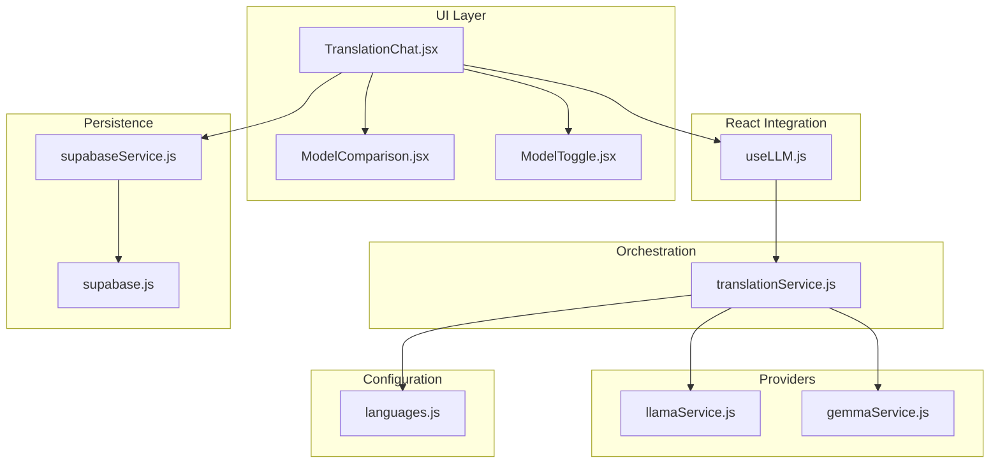
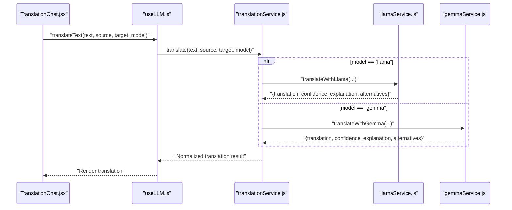
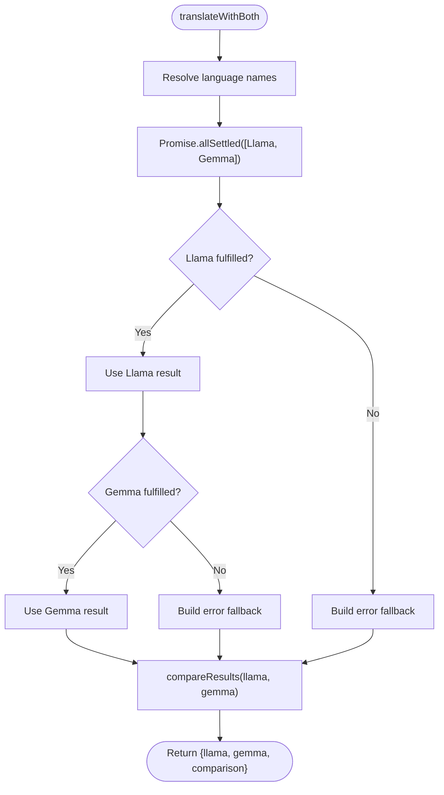
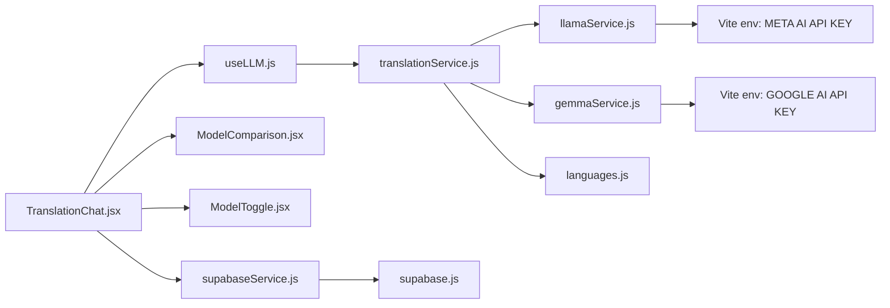

# Translation Service Orchestration

<cite>
**Referenced Files in This Document**
- [translationService.js](file://src/services/translationService.js)
- [llamaService.js](file://src/services/llamaService.js)
- [gemmaService.js](file://src/services/gemmaService.js)
- [useLLM.js](file://src/hooks/useLLM.js)
- [languages.js](file://src/config/languages.js)
- [supabaseService.js](file://src/services/supabaseService.js)
- [supabase.js](file://src/config/supabase.js)
- [TranslationChat.jsx](file://src/pages/chat/TranslationChat.jsx)
- [ModelComparison.jsx](file://src/pages/chat/ModelComparison.jsx)
- [ModelToggle.jsx](file://src/components/ModelToggle.jsx)
- [package.json](file://package.json)
- [vite.config.js](file://vite.config.js)
</cite>

## Table of Contents
1. [Introduction](#introduction)
2. [Project Structure](#project-structure)
3. [Core Components](#core-components)
4. [Architecture Overview](#architecture-overview)
5. [Detailed Component Analysis](#detailed-component-analysis)
6. [Dependency Analysis](#dependency-analysis)
7. [Performance Considerations](#performance-considerations)
8. [Troubleshooting Guide](#troubleshooting-guide)
9. [Conclusion](#conclusion)
10. [Appendices](#appendices)

## Introduction
This document provides comprehensive API documentation for the translation service orchestration layer. It explains how the system coordinates between two AI translation providers (Llama and Gemma), handles request/response processing, error propagation, and fallback mechanisms. It also covers configuration parameters, API key management, rate-limiting strategies, caching mechanisms, and performance optimizations. Guidance is included for extending the system with additional AI models and customizing translation workflows.

## Project Structure
The translation system is organized around a small set of cohesive modules:
- Orchestration layer: translationService.js
- Provider integrations: llamaService.js, gemmaService.js
- React integration hook: useLLM.js
- Language configuration: languages.js
- Persistence utilities: supabaseService.js and supabase.js
- UI integration: TranslationChat.jsx, ModelComparison.jsx, ModelToggle.jsx
- Build and environment: package.json, vite.config.js

**Diagram sources**
- [TranslationChat.jsx](file://src/pages/chat/TranslationChat.jsx)
- [ModelComparison.jsx](file://src/pages/chat/ModelComparison.jsx)
- [ModelToggle.jsx](file://src/components/ModelToggle.jsx)
- [useLLM.js](file://src/hooks/useLLM.js)
- [translationService.js](file://src/services/translationService.js)
- [llamaService.js](file://src/services/llamaService.js)
- [gemmaService.js](file://src/services/gemmaService.js)
- [languages.js](file://src/config/languages.js)
- [supabaseService.js](file://src/services/supabaseService.js)
- [supabase.js](file://src/config/supabase.js)

**Section sources**
- [translationService.js](file://src/services/translationService.js)
- [llamaService.js](file://src/services/llamaService.js)
- [gemmaService.js](file://src/services/gemmaService.js)
- [useLLM.js](file://src/hooks/useLLM.js)
- [languages.js](file://src/config/languages.js)
- [supabaseService.js](file://src/services/supabaseService.js)
- [supabase.js](file://src/config/supabase.js)
- [TranslationChat.jsx](file://src/pages/chat/TranslationChat.jsx)
- [ModelComparison.jsx](file://src/pages/chat/ModelComparison.jsx)
- [ModelToggle.jsx](file://src/components/ModelToggle.jsx)
- [package.json](file://package.json)
- [vite.config.js](file://vite.config.js)

## Core Components
- translationService.js
  - Provides a unified interface for translation requests.
  - Routes requests to either Llama or Gemma based on the model parameter.
  - Supports parallel comparison via Promise.allSettled with graceful fallbacks.
  - Exposes a comparison utility to compute similarity metrics between outputs.
- llamaService.js
  - Implements translation against a hosted Llama API endpoint.
  - Manages API key via Vite environment variables.
  - Parses JSON responses and falls back to raw content if parsing fails.
  - Throws structured errors on HTTP failures.
- gemmaService.js
  - Integrates with Google Generative AI to call Gemma models.
  - Uses a system instruction to enforce JSON output.
  - Parses and validates JSON responses with safe fallbacks.
- useLLM.js
  - React hook exposing translateText and translateBothModels.
  - Tracks loading states and errors during translation.
- languages.js
  - Supplies language metadata and helpers for language name resolution.
- supabaseService.js and supabase.js
  - Persist translation history and support analytics.
  - Provide typed CRUD operations for translation records.

**Section sources**
- [translationService.js](file://src/services/translationService.js)
- [llamaService.js](file://src/services/llamaService.js)
- [gemmaService.js](file://src/services/gemmaService.js)
- [useLLM.js](file://src/hooks/useLLM.js)
- [languages.js](file://src/config/languages.js)
- [supabaseService.js](file://src/services/supabaseService.js)
- [supabase.js](file://src/config/supabase.js)

## Architecture Overview
The orchestration layer abstracts provider differences behind a consistent API. The UI triggers translation actions via a React hook, which delegates to the orchestration service. The orchestration service selects the appropriate provider implementation, parses provider-specific responses, and normalizes them into a unified result structure. Optional parallel execution enables model comparison with resilient error handling.

**Diagram sources**
- [TranslationChat.jsx](file://src/pages/chat/TranslationChat.jsx)
- [useLLM.js](file://src/hooks/useLLM.js)
- [translationService.js](file://src/services/translationService.js)
- [llamaService.js](file://src/services/llamaService.js)
- [gemmaService.js](file://src/services/gemmaService.js)

## Detailed Component Analysis

### translationService.js
Responsibilities:
- Accepts text, source/target language codes, and model selector.
- Resolves language names using languages.js.
- Delegates to provider-specific services.
- Supports parallel execution with Promise.allSettled and fallbacks.
- Computes comparison metrics between outputs.

Processing logic highlights:
- Single model routing based on model parameter.
- Parallel execution with Promise.allSettled to avoid blocking on failures.
- Normalized result structure with model identity and optional fields.
- Comparison metrics include word counts, character counts, and a Jaccard-like similarity.

**Diagram sources**
- [translationService.js](file://src/services/translationService.js)

**Section sources**
- [translationService.js](file://src/services/translationService.js)
- [languages.js](file://src/config/languages.js)

### llamaService.js
Responsibilities:
- Calls a hosted Llama API endpoint with a system prompt and user prompt.
- Sends Authorization header using Vite environment variables.
- Validates HTTP response and throws descriptive errors.
- Parses JSON payload and provides fallbacks when parsing fails.

Key configuration:
- API endpoint and model identifier are defined in module scope.
- Temperature and max_tokens are tuned for deterministic translation.

Error handling:
- Non-OK HTTP responses trigger an error with status and body text.
- JSON parse failures fall back to returning the raw content with conservative defaults.

**Section sources**
- [llamaService.js](file://src/services/llamaService.js)
- [package.json](file://package.json)
- [vite.config.js](file://vite.config.js)

### gemmaService.js
Responsibilities:
- Initializes Google Generative AI client with API key from environment.
- Uses a system instruction to enforce JSON output.
- Generates content and parses JSON with robust fallbacks.

Key configuration:
- Model identifier and system instruction are defined in module scope.
- JSON parsing ensures consistent output structure.

Error handling:
- JSON parse failures return a normalized object with default confidence and empty explanation/alternatives.

**Section sources**
- [gemmaService.js](file://src/services/gemmaService.js)
- [package.json](file://package.json)
- [vite.config.js](file://vite.config.js)

### useLLM.js
Responsibilities:
- Exposes translateText and translateBothModels to UI components.
- Manages loading and error states during translation.
- Propagates errors to the caller and UI.

Integration pattern:
- Uses useCallback to prevent unnecessary re-renders.
- Wraps orchestration calls with try/catch and finally blocks to manage UI state.

**Section sources**
- [useLLM.js](file://src/hooks/useLLM.js)
- [translationService.js](file://src/services/translationService.js)

### UI Integration
- TranslationChat.jsx
  - Collects user input, manages messages, and renders results.
  - Integrates ModelToggle to switch between Llama, Gemma, and comparison modes.
  - Uses ModelComparison to present dual outputs and computed metrics.
- ModelToggle.jsx
  - Provides a simple UI to choose the active model or compare both.
- ModelComparison.jsx
  - Renders Llama and Gemma outputs with confidence, explanations, and alternatives.

**Section sources**
- [TranslationChat.jsx](file://src/pages/chat/TranslationChat.jsx)
- [ModelToggle.jsx](file://src/components/ModelToggle.jsx)
- [ModelComparison.jsx](file://src/pages/chat/ModelComparison.jsx)

### Data Persistence
- supabaseService.js
  - saveTranslation persists translation history with provider outputs and selected model.
  - getTranslationHistory retrieves recent translations for a user.
  - Additional services support quiz attempts, progress, challenges, leaderboard, and profiles.
- supabase.js
  - Creates Supabase client using Vite environment variables.

**Section sources**
- [supabaseService.js](file://src/services/supabaseService.js)
- [supabase.js](file://src/config/supabase.js)

## Dependency Analysis
External dependencies and environment:
- @google/generative-ai: Enables integration with Gemini/Gemma models.
- @supabase/supabase-js: Provides backend-as-a-service for persistence and auth.
- Vite environment variables: API keys and Supabase credentials are loaded at build/runtime.

**Diagram sources**
- [translationService.js](file://src/services/translationService.js)
- [llamaService.js](file://src/services/llamaService.js)
- [gemmaService.js](file://src/services/gemmaService.js)
- [languages.js](file://src/config/languages.js)
- [useLLM.js](file://src/hooks/useLLM.js)
- [TranslationChat.jsx](file://src/pages/chat/TranslationChat.jsx)
- [ModelComparison.jsx](file://src/pages/chat/ModelComparison.jsx)
- [ModelToggle.jsx](file://src/components/ModelToggle.jsx)
- [supabaseService.js](file://src/services/supabaseService.js)
- [supabase.js](file://src/config/supabase.js)
- [package.json](file://package.json)
- [vite.config.js](file://vite.config.js)

**Section sources**
- [package.json](file://package.json)
- [vite.config.js](file://vite.config.js)

## Performance Considerations
- Parallel execution: translateWithBoth leverages Promise.allSettled to minimize latency when one provider is slower or down.
- JSON parsing: Both providers include defensive parsing to avoid crashes on malformed responses.
- Token limits and temperature: Tuned parameters reduce generation variability and cost.
- Caching: No explicit caching mechanism is implemented in the current code. Recommendation: Introduce a lightweight in-memory cache keyed by (text, sourceLang, targetLang, model) with TTL to reduce redundant calls for identical inputs.

[No sources needed since this section provides general guidance]

## Troubleshooting Guide
Common issues and resolutions:
- API key missing or invalid
  - Ensure VITE_META_AI_API_KEY and VITE_GOOGLE_AI_API_KEY are set in the environment.
  - Verify runtime availability via Vite’s import.meta.env.
- HTTP errors from Llama provider
  - The service throws descriptive errors including status and body text; inspect the error message for details.
- JSON parsing failures
  - Both providers include fallbacks to return a normalized structure with conservative defaults.
- UI not reflecting errors
  - useLLM.js sets error state; confirm that the UI reads and displays error.message.

Operational checks:
- Confirm environment variables are present in the built app.
- Validate that Supabase credentials are configured for persistence features.

**Section sources**
- [llamaService.js](file://src/services/llamaService.js)
- [gemmaService.js](file://src/services/gemmaService.js)
- [useLLM.js](file://src/hooks/useLLM.js)
- [supabase.js](file://src/config/supabase.js)

## Conclusion
The translation service orchestration layer cleanly abstracts provider differences, offers flexible routing, and provides robust fallbacks. The React integration exposes simple APIs for single and comparison translations, while the UI presents results consistently. Extensibility is straightforward: add a new provider service and wire it into the orchestrator. Persistence and environment management are handled via Supabase and Vite, respectively.

[No sources needed since this section summarizes without analyzing specific files]

## Appendices

### API Definitions

- translate(text, sourceLangCode, targetLangCode, model = "llama")
  - Purpose: Translate text using a single model.
  - Parameters:
    - text: string
    - sourceLangCode: string (e.g., "en")
    - targetLangCode: string (e.g., "es")
    - model: "llama" | "gemma"
  - Returns: Promise resolving to normalized translation object with fields: translation, confidence, explanation, alternatives, model.
  - Errors: Propagated from provider services; llamaService throws on HTTP failure; gemmaService returns fallback on JSON parse error.

- translateWithBoth(text, sourceLangCode, targetLangCode)
  - Purpose: Run both models concurrently and return results plus comparison metrics.
  - Returns: Object containing llama, gemma, and comparison fields. Each provider result is either the successful translation or an error fallback. comparison includes word counts, character counts, and similarity.

- compareResults(llamaOutput, gemmaOutput)
  - Purpose: Compute basic similarity metrics between two translation outputs.
  - Returns: Object with llamaWordCount, gemmaWordCount, llamaCharCount, gemmaCharCount, wordSimilarity, llamaConfidence, gemmaConfidence; returns null if either input is missing.

- useLLM hook
  - translateText(text, sourceLang, targetLang, model?)
  - translateBothModels(text, sourceLang, targetLang)
  - State: isLoading, error

- Provider services
  - translateWithLlama(text, sourceLang, targetLang): Promise<NormalizedTranslation>
  - translateWithGemma(text, sourceLang, targetLang): Promise<NormalizedTranslation>

**Section sources**
- [translationService.js](file://src/services/translationService.js)
- [llamaService.js](file://src/services/llamaService.js)
- [gemmaService.js](file://src/services/gemmaService.js)
- [useLLM.js](file://src/hooks/useLLM.js)

### Configuration Parameters
- Environment variables
  - VITE_META_AI_API_KEY: Authorization key for the Llama API.
  - VITE_GOOGLE_AI_API_KEY: Authorization key for Google Generative AI.
  - VITE_SUPABASE_URL, VITE_SUPABASE_ANON_KEY: Supabase backend configuration.
- Runtime behavior
  - Llama API endpoint and model identifier are defined in llamaService.js.
  - Gemma model identifier and system instruction are defined in gemmaService.js.
  - Temperature and max_tokens are tuned in both provider services.

**Section sources**
- [llamaService.js](file://src/services/llamaService.js)
- [gemmaService.js](file://src/services/gemmaService.js)
- [supabase.js](file://src/config/supabase.js)
- [package.json](file://package.json)
- [vite.config.js](file://vite.config.js)

### Rate Limiting Strategies
- Current implementation does not include explicit client-side rate limiting.
- Recommendations:
  - Implement exponential backoff on provider errors.
  - Add a global request limiter using a token bucket or semaphore.
  - Cache frequent translations to reduce external calls.

[No sources needed since this section provides general guidance]

### Caching Mechanisms
- Current code does not implement caching.
- Recommended approach:
  - Use a Map keyed by a composite key (text, sourceLang, targetLang, model).
  - Store entries with timestamps and TTL.
  - Evict expired entries periodically or on memory pressure.

[No sources needed since this section provides general guidance]

### Extending with Additional AI Models
Steps to integrate a new provider:
1. Create a new service file (e.g., newProviderService.js) exporting translateWithNewProvider and optional generateQuizWithNewProvider.
2. Add a new mode option in ModelToggle.jsx and update TranslationChat.jsx to route to the new service.
3. Modify translationService.js to detect the new model and delegate to the new service.
4. Ensure the new service handles JSON parsing and returns a normalized structure.
5. Update environment variables and Vite configuration as needed.

**Section sources**
- [translationService.js](file://src/services/translationService.js)
- [ModelToggle.jsx](file://src/components/ModelToggle.jsx)
- [TranslationChat.jsx](file://src/pages/chat/TranslationChat.jsx)